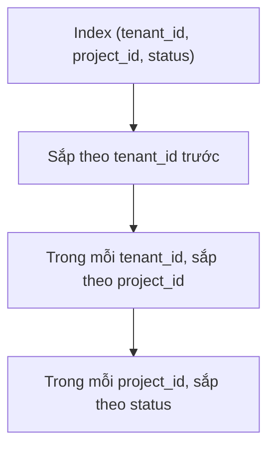
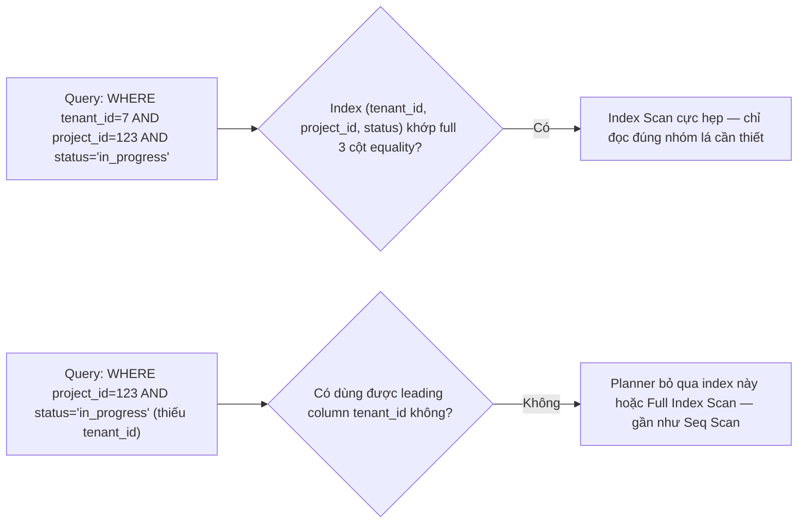

# 02 — Multicolumn Index, Covering & Column Order

## 🎯 Mục tiêu học

Đây là file **quan trọng nhất của cả phase indexing**. Sai lầm số một trong thực tế không phải "thiếu index" — mà là **composite index đúng cột nhưng sai thứ tự**. Sau file này bạn phải tự thiết kế được thứ tự cột đúng cho bất kỳ query pattern nào, và hiểu covering index/`INCLUDE` giúp gì (và không giúp gì).

## 📋 Mục lục

- [Practical understanding](#practical-understanding)
- [Mental model: leading-column logic](#mental-model-leading-column-logic)
- [Key index mechanics](#key-index-mechanics)
- [Planner interaction](#planner-interaction)
- [Query patterns / examples](#query-patterns--examples)
- [Bảng: query shape → index order phù hợp/tệ](#bảng-query-shape--index-order-phù-hợptệ)
- [Covering index / INCLUDE](#covering-index--include)
- [Why index order is part of query design](#why-index-order-is-part-of-query-design)
- [Trade-offs](#trade-offs)
- [Failure modes](#failure-modes)
- [Debugging hints](#debugging-hints)
- [Interview lens](#interview-lens)
- [Mini scenarios](#mini-scenarios)
- [Key takeaways](#key-takeaways)
- [Xem tiếp / Liên kết liên quan](#xem-tiếp--liên-kết-liên-quan)

## Practical understanding

❌ Cách hiểu sai: "Index trên `(tenant_id, project_id, status)` thì mọi query lọc theo bất kỳ tổ hợp nào trong 3 cột này đều nhanh."

✅ Thực tế: composite index B-tree hoạt động theo **left-prefix rule** (còn gọi là leading-column logic) — index chỉ hữu ích khi truy vấn dùng được **tiền tố liên tục từ cột đầu tiên**. Bỏ qua cột đầu mà lọc thẳng vào cột thứ hai/ba thì index **gần như vô dụng**, bất kể tên cột có "đúng" trong định nghĩa index hay không.

## Mental model: leading-column logic



Hãy tưởng tượng index này như một cuốn danh bạ được sắp theo **Tỉnh → Quận → Tên đường**. Bạn tra được nhanh nếu biết Tỉnh (dùng được cột đầu). Nếu chỉ biết "Tên đường" mà không biết Tỉnh, cuốn danh bạ này **vô dụng** — bạn phải lật từng trang.

## Key index mechanics

- **Left-prefix rule**: index `(a, b, c)` phục vụ trực tiếp cho: `WHERE a = ?`, `WHERE a = ? AND b = ?`, `WHERE a = ? AND b = ? AND c = ?`, và biến thể range ở cột cuối cùng được dùng (`WHERE a = ? AND b = ? AND c > ?`).
- Index `(a, b, c)` **không** phục vụ hiệu quả cho `WHERE b = ?` một mình, hay `WHERE c = ?` một mình — planner phải scan toàn bộ index (Full Index Scan, gần tệ như Seq Scan) hoặc bỏ qua index đó.
- Nếu một cột ở giữa dùng **range** (`>`, `<`, `BETWEEN`) thay vì equality, mọi cột đứng **sau** nó trong index mất tác dụng lọc thêm hiệu quả — vì trong phạm vi range đó, dữ liệu không còn sắp liên tục theo cột kế tiếp.

## Planner interaction



Planner luôn cố dùng phần tiền tố dài nhất có thể từ trái sang phải; nó **không thể "nhảy cóc"** bỏ qua cột đầu để tận dụng cột sau.

## Query patterns / examples

### Ví dụ 1 — Index đúng thứ tự cho SaaS filtering

```sql
CREATE INDEX idx_tasks_tenant_project_status ON tasks(tenant_id, project_id, status);

EXPLAIN ANALYZE
SELECT id, title, status, due_at
FROM tasks
WHERE tenant_id = 7 AND project_id = 123 AND status = 'in_progress'
ORDER BY due_at ASC NULLS LAST;
```

Đây khớp hoàn hảo left-prefix: `tenant_id` → `project_id` → `status` đều dùng equality. Index Scan chỉ cần đọc đúng nhóm lá tương ứng — cực rẻ dù bảng `tasks` có hàng chục triệu dòng của các tenant khác.

### Ví dụ 2 — Cùng index, query thiếu leading column → gần như vô dụng

```sql
-- Không có tenant_id trong WHERE
EXPLAIN ANALYZE
SELECT id, title FROM tasks WHERE project_id = 123 AND status = 'in_progress';
```

Với index `(tenant_id, project_id, status)`, query này **không dùng được index hiệu quả** vì thiếu điều kiện trên `tenant_id` (cột đầu). Planner có thể chọn Seq Scan, hoặc Full Index Scan (đọc toàn bộ index theo thứ tự vật lý, lọc từng entry) — cả hai đều tệ với bảng lớn. Đây là lỗi thiết kế thường gặp: quên rằng trong hệ multi-tenant, **mọi index nên bắt đầu bằng `tenant_id`** vì mọi query production đều lọc theo tenant.

### Ví dụ 3 — Range ở giữa cắt đứt tác dụng cột sau

```sql
CREATE INDEX idx_orders_user_created ON orders(user_id, created_at, status);

EXPLAIN ANALYZE
SELECT id, status FROM orders
WHERE user_id = 42
  AND created_at >= now() - interval '30 days'
  AND status = 'paid';
```

Vì `created_at` dùng range (`>=`), cột `status` đứng sau nó trong index **không còn được dùng để lọc hiệu quả bằng index** — trong phạm vi 30 ngày đó, các dòng không sắp theo `status` nữa. Planner vẫn dùng được index tới `created_at` (Index Cond), nhưng `status = 'paid'` sẽ trở thành một **Filter** áp dụng sau khi đã lấy dòng ra, không phải một phần `Index Cond` thu hẹp phạm vi B-tree.

➡️ Nếu `status = 'paid'` là điều kiện được dùng thường xuyên hơn `created_at` range, cân nhắc đổi thứ tự: `(user_id, status, created_at)` — miễn `status` chủ yếu dùng equality trong các query thực tế.

### Ví dụ 4 — Index cho processing_jobs polling pattern

```sql
CREATE INDEX idx_processing_jobs_status_scheduled ON processing_jobs(status, scheduled_at)
WHERE status IN ('queued', 'running');

EXPLAIN ANALYZE
SELECT id, job_type FROM processing_jobs
WHERE status = 'queued' AND scheduled_at <= now()
ORDER BY scheduled_at ASC
LIMIT 50;
```

`status` (equality) đứng trước `scheduled_at` (range + cần sort) — đúng nguyên tắc: cột equality luôn nên đứng trước cột range/sort trong composite index. Kết hợp `WHERE status IN (...)` làm **partial index** (xem `03-partial-expression-and-specialized-indexes.md`) giúp index nhỏ gọn, chỉ chứa các job chưa hoàn tất.

## Bảng: query shape → index order phù hợp/tệ

| Query shape | Index order phù hợp | Index order tệ | Vì sao |
|---|---|---|---|
| `WHERE tenant_id=? AND project_id=? AND status=?` (tất cả equality) | `(tenant_id, project_id, status)` | `(status, tenant_id, project_id)` | equality trên mọi cột — thứ tự nên theo mức độ chọn lọc từ thô tới mịn, nhưng leading column **phải** là cột luôn xuất hiện trong mọi query (`tenant_id`) |
| `WHERE user_id=? AND created_at BETWEEN ? AND ?` | `(user_id, created_at)` | `(created_at, user_id)` | equality (`user_id`) phải đứng trước range (`created_at`) để tận dụng tối đa left-prefix |
| `WHERE status=? ORDER BY scheduled_at` | `(status, scheduled_at)` | `(scheduled_at, status)` | equality trước, cột cần sort đứng sau để B-tree trả kết quả **đã đúng thứ tự**, tránh Sort node riêng |
| `WHERE project_id=?` (không có tenant_id trong query) | `(project_id)` riêng biệt | Dùng chung `(tenant_id, project_id, ...)` | nếu pattern này thực sự phổ biến, cần index riêng — không thể "mượn" leading column của index khác |

## Covering index / INCLUDE

**Covering index** là index chứa đủ mọi cột mà query cần, sao cho executor **không cần quay lại heap** — đây gọi là **Index Only Scan**.

```sql
CREATE INDEX idx_orders_user_created_covering
  ON orders(user_id, created_at)
  INCLUDE (status, total_cents);

EXPLAIN ANALYZE
SELECT status, total_cents, created_at
FROM orders
WHERE user_id = 42
ORDER BY created_at DESC
LIMIT 20;
```

`INCLUDE (status, total_cents)` thêm 2 cột vào **leaf page** của index (không dùng để tìm kiếm/sắp thứ tự, chỉ để "đính kèm" giá trị) — nếu query chỉ cần `user_id`, `created_at`, `status`, `total_cents`, executor có thể trả kết quả **hoàn toàn từ index**, không chạm heap.

⚠️ **Điều kiện bắt buộc để Index Only Scan thực sự xảy ra**: **visibility map** của các trang heap liên quan phải cho biết "mọi tuple trong trang này đều visible cho mọi transaction" (đã được vacuum cập nhật — xem `01-storage-and-mvcc/03-visibility-vacuum-freeze.md`). Nếu bảng có nhiều write gần đây chưa được vacuum, executor **vẫn phải** ghé heap để xác nhận visibility từng dòng — lúc đó `INCLUDE` không mang lại lợi ích như kỳ vọng dù EXPLAIN vẫn ghi "Index Only Scan" (sẽ thấy `Heap Fetches:` > 0 trong `EXPLAIN ANALYZE`).

## Why index order is part of query design

Composite index không phải "càng nhiều cột càng tốt" — mỗi cột thêm vào:

- Tăng kích thước mỗi entry → tăng số trang B-tree → tăng chi phí ghi và bộ nhớ cache cho index đó.
- Chỉ có giá trị nếu **thứ tự khớp với cách ứng dụng thực sự truy vấn** — thêm cột thứ 4, 5 "cho chắc" mà không ai query theo tổ hợp đó chỉ tốn chi phí ghi vô ích.

➡️ Thiết kế composite index đúng đòi hỏi bạn liệt kê **query pattern thực tế** trước, rồi suy ra thứ tự cột — không phải liệt kê hết cột "có vẻ liên quan" rồi nhét vào một index.

## Trade-offs

- ✅ Composite index đúng thứ tự giải quyết được cả filter lẫn sort trong 1 lần Index Scan — không cần Sort node riêng.
- ⚠️ Covering index (`INCLUDE`) giúp Index Only Scan nhưng **chỉ khi visibility map đủ tốt** — không phải "cứ thêm INCLUDE là tự động nhanh".
- ⚠️ Mỗi cột thêm vào composite index đều có giá — không nên thêm "phòng khi cần" nếu chưa xác nhận query pattern thật.

## Failure modes

- 🔴 Tạo index `(status, tenant_id)` cho hệ multi-tenant — mọi query lọc theo `tenant_id` trước sẽ không tận dụng được index này hiệu quả, vì `status` (thường selectivity thấp) lại đứng làm leading column.
- 🔴 Composite index có 5-6 cột "để dự phòng mọi trường hợp" — index cồng kềnh, tốn ghi, nhưng phần lớn tổ hợp cột không bao giờ được query thực tế dùng tới.
- 🔴 Kỳ vọng `INCLUDE` luôn cho Index Only Scan — quên rằng bảng có write rate cao (autovacuum chưa kịp cập nhật visibility map) vẫn khiến executor phải heap fetch.
- 🔴 Đặt cột range ở giữa composite index rồi ngạc nhiên vì cột sau đó "không lọc được" — quên nguyên tắc range cắt đứt tác dụng left-prefix của các cột theo sau.

## Debugging hints

- Kiểm tra index có được dùng đúng ý: `EXPLAIN ANALYZE` rồi xem `Index Cond:` — cột nào nằm trong `Index Cond` là cột **thực sự dùng để thu hẹp phạm vi B-tree**; cột nào chỉ nằm trong `Filter:` là bị áp dụng **sau khi đã lấy dòng ra** (không hưởng lợi từ left-prefix).
- Kiểm tra Index Only Scan có thật sự "only" hay không: tìm dòng `Heap Fetches:` trong `EXPLAIN (ANALYZE, BUFFERS)` — số này > 0 nghĩa là vẫn phải ghé heap dù tên node là "Index Only Scan".
- Muốn xác nhận thứ tự cột hợp lý: liệt kê 5-10 query thực tế phổ biến nhất trên bảng đó, xem cột nào **luôn** xuất hiện bằng equality (đặt đầu), cột nào dùng range/sort (đặt cuối).

## Interview lens

**Interviewer thường hỏi**: "Bạn có index `(a, b, c)` nhưng query `WHERE b = ? AND c = ?` vẫn chậm — tại sao?"

- ❌ Câu trả lời yếu: "Chắc PostgreSQL không nhận ra index này, cần tạo lại."
- ✅ Câu trả lời mạnh: giải thích left-prefix rule — index `(a, b, c)` được sắp theo `a` trước tiên; nếu query không có điều kiện trên `a`, phần lớn lợi ích của B-tree biến mất vì dữ liệu trong index không liên tục theo `b` khi nhìn xuyên suốt mọi giá trị `a`. Đề xuất: tạo thêm index `(b, c)` riêng nếu pattern này đủ phổ biến, thay vì cố "sửa" index cũ.

## Mini scenarios

1. **Multi-tenant SaaS quên đặt `tenant_id` làm leading column**: index `(project_id, status)` được tạo trước khi hệ thống có khái niệm tenant rõ ràng — sau khi mở rộng multi-tenant, mọi query bắt buộc thêm `tenant_id` vào `WHERE` nhưng index cũ không còn tối ưu, cần tạo lại `(tenant_id, project_id, status)`.
2. **E-commerce dashboard sort theo `created_at` nhưng index chỉ có `(user_id)`**: mỗi lần load dashboard đều kéo theo Sort node (xem `02-query-planner-and-execution/05-sorting-hashing-materialization.md`) — thêm `created_at` vào cuối index loại bỏ hoàn toàn Sort node.
3. **`INCLUDE` được thêm vào nhưng bảng ghi liên tục (append-heavy `events`)**: đội ngũ kỳ vọng Index Only Scan nhưng `Heap Fetches` vẫn cao vì autovacuum không theo kịp — cần xem lại tần suất autovacuum thay vì nghi ngờ `INCLUDE` "không hoạt động".
4. **Composite index 5 cột "cho chắc" trên `activity_logs`**: sau audit, phát hiện chỉ 2 trong 5 cột thực sự được dùng đồng thời trong bất kỳ query production nào — 3 cột còn lại chỉ làm tăng kích thước index và chi phí ghi vô ích, nên tách lại thành 1-2 index gọn hơn đúng theo pattern thật.

## Key takeaways

- 🧠 Composite index B-tree tuân theo left-prefix rule — không dùng được nếu thiếu điều kiện trên leading column.
- 🧠 Thứ tự cột nên là: equality trước, range/sort sau cùng — range ở giữa cắt đứt tác dụng của các cột theo sau.
- 🧠 `INCLUDE`/covering index chỉ mang lại Index Only Scan thật sự khi visibility map đủ tốt — kiểm tra `Heap Fetches:` để xác nhận.
- 🧠 Composite index không phải "càng nhiều cột càng tốt" — mỗi cột thêm vào phải được biện minh bằng query pattern thực tế.
- 🧠 Thiết kế index là một phần của **thiết kế query**, không phải việc làm sau khi viết xong SQL.

## Xem tiếp / Liên kết liên quan

- ➡️ [`03-partial-expression-and-specialized-indexes.md`](03-partial-expression-and-specialized-indexes.md) — partial index thu hẹp working set hơn nữa.
- ⬅️ [`01-btree-basics.md`](01-btree-basics.md) — nền tảng cấu trúc B-tree.
- 🔗 [`01-storage-and-mvcc/03-visibility-vacuum-freeze.md`](../01-storage-and-mvcc/03-visibility-vacuum-freeze.md) — visibility map và Index Only Scan.
- ⬅️ [README phase này](README.md)
