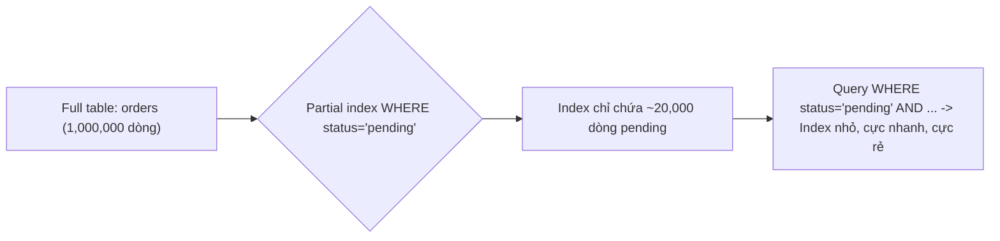
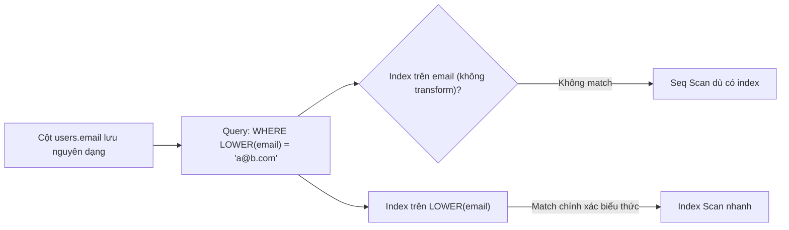

# 03 — Partial, Expression & Specialized Indexes (Practical Variants)

## 🎯 Mục tiêu học

Hiểu partial index và expression index không phải "tính năng nâng cao hiếm dùng", mà là công cụ thực dụng để **thu hẹp index xuống đúng working set thật** và **giúp planner match được các biểu thức mà bạn thực sự query**. File này chỉ cover các biến thể "practical" — nhóm index type chuyên biệt (GIN/GiST/BRIN/Hash) sang file tiếp theo.

## 📋 Mục lục

- [Practical understanding](#practical-understanding)
- [Mental model](#mental-model)
- [Key index mechanics: Partial index](#key-index-mechanics-partial-index)
- [Key index mechanics: Expression index](#key-index-mechanics-expression-index)
- [Planner interaction](#planner-interaction)
- [Query patterns / examples](#query-patterns--examples)
- [Bảng: pattern → index shape → danger](#bảng-pattern--index-shape--danger)
- [Trade-offs](#trade-offs)
- [Failure modes](#failure-modes)
- [Debugging hints](#debugging-hints)
- [Interview lens](#interview-lens)
- [Mini scenarios](#mini-scenarios)
- [Key takeaways](#key-takeaways)
- [Xem tiếp / Liên kết liên quan](#xem-tiếp--liên-kết-liên-quan)

## Practical understanding

Hai vấn đề rất khác nhau mà nhiều người gộp chung:

| Vấn đề | Giải pháp |
|---|---|
| "Index đầy đủ tốn quá nhiều dung lượng/chi phí ghi vì đa số dòng không liên quan tới query thực tế" (ví dụ 95% `orders` đã `shipped`, chỉ 5% `pending` cần tra cứu thường xuyên) | **Partial index** — chỉ index tập con dòng khớp điều kiện |
| "Query luôn transform cột trước khi so sánh (`LOWER(email)`, `date_trunc(...)`), nên index trên cột gốc không match" | **Expression index** — index trên kết quả biểu thức, không phải cột gốc |

## Mental model





## Key index mechanics: Partial index

Partial index chỉ chứa các dòng **thỏa mãn một điều kiện `WHERE` cố định tại thời điểm tạo index** — điều kiện này được lưu cùng định nghĩa index và **phải khớp (hoặc được planner chứng minh là bao hàm) điều kiện trong query thực tế** thì mới được dùng.

```sql
-- Chỉ index các đơn hàng chưa hoàn tất — đây mới là tập dữ liệu được tra cứu thường xuyên
CREATE INDEX idx_orders_pending ON orders(user_id, created_at)
WHERE status IN ('pending', 'paid');

-- Chỉ index các job còn cần xử lý — loại bỏ hàng triệu job đã succeeded/failed cũ
CREATE INDEX idx_processing_jobs_active ON processing_jobs(status, scheduled_at)
WHERE status IN ('queued', 'running');

-- Chỉ index các account chưa bị soft-delete
CREATE INDEX idx_accounts_active ON accounts(tenant_id, email)
WHERE deleted_at IS NULL;
```

## Key index mechanics: Expression index

Expression index lưu **kết quả của một biểu thức**, không phải giá trị cột gốc.

```sql
-- Đăng nhập luôn so sánh email không phân biệt hoa/thường
CREATE INDEX idx_users_email_lower ON users(LOWER(email));

-- Query báo cáo theo ngày (không theo timestamp chính xác)
CREATE INDEX idx_events_occurred_day ON events(date_trunc('day', occurred_at));

-- Query lọc theo 1 key cụ thể trong JSONB (nếu key này được query thường xuyên bằng equality)
CREATE INDEX idx_activity_logs_category ON activity_logs((metadata->>'category'));
```

## Planner interaction

Với **partial index**, planner phải chứng minh được: điều kiện `WHERE` của **query** kéo theo (implies) điều kiện `WHERE` của **index**. Nếu query dùng điều kiện không tương thích hoặc rộng hơn, planner **không thể** dùng partial index đó — kể cả khi về mặt logic dữ liệu, kết quả vẫn đúng nếu dùng.

```sql
-- Index: WHERE status IN ('pending', 'paid')
-- Query khớp — planner CÓ THỂ dùng partial index:
SELECT * FROM orders WHERE user_id = 42 AND status = 'pending';

-- Query KHÔNG khớp — planner KHÔNG dùng được partial index (điều kiện query không kéo theo điều kiện index):
SELECT * FROM orders WHERE user_id = 42 AND status = 'shipped';

-- Query KHÔNG khớp dù trực giác "có vẻ liên quan" — thiếu điều kiện status hoàn toàn:
SELECT * FROM orders WHERE user_id = 42;
```

Với **expression index**, planner chỉ match được khi **query viết đúng y hệt biểu thức đã index** (hoặc biểu thức tương đương về mặt cú pháp mà planner nhận diện được):

```sql
-- Index: LOWER(email) — query PHẢI viết LOWER(email), không phải email thường
SELECT * FROM users WHERE LOWER(email) = 'a@b.com'; -- ✅ dùng được index
SELECT * FROM users WHERE email = 'a@b.com';          -- ❌ không dùng được index này
SELECT * FROM users WHERE email ILIKE 'a@b.com';      -- ❌ ILIKE không tự động dùng expression index LOWER()
```

## Query patterns / examples

### Ví dụ 1 — Partial index cho "pending queue" (processing_jobs)

```sql
CREATE INDEX idx_processing_jobs_active ON processing_jobs(status, scheduled_at)
WHERE status IN ('queued', 'running');

EXPLAIN ANALYZE
SELECT id, job_type, attempts
FROM processing_jobs
WHERE status = 'queued' AND scheduled_at <= now()
ORDER BY scheduled_at ASC
LIMIT 50;
```

Nếu bảng có 50 triệu job (đa số đã `succeeded`), partial index chỉ chứa vài nghìn dòng `queued`/`running` — nhỏ gọn, luôn nằm trong cache, và mỗi lần polling worker chỉ cần đọc một phần index cực nhỏ thay vì một index đầy đủ khổng lồ chứa toàn bộ lịch sử job.

### Ví dụ 2 — Partial index cho soft-delete pattern

```sql
CREATE INDEX idx_accounts_active_email ON accounts(tenant_id, email)
WHERE deleted_at IS NULL;

EXPLAIN ANALYZE
SELECT id, role FROM accounts
WHERE tenant_id = 7 AND email = 'owner@acme.test' AND deleted_at IS NULL;
```

Đây là pattern phổ biến: ứng dụng gần như luôn query "account còn active", hiếm khi cần tra account đã xóa mềm — partial index loại bỏ hoàn toàn các dòng `deleted_at IS NOT NULL` khỏi index, giữ kích thước nhỏ dù bảng tích lũy nhiều account đã rời đi qua nhiều năm.

### Ví dụ 3 — Expression index cho JSONB key cụ thể

```sql
CREATE INDEX idx_activity_logs_category ON activity_logs((metadata->>'category'));

EXPLAIN ANALYZE
SELECT id, action, created_at
FROM activity_logs
WHERE tenant_id = 7 AND (metadata->>'category') = 'billing';
```

Nếu `metadata->>'category'` là một key được query bằng equality thường xuyên (không phải toàn bộ cấu trúc JSONB), expression index này rẻ hơn nhiều so với GIN index trên toàn bộ `metadata` — vì bạn chỉ cần tra một giá trị scalar cụ thể, không cần containment search tổng quát.

⚠️ Lưu ý: nên kết hợp với `tenant_id` (`(tenant_id, (metadata->>'category'))`) nếu mọi query production đều có `tenant_id` — độc lập một mình `(metadata->>'category')` sẽ vi phạm nguyên tắc leading-column đã học ở file trước cho hệ multi-tenant.

## Bảng: pattern → index shape → danger

| Pattern | Index shape | Danger nếu làm sai |
|---|---|---|
| Chỉ cần tra cứu nhanh tập "đang active/pending" trong bảng lớn | Partial index `WHERE status IN (...)` | Predicate index không khớp predicate query thực tế → index bị bỏ qua hoàn toàn, tốn ghi vô ích |
| Soft-delete, luôn lọc `deleted_at IS NULL` | Partial index `WHERE deleted_at IS NULL` | Quên rằng vài query nội bộ (báo cáo, audit) cần cả dòng đã xóa — query đó sẽ không dùng được index này (đúng ý, nhưng cần index khác cho case đó) |
| Đăng nhập/tra cứu không phân biệt hoa thường | Expression index `LOWER(col)` | App code không nhất quán dùng `LOWER()` ở mọi nơi truy vấn — nửa query dùng được index, nửa không, gây hiệu năng thất thường khó chẩn đoán |
| Query 1 key cụ thể trong JSONB | Expression index `(jsonb_col->>'key')` | Tạo cho key ít được query, trong khi key thực sự nóng (hot path) lại không có index tương ứng |
| Báo cáo theo ngày/tháng từ timestamp | Expression index `date_trunc('day', col)` | Report thực tế lại nhóm theo giờ hoặc theo tuần — biểu thức index không khớp granularity thật cần dùng |

## Trade-offs

- ✅ Partial index giảm mạnh kích thước index khi working set thật sự nhỏ hơn nhiều so với toàn bảng — giảm chi phí ghi (chỉ update index khi dòng khớp điều kiện) và tăng khả năng toàn bộ index nằm gọn trong cache.
- ⚠️ Partial index **cứng nhắc theo điều kiện đã khai báo** — thay đổi logic nghiệp vụ (thêm status mới, đổi ngưỡng) đòi hỏi phải `DROP`/`CREATE` lại index, không tự động thích nghi.
- ⚠️ Expression index chỉ match khi query viết đúng biểu thức — dễ "âm thầm không được dùng" nếu một phần codebase viết biểu thức hơi khác (ví dụ `lower(trim(email))` thay vì `lower(email)`).

## Failure modes

- 🔴 **Partial index predicate không khớp query thực tế**: tạo `WHERE status = 'pending'` nhưng ứng dụng thực tế luôn query `status IN ('pending', 'processing')` — planner không chứng minh được bao hàm, index bị bỏ qua hoàn toàn dù "trông có vẻ liên quan".
- 🔴 **Expression index nhưng một phần code không dùng expression tương ứng**: nửa API dùng `LOWER(email) = ...`, nửa khác dùng `email ILIKE ...` — hiệu năng thất thường theo từng endpoint, khó debug vì "cùng bảng, cùng cột" mà có nơi nhanh nơi chậm.
- 🔴 **Quá nhiều "clever index" không ai nhớ maintain**: nhiều partial/expression index chồng chéo được tạo bởi các đợt "tối ưu nhanh" khác nhau, không ai còn nhớ index nào phục vụ query nào — dọn dẹp trở nên rủi ro vì sợ xóa nhầm.

## Debugging hints

- Kiểm tra predicate của partial index đã tồn tại: `SELECT indexname, indexdef FROM pg_indexes WHERE tablename = 'orders';` — đọc kỹ phần `WHERE` trong `indexdef`.
- Xác nhận expression index có được dùng: `EXPLAIN ANALYZE` phải hiện đúng `Index Cond:` chứa cùng biểu thức — nếu chỉ thấy `Filter:` áp dụng biểu thức đó, nghĩa là planner **không** dùng expression index (đang Seq Scan rồi lọc sau).
- Trước khi tạo expression index mới, thống nhất với team **một cách viết chuẩn duy nhất** cho biểu thức đó trong toàn bộ codebase — tránh tình trạng "nửa dùng được nửa không".

## Interview lens

**Interviewer thường hỏi**: "Bạn sẽ index thế nào cho bảng 100 triệu dòng mà 95% đã ở trạng thái hoàn tất, chỉ 5% còn active cần tra cứu liên tục?"

- ❌ Câu trả lời yếu: "Tạo index B-tree bình thường trên cột `status`."
- ✅ Câu trả lời mạnh: đề xuất partial index `WHERE status IN (...)` giới hạn đúng 5% working set thật; giải thích lý do (kích thước nhỏ hơn 20 lần, chi phí ghi chỉ áp dụng khi dòng khớp điều kiện, toàn bộ index dễ nằm gọn trong cache); và lưu ý điều kiện planner cần để dùng được partial index (query phải kéo theo predicate của index).

## Mini scenarios

1. **Worker polling `processing_jobs`** mỗi giây để lấy job cần chạy — partial index trên `(status, scheduled_at) WHERE status IN ('queued','running')` giữ độ trễ polling ổn định dù bảng lịch sử job phình to theo thời gian.
2. **Trang đăng nhập với email không phân biệt hoa/thường** nhưng team quên đồng bộ toàn bộ codebase dùng `LOWER()` — một microservice mới viết `email = $1` trực tiếp, âm thầm không dùng được expression index, gây Seq Scan lẻ tẻ khó phát hiện qua monitoring tổng.
3. **Báo cáo hoạt động tenant theo `metadata->>'category'`** được thêm expression index đúng lúc feature mới ra mắt — nhưng 3 tháng sau, product đổi yêu cầu báo cáo theo `metadata->>'sub_category'`, index cũ trở thành "clever index" không ai dùng, cần audit định kỳ để phát hiện và dọn.

## Key takeaways

- 🧠 Partial index giải quyết đúng vấn đề "working set nhỏ hơn nhiều so với toàn bảng" — không phải mọi bảng đều cần, nhưng khi cần thì hiệu quả rất lớn.
- 🧠 Planner chỉ dùng được partial index khi chứng minh được điều kiện query **kéo theo** điều kiện index — không phải "có liên quan là được".
- 🧠 Expression index chỉ match khi query viết đúng y hệt biểu thức — thiếu nhất quán trong codebase là nguyên nhân phổ biến khiến expression index "không hoạt động" một cách khó hiểu.
- 🧠 Cả hai loại index này cần được audit định kỳ — chúng dễ trở thành "clever index" không ai nhớ maintain khi logic nghiệp vụ thay đổi.

## Xem tiếp / Liên kết liên quan

- ➡️ [`04-gin-gist-brin-hash-when-to-use.md`](04-gin-gist-brin-hash-when-to-use.md) — khi B-tree (kể cả partial/expression) không còn đủ.
- ⬅️ [`02-multicolumn-covering-and-order.md`](02-multicolumn-covering-and-order.md) — kết hợp partial index với leading-column đúng thứ tự.
- 🔗 [`05-index-anti-patterns.md`](05-index-anti-patterns.md) — dọn dẹp "clever index" không còn dùng.
- ⬅️ [README phase này](README.md)
