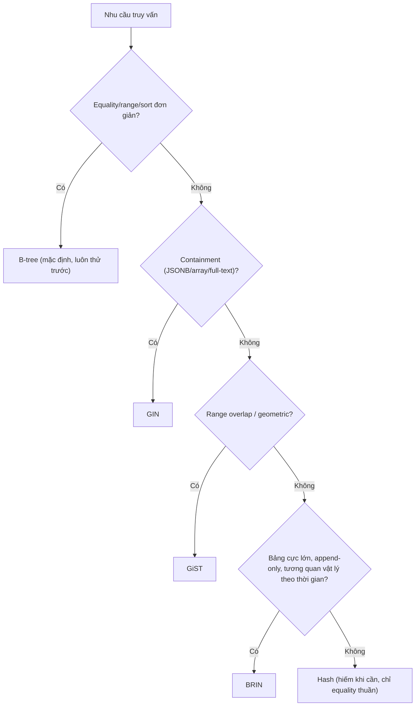

# 04 — GIN, GiST, BRIN, Hash: When to Use

## 🎯 Mục tiêu học

Biết chính xác khi nào B-tree **không còn là công cụ đúng**, và loại index chuyên biệt nào thay thế phù hợp — không phải để "thuộc bảng tra cứu", mà để tự tin trả lời: "tại sao chọn GIN ở đây chứ không phải GiST/BRIN?"

## 📋 Mục lục

- [Practical understanding](#practical-understanding)
- [Mental model](#mental-model)
- [Bảng so sánh thực dụng](#bảng-so-sánh-thực-dụng)
- [Key index mechanics theo từng loại](#key-index-mechanics-theo-từng-loại)
- [Planner interaction](#planner-interaction)
- [Query patterns / examples](#query-patterns--examples)
- [Trade-offs](#trade-offs)
- [Failure modes](#failure-modes)
- [Debugging hints](#debugging-hints)
- [Interview lens](#interview-lens)
- [Mini scenarios](#mini-scenarios)
- [Key takeaways](#key-takeaways)
- [Xem tiếp / Liên kết liên quan](#xem-tiếp--liên-kết-liên-quan)

## Practical understanding

B-tree giải quyết được equality, range, ordered access — **hầu hết nhu cầu OLTP thông thường**. Bốn loại index còn lại chỉ đáng cân nhắc khi bạn có một nhu cầu **cụ thể mà B-tree không diễn đạt được**:

| Nhu cầu | B-tree làm được không? | Loại index thay thế |
|---|---|---|
| "JSONB này có chứa key/value X không?" | ❌ | GIN |
| "Array này có chứa phần tử X không?" | ❌ | GIN |
| "Tìm full-text theo từ khóa" | ❌ | GIN (với `tsvector`) |
| "Hai khoảng thời gian này có chồng lấn không?" | ❌ | GiST (range types) |
| "Bảng append-only 500 triệu dòng, chỉ cần lọc theo khoảng thời gian" | Được, nhưng index B-tree quá lớn | BRIN |
| "Chỉ cần equality thuần, không bao giờ range/sort" | Được, nhưng có option nhỏ gọn hơn | Hash (hiếm khi đáng đổi) |

## Mental model



## Bảng so sánh thực dụng

| Index type | Good for | Bad for | Cost | Common mistake |
|---|---|---|---|---|
| **GIN** | JSONB containment (`@>`), array containment (`&&`, `@>`), full-text search (`tsvector @@ tsquery`) | Range/sort, ghi liên tục tần suất cao (mỗi update phải cập nhật nhiều "entry" bên trong cấu trúc inverted index) | Ghi chậm hơn B-tree đáng kể, index lớn nếu dữ liệu JSONB rộng; cần `VACUUM`/`GIN pending list` được xử lý đều đặn | Dùng GIN cho case chỉ cần equality trên 1 key JSONB cụ thể — expression index (`03-partial-expression-and-specialized-indexes.md`) rẻ hơn nhiều |
| **GiST** | Range type overlap (`tsrange`, `daterange`), dữ liệu hình học, exclusion constraint | Equality thuần túy đơn giản (B-tree rẻ hơn) | Lookup có "loss" (mất chính xác một phần, cần recheck) — chậm hơn B-tree cho case đơn giản | Dùng GiST khi bài toán thực chất chỉ là equality/range chuẩn, GiST chỉ nên dùng khi có yếu tố overlap/spatial thật sự |
| **BRIN** | Bảng cực lớn, append-only, dữ liệu **tương quan vật lý** với thứ tự insert (ví dụ `events.occurred_at` khi luôn insert theo thời gian thực) | Dữ liệu không tương quan vật lý (ví dụ `UPDATE` ngẫu nhiên xáo trộn thứ tự, hoặc cột không liên quan tới thứ tự insert) | Cực nhỏ so với B-tree (chỉ lưu min/max mỗi "block range") — đổi lại độ chính xác thấp hơn (nhiều false positive cần recheck) | Dùng BRIN cho cột hay bị `UPDATE` (phá vỡ tương quan vật lý) hoặc cho bảng nhỏ (lợi ích kích thước không đáng kể) |
| **Hash** | Equality thuần túy (`=`), không bao giờ cần range/sort | Range, sort, `IN` nhiều giá trị không hưởng lợi thêm so với B-tree | Từ PostgreSQL 10+, Hash index có WAL logging và ổn định để dùng production — nhưng lợi ích thực tế so với B-tree thường nhỏ | Chọn Hash chỉ vì tên nghe "chuyên biệt hơn" — B-tree đã đủ nhanh cho equality trong hầu hết trường hợp, và B-tree còn hỗ trợ thêm range/sort miễn phí nếu sau này cần |

## Key index mechanics theo từng loại

- **GIN (Generalized Inverted Index)**: lưu ánh xạ "mỗi phần tử/key → danh sách dòng chứa nó" — giống inverted index của search engine. Việc này khiến ghi dữ liệu (mỗi `INSERT`/`UPDATE` phải cập nhật nhiều entry cho nhiều phần tử bên trong 1 giá trị JSONB/array) chậm hơn B-tree — PostgreSQL giảm nhẹ vấn đề này bằng **GIN pending list** (gom insert lại, xử lý theo lô), nhưng cần `VACUUM`/autovacuum xử lý pending list đều đặn.
- **GiST (Generalized Search Tree)**: cấu trúc cây tổng quát cho phép định nghĩa "overlap"/"contains" tùy loại dữ liệu (range, hình học). Lookup GiST có thể "lossy" — trả về ứng viên gần đúng, executor phải recheck lại điều kiện chính xác trên heap.
- **BRIN (Block Range Index)**: chỉ lưu min/max (hoặc summary tương tự) cho mỗi **nhóm trang vật lý** (ví dụ mỗi 128 trang) thay vì từng dòng — cực nhỏ. Hiệu quả **phụ thuộc hoàn toàn** vào correlation giữa giá trị cột và thứ tự vật lý trên đĩa.
- **Hash**: lưu hash của giá trị, chỉ hỗ trợ equality — không hỗ trợ range/sort dưới bất kỳ hình thức nào.

## Planner interaction

```mermaid
flowchart LR
    Q["Query: metadata @> '{\"tier\":\"pro\"}'"] --> P{"Có GIN index trên metadata?"}
    P -->|"Có"| G["Bitmap Index Scan qua GIN -> Bitmap Heap Scan"]
    P -->|"Không"| S["Seq Scan toàn bảng, kiểm tra containment từng dòng"]
```

Với BRIN, planner luôn dùng dưới dạng **Bitmap Heap Scan**: BRIN trả về **phạm vi trang có thể chứa dòng khớp** (không chính xác từng dòng), executor build bitmap các trang đó rồi mới đọc heap và lọc chính xác.

## Query patterns / examples

### Ví dụ 1 — GIN cho JSONB containment thực sự cần thiết

```sql
CREATE INDEX idx_event_payloads_gin ON event_payloads USING GIN (payload jsonb_path_ops);

EXPLAIN ANALYZE
SELECT event_id FROM event_payloads
WHERE payload @> '{"currency": "USD", "provider": "stripe"}';
```

Đây là containment thật sự (kiểm tra JSONB có chứa **tổ hợp** key/value, không biết trước key nào sẽ được query) — GIN là lựa chọn đúng vì bạn không thể liệt kê hết mọi expression index cho từng key có thể xuất hiện.

### Ví dụ 2 — BRIN cho bảng events append-only khổng lồ

```sql
CREATE INDEX idx_events_occurred_brin ON events USING BRIN (occurred_at);

EXPLAIN ANALYZE
SELECT id, event_type FROM events
WHERE occurred_at >= '2024-06-01' AND occurred_at < '2024-06-02';
```

Vì `events` chỉ `INSERT` (không `UPDATE occurred_at`), giá trị `occurred_at` **tương quan gần như hoàn hảo** với thứ tự vật lý trên đĩa (dòng insert sau luôn nằm ở trang sau). Một B-tree đầy đủ trên 500 triệu dòng events sẽ tốn hàng GB; BRIN cho cùng mục đích chỉ tốn vài MB — đổi lại độ chính xác thấp hơn (BRIN trả về cả một range trang, executor phải lọc lại chính xác trên heap).

### Ví dụ 3 — Vì sao GIN "oversell" cho equality đơn giản

```sql
-- Nếu chỉ cần equality trên 1 key cụ thể, GIN là quá tay:
CREATE INDEX idx_bad_gin ON activity_logs USING GIN (metadata);
-- so với:
CREATE INDEX idx_good_expr ON activity_logs ((metadata->>'category'));
```

GIN trên toàn bộ `metadata` phục vụ được **mọi** key có thể query bằng `@>`, nhưng nếu thực tế chỉ có 1-2 key được query bằng equality, expression index rẻ hơn nhiều lần về chi phí ghi và kích thước — đừng dùng "vũ khí tổng quát" cho bài toán cụ thể.

## Trade-offs

- ✅ GIN/GiST mở ra khả năng truy vấn mà B-tree không làm được — nhưng đánh đổi bằng chi phí ghi cao hơn đáng kể.
- ✅ BRIN cực kỳ rẻ về dung lượng cho bảng khổng lồ tương quan vật lý tốt — nhưng vô dụng (hoặc phản tác dụng) nếu dữ liệu bị `UPDATE` xáo trộn thứ tự.
- ⚠️ Hash hiếm khi đáng đổi so với B-tree trong thực tế hiện đại — B-tree đã đủ nhanh cho equality và còn linh hoạt hơn (hỗ trợ thêm range/sort miễn phí nếu cần sau này).

## Failure modes

- 🔴 Dùng GIN cho một key JSONB cụ thể chỉ cần equality — trả giá bằng chi phí ghi và dung lượng không cần thiết, trong khi expression index đã đủ.
- 🔴 Dùng BRIN cho cột thường xuyên bị `UPDATE` (ví dụ `status` thay đổi ngẫu nhiên không theo thứ tự vật lý) — BRIN gần như vô dụng vì correlation thấp, executor phải quét lại phần lớn trang.
- 🔴 Chọn GiST cho bài toán chỉ là equality/range chuẩn — B-tree rẻ hơn và không có overhead "lossy lookup + recheck" của GiST.
- 🔴 Bỏ quên bảo trì GIN pending list trên bảng ghi liên tục — pending list phình to làm chậm dần cả insert lẫn query cho tới khi autovacuum xử lý.

## Debugging hints

- Muốn xác nhận BRIN có "ăn" không: kiểm tra correlation của cột trong `pg_stats` (`SELECT correlation FROM pg_stats WHERE tablename='events' AND attname='occurred_at';`) — correlation gần ±1 là dấu hiệu tốt cho BRIN, gần 0 là dấu hiệu BRIN sẽ kém hiệu quả.
- Muốn xác nhận GIN có được dùng: `EXPLAIN ANALYZE` phải hiện `Bitmap Index Scan using idx_..._gin`.
- Muốn kiểm tra GIN pending list còn tồn đọng: `SELECT * FROM pg_stat_user_indexes WHERE indexrelname LIKE '%gin%';` kết hợp theo dõi kích thước index tăng bất thường.

## Interview lens

**Interviewer thường hỏi**: "Bạn cần index để tìm nhanh các order có `metadata` JSONB chứa `{"promo": "BLACKFRIDAY"}` — chọn loại index nào?"

- ❌ Câu trả lời yếu: "B-tree trên cột metadata."
- ✅ Câu trả lời mạnh: B-tree không hiểu containment JSONB; cần GIN với `jsonb_path_ops` (nhỏ gọn hơn `jsonb_ops` mặc định nếu chỉ cần `@>`); nêu rõ đánh đổi: ghi chậm hơn, cần theo dõi pending list, nhưng đổi lại tìm containment nhanh hơn Seq Scan rất nhiều lần trên bảng lớn.

**Interviewer cũng hay hỏi**: "BRIN có luôn tốt hơn B-tree cho bảng lớn không?"

- ✅ Câu trả lời mạnh: chỉ khi dữ liệu **tương quan vật lý tốt** với thứ tự insert (append-only, không update cột đó) — nếu không, BRIN kém chính xác hơn nhiều so với B-tree và có thể chậm hơn vì phải recheck nhiều trang giả dương tính (false positive).

## Mini scenarios

1. **Tìm kiếm sản phẩm theo tag lưu dạng JSONB array** (`products.metadata->'tags' @> '["wireless"]'`) — GIN là lựa chọn tự nhiên vì không biết trước tag nào sẽ được tìm.
2. **Bảng `audit_logs` 2 tỷ dòng, chỉ insert theo thời gian, cần lọc theo khoảng ngày cho việc điều tra sự cố** — BRIN trên `created_at` giữ index nhỏ gọn, chấp nhận trade-off độ chính xác đổi lấy dung lượng.
3. **Đội ngũ định dùng GiST cho một cột chỉ cần lọc theo khoảng số nguyên đơn giản** — sau khi phân tích, nhận ra đây chỉ là range query chuẩn, B-tree đã đủ và rẻ hơn nhiều so với GiST không cần thiết.

## Key takeaways

- 🧠 B-tree luôn là lựa chọn thử trước — chỉ chuyển sang GIN/GiST/BRIN/Hash khi có nhu cầu cụ thể mà B-tree không diễn đạt được.
- 🧠 GIN mạnh cho containment (JSONB/array/full-text) nhưng đắt hơn B-tree khi ghi — không dùng cho equality đơn giản.
- 🧠 BRIN chỉ hiệu quả khi dữ liệu tương quan vật lý tốt với thứ tự insert — kiểm tra `correlation` trước khi chọn.
- 🧠 GiST phục vụ overlap/spatial — dùng sai chỗ (equality/range thuần) sẽ chậm hơn B-tree không cần thiết.
- 🧠 Đừng "oversell" specialized index — luôn hỏi "B-tree (kể cả partial/expression) có giải quyết đủ không?" trước khi chọn loại chuyên biệt.

## Xem tiếp / Liên kết liên quan

- ➡️ [`05-index-anti-patterns.md`](05-index-anti-patterns.md) — tổng hợp sai lầm index kinh điển, bao gồm cả oversell specialized index.
- ⬅️ [`03-partial-expression-and-specialized-indexes.md`](03-partial-expression-and-specialized-indexes.md) — khi nào expression index đã đủ, không cần GIN.
- 🔗 [`09-advanced-sql-patterns/03-jsonb-practical-usage.md`](../09-advanced-sql-patterns/README.md) — pattern JSONB nâng cao (sẽ mở rộng ở phần sau).
- ⬅️ [README phase này](README.md)
