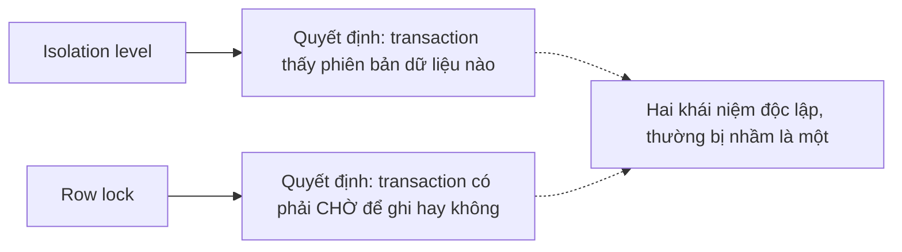

# 01 — Isolation Levels & Anomalies

## 🎯 Mục tiêu học

Hiểu snapshot trong PostgreSQL không phải khái niệm trừu tượng mà là **thứ quyết định transaction của bạn nhìn thấy dữ liệu nào tại từng thời điểm**. Sau file này, khi gặp "dữ liệu đọc lại khác lần trước", "hai transaction cùng update mà một bên biến mất", hoặc lỗi `could not serialize access`, bạn phải biết ngay đây là anomaly gì và isolation level nào (không) chặn được nó.

## 📋 Mục lục

- [Mental model](#mental-model)
- [What actually happens: READ COMMITTED](#what-actually-happens-read-committed)
- [What actually happens: REPEATABLE READ](#what-actually-happens-repeatable-read)
- [What actually happens: SERIALIZABLE](#what-actually-happens-serializable)
- [Transaction timeline: 4 anomaly minh họa](#transaction-timeline-4-anomaly-minh-họa)
- [Bảng: isolation level → what snapshot sees → common misuse](#bảng-isolation-level--what-snapshot-sees--common-misuse)
- [Why READ COMMITTED is often enough](#why-read-committed-is-often-enough)
- [When REPEATABLE READ still surprises people](#when-repeatable-read-still-surprises-people)
- [When SERIALIZABLE is worth the retry complexity](#when-serializable-is-worth-the-retry-complexity)
- [Trade-offs](#trade-offs)
- [Failure modes](#failure-modes)
- [Debugging hints](#debugging-hints)
- [Interview lens](#interview-lens)
- [Mini scenarios](#mini-scenarios)
- [Key takeaways](#key-takeaways)
- [Xem tiếp / Liên kết liên quan](#xem-tiếp--liên-kết-liên-quan)

## Mental model

❌ Hiểu lầm phổ biến nhất: **"PostgreSQL dùng MVCC nên các transaction không bao giờ block nhau."**

✅ Thực tế: MVCC giải quyết **đọc/ghi không chặn nhau** (một `SELECT` không bao giờ phải chờ một `UPDATE` đang chạy, và ngược lại) — nhưng **ghi/ghi xung đột trên cùng 1 dòng vẫn phải chờ nhau** (xem `02-row-table-and-advisory-locks.md`). Isolation level quyết định **snapshot nào transaction của bạn dùng để đọc**, không quyết định việc ghi có bị chặn hay không.



## What actually happens: READ COMMITTED

Đây là **isolation level mặc định** của PostgreSQL. Mỗi **statement** (không phải mỗi transaction) lấy một snapshot mới tại thời điểm statement đó bắt đầu chạy.

```sql
BEGIN; -- Transaction A, isolation mặc định READ COMMITTED
SELECT stock FROM products WHERE id = 501; -- statement 1: snapshot lúc này
-- ... một transaction khác COMMIT một UPDATE giữa lúc này ...
SELECT stock FROM products WHERE id = 501; -- statement 2: snapshot MỚI, có thể thấy giá trị khác statement 1
COMMIT;
```

📌 Vì mỗi statement có snapshot riêng, `UPDATE`/`DELETE` dưới READ COMMITTED có một quy tắc đặc biệt: nếu dòng bạn định update đã bị một transaction khác update và **commit** trước khi statement của bạn chạm tới, PostgreSQL sẽ **tự động dùng phiên bản mới nhất đã commit đó** để áp dụng điều kiện `WHERE` lại (gọi là EvalPlanQual) — không báo lỗi, không im lặng bỏ qua.

## What actually happens: REPEATABLE READ

Toàn bộ transaction dùng **một snapshot duy nhất**, cố định tại lần đọc dữ liệu đầu tiên (không phải tại `BEGIN`).

```sql
BEGIN ISOLATION LEVEL REPEATABLE READ;
SELECT stock FROM products WHERE id = 501; -- snapshot cố định từ đây
-- ... transaction khác COMMIT UPDATE stock giữa lúc này ...
SELECT stock FROM products WHERE id = 501; -- VẪN thấy giá trị CŨ — đây là điểm khác biệt cốt lõi với READ COMMITTED
COMMIT;
```

⚠️ **Mạnh hơn nhiều người tưởng**: PostgreSQL's REPEATABLE READ không chỉ chặn non-repeatable read — nó còn phát hiện và **từ chối commit** (báo lỗi `could not serialize access due to concurrent update`) nếu transaction của bạn cố `UPDATE`/`DELETE` một dòng mà transaction khác đã sửa và commit trước đó trong lúc bạn đang chạy — đây là hành vi mạnh hơn READ COMMITTED (vốn tự động áp dụng lại điều kiện thay vì báo lỗi).

## What actually happens: SERIALIZABLE

Có tất cả đảm bảo của REPEATABLE READ, cộng thêm: PostgreSQL theo dõi **các phụ thuộc đọc/ghi giữa các transaction** để đảm bảo kết quả cuối cùng **tương đương với việc chạy các transaction này tuần tự theo một thứ tự nào đó** — kể cả khi chúng chạy song song thật sự.

```sql
BEGIN ISOLATION LEVEL SERIALIZABLE;
-- ... logic đọc rồi ghi dựa trên điều kiện đọc được ...
COMMIT; -- có thể bị từ chối với "could not serialize access due to read/write dependencies"
```

📌 **Serialization failure không phải lỗi hệ thống** — đây là cơ chế bảo vệ correctness đang hoạt động đúng thiết kế. Ứng dụng **bắt buộc phải retry** transaction khi gặp lỗi này (thường là mã lỗi SQLSTATE `40001`).

## Transaction timeline: 4 anomaly minh họa

### 1. Non-repeatable read (chặn được từ REPEATABLE READ trở lên)

```mermaid
sequenceDiagram
    participant A as Transaction A (REPEATABLE READ)
    participant B as Transaction B
    A->>A: SELECT stock FROM products WHERE id=501 -> 100
    B->>B: UPDATE products SET stock=90 WHERE id=501; COMMIT
    A->>A: SELECT stock FROM products WHERE id=501 -> VẪN 100 (snapshot cũ)
```

Dưới READ COMMITTED, lần đọc thứ hai của A sẽ thấy `90` — đây chính là non-repeatable read, và với nhiều nghiệp vụ (ví dụ tính toán báo cáo trong 1 transaction dài), đây có thể là hành vi mong muốn (luôn thấy dữ liệu mới nhất) hoặc không mong muốn (cần tính nhất quán trong toàn bộ transaction).

### 2. Phantom-style business surprise (task đếm số lượng thay đổi giữa các lần query)

```sql
BEGIN ISOLATION LEVEL REPEATABLE READ;
SELECT COUNT(*) FROM tasks WHERE tenant_id = 7 AND status = 'todo'; -- ra 42
-- Transaction khác INSERT thêm 3 task 'todo' mới cho tenant 7, COMMIT
SELECT COUNT(*) FROM tasks WHERE tenant_id = 7 AND status = 'todo'; -- VẪN ra 42 (snapshot cố định)
COMMIT;
```

Đây là "phantom" bị chặn bởi REPEATABLE READ (snapshot toàn transaction, không chỉ per-row) — khác với chuẩn SQL cổ điển nơi phantom là vấn đề riêng của SERIALIZABLE. Postgres's REPEATABLE READ đã đủ mạnh để chặn cả non-repeatable read lẫn phantom read theo nghĩa "đọc lại cùng câu query cho cùng kết quả".

### 3. Lost update (chặn bằng row lock hoặc REPEATABLE READ+, không phải READ COMMITTED thuần)

```mermaid
sequenceDiagram
    participant A as Transaction A (READ COMMITTED)
    participant B as Transaction B (READ COMMITTED)
    A->>A: SELECT stock FROM products WHERE id=501 -> 10
    B->>B: SELECT stock FROM products WHERE id=501 -> 10
    A->>A: UPDATE products SET stock = 10 - 3 WHERE id=501; COMMIT
    B->>B: UPDATE products SET stock = 10 - 5 WHERE id=501; COMMIT
    Note over A,B: Kết quả cuối: stock = 5, mất luôn việc trừ 3 của A!
```

Đây là **lost update** kinh điển: cả A và B đều tính toán dựa trên giá trị `10` đọc trước đó (chứ không phải `UPDATE ... SET stock = stock - 3` trực tiếp trong SQL, vốn an toàn hơn nhiều — xem `05-upserts-race-conditions-and-safe-concurrency-patterns.md`). READ COMMITTED **không tự động chặn** kiểu race condition này khi logic trừ được tính ở tầng ứng dụng.

### 4. Write skew (chỉ lộ rõ ở REPEATABLE READ/SERIALIZABLE, dễ bị bỏ sót)

```mermaid
sequenceDiagram
    participant A as Transaction A (REPEATABLE READ)
    participant B as Transaction B (REPEATABLE READ)
    A->>A: SELECT COUNT(*) FROM processing_jobs WHERE job_type='send_email' AND status='running' -> 4 (limit 5)
    B->>B: SELECT COUNT(*) FROM processing_jobs WHERE job_type='send_email' AND status='running' -> 4 (limit 5)
    A->>A: INSERT processing_jobs (job_type='send_email', status='running'); COMMIT
    B->>B: INSERT processing_jobs (job_type='send_email', status='running'); COMMIT
    Note over A,B: Cả 2 đều pass check "còn dưới 5", kết quả thật: 6 job running — vi phạm invariant!
```

Đây là write skew: mỗi transaction riêng lẻ đọc đúng, ghi đúng theo logic của nó — nhưng **kết hợp lại vi phạm một ràng buộc nghiệp vụ** mà không transaction nào tự phát hiện được, vì cả hai đọc dữ liệu **trước khi** đối phương ghi. REPEATABLE READ **không chặn** được write skew này (mỗi transaction tự commit thành công); chỉ **SERIALIZABLE** mới phát hiện được phụ thuộc đọc/ghi chéo nhau và từ chối commit một trong hai.

## Bảng: isolation level → what snapshot sees → common misuse

| Isolation level | What snapshot sees | What can still surprise you | Common misuse |
|---|---|---|---|
| **READ COMMITTED** | Mỗi statement thấy dữ liệu đã commit tại thời điểm statement đó chạy | Đọc 2 lần trong cùng transaction có thể ra 2 kết quả khác nhau; lost update nếu tính toán ở tầng ứng dụng | Coi đây là "yếu, không an toàn" — thực ra đủ cho phần lớn OLTP nếu dùng đúng `UPDATE ... SET x = x - n` thay vì read-modify-write ở app |
| **REPEATABLE READ** | Toàn bộ transaction dùng 1 snapshot cố định từ lần đọc đầu tiên | Write skew (2 transaction đọc đúng, ghi đúng riêng lẻ nhưng vi phạm invariant tổng) | Nghĩ REPEATABLE READ "an toàn tuyệt đối" cho mọi bài toán multi-row invariant |
| **SERIALIZABLE** | Như REPEATABLE READ, cộng thêm phát hiện phụ thuộc đọc/ghi chéo giữa các transaction | Serialization failure (`40001`) xảy ra thường xuyên hơn dự kiến nếu transaction đọc/ghi rộng — cần retry logic | Không code retry logic, coi serialization failure là bug thay vì cơ chế bảo vệ |

## Why READ COMMITTED is often enough

Phần lớn thao tác OLTP (đặt hàng, cập nhật trạng thái task, ghi log) không cần đọc-rồi-tính-toán-rồi-ghi ở tầng ứng dụng — chúng có thể diễn đạt bằng **một câu SQL duy nhất** mà PostgreSQL tự đảm bảo tính nguyên tử ở mức row:

```sql
-- An toàn dưới READ COMMITTED vì phép trừ diễn ra NGAY TRONG database, không qua vòng đọc-tính-ghi ở app
UPDATE products SET stock = stock - 1 WHERE id = 501 AND stock >= 1;
```

Không cần REPEATABLE READ/SERIALIZABLE cho case này — vấn đề không nằm ở isolation level mà ở **việc tính toán ở đâu** (trong SQL hay ở tầng ứng dụng).

## When REPEATABLE READ still surprises people

Khi nghiệp vụ có **ràng buộc trên nhiều dòng** (ví dụ "không quá 5 job `running` cùng lúc", "tổng số ghế đặt không vượt quá sức chứa") — REPEATABLE READ **không đủ** vì mỗi transaction đọc snapshot riêng, không biết transaction khác đang làm gì đồng thời (xem ví dụ write skew ở trên). Đây là dấu hiệu cần SERIALIZABLE hoặc constraint tường minh ở tầng database (unique constraint, exclusion constraint) thay vì chỉ dựa vào isolation level.

## When SERIALIZABLE is worth the retry complexity

SERIALIZABLE đáng dùng khi:

- Ràng buộc nghiệp vụ trải rộng trên nhiều dòng/nhiều bảng mà không thể diễn đạt gọn bằng 1 câu `UPDATE`/unique constraint.
- Tần suất xung đột thực tế thấp (retry hiếm khi xảy ra) — SERIALIZABLE có overhead theo dõi phụ thuộc, không nên dùng mặc định cho mọi transaction nếu tần suất ghi rất cao.
- Đội ngũ đã sẵn sàng implement retry loop đúng cách (không phải retry mù, xem `03-deadlocks-and-lock-waits.md`).

## Trade-offs

- ✅ READ COMMITTED: throughput cao nhất, đơn giản nhất, đủ cho hầu hết trường hợp nếu viết SQL đúng cách (tính toán trong câu lệnh, không read-modify-write ở app).
- ⚠️ REPEATABLE READ: bảo vệ tốt hơn cho các phép đọc cần nhất quán trong toàn bộ transaction (báo cáo, tính toán nhiều bước) — nhưng cần code xử lý lỗi serialize khi update conflict.
- ⚠️ SERIALIZABLE: bảo vệ mạnh nhất nhưng đòi hỏi retry logic bắt buộc và có overhead theo dõi phụ thuộc — không phù hợp nếu áp dụng tràn lan cho mọi transaction.

## Failure modes

- 🔴 Coi READ COMMITTED là "kém an toàn" và mặc định chuyển toàn bộ hệ thống sang SERIALIZABLE — tăng tỷ lệ serialization failure không cần thiết cho những transaction vốn không cần bảo vệ đó.
- 🔴 Dùng REPEATABLE READ cho bài toán có ràng buộc multi-row (ví dụ giới hạn số lượng) mà không nhận ra write skew vẫn có thể xảy ra.
- 🔴 Dùng SERIALIZABLE nhưng không có retry logic — ứng dụng crash hoặc trả lỗi 500 cho người dùng thay vì tự động thử lại giao dịch.

## Debugging hints

- Kiểm tra isolation level hiện tại của session: `SHOW transaction_isolation;`
- Muốn tái hiện anomaly để test: mở 2 session `psql`, dùng `BEGIN ISOLATION LEVEL ...` tường minh, xen kẽ lệnh giữa 2 cửa sổ theo đúng timeline.
- Khi gặp lỗi `could not serialize access due to concurrent update` hoặc `due to read/write dependencies`: đây là SQLSTATE `40001` — luôn code retry (thường với exponential backoff nhẹ) thay vì coi là lỗi cuối cùng trả cho người dùng.

## Interview lens

**Interviewer thường hỏi**: "REPEATABLE READ trong PostgreSQL có chặn được phantom read không?"

- ❌ Câu trả lời yếu: trích y nguyên bảng ANSI SQL chuẩn (REPEATABLE READ cho phép phantom read) mà không biết PostgreSQL triển khai mạnh hơn chuẩn tối thiểu.
- ✅ Câu trả lời mạnh: PostgreSQL's REPEATABLE READ dùng snapshot cố định toàn transaction nên **chặn được** phantom read theo nghĩa "đọc lại cùng query ra cùng kết quả" — nhưng vẫn có thể gặp **write skew** (2 transaction đọc đúng, ghi đúng riêng lẻ, nhưng invariant tổng bị vi phạm) mà chỉ SERIALIZABLE mới chặn được.

## Mini scenarios

1. **Checkout đơn hàng đọc `products.stock` để hiển thị "còn hàng" cho người dùng, sau đó `UPDATE ... SET stock = stock - qty WHERE stock >= qty`** — an toàn dưới READ COMMITTED nhờ tính toán trong SQL, không cần REPEATABLE READ.
2. **Job scheduler giới hạn tối đa 5 `processing_jobs` loại `send_email` đang `running` cùng lúc** — dùng REPEATABLE READ vẫn có write skew (2 worker cùng đọc 4, cùng insert thêm 1) — cần constraint tường minh hoặc SERIALIZABLE, hoặc advisory lock theo `job_type` (xem `02-`, `05-`).
3. **Báo cáo doanh thu tổng hợp `orders`/`payments` chạy nhiều bước tính toán trong 1 transaction dài** — dùng REPEATABLE READ đảm bảo mọi bước tính toán thấy cùng một "bức ảnh" dữ liệu, tránh số liệu tự mâu thuẫn giữa các bước.

## Key takeaways

- 🧠 Isolation level quyết định **snapshot nào bạn thấy khi đọc** — không quyết định việc ghi có bị chặn hay không (đó là vai trò của lock).
- 🧠 READ COMMITTED đủ dùng cho phần lớn OLTP nếu tính toán được đẩy vào câu SQL (`UPDATE ... SET x = x - n`), không phải đọc-tính-ghi ở tầng ứng dụng.
- 🧠 REPEATABLE READ chặn non-repeatable read và phantom read (theo nghĩa Postgres) nhưng **không** chặn write skew.
- 🧠 SERIALIZABLE là công cụ duy nhất chặn được write skew — đổi lại bắt buộc phải có retry logic cho `40001`.
- 🧠 Serialization failure là cơ chế bảo vệ correctness đang hoạt động đúng, không phải bug.

## Xem tiếp / Liên kết liên quan

- ➡️ [`02-row-table-and-advisory-locks.md`](02-row-table-and-advisory-locks.md) — lock là cơ chế bổ sung, độc lập với isolation level.
- 🔗 [`01-storage-and-mvcc/05-transactions-and-snapshots.md`](../01-storage-and-mvcc/05-transactions-and-snapshots.md) — nền tảng snapshot/MVCC.
- ⬅️ [README phase này](README.md)
