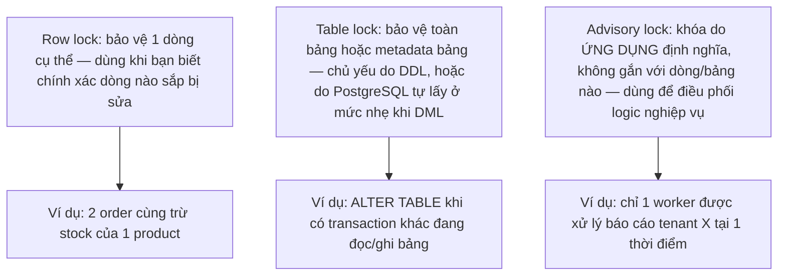
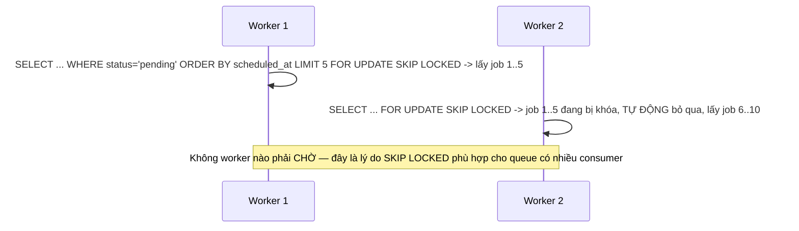

# 02 — Row, Table và Advisory Locks

## 🎯 Mục tiêu học

Hiểu rằng MVCC giải quyết "đọc không chặn ghi", nhưng **ghi/ghi trên cùng dữ liệu vẫn phải chờ nhau** — và cơ chế chờ đó chính là lock. Sau file này, bạn phải phân biệt được row lock / table lock / advisory lock dùng khi nào, biết chọn đúng `FOR UPDATE`/`FOR NO KEY UPDATE`/`FOR SHARE`/`FOR KEY SHARE`, và hiểu PostgreSQL **không có lock escalation** nhưng contention vẫn có thể trở nên rất nặng.

## 📋 Mục lục

- [Mental model](#mental-model)
- [What actually happens: row lock](#what-actually-happens-row-lock)
- [What actually happens: table lock](#what-actually-happens-table-lock)
- [What actually happens: advisory lock](#what-actually-happens-advisory-lock)
- [Bảng: lock syntax/pattern → protects against what](#bảng-lock-syntaxpattern--protects-against-what)
- [Transaction timeline](#transaction-timeline)
- [Không có lock escalation — nhưng contention vẫn nặng lên được](#không-có-lock-escalation--nhưng-contention-vẫn-nặng-lên-được)
- [Safe patterns](#safe-patterns)
- [Failure modes](#failure-modes)
- [Debugging hints](#debugging-hints)
- [Interview lens](#interview-lens)
- [Mini scenarios](#mini-scenarios)
- [Key takeaways](#key-takeaways)
- [Xem tiếp / Liên kết liên quan](#xem-tiếp--liên-kết-liên-quan)

## Mental model



## What actually happens: row lock

Row lock bảo vệ **một dòng cụ thể** khỏi bị transaction khác sửa/xóa đồng thời. PostgreSQL cung cấp 4 mức, từ chặt tới lỏng:

| Lock mode | Câu lệnh | Chặn gì |
|---|---|---|
| `FOR UPDATE` | `SELECT ... FOR UPDATE` | Chặn mọi lock khác trên cùng dòng (kể cả `FOR SHARE`) — dùng khi bạn **sẽ update/delete** dòng này |
| `FOR NO KEY UPDATE` | `SELECT ... FOR NO KEY UPDATE` | Giống `FOR UPDATE` nhưng vẫn cho phép `FOR KEY SHARE` song song — dùng khi update **không đụng tới cột có foreign key trỏ tới** |
| `FOR SHARE` | `SELECT ... FOR SHARE` | Cho phép nhiều transaction cùng `FOR SHARE`, nhưng chặn `FOR UPDATE`/`FOR NO KEY UPDATE` — dùng khi bạn chỉ cần "khóa đọc" để đảm bảo dòng không bị sửa trong lúc bạn xử lý |
| `FOR KEY SHARE` | `SELECT ... FOR KEY SHARE` | Yếu nhất — chỉ chặn việc sửa/xóa khóa chính, cho phép `FOR NO KEY UPDATE` song song — Postgres tự dùng khi kiểm tra foreign key |

```sql
-- Ví dụ: giữ order không bị xóa trong lúc đang xử lý payment cho nó
BEGIN;
SELECT id, status FROM orders WHERE id = 9001 FOR UPDATE;
-- ... kiểm tra business logic, sau đó ...
UPDATE payments SET status = 'captured' WHERE order_id = 9001;
COMMIT;
```

📌 `NOWAIT` và `SKIP LOCKED` thay đổi hành vi khi dòng đã bị lock bởi transaction khác:

```sql
-- NOWAIT: báo lỗi ngay thay vì chờ — dùng khi ứng dụng muốn tự xử lý "đang bận" thay vì block
SELECT * FROM orders WHERE id = 9001 FOR UPDATE NOWAIT;

-- SKIP LOCKED: bỏ qua dòng đang bị lock, lấy dòng tiếp theo — nền tảng của job queue pattern
SELECT * FROM processing_jobs
WHERE status = 'pending'
ORDER BY scheduled_at
LIMIT 10
FOR UPDATE SKIP LOCKED;
```

## What actually happens: table lock

Table lock hiếm khi ứng dụng chủ động xin trừ khi chạy DDL (`ALTER TABLE`, `CREATE INDEX` không dùng `CONCURRENTLY`, v.v.). Nhưng PostgreSQL **tự động lấy** các table lock nhẹ (`ROW EXCLUSIVE`, `ACCESS SHARE`) cho mọi câu `SELECT`/`INSERT`/`UPDATE`/`DELETE` bình thường — các mode này **tương thích với nhau** nên DML thông thường không chặn nhau ở mức bảng.

Vấn đề xảy ra khi một DDL (ví dụ `ALTER TABLE products ADD COLUMN ...`) cần `ACCESS EXCLUSIVE` — mode này **không tương thích với bất kỳ mode nào khác**, kể cả `SELECT` thông thường:

```sql
-- Transaction A đang chạy 1 SELECT dài trên products
-- Transaction B chạy: ALTER TABLE products ADD COLUMN discount_pct NUMERIC;
-- -> B phải CHỜ A commit/rollback xong mới lấy được ACCESS EXCLUSIVE
-- -> MỌI query SAU B (kể cả SELECT nhẹ) cũng phải xếp hàng chờ B, vì B đang chờ ACCESS EXCLUSIVE ở đầu hàng đợi
```

⚠️ Đây là nguồn gốc của incident "chạy migration nhỏ mà cả hệ thống đứng hình" — không phải vì ALTER TABLE chậm, mà vì nó xếp hàng chờ transaction cũ và mọi query sau nó phải chờ theo.

## What actually happens: advisory lock

Advisory lock **không gắn với dòng hay bảng nào cả** — nó chỉ là một con số (hoặc cặp số) mà ứng dụng tự định nghĩa ý nghĩa. PostgreSQL chỉ đảm bảo: "nếu 2 session cùng xin advisory lock với cùng con số, chỉ 1 session giữ được tại một thời điểm."

```sql
-- Coordination theo business key: chỉ 1 worker được generate report cho tenant X tại 1 thời điểm
SELECT pg_try_advisory_lock(hashtext('report-generation:tenant:7'));
-- -> trả về true nếu lấy được lock, false nếu đã có session khác đang giữ

-- ... sinh báo cáo ...

SELECT pg_advisory_unlock(hashtext('report-generation:tenant:7'));
```

⚠️ Advisory lock **không thay thế được integrity constraint**. Nó chỉ có tác dụng nếu **mọi** code path liên quan đều chủ động gọi nó — không có gì ở tầng database ép buộc việc này. Nếu có một chỗ trong codebase quên gọi advisory lock (ví dụ một script batch chạy tay), race condition vẫn xảy ra bình thường.

## Bảng: lock syntax/pattern → protects against what

| Pattern | Protects against | Cost/risk | Common misuse |
|---|---|---|---|
| `SELECT ... FOR UPDATE` | 2 transaction cùng sửa 1 dòng dựa trên giá trị đọc trước đó | Transaction khác phải chờ tới khi bạn commit/rollback | Giữ transaction mở quá lâu sau khi lock (gọi API bên ngoài, chờ user input) |
| `SELECT ... FOR NO KEY UPDATE` | Giống `FOR UPDATE` nhưng cho phép FK check song song | Nhẹ hơn `FOR UPDATE` một chút khi có nhiều FK trỏ tới bảng | Dùng `FOR UPDATE` mặc định ở mọi nơi dù không cần khóa key, gây chặn FK check không cần thiết |
| `SELECT ... FOR SHARE` | Đảm bảo dòng không đổi trong lúc xử lý nhiều bước, cho phép đọc chia sẻ | Có thể gây deadlock nếu 2 transaction cùng `FOR SHARE` rồi cùng cố `FOR UPDATE` sau đó | Dùng `FOR SHARE` rồi sau đó `UPDATE` trong cùng transaction — dễ deadlock (xem `03-`) |
| `FOR UPDATE SKIP LOCKED` | Nhiều worker tranh nhau lấy job mà không chặn nhau | Có thể gây starvation cho 1 số dòng nếu worker luôn ưu tiên dòng đầu | Không có cơ chế đảm bảo fairness — dòng "xui" có thể bị skip liên tục nếu luôn có worker khác nhanh tay hơn |
| Advisory lock theo business key | Coordination logic nghiệp vụ không map trực tiếp vào 1 dòng/bảng cụ thể | Không tự động release nếu quên gọi `pg_advisory_unlock` (trừ khi dùng session-level và session kết thúc) | Dùng thay cho unique constraint — không chặn được nếu có code path quên gọi lock |
| DDL (`ALTER TABLE` không `CONCURRENTLY`) | — | Lấy `ACCESS EXCLUSIVE`, chặn toàn bộ query khác kể cả `SELECT`, và chờ mọi transaction cũ | Chạy migration giờ cao điểm mà không kiểm tra transaction dài đang chạy trước |

## Transaction timeline

### `products.stock` — 2 order cùng mua

```mermaid
sequenceDiagram
    participant A as Order A
    participant B as Order B
    A->>A: SELECT stock FROM products WHERE id=501 FOR UPDATE -> lock dòng, thấy 10
    B->>B: SELECT stock FROM products WHERE id=501 FOR UPDATE -> CHỜ (dòng đang bị A khóa)
    A->>A: UPDATE products SET stock=7 WHERE id=501; COMMIT -> nhả lock
    B->>B: (được tiếp tục) SELECT lại thấy stock=7 -> UPDATE stock=4; COMMIT
    Note over A,B: Không mất phép trừ nào — B luôn thấy giá trị mới nhất sau khi A commit
```

### `processing_jobs` với `SKIP LOCKED` — nhiều worker



## Không có lock escalation — nhưng contention vẫn nặng lên được

Một số hệ quản trị CSDL khác (ví dụ SQL Server) có "lock escalation": khi số lượng row lock quá nhiều, hệ thống tự động **gộp thành table lock** để tiết kiệm bộ nhớ. **PostgreSQL không làm điều này** — dù bạn lock 1 triệu dòng, đó vẫn là 1 triệu row lock riêng biệt, không tự "leo thang" thành table lock.

⚠️ Nhưng điều này **không có nghĩa là contention không thể trở nên nghiêm trọng**:

- Nếu một transaction `UPDATE` không điều kiện `WHERE` chọn lọc (ví dụ `UPDATE tasks SET status='archived' WHERE tenant_id = 7` mà tenant 7 có 2 triệu dòng), nó vẫn lock toàn bộ 2 triệu dòng đó cho tới khi commit — bất kỳ transaction nào khác động vào các dòng này đều phải chờ.
- Số lượng row lock lớn cũng tiêu tốn bộ nhớ shared (`max_locks_per_transaction`), có thể dẫn tới lỗi `out of shared memory` nếu vượt giới hạn cấu hình.

## Safe patterns

- ✅ Lock đúng scope: chỉ `FOR UPDATE` những dòng bạn thực sự sẽ sửa, không lock rộng "cho chắc".
- ✅ Lock theo **thứ tự ổn định** khi một transaction cần lock nhiều dòng (ví dụ luôn sort theo `id` trước khi `FOR UPDATE` nhiều dòng) — giảm nguy cơ deadlock (xem `03-`).
- ✅ Dùng `SKIP LOCKED` cho job queue nhiều consumer; dùng `NOWAIT` khi ứng dụng muốn tự xử lý "đang bận" (ví dụ trả về HTTP 409) thay vì chờ.
- ✅ Advisory lock dùng session-scope (`pg_advisory_lock`/`pg_advisory_unlock`) chỉ nên tồn tại trong 1 transaction ngắn, hoặc dùng transaction-scope (`pg_advisory_xact_lock`) để tự động nhả khi commit/rollback.

## Failure modes

- 🔴 **Advisory lock thay cho unique constraint**: dùng advisory lock để "đảm bảo" email không trùng thay vì tạo `UNIQUE (tenant_id, email)` — nếu có bất kỳ code path nào (script, job nền, migration data) quên gọi advisory lock, dữ liệu trùng vẫn được tạo bình thường.
- 🔴 **Giữ transaction quá lâu sau khi lock row**: `FOR UPDATE` xong rồi gọi API thanh toán bên ngoài trong cùng transaction — mọi transaction khác cần dòng đó phải chờ tới khi API trả lời xong.
- 🔴 **Dùng `SKIP LOCKED` mà không hiểu starvation**: nếu logic chọn job luôn `ORDER BY priority DESC` và có dòng ưu tiên thấp liên tục bị nhiều worker bỏ qua để nhường chỗ cho dòng ưu tiên cao mới tới, dòng đó có thể chờ vô hạn.
- 🔴 **Lock nhiều dòng theo thứ tự không ổn định**: transaction A lock dòng theo thứ tự `[5, 3]`, transaction B lock theo thứ tự `[3, 5]` — đây là công thức chuẩn cho deadlock (xem `03-deadlocks-and-lock-waits.md`).

## Debugging hints

- Xem lock hiện tại: `SELECT * FROM pg_locks WHERE NOT granted;` — các dòng `granted = false` là những request đang chờ.
- Join `pg_locks` với `pg_stat_activity` qua `pid` để biết session nào đang giữ lock và session nào đang chờ, cùng câu query đang chạy.
- Nếu nghi ngờ contention do `UPDATE` phạm vi rộng: kiểm tra điều kiện `WHERE` có dùng được index chọn lọc không (liên hệ `03-indexing/`) — quét rộng đồng nghĩa lock rộng.

## Interview lens

**Interviewer thường hỏi**: "PostgreSQL có lock escalation không?"

- ❌ Câu trả lời yếu: "Có, giống SQL Server, khi lock nhiều dòng quá sẽ tự chuyển thành table lock."
- ✅ Câu trả lời mạnh: PostgreSQL **không có lock escalation** — mỗi row lock tồn tại độc lập trong bộ nhớ shared, giới hạn bởi `max_locks_per_transaction`. Điều này có nghĩa là quét rộng và update rộng vẫn gây contention nặng (mọi dòng bị khóa riêng lẻ), chỉ khác là không có bước "gộp" tự động — rủi ro thực sự nằm ở việc `WHERE` không chọn lọc, không phải ở cơ chế escalation.

## Mini scenarios

1. **2 request cùng đặt sản phẩm 501 khi chỉ còn 1 unit trong kho** — dùng `SELECT ... FOR UPDATE` trước khi kiểm tra `stock >= qty`, hoặc tốt hơn: `UPDATE products SET stock = stock - qty WHERE id=501 AND stock >= qty` để tránh cần lock tường minh (xem `05-`).
2. **5 worker cùng poll `processing_jobs` để lấy job xử lý** — `FOR UPDATE SKIP LOCKED` đảm bảo không worker nào chờ nhau, nhưng cần theo dõi job cũ có bị "đói" (starvation) không nếu luôn ưu tiên job mới.
3. **Chỉ muốn 1 job "gửi báo cáo cuối ngày" chạy cho mỗi tenant tại một thời điểm, dù có nhiều instance app** — dùng advisory lock theo `tenant_id` (`pg_try_advisory_lock(hashtext('daily-report:' || tenant_id))`), không cần một dòng/bảng riêng cho việc này.

## Key takeaways

- 🧠 MVCC không loại bỏ nhu cầu lock — nó chỉ loại bỏ việc đọc phải chờ ghi; ghi/ghi vẫn cần row lock.
- 🧠 `FOR UPDATE` > `FOR NO KEY UPDATE` > `FOR SHARE` > `FOR KEY SHARE` theo độ "chặt" — chọn đúng mức để giảm contention không cần thiết.
- 🧠 `SKIP LOCKED` là nền tảng job queue nhiều consumer; `NOWAIT` là công cụ để tránh chờ khi ứng dụng muốn tự xử lý.
- 🧠 Advisory lock là coordination tự nguyện của ứng dụng, không phải ràng buộc dữ liệu — không thay thế được unique/exclusion constraint.
- 🧠 PostgreSQL không có lock escalation, nhưng `UPDATE`/`DELETE` phạm vi rộng vẫn gây contention nặng vì khóa từng dòng riêng lẻ trên diện rộng.

## Xem tiếp / Liên kết liên quan

- ➡️ [`03-deadlocks-and-lock-waits.md`](03-deadlocks-and-lock-waits.md) — khi 2 transaction lock chéo nhau theo thứ tự ngược nhau.
- 🔗 [`03-indexing/README.md`](../03-indexing/README.md) — `WHERE` chọn lọc kém dẫn tới quét rộng và lock rộng.
- ⬅️ [README phase này](README.md)
