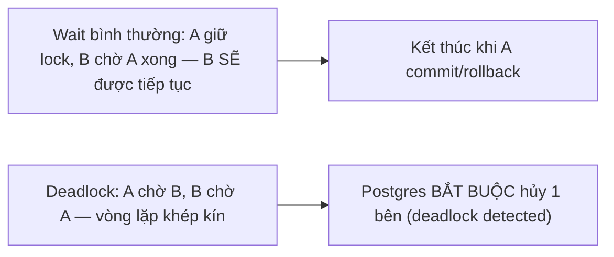
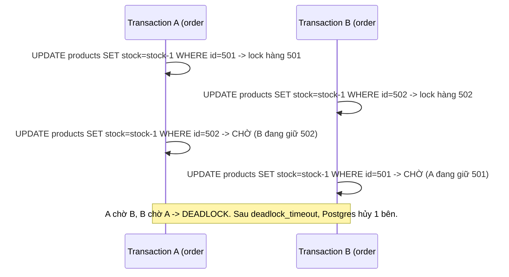
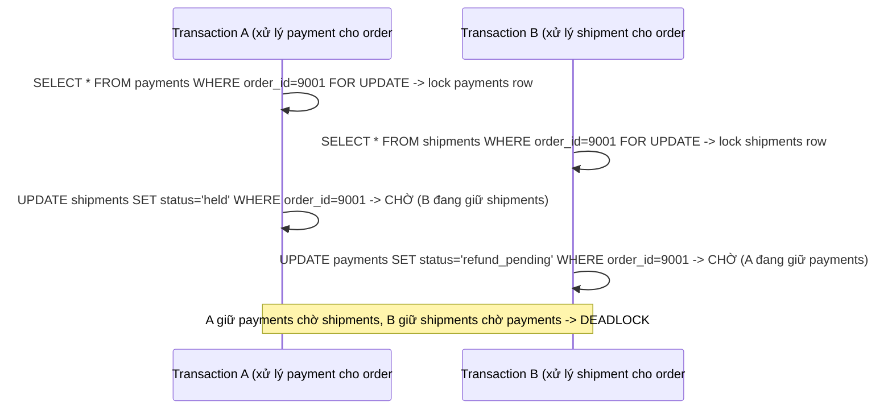

# 03 — Deadlocks và Lock Waits

## 🎯 Mục tiêu học

Đây là loại sự cố production phổ biến nhất liên quan tới concurrency. Sau file này, bạn phải phân biệt được "đang chờ lock bình thường" với "deadlock", biết đọc `pg_locks`/`pg_stat_activity` để tìm ra ai đang chặn ai, và biết ứng dụng nên phản ứng thế nào khi gặp deadlock — không phải retry mù.

## 📋 Mục lục

- [Mental model](#mental-model)
- [What actually happens: wait bình thường vs deadlock](#what-actually-happens-wait-bình-thường-vs-deadlock)
- [Transaction timeline: deadlock #1 — inventory/orders](#transaction-timeline-deadlock-1--inventoryorders)
- [Transaction timeline: deadlock #2 — tasks/payments/shipments](#transaction-timeline-deadlock-2--taskspaymentsshipments)
- [Lock timeout vs statement timeout vs deadlock detection](#lock-timeout-vs-statement-timeout-vs-deadlock-detection)
- [Bảng: symptom → likely cause → how to verify → fix direction](#bảng-symptom--likely-cause--how-to-verify--fix-direction)
- [`pg_locks` và `pg_stat_activity` — nghĩ gì khi đọc](#pg_locks-và-pg_stat_activity--nghĩ-gì-khi-đọc)
- [Safe patterns](#safe-patterns)
- [Failure modes](#failure-modes)
- [Debugging hints](#debugging-hints)
- [Interview lens](#interview-lens)
- [Mini scenarios](#mini-scenarios)
- [Key takeaways](#key-takeaways)
- [Xem tiếp / Liên kết liên quan](#xem-tiếp--liên-kết-liên-quan)

## Mental model



❌ Hiểu lầm phổ biến: "Deadlock là lỗi hiếm, gặp thì retry là xong."

✅ Thực tế: deadlock là **triệu chứng** của một vấn đề thiết kế — thứ tự lock không nhất quán giữa các transaction. Retry che giấu triệu chứng chứ không sửa nguyên nhân; nếu tải tăng, tần suất deadlock sẽ tăng theo cho tới khi retry cũng không cứu được throughput.

## What actually happens: wait bình thường vs deadlock

**Wait bình thường**: Transaction B cần lock mà Transaction A đang giữ. B đơn giản là **xếp hàng chờ**. Đây là hành vi đúng và cần thiết — không phải bug. B sẽ được tiếp tục ngay khi A commit hoặc rollback.

**Deadlock**: Transaction A đang giữ lock X, chờ lock Y. Transaction B đang giữ lock Y, chờ lock X. **Không bên nào có thể tiến triển** — đây là vòng lặp khép kín (cycle) trong đồ thị chờ (wait-for graph). PostgreSQL chạy một tiến trình định kỳ (mặc định mỗi `deadlock_timeout` = 1s) để phát hiện cycle này, và khi phát hiện, **chủ động hủy (ROLLBACK) một trong hai transaction** để phá vỡ vòng lặp — báo lỗi `deadlock detected` cho transaction bị chọn hủy.

⚠️ Điểm quan trọng hay bị bỏ sót: **"query chậm" nhiều khi thực ra là đang chờ lock**, không phải chậm do I/O hay plan tệ. Cách phân biệt:

| Triệu chứng | Đang chờ lock | Chậm do I/O/plan tệ |
|---|---|---|
| `pg_stat_activity.wait_event_type` | `Lock` | `IO` hoặc `NULL` (đang CPU-bound) |
| `EXPLAIN ANALYZE` chạy riêng lẻ | Nhanh | Chậm |
| Nhiều session cùng "đứng hình" cùng lúc | Có, đặc biệt các session động vào cùng dòng/bảng | Không nhất thiết liên quan tới nhau |
| Hủy transaction đang giữ lock | Các session khác lập tức tiếp tục | Không thay đổi gì |

## Transaction timeline: deadlock #1 — inventory/orders



**Nguyên nhân gốc**: A xử lý sản phẩm theo thứ tự `[501, 502]`, B xử lý theo thứ tự `[502, 501]` — thứ tự lock ngược nhau giữa 2 transaction.

**Fix**: luôn sort danh sách `product_id` trong `order_items` theo `id` tăng dần trước khi lock/update — đảm bảo mọi transaction lock theo cùng một thứ tự tuyệt đối.

```sql
-- An toàn: luôn cập nhật theo thứ tự product_id tăng dần
UPDATE products SET stock = stock - oi.qty
FROM (SELECT product_id, qty FROM order_items WHERE order_id = 9001 ORDER BY product_id) oi
WHERE products.id = oi.product_id;
```

## Transaction timeline: deadlock #2 — tasks/payments/shipments



**Nguyên nhân gốc**: Hai quy trình nghiệp vụ khác nhau (xử lý payment, xử lý shipment) đều động tới **cả hai bảng** nhưng theo thứ tự khác nhau, và mỗi transaction "ôm" quá nhiều bước nghiệp vụ (payment + shipment) trong một giao dịch.

**Fix**: tách nhỏ transaction theo đúng trách nhiệm (transaction xử lý payment chỉ động tới `payments`, phát event/queue riêng để service khác xử lý `shipments`), hoặc nếu bắt buộc phải sửa cả hai trong 1 transaction thì quy ước thứ tự cố định (luôn lock `payments` trước `shipments`, ở mọi nơi trong codebase).

## Lock timeout vs statement timeout vs deadlock detection

| Cơ chế | Kiểm soát gì | Cấu hình | Khi nào kích hoạt |
|---|---|---|---|
| `deadlock_timeout` | Thời gian chờ trước khi Postgres **kiểm tra** có cycle chờ hay không | Mặc định 1s | Chỉ chạy kiểm tra cycle sau khi 1 session đã chờ lock đủ lâu — không phải interval quét toàn hệ thống liên tục |
| `lock_timeout` | Thời gian tối đa 1 session chịu **chờ để lấy được 1 lock cụ thể** trước khi tự hủy statement | Tắt mặc định (0 = chờ vô hạn) | Áp dụng cho mọi kiểu chờ lock, kể cả khi không có deadlock thực sự — chỉ đơn giản là chờ quá lâu |
| `statement_timeout` | Thời gian tối đa **toàn bộ statement** được phép chạy, bất kể đang chờ lock hay đang tính toán | Tắt mặc định | Áp dụng chung, không phân biệt nguyên nhân chậm |

📌 Phân biệt quan trọng: `lock_timeout` hủy vì **chờ lock** quá lâu (dù không có deadlock); deadlock detection hủy vì phát hiện **cycle chờ lẫn nhau**, không phụ thuộc thời gian chờ tuyệt đối miễn cycle đã hình thành đủ `deadlock_timeout`.

## Bảng: symptom → likely cause → how to verify → fix direction

| Symptom | Likely cause | How to verify | Fix direction |
|---|---|---|---|
| Query "treo", CPU database thấp | Đang chờ lock | `pg_stat_activity.wait_event_type = 'Lock'` | Tìm session đang giữ lock qua `pg_locks`, xử lý theo `04-` nếu là long transaction |
| Log xuất hiện `deadlock detected` | Hai transaction lock chéo thứ tự | Đọc chi tiết log deadlock (Postgres liệt kê rõ 2 process, 2 câu query, 2 lock đang giữ/chờ) | Chuẩn hóa thứ tự lock, rút ngắn transaction |
| Nhiều session cùng chờ 1 session cụ thể | Session đó giữ lock quá lâu (long transaction/idle in transaction) | `pg_stat_activity` xem session đó ở trạng thái gì (`idle in transaction`?) và đã chạy bao lâu | Xem `04-long-transactions-and-idle-in-transaction.md` |
| Throughput giảm dần khi tải tăng, không có lỗi cụ thể | Contention tăng do lock diện rộng hoặc transaction dài dưới tải cao | So sánh `pg_stat_activity` lúc tải cao vs tải thấp, đếm số session ở trạng thái `Lock` | Thu hẹp phạm vi transaction, xem lại điều kiện `WHERE` có chọn lọc không |

## `pg_locks` và `pg_stat_activity` — nghĩ gì khi đọc

Không cần thuộc lòng từng cột — điều quan trọng là **tư duy join 2 view này để trả lời 1 câu hỏi**: "session nào đang giữ lock mà session khác đang chờ, và câu query của cả hai là gì?"

```sql
SELECT
    blocked.pid AS blocked_pid,
    blocked_activity.query AS blocked_query,
    blocking.pid AS blocking_pid,
    blocking_activity.query AS blocking_query,
    blocking_activity.state AS blocking_state
FROM pg_locks blocked
JOIN pg_stat_activity blocked_activity ON blocked.pid = blocked_activity.pid
JOIN pg_locks blocking ON blocking.locktype = blocked.locktype
    AND blocking.database IS NOT DISTINCT FROM blocked.database
    AND blocking.relation IS NOT DISTINCT FROM blocked.relation
    AND blocking.pid != blocked.pid
    AND blocking.granted
JOIN pg_stat_activity blocking_activity ON blocking.pid = blocking_activity.pid
WHERE NOT blocked.granted;
```

📌 Cột đáng chú ý nhất trong `pg_stat_activity` khi debug: `state` (`idle in transaction` là dấu hiệu cảnh báo), `wait_event_type`/`wait_event` (đang chờ gì), `query_start`/`xact_start` (đã chạy/mở transaction bao lâu).

## Safe patterns

- ✅ **Stable lock ordering**: mọi transaction cần lock nhiều dòng/nhiều bảng phải theo cùng một thứ tự cố định trong toàn bộ codebase (ví dụ luôn sort theo `id`, luôn lock `payments` trước `shipments`).
- ✅ **Shorten transaction**: gom logic thuần database vào 1 transaction ngắn, tách các bước gọi API bên ngoài/logic chậm ra khỏi transaction.
- ✅ **Split operation**: nếu 1 transaction phải động tới nhiều bảng không liên quan nghiệp vụ chặt chẽ, cân nhắc tách thành nhiều transaction nhỏ + cơ chế outbox/event để đảm bảo eventual consistency thay vì 1 transaction ôm đồm.
- ✅ **Retry có ý nghĩa**: khi bắt được `deadlock detected` (SQLSTATE `40P01`), retry là hợp lý **miễn là** thao tác idempotent và có backoff — không phải bắt lỗi rồi lặp vô hạn ngay lập tức.

## Failure modes

- 🔴 **Khóa resource theo thứ tự không nhất quán**: nguyên nhân gốc của gần như mọi deadlock thực tế — 2 quy trình nghiệp vụ khác nhau chạm cùng tập bảng/dòng nhưng theo thứ tự khác nhau.
- 🔴 **Transaction ôm quá nhiều business step**: 1 transaction vừa update payment, vừa update shipment, vừa ghi audit log, vừa gọi external API — càng nhiều thao tác trong 1 transaction, càng nhiều cơ hội xung đột thứ tự lock với transaction khác.
- 🔴 **Catch lỗi rồi retry mù không backoff/không idempotent**: retry ngay lập tức không backoff dưới tải cao có thể khuếch đại deadlock thành "deadlock storm"; retry một thao tác không idempotent (ví dụ `INSERT` không có unique constraint) có thể tạo dữ liệu trùng khi retry thành công sau khi lần đầu đã có side-effect một phần.
- 🔴 **Coi deadlock là lỗi hiếm nên bỏ qua**: dưới tải thấp deadlock hiếm gặp vì cửa sổ thời gian giao nhau giữa 2 transaction nhỏ; khi tải tăng, tần suất giao nhau tăng phi tuyến — hệ thống "chạy tốt nhiều tháng" có thể đột ngột deadlock dồn dập khi traffic tăng đột biến (sale, campaign).

## Debugging hints

- Log Postgres khi deadlock xảy ra (`log_lock_waits = on` giúp log cả trường hợp chờ lâu dù chưa phải deadlock) sẽ liệt kê rõ: 2 process, loại lock, câu query của từng bên — đọc kỹ đoạn `DETAIL:` trong log trước khi phỏng đoán.
- Muốn biết ai đang chặn ai tại một thời điểm bất kỳ (không chỉ lúc deadlock): chạy câu join `pg_locks`/`pg_stat_activity` ở trên.
- Muốn phân biệt "chờ lock" với "chậm do plan tệ": kiểm tra `wait_event_type` trước khi mất thời gian phân tích `EXPLAIN`.

## Interview lens

**Interviewer thường hỏi**: "Bạn debug một API bị treo đột ngột trong production như thế nào — nghi ngờ đầu tiên là gì?"

- ❌ Câu trả lời yếu: "Chạy `EXPLAIN ANALYZE` xem query có chậm không."
- ✅ Câu trả lời mạnh: Đầu tiên phân biệt "chậm do thực thi" hay "đang chờ lock" bằng `pg_stat_activity.wait_event_type`. Nếu là `Lock`, tìm session đang giữ lock (join `pg_locks`), kiểm tra session đó có phải long-running/idle in transaction không, rồi mới quyết định hủy session đó hay chờ. Chỉ khi loại trừ được nguyên nhân lock mới đi sâu vào `EXPLAIN ANALYZE`.

## Mini scenarios

1. **2 order cùng mua 2 sản phẩm chung nhưng thứ tự khác nhau trong giỏ hàng** — deadlock #1 ở trên; fix bằng sort `product_id` trước khi update.
2. **Service xử lý payment và service xử lý shipment cùng update chéo bảng của nhau trong 1 transaction lớn** — deadlock #2 ở trên; fix bằng tách trách nhiệm hoặc chuẩn hóa thứ tự lock.
3. **Sau khi tăng gấp đôi traffic dịp sale, log xuất hiện hàng loạt `deadlock detected` dù code không đổi** — dấu hiệu cửa sổ giao nhau giữa các transaction tăng do tải, không phải bug mới; cần xem lại có thể giảm phạm vi transaction hoặc chuẩn hóa thứ tự lock để giảm tần suất cycle.

## Key takeaways

- 🧠 Wait bình thường và deadlock khác nhau ở chỗ: wait là hàng đợi một chiều, deadlock là vòng lặp chờ lẫn nhau — Postgres tự phát hiện và hủy 1 bên.
- 🧠 "Query treo" thường là đang chờ lock, không phải I/O/plan tệ — kiểm tra `wait_event_type` trước khi phân tích plan.
- 🧠 Nguyên nhân gốc của deadlock gần như luôn là thứ tự lock không nhất quán giữa các transaction khác nhau chạm cùng tập tài nguyên.
- 🧠 `lock_timeout` (chờ lock quá lâu) khác `statement_timeout` (statement chạy quá lâu) khác deadlock detection (phát hiện cycle).
- 🧠 Retry sau deadlock chỉ an toàn khi thao tác idempotent và có backoff — không phải bắt lỗi rồi lặp mù.

## Xem tiếp / Liên kết liên quan

- ➡️ [`04-long-transactions-and-idle-in-transaction.md`](04-long-transactions-and-idle-in-transaction.md) — vì sao session giữ lock lâu lại nguy hiểm hơn bản thân việc có lock.
- 🔗 [`02-row-table-and-advisory-locks.md`](02-row-table-and-advisory-locks.md) — các loại lock cụ thể có thể gây ra deadlock.
- ⬅️ [README phase này](README.md)
