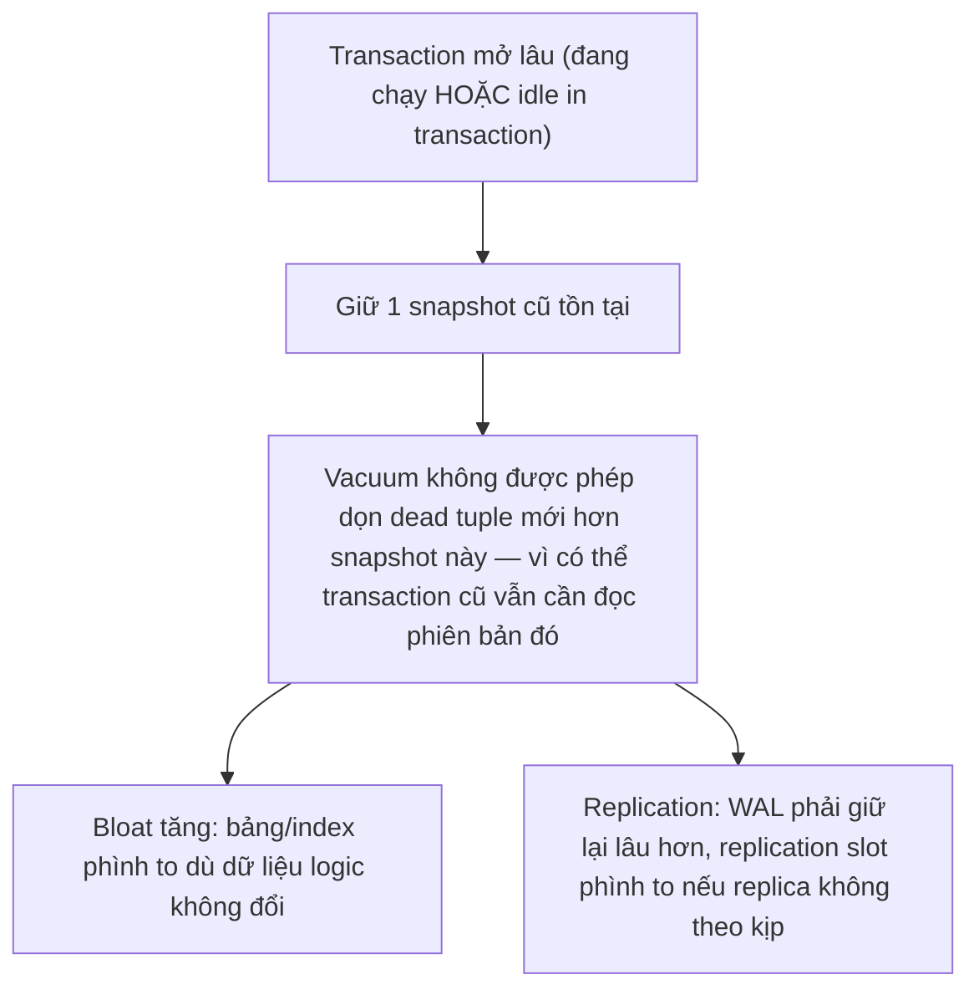

# 04 — Long Transactions và Idle in Transaction

## 🎯 Mục tiêu học

Đây là nguồn gốc của rất nhiều sự cố production âm thầm: hệ thống chạy chậm dần, bloat tăng không rõ lý do, replication lag tăng — mà không có transaction nào lỗi rõ ràng. Sau file này, bạn phải giải thích được chính xác **cơ chế** transaction dài phá hỏng vacuum/bloat/replication, không chỉ nói chung chung "long transaction xấu".

## 📋 Mục lục

- [Mental model](#mental-model)
- [What actually happens: xid horizon và vacuum](#what-actually-happens-xid-horizon-và-vacuum)
- [Transaction timeline: vacuum bị chặn bởi snapshot cũ](#transaction-timeline-vacuum-bị-chặn-bởi-snapshot-cũ)
- [Idle in transaction — nguy hiểm hơn long transaction đang chạy](#idle-in-transaction--nguy-hiểm-hơn-long-transaction-đang-chạy)
- [Transaction timeline: app giữ transaction qua network call](#transaction-timeline-app-giữ-transaction-qua-network-call)
- [Bảng: symptom → underlying mechanism → operational consequence → fix](#bảng-symptom--underlying-mechanism--operational-consequence--fix)
- [ORM/app pattern hay vô tình gây ra vấn đề này](#ormapp-pattern-hay-vô-tình-gây-ra-vấn-đề-này)
- [Safe patterns](#safe-patterns)
- [Failure modes](#failure-modes)
- [Debugging hints](#debugging-hints)
- [Interview lens](#interview-lens)
- [Mini scenarios](#mini-scenarios)
- [Key takeaways](#key-takeaways)
- [Xem tiếp / Liên kết liên quan](#xem-tiếp--liên-kết-liên-quan)

## Mental model



❌ Hiểu lầm phổ biến: "Idle in transaction chỉ tốn 1 connection, không ảnh hưởng gì tới hiệu năng."

✅ Thực tế: dù không chạy câu lệnh nào, session `idle in transaction` vẫn **giữ nguyên snapshot đã mở** — và vacuum trên **toàn bộ database** (không chỉ bảng session đó từng đọc) bị giới hạn bởi transaction cũ nhất đang mở.

## What actually happens: xid horizon và vacuum

PostgreSQL xác định "dead tuple nào an toàn để dọn" dựa trên **xid horizon** — transaction ID cũ nhất mà bất kỳ snapshot đang mở nào vẫn có thể cần nhìn thấy. Một dead tuple chỉ được vacuum dọn nếu **không còn transaction nào đang mở có thể cần thấy phiên bản đó** (liên hệ `01-storage-and-mvcc/03-visibility-vacuum-freeze.md`).

Nếu Transaction A mở lúc 9:00 và vẫn chưa commit lúc 9:30, thì **mọi dead tuple được tạo ra sau 9:00 trên toàn bộ database** (không chỉ bảng A từng chạm vào) đều phải giữ nguyên — vì về mặt lý thuyết A có thể chạy một câu `SELECT` bất kỳ lúc nào trước khi commit và cần thấy đúng trạng thái dữ liệu tại 9:00.

## Transaction timeline: vacuum bị chặn bởi snapshot cũ

```mermaid
sequenceDiagram
    participant A as Transaction A (mở lúc 9:00, REPEATABLE READ, chưa commit)
    participant W as Worker khác
    participant AV as Autovacuum
    A->>A: BEGIN; SELECT 1; -- snapshot cố định từ 9:00
    W->>W: 9:05 UPDATE tasks SET status='done' WHERE id=88 -> tạo dead tuple version cũ
    W->>W: 9:10 UPDATE tasks SET status='archived' WHERE id=88 -> tạo thêm dead tuple
    AV->>AV: 9:15 autovacuum quét tasks -> thấy dead tuple nhưng KHÔNG dọn được (A vẫn có thể cần thấy version 9:00)
    A->>A: 10:30 COMMIT (transaction chạy 90 phút)
    AV->>AV: 10:35 autovacuum lần sau -> giờ mới dọn được các dead tuple tồn đọng
    Note over A,AV: 90 phút dead tuple tích tụ trên TOÀN DATABASE, không chỉ bảng tasks
```

## Idle in transaction — nguy hiểm hơn long transaction đang chạy

Một transaction **đang chạy** một câu query dài (ví dụ báo cáo tổng hợp mất 5 phút) vẫn giữ snapshot, nhưng ít nhất nó có một điểm kết thúc dự đoán được. **Idle in transaction** (session đã `BEGIN` nhưng không chạy câu lệnh nào, đang "treo" chờ code ứng dụng làm gì đó tiếp theo) nguy hiểm hơn vì:

- Không có gì đảm bảo nó sẽ kết thúc trong bao lâu — có thể là do app bug, do exception không được catch dẫn tới quên `COMMIT`/`ROLLBACK`, do network timeout giữa app và DB không đồng bộ với transaction state.
- Nó vẫn **giữ nguyên tất cả row lock** mà nó đã lấy trước đó (nếu có `FOR UPDATE` trước khi "treo") — chặn các transaction khác cần các dòng đó.

## Transaction timeline: app giữ transaction qua network call

```mermaid
sequenceDiagram
    participant App as App server
    participant DB as PostgreSQL
    participant Ext as External payment API
    App->>DB: BEGIN
    App->>DB: SELECT * FROM orders WHERE id=9001 FOR UPDATE
    App->>Ext: HTTP POST /charge (gọi API bên ngoài TRONG transaction)
    Note over App,Ext: API chậm/timeout sau 30s -> session ở trạng thái "idle in transaction" suốt thời gian chờ
    Ext-->>App: response (chậm)
    App->>DB: UPDATE payments SET status='captured'; COMMIT
    Note over App,DB: Trong 30s đó: dòng order 9001 bị lock, dead tuple trên toàn DB không dọn được
```

**Fix**: tách bước gọi API bên ngoài ra khỏi transaction — `COMMIT` trạng thái "đang xử lý" trước, gọi API, rồi mở transaction mới ngắn để cập nhật kết quả cuối cùng. Idempotency key cần được thiết kế để xử lý trường hợp app crash giữa 2 bước này.

## Bảng: symptom → underlying mechanism → operational consequence → fix

| Symptom | Underlying mechanism | Operational consequence | Fix |
|---|---|---|---|
| `pg_stat_activity` có session `idle in transaction` chạy hàng chục phút | App mở transaction, gọi code chậm (API, chờ user), quên đóng | Dead tuple tích tụ toàn database, row lock giữ lâu | Đặt `idle_in_transaction_session_timeout`; tách logic chậm ra khỏi transaction |
| Bảng nhỏ nhưng kích thước vật lý lớn bất thường, `n_dead_tup` cao dù autovacuum chạy | Snapshot cũ (long transaction) chặn vacuum dọn dead tuple | Table/index bloat, query chậm dần vì quét nhiều trang rỗng | Rút ngắn transaction; theo dõi `pg_stat_activity.xact_start` để phát hiện transaction già |
| Replication lag tăng dần dù mạng ổn định | Long transaction trên primary giữ WAL chưa thể dọn/gửi hết, hoặc replication slot phình vì replica xử lý chậm hơn primary phát sinh | Replica ngày càng trễ, disk trên primary có thể đầy nếu WAL tích tụ quá lâu | Giám sát transaction dài trên primary; giám sát `pg_replication_slots` cho slot không hoạt động |
| `xid horizon` cảnh báo gần `wraparound` dù ít traffic ghi | Có transaction "treo" rất lâu (đôi khi do session bị bỏ quên) giữ xid cũ | Autovacuum không thể freeze các trang cần freeze | Tìm và hủy session có `xact_start` cũ nhất, kiểm tra ứng dụng có leak transaction không |

## ORM/app pattern hay vô tình gây ra vấn đề này

- **Mở transaction ở tầng framework (ví dụ decorator `@Transactional`) rồi gọi API bên ngoài/queue message bên trong cùng hàm** — framework tự động `BEGIN` trước khi vào hàm và `COMMIT` sau khi hàm return, nên bất kỳ I/O chậm nào bên trong hàm đều nằm trong transaction mà lập trình viên không để ý.
- **Interactive debug session (ví dụ mở `psql` hoặc console để kiểm tra dữ liệu, gõ `BEGIN` rồi quên `COMMIT`/`ROLLBACK`) rồi rời máy** — session này có thể tồn tại hàng giờ.
- **Background worker poll liên tục nhưng giữ transaction mở suốt vòng lặp** thay vì mở/đóng transaction ngắn cho mỗi lần xử lý.
- **Report/dashboard chạy query nặng dưới REPEATABLE READ/SERIALIZABLE** để đảm bảo tính nhất quán số liệu, nhưng không nhận ra rằng snapshot đó tồn tại suốt thời gian chạy report — nếu report chạy 20 phút, đó là transaction 20 phút.

## Safe patterns

- ✅ Đặt `idle_in_transaction_session_timeout` ở mức connection/role để tự động hủy session treo quá lâu — đây là lưới an toàn, không phải giải pháp thay cho việc sửa code.
- ✅ Không bao giờ gọi I/O chậm (HTTP request, chờ user input, gửi message queue đồng bộ) bên trong 1 transaction database đang mở — commit trạng thái trung gian trước, hoặc dùng outbox pattern.
- ✅ Với report/query dài cần tính nhất quán, cân nhắc chạy trên **read replica** thay vì transaction dài trên primary — tách hẳn khỏi vòng đời vacuum của primary (có ràng buộc riêng về replication delay, xem `07-replication-and-ha/`, sẽ mở rộng ở phần sau).
- ✅ Giám sát chủ động: alert khi có session với `xact_start` quá X phút, không chờ tới khi bloat/lag đã rõ ràng mới điều tra.

## Failure modes

- 🔴 **Mở transaction rồi gọi external API**: ví dụ trong timeline ở trên — biến độ trễ mạng của bên thứ ba thành thời gian giữ lock + giữ snapshot trên database của bạn.
- 🔴 **Interactive debug session quên commit/rollback**: một kỹ sư mở `psql`, chạy `BEGIN`, kiểm tra vài dòng dữ liệu, rồi chuyển sang việc khác — session này âm thầm chặn vacuum hàng giờ.
- 🔴 **Background worker poll giữ transaction idle**: worker mở transaction ở đầu vòng lặp, nhưng vòng lặp có `sleep()` hoặc chờ message từ queue — transaction vẫn mở suốt thời gian chờ.
- 🔴 **Report/query kéo quá lâu ở isolation không phù hợp**: chạy REPEATABLE READ cho báo cáo chạy hàng chục phút trên chính production primary thay vì replica.

## Debugging hints

- Tìm transaction già nhất đang mở: `SELECT pid, state, xact_start, now() - xact_start AS age, query FROM pg_stat_activity WHERE xact_start IS NOT NULL ORDER BY xact_start LIMIT 5;`
- Theo dõi bloat gián tiếp qua `pg_stat_user_tables.n_dead_tup` tăng bất thường dù autovacuum vẫn chạy (`last_autovacuum` gần đây nhưng `n_dead_tup` không giảm) — dấu hiệu vacuum bị chặn bởi snapshot cũ, không phải vacuum không chạy.
- Với nghi ngờ replication lag do long transaction: kiểm tra `pg_stat_replication` (độ trễ) song song với `pg_stat_activity` (transaction dài) trên primary tại cùng thời điểm.

## Interview lens

**Interviewer thường hỏi**: "Tại sao 'idle in transaction' lại nguy hiểm hơn bạn nghĩ — nó chỉ là 1 connection rảnh thôi mà?"

- ❌ Câu trả lời yếu: "Nó chiếm 1 connection trong pool, có thể gây hết connection."
- ✅ Câu trả lời mạnh: Vấn đề không chỉ là connection — session đó vẫn giữ **snapshot** đã mở, khiến autovacuum trên **toàn database** không thể dọn dead tuple mới hơn snapshot này (xid horizon), gây bloat tích lũy; nếu session còn giữ row lock từ trước, các transaction khác cũng bị chặn theo; và nếu kéo dài, ảnh hưởng cả replication (WAL phải giữ lâu hơn).

## Mini scenarios

1. **Endpoint tạo đơn hàng mở transaction, `FOR UPDATE` trên `products`, rồi gọi API kiểm tra gian lận (fraud check) mất 2-5 giây trước khi `COMMIT`** — trong lúc chờ fraud check, mọi đơn hàng khác chạm cùng sản phẩm đều bị chặn; fix: tách fraud check ra khỏi transaction giữ lock.
2. **Kỹ sư dùng `psql` debug dữ liệu `tasks` trong tenant lỗi, gõ `BEGIN` để thử `UPDATE` xem kết quả trước khi quyết định `COMMIT` hay `ROLLBACK`, rồi bị gọi họp đột xuất** — session treo `idle in transaction` hàng giờ; cần `idle_in_transaction_session_timeout` làm lưới an toàn.
3. **Dashboard nội bộ chạy 1 transaction REPEATABLE READ tổng hợp số liệu `orders`/`payments`/`shipments` mất 15 phút mỗi sáng, chạy trực tiếp trên primary** — nên chuyển sang read replica hoặc chia nhỏ query để giảm thời gian giữ snapshot.

## Key takeaways

- 🧠 Vấn đề cốt lõi không phải "transaction dài chạy chậm" mà là nó **giữ một snapshot cũ**, khiến vacuum trên toàn database không dọn được dead tuple mới hơn.
- 🧠 Idle in transaction nguy hiểm ngang hoặc hơn transaction đang chạy dài, vì thời gian tồn tại của nó không kiểm soát được và nó vẫn giữ mọi lock đã lấy.
- 🧠 Nguyên nhân phổ biến nhất trong thực tế: gọi I/O chậm (API, queue, user input) bên trong một transaction database đang mở.
- 🧠 Hậu quả lan rộng: bloat, xid horizon cảnh báo wraparound, replication lag — không chỉ giới hạn ở bảng mà transaction đó chạm vào.
- 🧠 `idle_in_transaction_session_timeout` là lưới an toàn vận hành, không thay thế việc sửa code giữ transaction sai cách.

## Xem tiếp / Liên kết liên quan

- ➡️ [`05-upserts-race-conditions-and-safe-concurrency-patterns.md`](05-upserts-race-conditions-and-safe-concurrency-patterns.md) — pattern an toàn để tránh phải giữ transaction dài khi xử lý race condition.
- 🔗 [`01-storage-and-mvcc/03-visibility-vacuum-freeze.md`](../01-storage-and-mvcc/03-visibility-vacuum-freeze.md) — cơ chế xid horizon/vacuum nền tảng cho file này.
- ⬅️ [README phase này](README.md)
