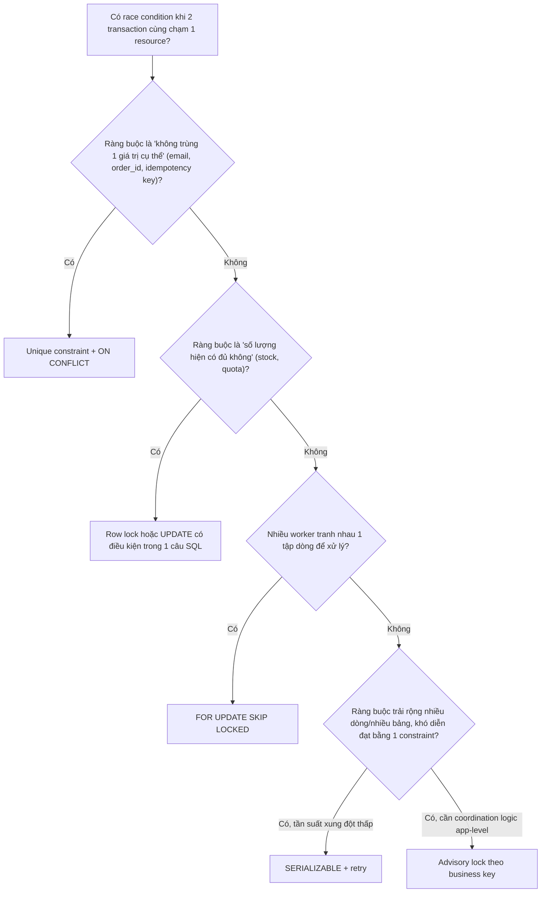

# 05 — Upserts, Race Conditions và Safe Concurrency Patterns

## 🎯 Mục tiêu học

Đây là file thực chiến nhất của phase này. Sau file này, khi thiết kế 1 tính năng có khả năng bị 2 request cùng chạm vào (đặt hàng, tạo tài khoản, claim job), bạn phải biết ngay nên dùng unique constraint, row lock, optimistic retry, advisory lock, hay SERIALIZABLE — và vì sao.

## 📋 Mục lục

- [Mental model](#mental-model)
- [What actually happens: `INSERT ... ON CONFLICT`](#what-actually-happens-insert--on-conflict)
- [Decision tree](#decision-tree)
- [Transaction timeline: upsert race — tạo account trùng email](#transaction-timeline-upsert-race--tạo-account-trùng-email)
- [Transaction timeline: inventory oversell race](#transaction-timeline-inventory-oversell-race)
- [Job claiming an toàn](#job-claiming-an-toàn)
- [Idempotency cho payment/shipment](#idempotency-cho-paymentshipment)
- [Bảng: problem pattern → unsafe → safer → trade-off](#bảng-problem-pattern--unsafe--safer--trade-off)
- [Safe patterns](#safe-patterns)
- [Failure modes](#failure-modes)
- [Debugging hints](#debugging-hints)
- [Interview lens](#interview-lens)
- [Mini scenarios](#mini-scenarios)
- [Key takeaways](#key-takeaways)
- [Xem tiếp / Liên kết liên quan](#xem-tiếp--liên-kết-liên-quan)

## Mental model

❌ Hiểu lầm phổ biến: "`ON CONFLICT` là đủ cho mọi business invariant liên quan concurrency."

✅ Thực tế: `ON CONFLICT` chỉ giải quyết đúng 1 việc — **race condition khi insert trùng key đã có unique constraint**. Nó không giải quyết được: giới hạn số lượng (ví dụ "tối đa 5 job đang chạy"), ràng buộc trải rộng nhiều dòng (write skew), hay logic nghiệp vụ không map trực tiếp vào 1 unique key.



## What actually happens: `INSERT ... ON CONFLICT`

Unique constraint không chỉ là ràng buộc dữ liệu — nó là **cơ chế đồng bộ hóa (concurrency primitive) mạnh nhất mà PostgreSQL cung cấp cho tình huống "chỉ 1 trong nhiều request được thành công"**. `ON CONFLICT` biến race condition "check-rồi-insert" thành 1 thao tác nguyên tử duy nhất ở tầng database.

```sql
-- Ràng buộc: email UNIQUE theo tenant (xem accounts trong 00-overview/02-...)
INSERT INTO accounts (tenant_id, email, name)
VALUES (7, 'a@company.com', 'A')
ON CONFLICT (tenant_id, email) DO NOTHING
RETURNING id;
-- Nếu 2 request cùng insert 1 email đồng thời: CHỈ 1 request nhận được id trả về, request kia RETURNING rỗng
```

📌 Nếu muốn cập nhật khi đã tồn tại thay vì bỏ qua:

```sql
INSERT INTO processing_jobs (job_type, dedupe_key, status, scheduled_at)
VALUES ('send_invoice', 'order-9001', 'pending', now())
ON CONFLICT (dedupe_key) DO UPDATE
SET scheduled_at = EXCLUDED.scheduled_at
WHERE processing_jobs.status = 'pending'; -- chỉ update nếu job cũ chưa chạy, tránh ghi đè job đang running
```

## Decision tree

1. **Ràng buộc "duy nhất 1 giá trị"** (email/tenant, order_id cho payment, idempotency key) → **unique constraint + `ON CONFLICT`**. Đây luôn là lựa chọn đầu tiên, mạnh và rẻ nhất.
2. **Ràng buộc "còn đủ số lượng không"** (stock, số ghế, hạn mức) → **row lock + `UPDATE` có điều kiện trong 1 câu SQL** (`UPDATE ... SET x = x - n WHERE x >= n`), không cần đọc-tính-ghi ở app.
3. **Nhiều worker tranh nhau xử lý 1 tập dòng** (job queue) → **`FOR UPDATE SKIP LOCKED`**.
4. **Ràng buộc trải rộng nhiều dòng/nhiều bảng**, tần suất xung đột thấp, có thể retry → **SERIALIZABLE**.
5. **Coordination logic app-level không map vào 1 dòng cụ thể** (ví dụ "chỉ 1 job tổng hợp báo cáo/tenant chạy 1 lúc") → **advisory lock**, nhưng luôn kết hợp với constraint thật nếu có thể để không phụ thuộc hoàn toàn vào việc mọi code path đều gọi đúng lock.

## Transaction timeline: upsert race — tạo account trùng email

```mermaid
sequenceDiagram
    participant A as Request A
    participant B as Request B
    A->>A: SELECT id FROM accounts WHERE tenant_id=7 AND email='a@company.com' -> không thấy
    B->>B: SELECT id FROM accounts WHERE tenant_id=7 AND email='a@company.com' -> không thấy
    A->>A: INSERT INTO accounts (...) VALUES (...); COMMIT -> thành công
    B->>B: INSERT INTO accounts (...) VALUES (...); COMMIT -> THÀNH CÔNG LUÔN nếu không có unique constraint!
    Note over A,B: Không có constraint -> 2 account trùng email được tạo. Đây là read-then-insert race kinh điển.
```

**Fix**: `UNIQUE (tenant_id, email)` + `INSERT ... ON CONFLICT (tenant_id, email) DO NOTHING RETURNING id` — request B tự động nhận `RETURNING` rỗng, không cần transaction dài hay lock tường minh nào.

## Transaction timeline: inventory oversell race

```mermaid
sequenceDiagram
    participant A as Order A (mua 1 unit, stock hiện tại = 1)
    participant B as Order B (mua 1 unit, stock hiện tại = 1)
    A->>A: SELECT stock FROM products WHERE id=501 -> 1 (app kiểm tra "còn hàng")
    B->>B: SELECT stock FROM products WHERE id=501 -> 1 (app kiểm tra "còn hàng")
    A->>A: UPDATE products SET stock = 0 WHERE id=501; COMMIT
    B->>B: UPDATE products SET stock = 0 WHERE id=501; COMMIT -- KHÔNG kiểm tra lại điều kiện!
    Note over A,B: Cả 2 order đều nghĩ mình mua thành công 1 unit trong khi kho chỉ có 1 -- OVERSELL
```

**Unsafe approach**: check-then-update tách rời ở app (đọc `stock`, so sánh ở code, rồi `UPDATE` không điều kiện).

**Safer pattern**:

```sql
UPDATE products SET stock = stock - 1 WHERE id = 501 AND stock >= 1 RETURNING stock;
-- Nếu RETURNING rỗng -> hết hàng, transaction B tự động thất bại về mặt logic mà không cần lock tường minh
```

Câu lệnh này **nguyên tử**: điều kiện `stock >= 1` được PostgreSQL đánh giá cùng lúc với việc ghi, dưới sự bảo vệ ngầm của row lock trong quá trình thực thi `UPDATE` — không có cửa sổ thời gian nào giữa "đọc" và "ghi" để race condition chen vào.

## Job claiming an toàn

```sql
-- Worker claim tối đa 10 job pending, bỏ qua job đang bị worker khác giữ
WITH claimed AS (
    SELECT id FROM processing_jobs
    WHERE status = 'pending'
    ORDER BY scheduled_at
    LIMIT 10
    FOR UPDATE SKIP LOCKED
)
UPDATE processing_jobs
SET status = 'running', attempts = attempts + 1
WHERE id IN (SELECT id FROM claimed)
RETURNING id;
```

📌 Đây là pattern chuẩn cho worker queue: `SKIP LOCKED` đảm bảo nhiều worker không chờ nhau, `FOR UPDATE` trong CTE đảm bảo không 2 worker cùng claim 1 job, và việc gộp `SELECT`+`UPDATE` trong 1 statement giảm cửa sổ race giữa lúc chọn dòng và lúc đánh dấu `running`.

## Idempotency cho payment/shipment

Race condition nguy hiểm nhất ở đây không phải "2 transaction cùng insert", mà là **retry ở tầng ứng dụng/network gây gọi lại một thao tác đã thành công** (ví dụ client timeout rồi tự động gửi lại request thanh toán).

```sql
-- payments có UNIQUE (order_id, provider_ref) hoặc UNIQUE (idempotency_key)
INSERT INTO payments (order_id, provider_ref, status, amount_cents)
VALUES (9001, 'charge_abc123', 'captured', 15000)
ON CONFLICT (order_id, provider_ref) DO NOTHING
RETURNING id;
-- Nếu request retry gửi lại đúng provider_ref -> RETURNING rỗng -> app biết đây là lần gọi lặp, KHÔNG tạo shipment lần 2
```

⚠️ Idempotency key phải đến từ **client hoặc từ provider thanh toán** (một giá trị ổn định qua các lần retry) — nếu app tự sinh `provider_ref` mới mỗi lần retry thì constraint này vô dụng.

## Bảng: problem pattern → unsafe approach → safer pattern → trade-off

| Problem pattern | Unsafe approach | Safer pattern | Trade-off |
|---|---|---|---|
| Tạo account/email không trùng | `SELECT` kiểm tra tồn tại rồi `INSERT` riêng | `UNIQUE` + `INSERT ... ON CONFLICT` | Cần thiết kế đúng cột unique ngay từ schema; gần như không có nhược điểm |
| Trừ kho không âm | Đọc `stock`, so sánh ở app, `UPDATE` riêng | `UPDATE ... SET stock = stock - n WHERE stock >= n` | Không trả về "còn bao nhiêu" trước khi trừ trong 1 round-trip riêng — cần đọc `RETURNING` để biết kết quả |
| Nhiều worker lấy job xử lý | `SELECT` job rồi `UPDATE` riêng (2 round-trip, không lock) | `FOR UPDATE SKIP LOCKED` gộp trong 1 statement (CTE) | Không đảm bảo fairness tuyệt đối giữa các job (xem `02-`) |
| Tránh double payment do retry | Coi mỗi request là 1 lần thanh toán mới | `UNIQUE (order_id, provider_ref)` + `ON CONFLICT DO NOTHING` | Yêu cầu idempotency key ổn định qua các lần retry |
| Giới hạn số lượng job `running` cùng lúc | Đếm rồi insert dưới REPEATABLE READ (vẫn write skew) | `SERIALIZABLE` + retry, hoặc partial unique index có kiểm soát nếu mô hình hóa được | SERIALIZABLE cần retry logic; advisory lock theo nhóm là lựa chọn thay thế đơn giản hơn nếu chấp nhận rủi ro thiếu constraint cứng |

## Safe patterns

- ✅ **Optimistic (unique constraint + `ON CONFLICT`)**: dùng khi ràng buộc là "duy nhất 1 giá trị" — rẻ, không cần giữ lock lâu, tự nhiên chống race condition.
- ✅ **Pessimistic (row lock)**: dùng khi phải đọc-rồi-quyết định dựa trên giá trị hiện tại theo logic phức tạp hơn 1 câu `UPDATE` đơn giản có thể diễn đạt.
- ✅ **Retry sau `ON CONFLICT`/serialization failure**: luôn thiết kế thao tác retry được (idempotent) trước khi chọn pattern dựa vào retry.
- ✅ **Kết hợp**: unique constraint là lớp bảo vệ cuối cùng ngay cả khi đã dùng advisory lock/application logic — advisory lock giảm số lần retry cần thiết, constraint đảm bảo correctness tuyệt đối.

## Failure modes

- 🔴 **SELECT-before-INSERT không có constraint**: pattern "check tồn tại rồi insert" luôn có cửa sổ race nếu không có unique constraint đứng sau — bất kể có `SELECT ... FOR UPDATE` hay không, vì `FOR UPDATE` chỉ khóa dòng **đã tồn tại**, không khóa được "dòng chưa tồn tại".
- 🔴 **Assumed single-writer**: code viết đúng cho trường hợp 1 instance app, nhưng production chạy nhiều instance/nhiều worker — race condition chỉ xuất hiện khi scale ngang, không lộ ra khi test local.
- 🔴 **Retry không idempotency**: bắt lỗi (deadlock, timeout, network) rồi retry thao tác không idempotent — có thể tạo 2 bản ghi khi lần đầu thực ra đã thành công một phần trước khi lỗi.
- 🔴 **Lock quá rộng thay vì dùng constraint đúng chỗ**: dùng advisory lock hoặc lock cả bảng chỉ để tránh trùng 1 giá trị đơn giản — trong khi 1 unique constraint giải quyết gọn hơn nhiều và không cần giữ transaction mở lâu.

## Debugging hints

- Nếu nghi ngờ dữ liệu trùng do race condition: kiểm tra trước hết bảng đó **có unique constraint đúng cột không** — phần lớn bug loại này là do thiếu constraint chứ không phải do code sai.
- Test race condition thật: dùng 2 session `psql` xen kẽ lệnh theo đúng timeline (giống các sequence diagram ở trên) để tái hiện, không chỉ đọc code suy luận.
- Khi thấy lỗi `duplicate key value violates unique constraint` xuất hiện trong log ứng dụng dưới tải cao (không phải bug): đây thường là dấu hiệu `ON CONFLICT` đang hoạt động đúng — cần đảm bảo code xử lý conflict một cách có chủ đích thay vì để lỗi bung ra người dùng.

## Interview lens

**Interviewer thường hỏi**: "Làm sao để đảm bảo không 2 request tạo trùng tài khoản với cùng email khi có nhiều instance ứng dụng chạy song song?"

- ❌ Câu trả lời yếu: "Dùng `SELECT` kiểm tra trước khi `INSERT`" hoặc "dùng Redis lock ở tầng ứng dụng."
- ✅ Câu trả lời mạnh: Unique constraint ở database là nơi duy nhất đảm bảo tuyệt đối, vì nó hoạt động đúng bất kể có bao nhiêu instance ứng dụng, có bug ở tầng nào khác hay không. Dùng `INSERT ... ON CONFLICT (tenant_id, email) DO NOTHING RETURNING id` để biến race condition thành 1 thao tác nguyên tử; các cơ chế lock ở tầng ứng dụng (Redis, advisory lock) chỉ nên là lớp tối ưu giảm số request phải retry, không phải lớp bảo vệ correctness chính.

## Mini scenarios

1. **2 request đăng ký tài khoản cùng email trong cùng tenant gần như đồng thời** — timeline race ở trên; fix bằng unique constraint + `ON CONFLICT`.
2. **Flash sale: hàng trăm request cùng mua 1 sản phẩm chỉ còn vài unit** — timeline oversell ở trên; fix bằng `UPDATE ... WHERE stock >= n` nguyên tử, không cần transaction dài.
3. **Webhook thanh toán bị provider gọi lại nhiều lần cho cùng 1 giao dịch (do provider không nhận được ACK lần đầu)** — fix bằng unique constraint trên `(order_id, provider_ref)` + `ON CONFLICT DO NOTHING`, đảm bảo shipment chỉ được tạo đúng 1 lần dù webhook gọi 3 lần.
4. **10 worker cùng chạy để xử lý hàng đợi `processing_jobs`, muốn tối đa 5 job `send_email` chạy song song** — không thể chỉ dùng đếm + REPEATABLE READ (write skew); cần constraint mô hình hóa được (ví dụ bảng slot cố định 5 dòng, claim theo dòng) hoặc SERIALIZABLE + retry, hoặc advisory lock đơn giản hóa nếu chấp nhận rủi ro nhỏ.

## Key takeaways

- 🧠 Unique constraint là công cụ concurrency mạnh và rẻ nhất trong PostgreSQL — luôn là lựa chọn đầu tiên cho ràng buộc "duy nhất 1 giá trị".
- 🧠 `ON CONFLICT` biến race condition read-then-insert thành 1 thao tác nguyên tử — nhưng không giải quyết được ràng buộc đếm số lượng hay ràng buộc trải rộng nhiều dòng.
- 🧠 Trừ kho/đếm số lượng nên diễn đạt bằng `UPDATE ... SET x = x - n WHERE x >= n` thay vì đọc-tính-ghi ở tầng ứng dụng.
- 🧠 `FOR UPDATE SKIP LOCKED` gộp trong 1 statement (CTE) là pattern chuẩn cho job claiming.
- 🧠 Idempotency key ổn định (từ client/provider, không tự sinh mỗi lần retry) + unique constraint là cách duy nhất chống double-processing đáng tin cậy khi có retry ở tầng mạng/ứng dụng.

## Xem tiếp / Liên kết liên quan

- ➡️ [`05-maintenance-and-bloat/README.md`](../05-maintenance-and-bloat/README.md) — hệ quả dài hạn của transaction/lock lên vacuum và bloat (sẽ mở rộng ở phần sau).
- 🔗 [`01-isolation-levels-and-anomalies.md`](01-isolation-levels-and-anomalies.md) — vì sao write skew không thể tự chặn bằng REPEATABLE READ.
- 🔗 [`02-row-table-and-advisory-locks.md`](02-row-table-and-advisory-locks.md) — chi tiết `FOR UPDATE`/`SKIP LOCKED`/advisory lock.
- ⬅️ [README phase này](README.md)
