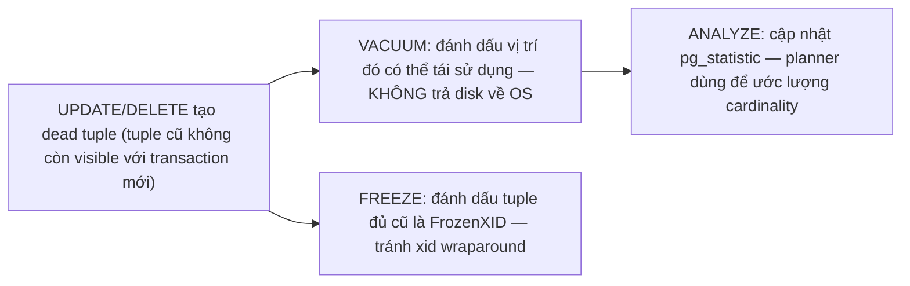
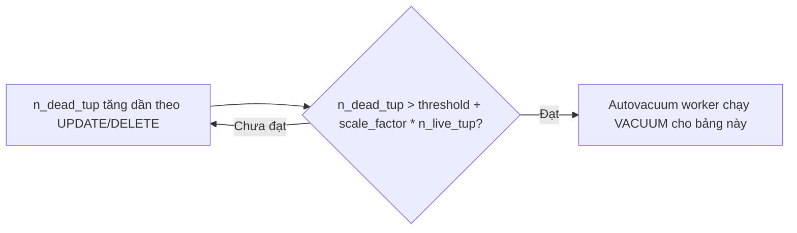
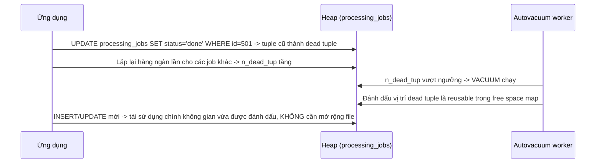
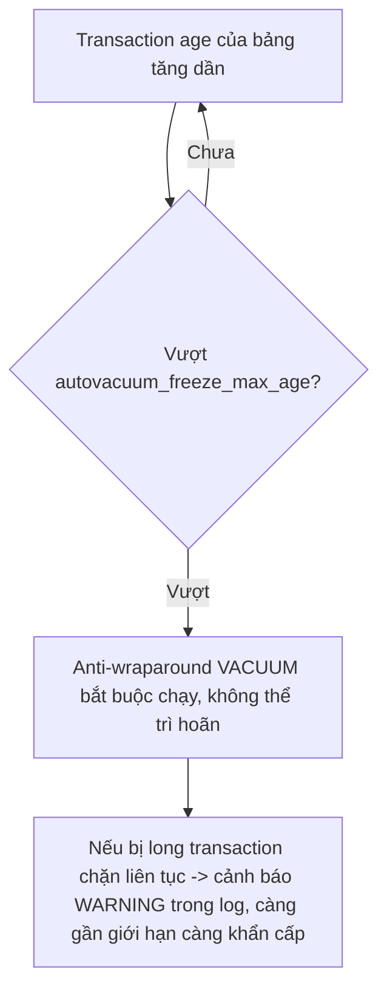

# 01 — Autovacuum, VACUUM, ANALYZE, FREEZE

## 🎯 Mục tiêu học

Sau file này, bạn phải phân biệt rạch ròi 4 khái niệm hay bị gộp chung: **VACUUM** (dọn dead tuple để tái sử dụng), **ANALYZE** (cập nhật statistics cho planner), **FREEZE** (đánh dấu tuple cũ để tránh xid wraparound), và **autovacuum** (tiến trình nền tự động chạy 2 việc đầu theo threshold). Bạn cũng phải hiểu vì sao "vacuum xong" không có nghĩa là file trên đĩa nhỏ lại ngay.

## 📋 Mục lục

- [Mental model](#mental-model)
- [What actually happens: VACUUM](#what-actually-happens-vacuum)
- [What actually happens: ANALYZE](#what-actually-happens-analyze)
- [What actually happens: FREEZE](#what-actually-happens-freeze)
- [Bảng: operation → purpose → what it fixes → what it does NOT fix](#bảng-operation--purpose--what-it-fixes--what-it-does-not-fix)
- [Autovacuum trigger: threshold + scale factor intuition](#autovacuum-trigger-threshold--scale-factor-intuition)
- [Timeline: dead tuple → vacuum → reusable space](#timeline-dead-tuple--vacuum--reusable-space)
- [Anti-wraparound vacuum](#anti-wraparound-vacuum)
- [Long transaction cản cleanup như thế nào](#long-transaction-cản-cleanup-như-thế-nào)
- [Why autovacuum is not optional](#why-autovacuum-is-not-optional)
- [Why manual VACUUM is not the first answer to every slowdown](#why-manual-vacuum-is-not-the-first-answer-to-every-slowdown)
- [Why ANALYZE matters even when vacuum seems healthy](#why-analyze-matters-even-when-vacuum-seems-healthy)
- [Trade-offs](#trade-offs)
- [Failure modes](#failure-modes)
- [Debugging hints](#debugging-hints)
- [Interview lens](#interview-lens)
- [Mini scenarios](#mini-scenarios)
- [Key takeaways](#key-takeaways)
- [Xem tiếp / Liên kết liên quan](#xem-tiếp--liên-kết-liên-quan)

## Mental model



Ba việc này **độc lập về mục đích** dù thường chạy cùng lúc qua autovacuum: VACUUM giải quyết "dọn để tái sử dụng không gian", ANALYZE giải quyết "planner có biết dữ liệu trông như thế nào", FREEZE giải quyết "transaction ID không bị hết số".

## What actually happens: VACUUM

`VACUUM` quét heap, với mỗi tuple đã dead (không còn transaction/snapshot nào cần thấy nó — xem `xid horizon` ở `04-concurrency-and-locking/04-long-transactions-and-idle-in-transaction.md`), nó:

1. Đánh dấu vị trí đó là **có thể ghi đè** bởi tuple mới trong tương lai (cập nhật free space map).
2. Xóa entry index tương ứng nếu tuple đó không còn cần thiết (index cleanup).
3. Cập nhật visibility map cho các page toàn bộ tuple đều visible.

📌 **VACUUM không trả không gian về hệ điều hành** — nó chỉ đánh dấu không gian đó **tái sử dụng được bên trong file của chính table**. Chỉ khi các page **trống hoàn toàn ở cuối file** (không có tuple sống nào), `VACUUM` (không phải `FULL`) mới có thể cắt bớt file bằng `truncate` — điều này không phải lúc nào cũng xảy ra vì phụ thuộc phân bố dead tuple trong file.

```sql
VACUUM (VERBOSE, ANALYZE) processing_jobs;
-- Output ví dụ (rút gọn):
-- pages: 0 removed, 1520 remain, 340 scanned
-- tuples: 8420 removed, 112000 remain
```

## What actually happens: ANALYZE

`ANALYZE` lấy mẫu ngẫu nhiên các dòng trong bảng, tính toán và ghi vào `pg_statistic`: histogram giá trị, MCV (Most Common Values), số dòng ước tính (`n_distinct`), `correlation` vật lý. Planner **hoàn toàn dựa vào** dữ liệu này để ước lượng cardinality khi lập plan — không có `ANALYZE` gần đây, planner dùng số liệu cũ, có thể sai lệch nghiêm trọng nếu phân bố dữ liệu đã đổi.

```sql
ANALYZE tasks;
SELECT relname, last_analyze, last_autoanalyze, n_live_tup, n_dead_tup
FROM pg_stat_user_tables WHERE relname = 'tasks';
```

## What actually happens: FREEZE

Mỗi tuple lưu `xmin` (transaction đã tạo nó). PostgreSQL dùng số nguyên hữu hạn cho XID, nên định kỳ cần đánh dấu tuple **quá cũ, chắc chắn visible với mọi transaction tương lai** bằng giá trị đặc biệt `FrozenTransactionId` — để việc so sánh XID không bị lỗi khi bộ đếm quay vòng (wraparound). Đây gọi là **freeze**, và nó là một phần công việc `VACUUM` thực hiện khi tuple đủ "cũ" theo `vacuum_freeze_min_age`.

## Bảng: operation → purpose → what it fixes → what it does NOT fix

| Operation | Purpose | What it fixes | What it does NOT fix |
|---|---|---|---|
| `VACUUM` | Dọn dead tuple, cập nhật free space map + visibility map | Không gian tái sử dụng bên trong file, hiệu quả Index Only Scan (qua visibility map) | KHÔNG shrink file vật lý (trừ page trống ở cuối file); KHÔNG cập nhật statistics nếu không kèm `ANALYZE` |
| `ANALYZE` | Lấy mẫu, cập nhật `pg_statistic` | Độ chính xác cardinality estimate của planner | KHÔNG dọn dead tuple; không ảnh hưởng kích thước file |
| `VACUUM FULL` | Viết lại toàn bộ table vào file mới, không còn dead tuple/free space dư | Shrink file vật lý thật sự, dọn bloat triệt để | Cần `ACCESS EXCLUSIVE` lock toàn bảng suốt thời gian chạy — không phải giải pháp mặc định (xem `05-`) |
| `FREEZE` (một phần của VACUUM) | Đánh dấu tuple cũ là `FrozenTransactionId` | Nguy cơ xid wraparound | Không liên quan gì tới dead tuple cleanup hay statistics |
| `REINDEX` | Xây lại index từ đầu | Index bloat triệt để, page fragmentation trong index | Không tự động chạy — cần chủ động; không ảnh hưởng heap/table bloat |

## Autovacuum trigger: threshold + scale factor intuition

Autovacuum không chạy liên tục — nó quét theo chu kỳ và quyết định có nên `VACUUM`/`ANALYZE` một bảng dựa trên công thức:

```
autovacuum_vacuum_threshold + autovacuum_vacuum_scale_factor * số dòng ước tính trong bảng
```

Mặc định: `threshold = 50`, `scale_factor = 0.2` (20%). Nghĩa là bảng có 1 triệu dòng cần **~200,050 dead tuple** mới kích hoạt VACUUM tự động — với bảng lớn, đây là con số rất lớn, dẫn tới bloat tích lũy đáng kể trước khi autovacuum "ra tay".



📌 Đây là lý do bảng lớn, update-heavy (ví dụ `processing_jobs` hàng triệu dòng, `products.stock` bị update liên tục) thường cần **giảm `scale_factor`** (hoặc set `threshold` tuyệt đối nhỏ hơn qua `ALTER TABLE ... SET (autovacuum_vacuum_scale_factor = 0.02)`) để autovacuum chạy thường xuyên hơn theo tỷ lệ dữ liệu thực tế.

## Timeline: dead tuple → vacuum → reusable space



## Anti-wraparound vacuum

Nếu một bảng có tuple chưa được freeze quá lâu (transaction age vượt `autovacuum_freeze_max_age`, mặc định ~200 triệu), PostgreSQL **buộc** chạy một **anti-wraparound vacuum** — loại vacuum này **không thể bị autovacuum bỏ qua** dù bảng đang bận, vì nếu để XID quay vòng thật sự, dữ liệu cũ sẽ "biến mất khỏi visibility" một cách thảm khốc (tuple cũ trông như "từ tương lai").



⚠️ Đây là mức độ nghiêm trọng khác hẳn "table hơi bloat" — nếu để tới mức database từ chối nhận thêm transaction mới để bảo vệ dữ liệu (single-user mode), đây là sự cố production nghiêm trọng bậc nhất liên quan tới vacuum.

## Long transaction cản cleanup như thế nào

Đã phân tích chi tiết ở `04-concurrency-and-locking/04-long-transactions-and-idle-in-transaction.md`: VACUUM không thể dọn dead tuple mới hơn xid horizon do bất kỳ snapshot nào đang mở quyết định. Autovacuum "chạy" không đồng nghĩa "dọn được" — log có thể cho thấy autovacuum chạy đều đặn nhưng `n_dead_tup` không giảm, đây chính là dấu hiệu transaction dài đang chặn.

## Why autovacuum is not optional

Không chạy autovacuum (tắt hoàn toàn, hoặc tune quá yếu) đồng nghĩa: dead tuple tích lũy vô hạn (bloat không giới hạn), statistics không bao giờ cập nhật (planner luôn dựa vào số liệu cũ hoặc rỗng), và cuối cùng **xid wraparound protection kích hoạt ở mức nghiêm trọng nhất** — PostgreSQL sẽ **từ chối chấp nhận transaction mới** để bảo vệ dữ liệu khỏi bị hỏng do wraparound. Đây không phải "tối ưu tùy chọn" mà là điều kiện tồn tại cơ bản của MVCC.

## Why manual VACUUM is not the first answer to every slowdown

"Database chậm → chạy `VACUUM`" là phản xạ sai nếu chưa xác định được nguyên nhân. Nếu bloat chưa nghiêm trọng, VACUUM thủ công tốn I/O mà không cải thiện gì đáng kể; nếu vấn đề thực ra là statistics stale, VACUUM (không `ANALYZE`) không giúp gì cho planner; nếu vấn đề là long transaction đang chặn, chạy VACUUM cũng vô ích cho tới khi transaction đó kết thúc. Luôn xác định `symptom → mechanism` trước (xem `02-`, `03-`) trước khi chạy maintenance operation.

## Why ANALYZE matters even when vacuum seems healthy

`n_dead_tup` thấp (vacuum đang "khỏe") không có nghĩa statistics đang tốt — hai chỉ số này độc lập. Một bảng có ít update/delete (statistics ít khi được autoanalyze trigger vì threshold cũng dựa trên số dòng thay đổi) nhưng phân bố dữ liệu logic đổi nhanh (ví dụ `tasks.status` chuyển từ chủ yếu `todo` sang chủ yếu `done` theo thời gian) vẫn có thể khiến planner ước lượng sai nếu `ANALYZE` không được chạy đủ thường xuyên để bắt kịp thay đổi phân bố.

## Trade-offs

| Operation | I/O cost | Lock impact | Khi nào đáng chạy |
|---|---|---|---|
| `VACUUM` (thường) | Đọc toàn bộ page có khả năng có dead tuple, ghi lại free space map | Không chặn `SELECT`/`INSERT`/`UPDATE`/`DELETE` thông thường (chỉ giữ lock nhẹ) | Định kỳ qua autovacuum; thủ công khi cần dọn gấp trước một đợt tải cao dự kiến |
| `ANALYZE` | Đọc mẫu ngẫu nhiên, nhẹ hơn nhiều so với full scan | Không chặn gì đáng kể | Sau khi nạp/xóa dữ liệu hàng loạt, sau khi phân bố `status`/`tenant_id` thay đổi rõ rệt |
| `VACUUM FULL` | Viết lại toàn bộ bảng — I/O rất lớn | `ACCESS EXCLUSIVE` — chặn **mọi** truy cập trong suốt thời gian chạy | Chỉ khi bloat cực đoan và có maintenance window (xem `05-`) |

## Failure modes

- 🔴 Tắt autovacuum toàn cục hoặc set `scale_factor` quá lớn cho bảng lớn "để giảm tải I/O" — dẫn tới bloat không kiểm soát và cuối cùng đối mặt anti-wraparound vacuum bắt buộc chạy đúng lúc tải cao nhất.
- 🔴 Coi "table lớn" đương nhiên là do vacuum thất bại mà không kiểm tra `n_dead_tup`/`last_autovacuum` trước.
- 🔴 Chạy `VACUUM` thủ công lặp lại nhiều lần nghĩ rằng "chạy nhiều thì sạch hơn" trong khi vấn đề thực là long transaction đang chặn — vacuum sẽ luôn quay lại với kết quả "không dọn được gì mới" cho tới khi transaction đó kết thúc.
- 🔴 Bỏ qua `ANALYZE` sau khi migrate/nạp dữ liệu hàng loạt, khiến planner dùng statistics của bảng rỗng/nhỏ cho một bảng giờ đã có hàng triệu dòng.

## Debugging hints

- Kiểm tra sức khỏe vacuum: `SELECT relname, n_live_tup, n_dead_tup, last_vacuum, last_autovacuum, last_analyze, last_autoanalyze FROM pg_stat_user_tables ORDER BY n_dead_tup DESC;`
- Kiểm tra nguy cơ wraparound: `SELECT relname, age(relfrozenxid) FROM pg_class WHERE relkind = 'r' ORDER BY age(relfrozenxid) DESC LIMIT 10;` — so sánh với `autovacuum_freeze_max_age`.
- Nếu `n_dead_tup` cao nhưng `last_autovacuum` gần đây: nghi ngờ ngay long transaction/idle in transaction đang chặn (xem `pg_stat_activity.xact_start` cũ nhất).

## Interview lens

**Interviewer thường hỏi**: "VACUUM có trả không gian đĩa về cho hệ điều hành không?"

- ❌ Câu trả lời yếu: "Có, vacuum dọn rác nên disk sẽ nhỏ lại."
- ✅ Câu trả lời mạnh: `VACUUM` (thường) chỉ đánh dấu không gian bên trong file table là **tái sử dụng được** cho tuple mới — không trả về OS, trừ khi các page trống nằm liền ở cuối file (có thể truncate). Muốn thực sự giảm kích thước file trên đĩa cần `VACUUM FULL` (viết lại toàn bộ file, tốn `ACCESS EXCLUSIVE` lock) hoặc các công cụ online như `pg_repack`.

## Mini scenarios

1. **`processing_jobs` có hàng triệu dòng, job cũ chuyển `status` liên tục (`pending` → `running` → `done`)** — mỗi lần update tạo dead tuple; với `scale_factor` mặc định 0.2, autovacuum chỉ chạy sau khi tích lũy ~20% tổng số dòng thay đổi — cần giảm `scale_factor` cho bảng này.
2. **Sau khi import 5 triệu dòng `events` một lần từ hệ thống cũ**, planner vẫn ước lượng theo statistics cũ của bảng gần rỗng — cần `ANALYZE events;` thủ công ngay sau import, không đợi autoanalyze threshold.
3. **Log cảnh báo `oldest xmin is far in the past` xuất hiện dù tải hệ thống bình thường** — nghi ngờ ngay có session `idle in transaction` đã mở rất lâu, không phải autovacuum bị hỏng.

## Key takeaways

- 🧠 VACUUM, ANALYZE, FREEZE giải quyết 3 vấn đề độc lập: tái sử dụng không gian, cập nhật statistics, tránh xid wraparound.
- 🧠 VACUUM (thường) không shrink file vật lý — chỉ đánh dấu tái sử dụng bên trong; `VACUUM FULL`/`pg_repack` mới thực sự giảm kích thước đĩa.
- 🧠 Autovacuum trigger dựa trên `threshold + scale_factor * số dòng` — bảng lớn cần tune `scale_factor` nhỏ hơn để tránh tích lũy bloat quá nhiều trước khi được dọn.
- 🧠 Anti-wraparound vacuum là cơ chế bảo vệ bắt buộc, không thể tắt lâu dài — bỏ qua cảnh báo này có thể dẫn tới database từ chối transaction mới.
- 🧠 Long transaction/idle in transaction khiến "autovacuum đang chạy" và "dọn được dead tuple" là hai việc khác nhau.

## Xem tiếp / Liên kết liên quan

- ➡️ [`02-table-bloat-and-index-bloat.md`](02-table-bloat-and-index-bloat.md) — điều gì xảy ra khi vacuum không theo kịp workload.
- 🔗 [`01-storage-and-mvcc/03-visibility-vacuum-freeze.md`](../01-storage-and-mvcc/03-visibility-vacuum-freeze.md) — nền tảng visibility/vacuum/freeze.
- 🔗 [`04-concurrency-and-locking/04-long-transactions-and-idle-in-transaction.md`](../04-concurrency-and-locking/04-long-transactions-and-idle-in-transaction.md) — cơ chế xid horizon chặn cleanup.
- ⬅️ [README phase này](README.md)
