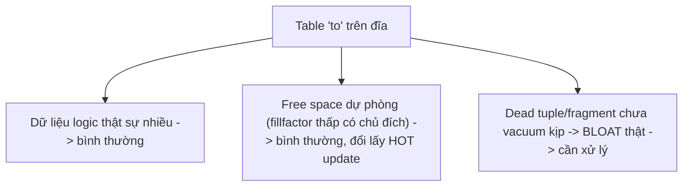
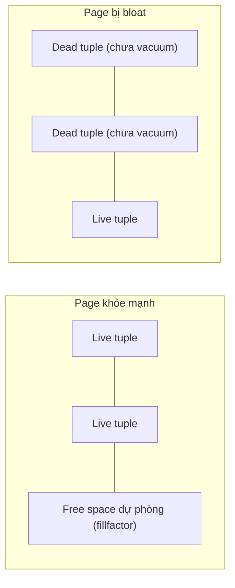
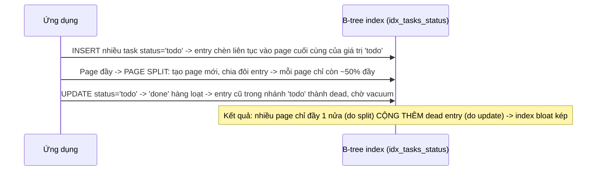

# 02 — Table Bloat và Index Bloat

## 🎯 Mục tiêu học

Sau file này, bạn phải phân biệt được **free space bình thường** (dự phòng cho update trong tương lai, hoàn toàn khỏe mạnh) với **bloat có hại** (dead tuple/fragment tích lũy làm giảm hiệu năng thật sự), và biết chính xác khi nào một bảng "trông to" chỉ là hiện tượng vô hại.

## 📋 Mục lục

- [Mental model](#mental-model)
- [What actually happens: table bloat](#what-actually-happens-table-bloat)
- [What actually happens: index bloat](#what-actually-happens-index-bloat)
- [Diagram: heap page với live/dead/free space](#diagram-heap-page-với-livedeadfree-space)
- [Diagram: index churn / page split / bloat](#diagram-index-churn--page-split--bloat)
- [Bảng: symptom → likely bloat type → why → verification → fixes](#bảng-symptom--likely-bloat-type--why--verification--fixes)
- [When bloat is mostly a storage concern](#when-bloat-is-mostly-a-storage-concern)
- [When bloat becomes a latency concern](#when-bloat-becomes-a-latency-concern)
- [HOT update: khi giúp giảm index churn, khi không](#hot-update-khi-giúp-giảm-index-churn-khi-không)
- [Failure modes](#failure-modes)
- [Debugging hints](#debugging-hints)
- [Interview lens](#interview-lens)
- [Mini scenarios](#mini-scenarios)
- [Key takeaways](#key-takeaways)
- [Xem tiếp / Liên kết liên quan](#xem-tiếp--liên-kết-liên-quan)

## Mental model

❌ Hiểu lầm phổ biến: "Table lớn nghĩa là bloat nặng."

✅ Thực tế: kích thước file lớn có thể do (a) dữ liệu logic thật sự nhiều, (b) free space dự phòng có chủ đích (fillfactor), hoặc (c) bloat thật sự (dead tuple/fragment chưa dọn). Ba nguyên nhân này cần ba phản ứng khác nhau — chỉ (c) là vấn đề cần xử lý.



## What actually happens: table bloat

Table bloat hình thành khi **tốc độ tạo dead tuple (UPDATE/DELETE) vượt tốc độ VACUUM dọn kịp**, hoặc khi VACUUM bị chặn bởi long transaction (`04-concurrency-and-locking/`). Dead tuple chiếm chỗ trong page nhưng không chứa dữ liệu còn hiệu lực — executor vẫn phải đọc qua chúng khi quét page (dù bỏ qua khi kiểm tra visibility), làm tăng số page cần đọc cho cùng một tập kết quả logic.

```sql
-- Case: products.stock bị UPDATE liên tục bởi mỗi đơn hàng
UPDATE products SET stock = stock - 1 WHERE id = 501;
-- Mỗi UPDATE tạo 1 tuple mới + 1 dead tuple (tuple cũ). Với sản phẩm bán chạy,
-- hàng ngàn UPDATE/ngày trên CÙNG 1 dòng logic tạo hàng ngàn dead tuple version.
```

## What actually happens: index bloat

Index bloat hình thành khác cơ chế với table bloat: khi 1 dòng bị update và giá trị cột được index **thay đổi** (hoặc dòng bị xóa), entry cũ trong B-tree index trở thành "chết" — index phải chờ vacuum dọn riêng. Ngoài ra, **page split** (khi 1 index page đầy và cần chèn thêm entry ở giữa) có thể để lại các page chỉ lấp đầy ~50%, làm tăng số page cần đọc cho cùng một phạm vi quét dù không có dead entry nào.

```sql
-- Case: tasks.status thay đổi liên tục, có index trên status
CREATE INDEX idx_tasks_status ON tasks (tenant_id, status);
UPDATE tasks SET status = 'in_progress' WHERE id = 88; -- status đổi -> entry cũ trong idx_tasks_status "chết", entry mới được chèn
```

## Diagram: heap page với live/dead/free space



Hai page có thể **trông giống hệt nhau về kích thước**, nhưng page đầu có free space dự phòng có chủ đích (vô hại, hỗ trợ update sau này), page sau có dead tuple thật sự chưa dọn (cần vacuum).

## Diagram: index churn / page split / bloat



## Bảng: symptom → likely bloat type → why → verification → fixes

| Symptom | Likely bloat type | Why it happens | Verification direction | Possible fixes |
|---|---|---|---|---|
| `products` table lớn hơn nhiều lần so với số dòng logic ước tính | Table bloat | `stock` bị update rất thường xuyên trên cùng ít dòng, vacuum chưa kịp | So `pg_relation_size` với ước tính `n_live_tup * avg_row_size`; xem `n_dead_tup` | Giảm `autovacuum_vacuum_scale_factor` cho bảng này; xem xét fillfactor thấp hơn (`04-`) |
| Index trên `tasks.status` to bất thường so với B-tree lý thuyết cho cardinality thấp | Index bloat | `status` đổi giá trị liên tục, mỗi lần đổi tạo entry chết trong nhánh cũ | `pg_stat_user_indexes` + so sánh kích thước qua công cụ ước tính bloat (extension `pgstattuple`) | `REINDEX CONCURRENTLY` khi bloat rõ ràng; cân nhắc partial index nếu chỉ cần query theo giá trị "hot" |
| `processing_jobs` table to, nhưng working set truy vấn thực tế (job `pending` mới) rất nhỏ | Table bloat từ job cũ đã `done`/`failed` chưa dọn | Không xóa job cũ, chỉ update status, dead tuple tích lũy trên toàn bảng dù phần "nóng" của dữ liệu nhỏ | Xem tỷ lệ `n_dead_tup`/`n_live_tup`; xem phân bố `status` qua thời gian | Xóa/archival job cũ theo lịch trình; partition theo thời gian (`06-`, sẽ mở rộng ở phần sau) |
| Table nhỏ về logic nhưng chiếm nhiều page trên đĩa | Có thể là free space dự phòng (fillfactor thấp có chủ đích), KHÔNG hẳn bloat | Cần phân biệt rõ trước khi hành động | Kiểm tra fillfactor đã set là bao nhiêu; nếu fillfactor mặc định 100 mà vẫn nhiều free space → nghi bloat thật | Không hành động nếu là free space có chủ đích; điều tra thêm nếu fillfactor mặc định |

## When bloat is mostly a storage concern

Nếu working set truy vấn thực tế của ứng dụng vẫn vừa bộ nhớ cache (`shared_buffers`/OS page cache) dù file trên đĩa lớn, bloat chủ yếu chỉ tốn **dung lượng lưu trữ** — chi phí sao lưu lớn hơn, chi phí đĩa lớn hơn, nhưng latency truy vấn chưa bị ảnh hưởng đáng kể vì dữ liệu "nóng" vẫn nằm trong cache.

## When bloat becomes a latency concern

Bloat trở thành vấn đề **latency** khi:

- Working set không còn vừa cache nữa (bloat đẩy dữ liệu "nóng" ra khỏi bộ nhớ, executor phải đọc thêm từ đĩa).
- Seq Scan trên bảng bloat phải quét thêm nhiều page chỉ để bỏ qua dead tuple.
- Index bloat làm tăng độ sâu/chiều rộng cây B-tree cần duyệt cho cùng một phạm vi kết quả, tăng số page I/O ngẫu nhiên.

## HOT update: khi giúp giảm index churn, khi không

HOT (Heap-Only Tuple) update giúp **tránh tạo entry mới trong index** khi: (1) cột được update **không nằm trong bất kỳ index nào**, và (2) page hiện tại của tuple **còn đủ free space** để chứa tuple mới cùng chỗ. Nếu cả hai điều kiện thỏa, entry index cũ được giữ nguyên, trỏ gián tiếp qua chuỗi HOT tới tuple mới nhất — giảm hẳn index churn.

```sql
-- HOT-friendly: order_items.notes không nằm trong index nào
UPDATE order_items SET notes = 'đổi địa chỉ giao hàng' WHERE id = 5001;

-- KHÔNG HOT: tasks.status có index — mọi update status đều tạo entry index mới
UPDATE tasks SET status = 'done' WHERE id = 88;
```

📌 Chi tiết cơ chế fillfactor ảnh hưởng HOT được bàn sâu ở `04-fillfactor-hot-updates-and-write-patterns.md`.

## Failure modes

- 🔴 **Thấy file to là hoảng**: chạy `VACUUM FULL`/`REINDEX` ngay khi thấy `pg_relation_size` lớn mà chưa kiểm tra `n_dead_tup`, fillfactor, hay working set thực tế.
- 🔴 **VACUUM FULL reflex**: coi đây là công cụ mặc định cho mọi "table to" — bỏ qua chi phí `ACCESS EXCLUSIVE` lock toàn thời gian chạy (xem `05-`).
- 🔴 **Rebuild index bừa**: `REINDEX` định kỳ vô điều kiện cho mọi index dù chưa xác nhận có bloat, tốn I/O và có thể ảnh hưởng query đang chạy nếu không dùng `CONCURRENTLY`.
- 🔴 **Nhầm free space với pathological bloat**: fillfactor thấp có chủ đích (ví dụ 70 cho bảng update-heavy) khiến table "trông to hơn" một cách hoàn toàn bình thường — không phải dấu hiệu cần dọn.

## Debugging hints

- Ước tính bloat thật sự cần công cụ đo trực tiếp (ví dụ extension `pgstattuple`: `SELECT * FROM pgstattuple('products');` trả về `dead_tuple_percent`, `free_percent`) thay vì chỉ nhìn `pg_relation_size`.
- So sánh `n_dead_tup` với `n_live_tup` trong `pg_stat_user_tables` — tỷ lệ dead tuple cao kéo dài dù autovacuum vẫn chạy là dấu hiệu bloat thật, không phải free space bình thường.
- Với index, dùng `pgstattuple('idx_tasks_status')` hoặc so sánh kích thước index với ước tính lý thuyết dựa trên số dòng và độ dài key.

## Interview lens

**Interviewer thường hỏi**: "Table 50GB nhưng chỉ có 2 triệu dòng dữ liệu logic có phải là vấn đề không?"

- ❌ Câu trả lời yếu: "50GB là quá to, chắc chắn cần VACUUM FULL ngay."
- ✅ Câu trả lời mạnh: Cần kiểm tra trước 3 khả năng: dữ liệu logic thực sự lớn (row width lớn, TOAST data), free space dự phòng có chủ đích (fillfactor thấp), hay dead tuple/fragment thật sự (bloat). Chỉ khi xác nhận qua `pgstattuple`/`n_dead_tup` rằng đây là bloat thật, và working set không còn vừa cache (latency bị ảnh hưởng), mới cân nhắc hành động — và hành động đầu tiên không phải `VACUUM FULL` mà là xem lại autovacuum tuning.

## Mini scenarios

1. **`products.stock` của 20 sản phẩm bán chạy nhất bị update hàng chục ngàn lần/ngày, nhưng bảng `products` chỉ có 50,000 dòng** — bloat tập trung cao độ ở một số ít dòng vật lý dù bảng "nhỏ" về số dòng; cần `autovacuum_vacuum_scale_factor` nhỏ hơn cho bảng này, không đợi threshold theo % toàn bảng.
2. **`processing_jobs` có 10 triệu dòng nhưng chỉ 5,000 dòng `pending` là "nóng"; phần còn lại là job cũ `done`/`failed` đã hoàn tất từ nhiều tháng trước** — bảng to chủ yếu do dữ liệu lịch sử tích lũy, không phải bloat theo nghĩa dead tuple; giải pháp đúng là archival/xóa job cũ hoặc partition theo thời gian, không phải vacuum tuning.
3. **Index trên `activity_logs (tenant_id, created_at)` phình to nhanh dù bảng chỉ `INSERT` (append-only), không `UPDATE`/`DELETE`** — đây không phải index bloat do dead entry (không có update/delete), mà là page split tự nhiên do insert liên tục theo thời gian tăng dần; đây là hành vi bình thường của B-tree, không cần can thiệp.

## Key takeaways

- 🧠 Table "to" có 3 nguyên nhân khác nhau (dữ liệu thật, free space dự phòng, bloat thật) — chỉ cái cuối cần xử lý.
- 🧠 Table bloat và index bloat hình thành từ cơ chế khác nhau: table bloat từ dead tuple chưa vacuum, index bloat từ dead entry + page split.
- 🧠 Bloat chỉ là vấn đề latency khi đẩy working set ra khỏi cache hoặc làm tăng số page cần đọc thật sự — nếu không, nó chủ yếu chỉ là chi phí lưu trữ.
- 🧠 HOT update giảm index churn chỉ khi cột update không nằm trong index VÀ page còn đủ free space — cả hai điều kiện đều cần thiết.
- 🧠 Công cụ đo bloat đáng tin (`pgstattuple`, `n_dead_tup`) quan trọng hơn cảm tính "nhìn kích thước file".

## Xem tiếp / Liên kết liên quan

- ➡️ [`03-statistics-freshness-and-planner-health.md`](03-statistics-freshness-and-planner-health.md) — bloat và stale statistics thường xuất hiện cùng lúc trên bảng bị bỏ quên maintenance.
- 🔗 [`03-indexing/05-index-anti-patterns.md`](../03-indexing/05-index-anti-patterns.md) — các anti-pattern index liên quan.
- ⬅️ [README phase này](README.md)
