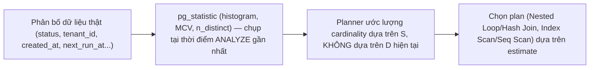
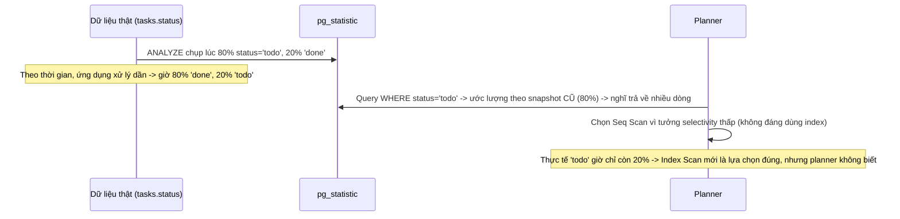

# 03 — Statistics Freshness và Planner Health

## 🎯 Mục tiêu học

Đây là file nối chặt với `02-query-planner-and-execution/03-cardinality-estimation-and-statistics.md`. Sau file này, bạn phải nhận ra được khi nào một query "tự nhiên chậm đi" không phải do bloat, không phải do thiếu index, mà do **statistics không còn phản ánh đúng phân bố dữ liệu hiện tại**.

## 📋 Mục lục

- [Mental model](#mental-model)
- [What actually happens: planner phụ thuộc statistics ra sao](#what-actually-happens-planner-phụ-thuộc-statistics-ra-sao)
- [Diagram: data distribution → stats → plan choice](#diagram-data-distribution--stats--plan-choice)
- [Case: selectivity thay đổi theo `status`](#case-selectivity-thay-đổi-theo-status)
- [Case: selectivity thay đổi theo `next_run_at`/`created_at`](#case-selectivity-thay-đổi-theo-next_run_atcreated_at)
- [Before/after estimate intuition](#beforeafter-estimate-intuition)
- [Autovacuum healthy nhưng stats vẫn chưa đủ tốt](#autovacuum-healthy-nhưng-stats-vẫn-chưa-đủ-tốt)
- [Bảng: planner symptom → likely stats issue → what to inspect → fix](#bảng-planner-symptom--likely-stats-issue--what-to-inspect--fix)
- [Why planner health is part of maintenance](#why-planner-health-is-part-of-maintenance)
- [Failure modes](#failure-modes)
- [Debugging hints](#debugging-hints)
- [Interview lens](#interview-lens)
- [Mini scenarios](#mini-scenarios)
- [Key takeaways](#key-takeaways)
- [Xem tiếp / Liên kết liên quan](#xem-tiếp--liên-kết-liên-quan)

## Mental model



❌ Hiểu lầm phổ biến: "Autovacuum khỏe mạnh (`n_dead_tup` thấp) thì statistics chắc chắn cũng tốt."

✅ Thực tế: VACUUM và ANALYZE là hai việc độc lập, trigger theo threshold khác nhau. Một bảng ít bị update/delete (VACUUM ít khi cần chạy) nhưng có phân bố giá trị logic thay đổi nhanh (ví dụ đa số dòng chuyển từ `status = 'pending'` sang `'done'` theo thời gian mà không xóa dòng nào) vẫn có thể có statistics rất lệch thực tế.

## What actually happens: planner phụ thuộc statistics ra sao

Mọi quyết định plan — chọn Seq Scan hay Index Scan, chọn Nested Loop hay Hash Join, chọn thứ tự join nào trước — đều dựa trên **ước lượng số dòng (cardinality estimate)** ở mỗi bước, và ước lượng này lấy từ `pg_statistic` (được `ANALYZE` ghi vào). Nếu `pg_statistic` không phản ánh đúng phân bố hiện tại, estimate sai, kéo theo lựa chọn plan sai — kể cả khi index tồn tại đúng và đủ tốt.

## Diagram: data distribution → stats → plan choice



## Case: selectivity thay đổi theo `status`

```sql
-- Ban đầu, ngay sau khi tạo bảng và ANALYZE lần đầu: đa số task 'todo'
EXPLAIN ANALYZE SELECT * FROM tasks WHERE tenant_id = 7 AND status = 'done';
-- Planner (dựa statistics cũ): ước lượng 'done' hiếm -> chọn Index Scan trên idx_tasks_tenant_status -> ĐÚNG lúc đó

-- 6 tháng sau, phần lớn task đã chuyển 'done', nhưng KHÔNG ANALYZE lại
EXPLAIN ANALYZE SELECT * FROM tasks WHERE tenant_id = 7 AND status = 'done';
-- Planner VẪN dùng statistics cũ (nghĩ 'done' hiếm) -> vẫn chọn Index Scan
-- nhưng thực tế 'done' giờ chiếm đa số -> Index Scan phải fetch heap rất nhiều lần -> chậm hơn Seq Scan nhiều
```

📌 Đây là ví dụ estimate **sai theo hướng lạc quan quá mức** (nghĩ ít dòng trong khi thực tế nhiều) — hậu quả: chọn Index Scan cho một điều kiện giờ đã không còn chọn lọc, phát sinh rất nhiều random heap fetch.

## Case: selectivity thay đổi theo `next_run_at`/`created_at`

```sql
-- processing_jobs.next_run_at: đa số job có next_run_at trong quá khứ gần (đã tới hạn)
-- Sau một đợt spike lớn job được lên lịch cho tương lai xa (ví dụ campaign),
-- phân bố next_run_at lệch hẳn nhưng chưa ANALYZE lại
SELECT * FROM processing_jobs WHERE next_run_at <= now() AND status = 'pending';
-- Nếu histogram cũ không phản ánh cụm dữ liệu mới (spike ở tương lai xa),
-- planner có thể ước lượng sai số dòng thỏa `next_run_at <= now()`, dẫn tới chọn join order/scan method không tối ưu
-- cho các báo cáo tổng hợp join processing_jobs với events
```

## Before/after estimate intuition

| Thời điểm | `status='done'` thực tế chiếm | Estimate của planner (dựa statistics cũ) | Plan được chọn | Có tối ưu không? |
|---|---|---|---|---|
| Ngay sau ANALYZE lần đầu | 20% | ~20% | Index Scan | ✅ Đúng |
| 6 tháng sau, chưa ANALYZE lại | 80% | Vẫn ~20% (statistics cũ) | Vẫn Index Scan | ❌ Sai — Seq Scan sẽ nhanh hơn ở tỷ lệ này |
| Sau khi chạy `ANALYZE tasks;` | 80% | ~80% (statistics mới) | Seq Scan | ✅ Đúng trở lại |

## Autovacuum healthy nhưng stats vẫn chưa đủ tốt

Autoanalyze cũng có threshold riêng (tương tự autovacuum: `autoanalyze_threshold + scale_factor * n_live_tup`), tính trên **số dòng bị thay đổi** (insert/update/delete), không quan tâm **giá trị logic** đổi ra sao. Một bảng với ít thay đổi số dòng tuyệt đối nhưng thay đổi tập trung vào đúng cột hay được query lọc (`status`, `tenant_id`) vẫn có thể vượt ngưỡng chậm, khiến statistics "lạc hậu" so với tốc độ thay đổi phân bố thực tế của nghiệp vụ.

## Bảng: planner symptom → likely stats issue → what to inspect → fix direction

| Planner symptom | Likely stats issue | What to inspect | Fix direction |
|---|---|---|---|
| `EXPLAIN ANALYZE` cho thấy `rows=X` ước lượng lệch xa `actual rows` | Statistics stale hoặc `default_statistics_target` quá thấp cho cột này | So `estimated rows` (trong `EXPLAIN`, không `ANALYZE`) với `actual rows` | Chạy `ANALYZE` thủ công; tăng `default_statistics_target` riêng cho cột (`ALTER TABLE ... ALTER COLUMN ... SET STATISTICS n`) |
| Plan đổi đột ngột không rõ lý do sau một đợt nạp/xóa dữ liệu lớn | Phân bố đổi nhanh, chưa kịp autoanalyze | `pg_stat_user_tables.last_autoanalyze` so với thời điểm nạp dữ liệu | `ANALYZE` ngay sau batch load/migration lớn, không đợi autoanalyze |
| Join order/join method thay đổi bất thường giữa các query gần giống nhau | Correlation hoặc n_distinct ước lượng sai cho cột join | Xem `pg_stats.correlation`, `pg_stats.n_distinct` cho cột liên quan | Cân nhắc `CREATE STATISTICS` (multi-column) nếu 2 cột phụ thuộc nhau; tăng statistics target |
| Query dùng `WHERE created_at > ...` chọn plan tệ dần theo thời gian dù dữ liệu tăng đều | Histogram bucket cũ không phản ánh vùng giá trị mới (dữ liệu càng ngày càng "trẻ" hơn histogram) | So khoảng giá trị trong `pg_stats.histogram_bounds` với giá trị `now()` | `ANALYZE` định kỳ thường xuyên hơn cho bảng có cột thời gian tăng liên tục |

## Why planner health is part of maintenance

Statistics freshness thường bị tách riêng khỏi "maintenance" trong tư duy vận hành (nghĩ maintenance chỉ là vacuum/bloat), nhưng về bản chất nó là **cùng một họ vấn đề**: cả hai đều là hệ quả của việc dữ liệu thay đổi theo thời gian mà một tiến trình nền (autovacuum/autoanalyze) phải theo kịp. Bỏ qua statistics health khi làm maintenance review là bỏ sót một nửa vấn đề — một hệ thống có thể "không bloat" nhưng vẫn chậm dần chỉ vì statistics lạc hậu.

## Failure modes

- 🔴 **Thêm index khi vấn đề là stale stats**: query chậm, giả định "thiếu index" và thêm index mới — trong khi index cũ vẫn đúng, planner chỉ đang ước lượng sai selectivity nên không chọn nó (hoặc chọn nó sai chỗ).
- 🔴 **Chỉ nhìn `actual time` mà bỏ estimate drift**: tối ưu dựa trên thời gian chạy thực tế mà không so sánh `rows estimated` vs `rows actual` trong `EXPLAIN ANALYZE` — bỏ lỡ dấu hiệu rõ ràng nhất của statistics sai.
- 🔴 **Assume autovacuum = statistics always fine**: hai cơ chế autovacuum/autoanalyze độc lập, threshold khác nhau; "vacuum khỏe" không đảm bảo "statistics tươi".
- 🔴 **Không tăng statistics target cho cột phân bố lệch mạnh** (ví dụ `tenant_id` có 1 tenant chiếm 90% dữ liệu) trong khi mặc định `default_statistics_target = 100` có thể không đủ chi tiết để bắt đúng long-tail.

## Debugging hints

- So sánh trực tiếp: `EXPLAIN (ANALYZE, BUFFERS) SELECT ...` — nhìn `rows=` (ước lượng, xuất hiện trước khi chạy) với `actual rows=` (đo thật) ở từng node; lệch lớn (vài lần trở lên) là dấu hiệu statistics cần refresh hoặc statistics target cần tăng.
- Xem trực tiếp thống kê của một cột: `SELECT attname, n_distinct, correlation, most_common_vals FROM pg_stats WHERE tablename = 'tasks' AND attname = 'status';`
- Nếu nghi ngờ 2 cột có tương quan (ví dụ `tenant_id` và `status` thường xuất hiện cùng nhau trong `WHERE`), planner mặc định coi 2 điều kiện độc lập — cân nhắc `CREATE STATISTICS` để khai báo tương quan rõ ràng.

## Interview lens

**Interviewer thường hỏi**: "Một query dùng đúng index nhưng chậm dần theo thời gian dù dữ liệu và code không đổi — bạn nghi ngờ điều gì đầu tiên?"

- ❌ Câu trả lời yếu: "Chắc index bị bloat, chạy `REINDEX`."
- ✅ Câu trả lời mạnh: Kiểm tra `EXPLAIN ANALYZE` xem estimate có lệch xa actual không trước — nếu phân bố dữ liệu (ví dụ tỷ lệ `status`) đã đổi đáng kể theo thời gian mà `ANALYZE` không theo kịp, planner có thể đang dùng statistics lạc hậu để quyết định scan method/join order sai, dù index vẫn hoàn toàn khỏe mạnh. `REINDEX` sẽ không giải quyết được vấn đề này vì đây không phải bloat mà là thông tin đầu vào của planner đã cũ.

## Mini scenarios

1. **Bảng `tasks` mới tạo có 90% `status='todo'`, 6 tháng sau đảo ngược thành 90% `'done'` mà chưa từng `ANALYZE` lại thủ công** — plan chọn theo phân bố cũ trở nên sai hướng; fix bằng `ANALYZE tasks;` định kỳ hoặc giảm ngưỡng autoanalyze cho bảng này.
2. **Sau một chiến dịch tạo hàng loạt `processing_jobs` với `next_run_at` xa trong tương lai**, báo cáo join `processing_jobs`/`events` chọn join order khác thường — kiểm tra `pg_stats.histogram_bounds` của `next_run_at` có bắt kịp cụm dữ liệu mới không.
3. **`tenant_id` có 1 tenant lớn chiếm 90% toàn bộ `activity_logs`**, các tenant nhỏ chỉ vài chục dòng — nếu `default_statistics_target` mặc định không đủ, MCV có thể không bắt đúng tần suất tenant lớn/nhỏ; cân nhắc `ALTER TABLE activity_logs ALTER COLUMN tenant_id SET STATISTICS 500;` rồi `ANALYZE` lại.

## Key takeaways

- 🧠 Mọi quyết định plan dựa trên statistics tại thời điểm `ANALYZE` gần nhất, không phải phân bố dữ liệu thực tế tại thời điểm chạy query.
- 🧠 VACUUM khỏe mạnh không đảm bảo statistics tươi — hai cơ chế trigger độc lập theo threshold khác nhau.
- 🧠 So sánh `rows estimated` vs `actual rows` trong `EXPLAIN ANALYZE` là cách nhanh nhất phát hiện statistics stale.
- 🧠 Thêm index hoặc `REINDEX` không giải quyết được vấn đề gốc nếu nguyên nhân thực sự là statistics lạc hậu.
- 🧠 Cột có phân bố lệch mạnh (long-tail) hoặc thay đổi nhanh theo thời gian cần `ANALYZE` chủ động thường xuyên hơn, có thể cần tăng `default_statistics_target` riêng cho cột đó.

## Xem tiếp / Liên kết liên quan

- ➡️ [`04-fillfactor-hot-updates-and-write-patterns.md`](04-fillfactor-hot-updates-and-write-patterns.md) — write pattern ảnh hưởng cả bloat lẫn tần suất autoanalyze.
- 🔗 [`02-query-planner-and-execution/03-cardinality-estimation-and-statistics.md`](../02-query-planner-and-execution/03-cardinality-estimation-and-statistics.md) — nền tảng cardinality estimation.
- ⬅️ [README phase này](README.md)
