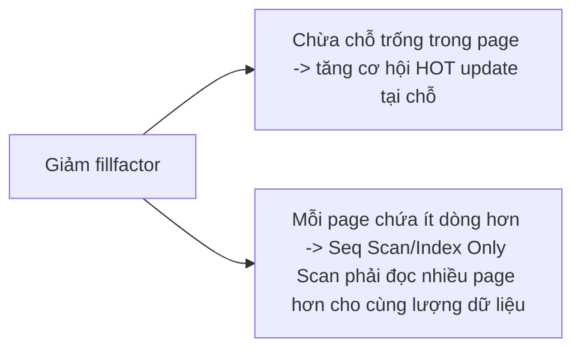
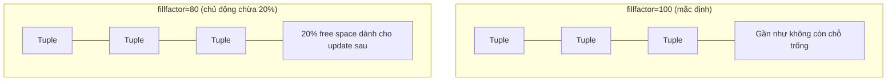
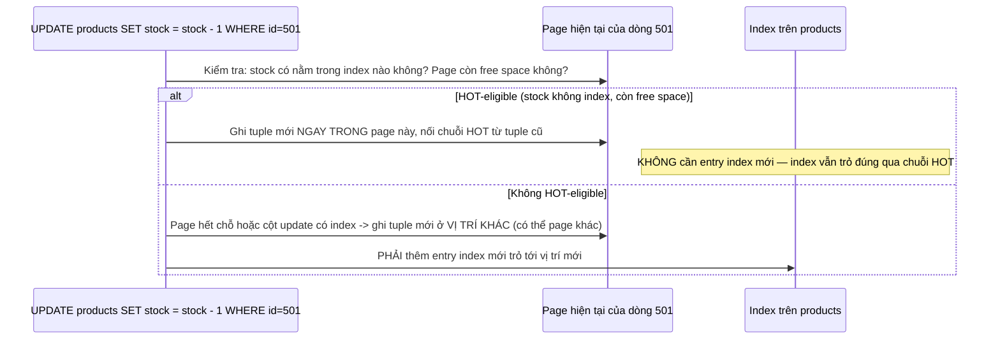

# 04 — Fillfactor, HOT Updates và Write Patterns

## 🎯 Mục tiêu học

Sau file này, bạn phải biết chính xác fillfactor đánh đổi cái gì để lấy cái gì, khi nào giảm fillfactor thực sự giúp ích (và cho bảng nào), và vì sao "fillfactor thấp luôn tốt hơn" là một hiểu lầm nguy hiểm.

## 📋 Mục lục

- [Mental model](#mental-model)
- [What actually happens: fillfactor](#what-actually-happens-fillfactor)
- [Diagram: page occupancy intuition](#diagram-page-occupancy-intuition)
- [Diagram: HOT vs non-HOT update path](#diagram-hot-vs-non-hot-update-path)
- [Practical examples theo workload](#practical-examples-theo-workload)
- [Bảng: workload pattern → default okay? → lower fillfactor useful? → risk](#bảng-workload-pattern--default-okay--lower-fillfactor-useful--risk)
- [Trade-offs](#trade-offs)
- [Failure modes](#failure-modes)
- [Debugging hints](#debugging-hints)
- [Interview lens](#interview-lens)
- [Mini scenarios](#mini-scenarios)
- [Key takeaways](#key-takeaways)
- [Xem tiếp / Liên kết liên quan](#xem-tiếp--liên-kết-liên-quan)

## Mental model

❌ Hiểu lầm phổ biến: "Fillfactor thấp luôn tốt hơn vì tạo nhiều chỗ trống cho update."

✅ Thực tế: fillfactor thấp là một **đánh đổi có điều kiện** — chỉ có lợi khi bảng thực sự update thường xuyên **và** không phải mọi cột được update đều nằm trong index. Với bảng append-only hoặc bảng ít update, fillfactor thấp chỉ tốn thêm dung lượng lưu trữ và làm mỗi page chứa ít dòng hơn (Seq Scan phải đọc nhiều page hơn cho cùng dữ liệu).



## What actually happens: fillfactor

`fillfactor` (mặc định 100 cho table, nghĩa là lấp đầy 100% khi insert) quyết định PostgreSQL **chủ động chừa lại bao nhiêu % trống** trong mỗi page ngay khi ghi dữ liệu lần đầu. Ví dụ `fillfactor = 80` nghĩa là chỉ lấp 80% page, chừa 20% cho các update sau này chèn tuple mới **ngay trong cùng page** thay vì phải tìm page khác.

```sql
ALTER TABLE products SET (fillfactor = 80);
-- Ảnh hưởng dữ liệu ghi SAU lệnh này (không tự động áp dụng cho dữ liệu cũ trừ khi VACUUM FULL/CLUSTER lại)
```

Không gian trống này chính là điều kiện thứ hai của HOT update (điều kiện thứ nhất là cột update không nằm trong index — xem `02-table-bloat-and-index-bloat.md`).

## Diagram: page occupancy intuition



## Diagram: HOT vs non-HOT update path



## Practical examples theo workload

### `products.stock` — update rất thường xuyên, giá trị không nằm trong index thường dùng

```sql
-- stock KHÔNG nằm trong index (chỉ id là PK, category_id có index riêng)
ALTER TABLE products SET (fillfactor = 70); -- ứng viên tốt cho fillfactor thấp: update-heavy + HOT-eligible
```

### `tasks.status` — update thường xuyên NHƯNG giá trị nằm trong index

```sql
-- status NẰM TRONG idx_tasks_tenant_status -> mọi update status đều KHÔNG HOT dù fillfactor thấp
-- Giảm fillfactor cho tasks giúp ít với riêng cột status, nhưng vẫn có lợi nếu tasks có nhiều cột khác (assignee_id, due_at) update không qua index
ALTER TABLE tasks SET (fillfactor = 85);
```

### `activity_logs`/`events` — append-only, gần như không update

```sql
-- Không có lý do giảm fillfactor: không update nghĩa là free space dự phòng không bao giờ được dùng tới
-- Giữ fillfactor mặc định 100 để tối đa hóa số dòng/page, giảm số page cần đọc khi quét
-- fillfactor thấp ở đây chỉ lãng phí dung lượng vô ích
```

## Bảng: workload pattern → default okay? → lower fillfactor useful? → risk/cost

| Workload pattern | Default (100) ổn không? | Fillfactor thấp có ích không? | Risk/cost nếu giảm |
|---|---|---|---|
| `products.stock` update liên tục, cột không index | Không tối ưu | ✅ Có — tăng tỷ lệ HOT update, giảm index churn | Tốn thêm dung lượng; cần đo được tần suất update thật trước khi chỉnh |
| `tasks.status` update liên tục, cột CÓ index | Chấp nhận được | ⚠️ Có ích một phần (các cột khác trong dòng), không giải quyết được index churn của `status` | Không cứu được vấn đề gốc nếu kỳ vọng quá nhiều vào fillfactor |
| `activity_logs`/`events` append-only | ✅ Tối ưu | ❌ Không — không có update để tận dụng free space | Giảm fillfactor chỉ lãng phí dung lượng, tăng số page cho Seq Scan |
| `payments`/`shipments` update 1-2 lần trong vòng đời rồi gần như bất biến | ✅ Tối ưu | ❌ Thường không đáng — tần suất update thấp không bù được chi phí free space cố định | Không cần tuning, ưu tiên default |
| `processing_jobs` update trạng thái nhiều lần (`pending`→`running`→`done`) | Không tối ưu nếu volume lớn | ✅ Có, đặc biệt nếu cột `attempts`/`updated_at` không index | Cần theo dõi song song với autovacuum tuning, không thay thế nhau |

## Trade-offs

- ✅ Fillfactor thấp + HOT-eligible: giảm index churn, giảm write amplification vào index, giảm bloat index tích lũy.
- ⚠️ Fillfactor thấp không giúp gì nếu cột update nằm trong index — vẫn phải ghi entry index mới bất kể còn free space hay không.
- ⚠️ Fillfactor thấp tăng dung lượng lưu trữ ngay từ đầu (trả trước chi phí để tránh trả sau dưới dạng index bloat) — đánh đổi hợp lý cho bảng update-heavy, lãng phí thuần túy cho bảng append-only/ít update.
- ⚠️ Thay đổi fillfactor không hồi tố cho dữ liệu cũ đã ghi — cần `VACUUM FULL`/`CLUSTER`/rebuild để áp dụng cho toàn bảng hiện có (cân nhắc chi phí lock khi làm việc này, xem `05-`).

## Failure modes

- 🔴 **Set fillfactor thấp hàng loạt** cho mọi bảng "để phòng ngừa" mà không phân tích write pattern từng bảng — lãng phí dung lượng ở các bảng append-only/ít update mà không thu được lợi ích gì.
- 🔴 **Tuning không đo update pattern**: đoán mò con số fillfactor (70? 80? 90?) thay vì đo tỷ lệ HOT update thực tế (`pg_stat_user_tables.n_tup_hot_upd` / `n_tup_upd`) trước và sau khi chỉnh.
- 🔴 **Kỳ vọng fillfactor cứu mọi bloat problem**: nếu cột update luôn nằm trong index (như `tasks.status`), giảm fillfactor không giải quyết được index churn — cần xem lại thiết kế index hoặc chấp nhận churn này là chi phí cần thiết.

## Debugging hints

- Đo tỷ lệ HOT update thực tế: `SELECT relname, n_tup_upd, n_tup_hot_upd, round(100.0 * n_tup_hot_upd / NULLIF(n_tup_upd, 0), 1) AS hot_pct FROM pg_stat_user_tables ORDER BY n_tup_upd DESC;` — `hot_pct` thấp trên bảng update nhiều là dấu hiệu đáng xem xét fillfactor hoặc thiết kế index.
- Trước khi đổi fillfactor, xác nhận cột hay bị update **không** nằm trong index nào (`\d tablename` trong `psql`, hoặc join `pg_index`) — nếu nó nằm trong index, ưu tiên xem lại có cần index đó không thay vì tuning fillfactor.
- Sau khi đổi fillfactor cho bảng đã có dữ liệu, đo lại `hot_pct` sau một chu kỳ ghi bình thường (không phải ngay lập tức) để xác nhận cải thiện thật.

## Interview lens

**Interviewer thường hỏi**: "Bạn sẽ set fillfactor bao nhiêu cho một bảng bất kỳ?"

- ❌ Câu trả lời yếu: "Set thấp, ví dụ 70, để chừa chỗ cho update, càng thấp càng an toàn."
- ✅ Câu trả lời mạnh: Không có con số mặc định đúng cho mọi bảng — cần đo `n_tup_upd`/`n_tup_hot_upd` để biết bảng có update nhiều không, và kiểm tra cột hay update có nằm trong index hay không (điều kiện bắt buộc để HOT hoạt động). Với bảng append-only (`events`, `activity_logs`), giữ fillfactor mặc định 100 là đúng; chỉ giảm cho bảng update-heavy có cột thay đổi ngoài index (`products.stock`).

## Mini scenarios

1. **`products` có `stock` update hàng ngàn lần/ngày cho các sản phẩm bán chạy, `stock` không nằm trong index nào** — ứng viên lý tưởng cho `fillfactor = 70-80`; đo `hot_pct` trước/sau để xác nhận cải thiện.
2. **`tasks` có `status` update liên tục nhưng `status` nằm trong composite index `(tenant_id, status)`** — giảm fillfactor không giải quyết index churn của cột này; cần cân nhắc lại có cần index đó theo đúng pattern query hay chấp nhận churn.
3. **`events` chỉ `INSERT`, không bao giờ `UPDATE`** — giữ nguyên fillfactor mặc định; nếu ai đó đề xuất giảm fillfactor "để tối ưu", đây là đề xuất sai vì không có update nào tận dụng được free space đó.

## Key takeaways

- 🧠 Fillfactor là trả trước dung lượng để đổi lấy khả năng HOT update — chỉ có lợi khi bảng thực sự update thường xuyên.
- 🧠 HOT update cần cả 2 điều kiện: cột update không nằm trong index, VÀ page còn đủ free space (từ fillffactor).
- 🧠 Bảng append-only không có lý do giảm fillfactor — chỉ tốn thêm page cho Seq Scan mà không thu lợi gì.
- 🧠 Đo `n_tup_hot_upd`/`n_tup_upd` thực tế trước khi tuning, không đoán mò con số fillfactor.
- 🧠 Thay đổi fillfactor không hồi tố cho dữ liệu cũ — cần rebuild (VACUUM FULL/CLUSTER) để áp dụng toàn bảng, kèm chi phí lock cần cân nhắc.

## Xem tiếp / Liên kết liên quan

- ➡️ [`05-safe-maintenance-operations-and-anti-patterns.md`](05-safe-maintenance-operations-and-anti-patterns.md) — khi nào rebuild để áp dụng fillfactor mới là hợp lý.
- 🔗 [`02-table-bloat-and-index-bloat.md`](02-table-bloat-and-index-bloat.md) — cơ chế HOT update và index churn chi tiết.
- 🔗 [`03-indexing/02-multicolumn-covering-and-order.md`](../03-indexing/02-multicolumn-covering-and-order.md) — thiết kế index composite ảnh hưởng cột nào "an toàn" để update HOT.
- ⬅️ [README phase này](README.md)
