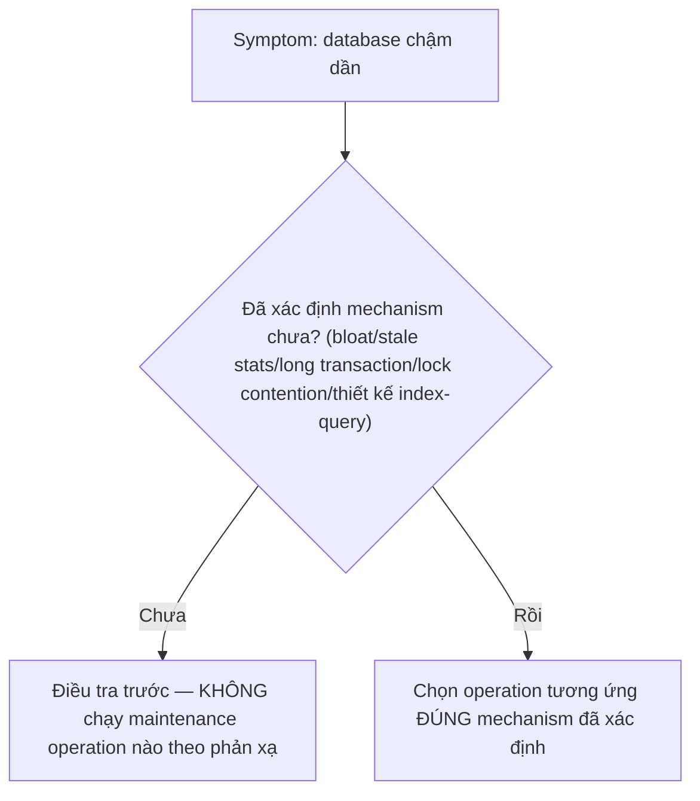
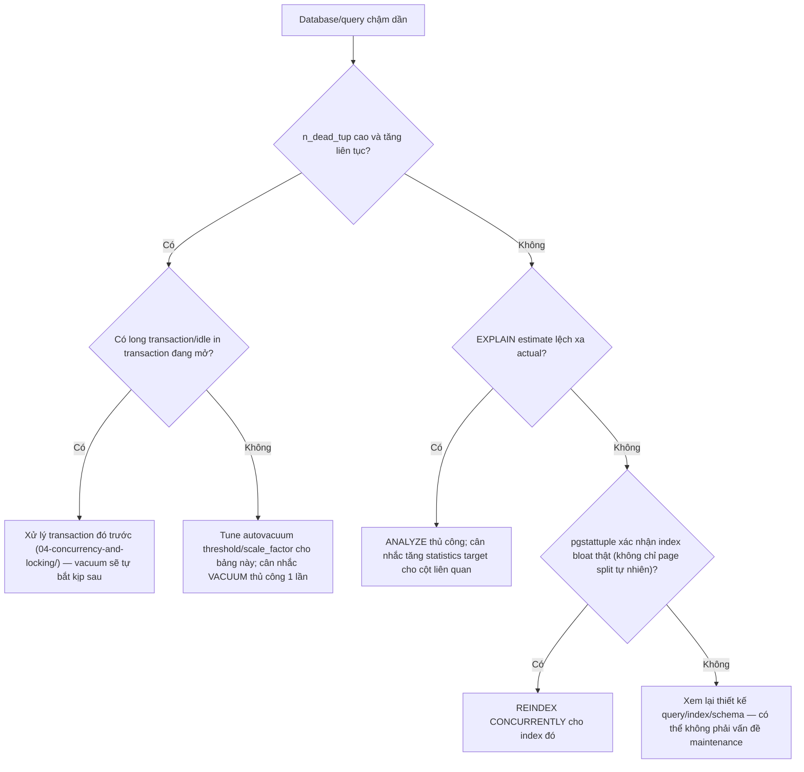

# 05 — Safe Maintenance Operations và Anti-patterns

## 🎯 Mục tiêu học

Đây là file tổng hợp thực chiến của toàn phase. Sau file này, khi đối mặt "database chậm dần", bạn phải có một quy trình triage rõ ràng thay vì phản xạ chạy `VACUUM FULL`/`REINDEX` ngay lập tức, và phải biết chính xác mỗi thao tác maintenance tốn gì (lock, I/O, replication) trước khi chạy trên production.

## 📋 Mục lục

- [Mental model](#mental-model)
- [What actually happens: mỗi operation ảnh hưởng gì](#what-actually-happens-mỗi-operation-ảnh-hưởng-gì)
- [Bảng: operation → use when → avoid when → locking impact → side effects](#bảng-operation--use-when--avoid-when--locking-impact--side-effects)
- [Diagram: maintenance decision tree](#diagram-maintenance-decision-tree)
- [Symptom-to-action matrix](#symptom-to-action-matrix)
- [Maintenance issue or workload-design issue?](#maintenance-issue-or-workload-design-issue)
- [What to verify before touching production](#what-to-verify-before-touching-production)
- [Safe maintenance patterns](#safe-maintenance-patterns)
- [Failure modes / anti-patterns](#failure-modes--anti-patterns)
- [Debugging hints](#debugging-hints)
- [Interview lens](#interview-lens)
- [Mini scenarios](#mini-scenarios)
- [Key takeaways](#key-takeaways)
- [Xem tiếp / Liên kết liên quan](#xem-tiếp--liên-kết-liên-quan)

## Mental model

❌ Hiểu lầm phổ biến: "Maintenance là việc tách biệt với application behavior — cứ để DBA lo."

✅ Thực tế: mọi vấn đề maintenance (bloat, stale stats, wraparound pressure) đều là **hệ quả trực tiếp của cách ứng dụng ghi dữ liệu** (update pattern, transaction length, delete/archival policy). Maintenance operation là phản ứng, không phải phòng ngừa gốc rễ — thiết kế schema/query/transaction tốt mới là phòng ngừa thật.

## What actually happens: mỗi operation ảnh hưởng gì

| Operation | Locking impact | I/O cost | Replication impact | Write amplification |
|---|---|---|---|---|
| `VACUUM` (thường) | Lock nhẹ, không chặn DML thông thường | Đọc page nghi có dead tuple; ghi free space map | Sinh WAL vừa phải (ghi lại visibility map/free space) | Thấp |
| `ANALYZE` | Không đáng kể | Đọc mẫu ngẫu nhiên, nhẹ | Không đáng kể | Không |
| `VACUUM FULL` | `ACCESS EXCLUSIVE` toàn bảng suốt thời gian chạy — chặn MỌI truy cập kể cả `SELECT` | Rất cao — viết lại toàn bộ bảng vào file mới | Sinh lượng WAL lớn (toàn bộ dữ liệu ghi lại) — có thể gây replication lag đột biến | Cao |
| `REINDEX` (không `CONCURRENTLY`) | `ACCESS EXCLUSIVE` trên index (chặn viết vào bảng qua index đó) | Đọc toàn bộ bảng để xây lại index | Sinh WAL cho toàn bộ index mới | Trung bình-cao |
| `REINDEX CONCURRENTLY` | Không chặn DML (nhưng chạy 2 lần build, chậm hơn, không chạy trong transaction) | Cao hơn `REINDEX` thường (do build 2 lần để đảm bảo an toàn) | Trải dài WAL theo thời gian dài hơn thay vì đột biến | Trung bình |
| `CLUSTER` | `ACCESS EXCLUSIVE` toàn bảng | Rất cao — viết lại + sắp xếp lại toàn bộ bảng theo 1 index | Tương tự `VACUUM FULL` | Cao |

## Bảng: operation → use when → avoid when → locking impact → side effects

| Operation | Use when | Avoid when | Locking impact | Side effects |
|---|---|---|---|---|
| `VACUUM` thủ công | Cần dọn gấp trước đợt tải cao dự kiến; autovacuum chưa kịp chạy sau batch delete lớn | Bảng đã autovacuum thường xuyên và `n_dead_tup` thấp | Nhẹ | Không đáng kể |
| `ANALYZE` thủ công | Ngay sau nạp/xóa dữ liệu hàng loạt; sau khi biết phân bố cột lọc quan trọng đã đổi | `pg_stat_activity` cho thấy autoanalyze vừa chạy gần đây trên bảng đó | Rất nhẹ | Không đáng kể |
| `VACUUM FULL` | Bloat cực đoan đã xác nhận bằng `pgstattuple`, có maintenance window, đã thử các phương án nhẹ hơn | Bảng đang phục vụ traffic production, không có maintenance window | `ACCESS EXCLUSIVE` — chặn toàn bộ | I/O đột biến, WAL đột biến, có thể ảnh hưởng replica |
| `REINDEX CONCURRENTLY` | Index bloat xác nhận qua đo đạc, cần chạy mà không chặn traffic | Không cần thiết nếu bloat chưa rõ ràng qua đo đạc | Không chặn DML | Chạy lâu hơn, tốn thêm CPU/I/O tạm thời do build 2 lần |
| Archival/xóa dữ liệu cũ (`processing_jobs` đã `done` lâu, `events` cũ) | Bảng to chủ yếu do dữ liệu lịch sử tích lũy, không phải bloat cơ chế | Dữ liệu còn cần cho audit/compliance | Tùy cách xóa (batch nhỏ ít ảnh hưởng hơn xóa 1 lần khối lượng lớn) | Tạo thêm dead tuple cần vacuum dọn sau đó |
| Tuning `autovacuum_vacuum_scale_factor` per-table | Bảng lớn, update-heavy, autovacuum mặc định không theo kịp | Bảng nhỏ hoặc ít update | Không có lock impact trực tiếp (chỉ đổi cấu hình) | Autovacuum chạy thường xuyên hơn — tốn thêm I/O nền định kỳ, đổi lại tránh bloat tích lũy lớn |

## Diagram: maintenance decision tree

## Symptom-to-action matrix

| Symptom | Đừng làm ngay | Làm trước |
|---|---|---|
| Table "trông to" | `VACUUM FULL` ngay | Đo `pgstattuple`, kiểm tra fillfactor đã set, so `n_live_tup` với kích thước thực |
| Query dùng đúng index nhưng chậm dần | `REINDEX` ngay | So `rows estimated` vs `actual` trong `EXPLAIN ANALYZE`, cân nhắc `ANALYZE` trước |
| "Query chậm" nói chung, chưa rõ nguyên nhân | `VACUUM`/`ANALYZE` phản xạ | Kiểm tra `pg_stat_activity.wait_event_type` xem có đang chờ lock không (`04-concurrency-and-locking/03-`) trước khi nghĩ tới maintenance |
| Autovacuum log chạy liên tục, không cải thiện | Tắt autovacuum "vì nó không hiệu quả" | Tìm session giữ transaction dài đang chặn cleanup |
| Cảnh báo gần xid wraparound | Bỏ qua vì "chưa tới hạn thật" | Xử lý ngay — đây là mức nghiêm trọng nhất, không phải "để sau" |

## Maintenance issue or workload-design issue?

Một số vấn đề **không thể giải quyết bằng maintenance operation nào** — chúng là hệ quả của thiết kế:

- `processing_jobs` giữ mãi job cũ `done`/`failed` không bao giờ archival → bảng phình vô hạn theo thời gian, không maintenance nào (vacuum/reindex) giải quyết được tận gốc — cần chính sách xóa/archival hoặc partition (`06-partitioning-and-large-tables/`, sẽ mở rộng ở phần sau).
- Query join `tasks`/`projects`/`activity_logs` chọn plan tệ liên tục dù statistics tươi → có thể là vấn đề thiết kế index/query (liên hệ `02-query-planner-and-execution/`, `03-indexing/`), không phải vấn đề maintenance.
- Transaction ứng dụng thường xuyên giữ lock lâu do gọi API bên ngoài → đây là vấn đề thiết kế transaction boundary (`04-concurrency-and-locking/04-`), không phải thứ VACUUM/ANALYZE có thể sửa.

## What to verify before touching production

1. **Xác nhận mechanism bằng số liệu**, không suy đoán: `n_dead_tup`, `pgstattuple`, `EXPLAIN ANALYZE` estimate vs actual, `pg_stat_activity` cho long transaction.
2. **Ước lượng thời gian chạy và tài nguyên** cần cho operation (đặc biệt `VACUUM FULL`/`REINDEX` không `CONCURRENTLY`) trước khi chạy trên production.
3. **Kiểm tra tải hiện tại**: chạy `VACUUM FULL`/`REINDEX` không `CONCURRENTLY` giờ cao điểm là tự tạo ra sự cố mới nghiêm trọng hơn vấn đề đang cố sửa.
4. **Kiểm tra ảnh hưởng replication**: thao tác sinh nhiều WAL đột biến (`VACUUM FULL`, `CLUSTER`) có thể làm replica tụt lại đáng kể — cân nhắc thời điểm off-peak và giám sát `pg_stat_replication` trong lúc chạy.
5. **Có kế hoạch rollback/theo dõi**: biết cách hủy operation giữa chừng an toàn nếu phát hiện ảnh hưởng ngoài dự kiến (đặc biệt với thao tác giữ lock dài).

## Safe maintenance patterns

- ✅ Ưu tiên operation ít xâm lấn nhất đủ giải quyết vấn đề đã xác nhận: `ANALYZE` < `VACUUM` < `REINDEX CONCURRENTLY` < `VACUUM FULL`/`REINDEX` thường/`CLUSTER`.
- ✅ Tune autovacuum theo bảng (per-table `autovacuum_vacuum_scale_factor`/`autovacuum_analyze_scale_factor`) thay vì chỉnh tham số toàn instance — tránh ảnh hưởng bảng nhỏ không cần thiết.
- ✅ Archival/xóa dữ liệu cũ theo batch nhỏ định kỳ (thay vì 1 lần xóa khối lượng lớn) để tránh tạo đợt dead tuple đột biến khó autovacuum theo kịp ngay.
- ✅ Với index bloat xác nhận thật, `REINDEX CONCURRENTLY` luôn được ưu tiên hơn `REINDEX` thường trên production đang phục vụ traffic.

## Failure modes / anti-patterns

- 🔴 **VACUUM FULL reflex**: chạy `VACUUM FULL` ngay khi thấy bảng to mà chưa xác nhận bloat thật qua `pgstattuple` — có thể gây downtime không cần thiết cho vấn đề có thể chỉ là free space bình thường.
- 🔴 **Rebuild all indexes định kỳ vô điều kiện**: cron job `REINDEX` toàn bộ database hàng tuần "cho chắc" mà không đo bloat trước — tốn tài nguyên vô ích phần lớn thời gian.
- 🔴 **Autovacuum disabled/tuned quá yếu**: tắt hoàn toàn hoặc set threshold quá cao "để giảm tải I/O nền" — dẫn thẳng tới anti-wraparound vacuum bắt buộc chạy đúng lúc không mong muốn.
- 🔴 **Maintenance lúc peak load không cân nhắc I/O**: chạy `VACUUM FULL`/`REINDEX` không `CONCURRENTLY` giờ cao điểm, tạo ra outage tự gây ra thay vì sự cố ban đầu.
- 🔴 **Chỉ nhìn table size mà không nhìn workload**: đánh giá "cần maintenance" chỉ dựa trên `pg_relation_size` mà bỏ qua `n_dead_tup`, tần suất update, fillfactor đã set.
- 🔴 **Chỉ chăm heap mà quên index bloat/stats**: dọn table bloat xong nhưng không kiểm tra index liên quan hay statistics đã tươi chưa — vấn đề vẫn còn một nửa.
- 🔴 **"Query chậm nên vacuum"**: phản xạ chạy VACUUM/ANALYZE cho mọi query chậm mà chưa loại trừ khả năng đang chờ lock (`04-concurrency-and-locking/03-deadlocks-and-lock-waits.md`) hay plan sai vì lý do khác hẳn (thiếu index, JOIN sai chiến lược).
- 🔴 **Ignore long transactions while blaming autovacuum**: đổ lỗi "autovacuum yếu" khi thực chất một session `idle in transaction` từ lâu đang chặn toàn bộ cleanup — sửa cấu hình autovacuum trong tình huống này không giải quyết được gì.

## Debugging hints

- Luôn bắt đầu bằng việc thu thập bằng chứng số liệu (`pg_stat_user_tables`, `pg_stat_activity`, `EXPLAIN ANALYZE`, `pgstattuple`) trước khi quyết định chạy bất kỳ operation nào.
- Khi cân nhắc `VACUUM FULL`/`REINDEX` thường, luôn hỏi: "có cách nào đạt hiệu quả tương tự mà không cần `ACCESS EXCLUSIVE` lock không?" (`REINDEX CONCURRENTLY`, tune autovacuum để tránh tích lũy bloat từ đầu).
- Theo dõi `pg_stat_replication` trong và sau khi chạy bất kỳ operation sinh WAL lớn nào để phát hiện sớm ảnh hưởng replica.

## Interview lens

**Interviewer thường hỏi**: "Database production chậm dần theo tuần, bạn sẽ làm gì đầu tiên — vacuum hay reindex?"

- ❌ Câu trả lời yếu: "Chạy `VACUUM FULL` và `REINDEX` cho chắc, dọn sạch hết."
- ✅ Câu trả lời mạnh: Trước tiên xác định mechanism bằng số liệu — kiểm tra `n_dead_tup`/`last_autovacuum` (bloat?), so estimate với actual trong `EXPLAIN ANALYZE` (stale stats?), kiểm tra `pg_stat_activity` có long transaction/lock contention không. Chỉ sau khi xác nhận đúng nguyên nhân mới chọn operation tương ứng và ít xâm lấn nhất — ưu tiên `ANALYZE`/`VACUUM` thường/`REINDEX CONCURRENTLY` trước khi cân nhắc `VACUUM FULL`, vốn cần `ACCESS EXCLUSIVE` lock và chỉ nên là lựa chọn cuối cùng có kế hoạch maintenance window rõ ràng.

## Mini scenarios

1. **Bảng `orders` tăng kích thước gấp đôi sau 3 tháng dù số đơn hàng chỉ tăng 20%** — kiểm tra `n_dead_tup` và fillfactor trước; nếu xác nhận bloat thật do update trạng thái đơn hàng liên tục, tune autovacuum trước khi cân nhắc `VACUUM FULL`.
2. **Sau một đợt xóa hàng loạt `processing_jobs` đã hoàn tất từ 1 năm trước (xóa 5 triệu dòng cùng lúc)**, hệ thống chậm hẳn ngay sau đó — đây là dead tuple đột biến; `VACUUM` thủ công ngay (không cần `FULL`) thường đủ để trả lại hiệu năng.
3. **Team nhận định "database chậm nên chạy vacuum toàn bộ hàng đêm"**, nhưng sau vài tuần vẫn chậm dần — kiểm tra lại thấy một dashboard nội bộ giữ transaction `REPEATABLE READ` mở suốt 20 phút mỗi sáng; đây là vấn đề `04-concurrency-and-locking/04-`, không phải thiếu vacuum.

## Key takeaways

- 🧠 Luôn xác định mechanism bằng số liệu trước khi chọn maintenance operation — không có phản xạ nào (vacuum/reindex/analyze) đúng cho mọi symptom.
- 🧠 Ưu tiên operation ít xâm lấn nhất đủ giải quyết vấn đề đã xác nhận: `ANALYZE` → `VACUUM` → `REINDEX CONCURRENTLY` → `VACUUM FULL`/`REINDEX` thường (last resort).
- 🧠 Mọi thao tác cần `ACCESS EXCLUSIVE` lock (`VACUUM FULL`, `REINDEX` không `CONCURRENTLY`, `CLUSTER`) cần maintenance window thật sự, không chạy tùy tiện trên production đang phục vụ traffic.
- 🧠 Một số vấn đề (dữ liệu lịch sử tích lũy vô hạn, thiết kế transaction giữ lock lâu, index/query sai chiến lược) không phải vấn đề maintenance — chúng cần sửa ở tầng thiết kế, maintenance chỉ là phản ứng.
- 🧠 Maintenance là phản ứng với hành vi ứng dụng, không phải hoạt động tách biệt — hiểu write pattern là điều kiện tiên quyết để maintenance đúng cách.

## Xem tiếp / Liên kết liên quan

- ➡️ [`06-partitioning-and-large-tables/README.md`](../06-partitioning-and-large-tables/README.md) — khi dữ liệu lịch sử tích lũy vượt quá khả năng maintenance thông thường xử lý (sẽ mở rộng ở phần sau).
- 🔗 [`01-autovacuum-vacuum-analyze-freeze.md`](01-autovacuum-vacuum-analyze-freeze.md) — nền tảng cơ chế mọi operation ở file này dựa vào.
- 🔗 [`04-concurrency-and-locking/03-deadlocks-and-lock-waits.md`](../04-concurrency-and-locking/03-deadlocks-and-lock-waits.md) — phân biệt "chờ lock" với "cần maintenance".
- ⬅️ [README phase này](README.md)
