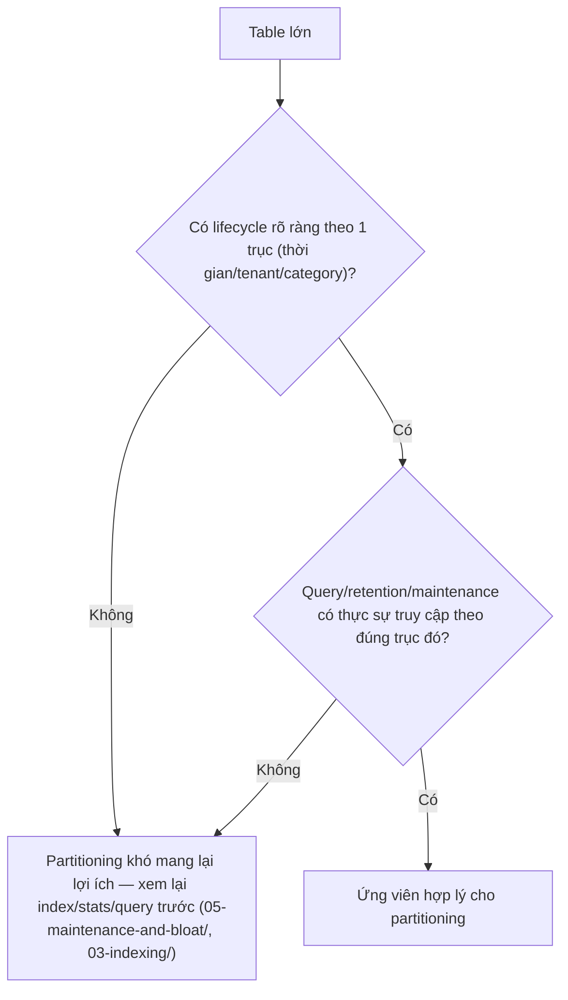
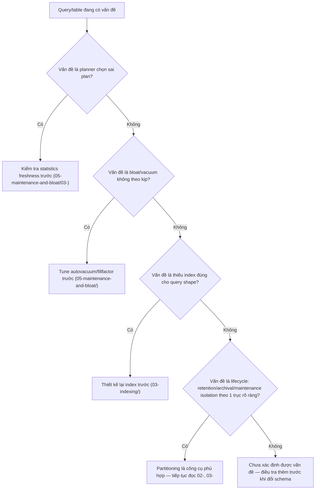

# 01 — When Partitioning Helps (và khi nào không)

## 🎯 Mục tiêu học

Sau file này, bạn phải trả lời được câu hỏi quan trọng nhất trước khi động tới `PARTITION BY`: "vấn đề tôi đang cố giải quyết có thực sự là vấn đề partitioning giải quyết được không?" Phần lớn thiệt hại vận hành liên quan tới partitioning không đến từ việc dùng sai cú pháp, mà từ việc partition một bảng để giải quyết một vấn đề mà partitioning không hề chạm tới.

## 📋 Mục lục

- [Mental model](#mental-model)
- [What partitioning really buys you](#what-partitioning-really-buys-you)
- [Big table is not the same as partition candidate](#big-table-is-not-the-same-as-partition-candidate)
- [Partitioning as lifecycle design, not just speed trick](#partitioning-as-lifecycle-design-not-just-speed-trick)
- [Practical examples](#practical-examples)
- [Phản ví dụ: partitioned nhưng vẫn chậm](#phản-ví-dụ-partitioned-nhưng-vẫn-chậm)
- [Bảng: workload pattern → partitioning helps? → why/why not → better first move](#bảng-workload-pattern--partitioning-helps--whywhy-not--better-first-move)
- [Diagram: problem → candidate solution flow](#diagram-problem--candidate-solution-flow)
- [Trade-offs](#trade-offs)
- [Failure modes](#failure-modes)
- [Debugging hints](#debugging-hints)
- [Interview lens](#interview-lens)
- [Mini scenarios](#mini-scenarios)
- [Key takeaways](#key-takeaways)
- [Xem tiếp / Liên kết liên quan](#xem-tiếp--liên-kết-liên-quan)

## Mental model

❌ Hiểu lầm phổ biến: "Table lớn thì phải partition."

✅ Thực tế: kích thước bảng **không phải** tiêu chí quyết định. Câu hỏi đúng là: "dữ liệu này có vòng đời (lifecycle) rõ ràng theo một trục nào đó (thời gian, tenant, category) mà ứng dụng thường xuyên truy vấn/xóa/archival theo đúng trục đó không?" Nếu câu trả lời là không, partitioning chỉ thêm độ phức tạp mà không mang lại lợi ích tương xứng.



## What partitioning really buys you

Partitioning trong PostgreSQL chủ yếu mang lại **4 lợi ích vận hành**, không phải "tăng tốc query nói chung":

1. **Data lifecycle & retention**: xóa dữ liệu cũ bằng `DROP`/`DETACH PARTITION` (gần như tức thời, không tạo dead tuple hàng loạt) thay vì `DELETE` hàng loạt (xem `04-`).
2. **Maintenance isolation**: mỗi partition có `pg_stat_user_tables`, autovacuum, statistics riêng — phần dữ liệu "nóng" (partition mới) được maintenance độc lập với phần "lạnh" (partition cũ, ít khi động tới).
3. **Pruning cho query đúng shape**: nếu query lọc theo đúng partition key, planner chỉ cần đụng tới các partition liên quan, bỏ qua hoàn toàn phần còn lại (xem `03-`).
4. **Operational safety cho bảng cực lớn**: thao tác như `VACUUM`, `REINDEX`, backup có thể thực hiện theo từng partition, giảm rủi ro một thao tác khổng lồ trên toàn bộ dữ liệu.

📌 Chú ý: partitioning **KHÔNG** tự động cải thiện: statistics kém, query shape kém (không filter theo partition key), thiết kế join kém, hay việc chọn sai index. Đây là 4 vấn đề độc lập, cần giải quyết bằng chính công cụ tương ứng (`02-query-planner-and-execution/`, `03-indexing/`, `05-maintenance-and-bloat/`).

## Big table is not the same as partition candidate

Một bảng có 500 triệu dòng **hoạt động ổn định** — autovacuum theo kịp, statistics tươi, index đúng, query luôn nhanh — **không cần partition** chỉ vì nó lớn. Ngược lại, một bảng 5 triệu dòng nhưng có chính sách xóa dữ liệu quá hạn 90 ngày hàng tuần (tạo hàng trăm ngàn dead tuple mỗi lần) có thể hưởng lợi rõ rệt từ partition theo thời gian, dù kích thước tuyệt đối nhỏ hơn nhiều.

## Partitioning as lifecycle design, not just speed trick

Câu hỏi đúng để thiết kế partition không phải "làm sao cho query nhanh hơn" mà là "**dữ liệu sinh ra và mất đi theo quy luật nào**, và ứng dụng có cần thao tác hàng loạt theo đúng quy luật đó không?" Ví dụ: `events` sinh ra liên tục theo thời gian và cần giữ 6 tháng theo compliance — đây là bài toán lifecycle rõ ràng, partition theo `created_at` là quyết định thiết kế (không phải chỉ để tăng tốc), có ảnh hưởng tới cả retention policy, backup strategy, và query pattern của toàn bộ team.

## Practical examples

### `events` — append-heavy, cần giữ 6 tháng

```sql
-- events sinh ra hàng triệu dòng/ngày, retention policy: giữ 6 tháng, sau đó archival/xóa
-- Query chủ yếu: dashboard 7 ngày gần nhất, điều tra sự cố trong 1 khoảng thời gian cụ thể
-- -> lifecycle rõ ràng theo created_at -> ứng viên tốt cho range partition theo tháng
SELECT * FROM events WHERE created_at >= now() - interval '7 days' AND event_type = 'payment_failed';
```

### `orders` — cần báo cáo/retention theo năm tài chính

```sql
-- orders cần giữ dữ liệu vô thời hạn cho audit, nhưng báo cáo vận hành hàng ngày chỉ cần 90 ngày gần nhất
-- Việc archival dữ liệu cũ sang "cold" storage vẫn giữ được audit trail mà không ảnh hưởng query vận hành hàng ngày
SELECT status, count(*) FROM orders WHERE created_at >= date_trunc('month', now()) GROUP BY status;
```

## Phản ví dụ: partitioned nhưng vẫn chậm

```sql
-- activity_logs được partition theo created_at (range, theo tháng)
-- Nhưng dashboard nội bộ lại query theo tenant_id, KHÔNG kèm điều kiện created_at:
SELECT count(*) FROM activity_logs WHERE tenant_id = 42;
-- Planner KHÔNG thể pruning theo tenant_id (partition key là created_at, không liên quan tenant_id)
-- -> phải quét TẤT CẢ partition -> chậm hơn cả khi chưa partition (thêm overhead routing qua nhiều partition)
```

📌 Đây là minh chứng rõ nhất cho nguyên tắc: **partitioning chỉ có ích khi query shape khớp với partition key** — partition sai trục so với access pattern thực tế có thể làm mọi thứ chậm hơn, không nhanh hơn.

## Bảng: workload pattern → partitioning helps? → why/why not → better first move

| Workload pattern | Partitioning helps? | Why / why not | Better first move if not |
|---|---|---|---|
| `events`/`audit_logs` retention 6-12 tháng, query chủ yếu recent-window | ✅ Có | Query và retention đều theo trục thời gian — pruning + drop partition đều hiệu quả | — |
| Table 500 triệu dòng, autovacuum/index/stats đều khỏe, query luôn nhanh | ❌ Không cần | Không có vấn đề vận hành nào partitioning giải quyết thêm | Giữ nguyên, chỉ theo dõi định kỳ |
| Query chậm do planner chọn sai plan (stats stale) | ❌ Không | Partitioning không refresh statistics hộ bạn | `ANALYZE` + xem lại `05-maintenance-and-bloat/03-` |
| Query luôn filter `user_id`, dự định partition theo `created_at` | ❌ Không (trực tiếp) | Pruning không hoạt động vì predicate không khớp partition key | Xem lại partition key có nên là `user_id`/hash, hoặc dùng index thay vì partition |
| Cần xóa 200 triệu dòng dữ liệu quá hạn mỗi tháng | ✅ Có | `DROP`/`DETACH PARTITION` tránh tạo dead tuple hàng loạt, tránh `DELETE` chậm và gây bloat | — |
| Bảng nhỏ (dưới vài triệu dòng), ít thay đổi | ❌ Không cần | Chi phí vận hành (DDL, index management) vượt xa lợi ích | Giữ đơn giản |

## Diagram: problem → candidate solution flow



## Trade-offs

- ✅ Lifecycle rõ ràng + query shape khớp partition key: giảm rõ rệt chi phí retention/maintenance, pruning hiệu quả cho query recent-window.
- ⚠️ DDL/operational complexity tăng: mỗi partition là 1 table vật lý riêng, cần quản lý tạo mới định kỳ (ví dụ tự động tạo partition tháng tiếp theo trước khi hết hạn partition hiện tại).
- ⚠️ Query routing complexity: mọi query cần được review để đảm bảo predicate khớp partition key — nếu không, hiệu năng có thể **tệ hơn** bảng không partition.
- ⚠️ Index management complexity: mỗi partition cần index riêng (xem `03-`) — dễ bị bỏ sót khi thêm partition mới nếu không tự động hóa.

## Failure modes

- 🔴 Partition một bảng chỉ vì "nó lớn" mà không xác định được lifecycle/access pattern rõ ràng theo trục nào.
- 🔴 Chọn partition key không khớp với cách ứng dụng thực sự query (ví dụ partition theo `created_at` nhưng dashboard luôn lọc theo `tenant_id`).
- 🔴 Kỳ vọng partitioning tự sửa vấn đề stats/index/query design — ba vấn đề này độc lập hoàn toàn với việc có partition hay không.
- 🔴 Partition một bảng nhỏ, ổn định "phòng khi tương lai lớn" — trả chi phí vận hành ngay hôm nay cho một lợi ích chưa chắc cần tới.

## Debugging hints

- Trước khi partition, liệt kê **tất cả** query pattern thực tế chạm vào bảng (không chỉ query "chính") và kiểm tra chúng có chung 1 trục filter/predicate không.
- Nếu không chắc access pattern, thu thập log query thực tế (qua `pg_stat_statements`) trong ít nhất 1-2 tuần trước khi quyết định partition key.
- Kiểm tra retention policy hiện có (nếu có) — nếu ứng dụng đã có logic "xóa dữ liệu quá X ngày", đây là dấu hiệu mạnh cho thấy partitioning theo thời gian sẽ khớp với lifecycle thật.

## Interview lens

**Interviewer thường hỏi**: "Một bảng 1 tỷ dòng, bạn có partition nó không?"

- ❌ Câu trả lời yếu: "Có, 1 tỷ dòng là quá lớn, cần partition ngay."
- ✅ Câu trả lời mạnh: Kích thước không phải tiêu chí quyết định — cần hỏi trước: dữ liệu này có lifecycle rõ ràng theo trục nào không (thời gian, tenant), query/retention/maintenance có thực sự truy cập theo đúng trục đó không, và các vấn đề hiện tại (nếu có) có phải do stats/index/query design trước hay không. Chỉ khi xác nhận có lifecycle rõ ràng và query shape khớp, partitioning mới là lựa chọn đúng — nếu không, nó chỉ thêm độ phức tạp vận hành mà không giải quyết gì.

## Mini scenarios

1. **`events` sinh 10 triệu dòng/ngày, retention 6 tháng, dashboard chủ yếu xem 7 ngày gần nhất** — ứng viên tốt: range partition theo tháng, query recent-window pruning hiệu quả, retention dùng `DROP PARTITION`.
2. **`activity_logs` partition theo `created_at` nhưng dashboard nội bộ luôn query theo `tenant_id` không kèm thời gian** — phản ví dụ: partitioning không giúp gì cho query pattern thật, cần xem lại có nên partition theo `tenant_id` hoặc composite, hoặc dùng index thay vì partition.
3. **`orders` 5 triệu dòng, autovacuum khỏe, statistics tươi, mọi query đều nhanh** — không có lý do partition; nếu ai đó đề xuất "partition cho chắc", đây là chi phí vận hành không cần thiết.

## Key takeaways

- 🧠 Kích thước bảng không phải tiêu chí quyết định partition — lifecycle rõ ràng theo 1 trục + query shape khớp trục đó mới là điều kiện cần.
- 🧠 Partitioning mang lại 4 lợi ích cụ thể: retention/lifecycle, maintenance isolation, pruning cho query đúng shape, operational safety cho thao tác trên bảng cực lớn.
- 🧠 Partitioning không tự sửa statistics kém, query shape kém, hay index sai — đây là 3 vấn đề độc lập cần công cụ riêng.
- 🧠 Partition key không khớp với access pattern thật có thể làm hiệu năng **tệ hơn**, không tốt hơn.
- 🧠 Luôn liệt kê toàn bộ query pattern thực tế trước khi chọn partition key, không chỉ dựa vào 1 query "chính".

## Xem tiếp / Liên kết liên quan

- ➡️ [`02-range-list-hash-partitioning.md`](02-range-list-hash-partitioning.md) — chọn đúng kiểu partition theo workload đã xác định ở file này.
- 🔗 [`05-maintenance-and-bloat/README.md`](../05-maintenance-and-bloat/README.md) — nhiều vấn đề "table to" thực ra là vấn đề maintenance, không phải partitioning.
- ⬅️ [README phase này](README.md)
