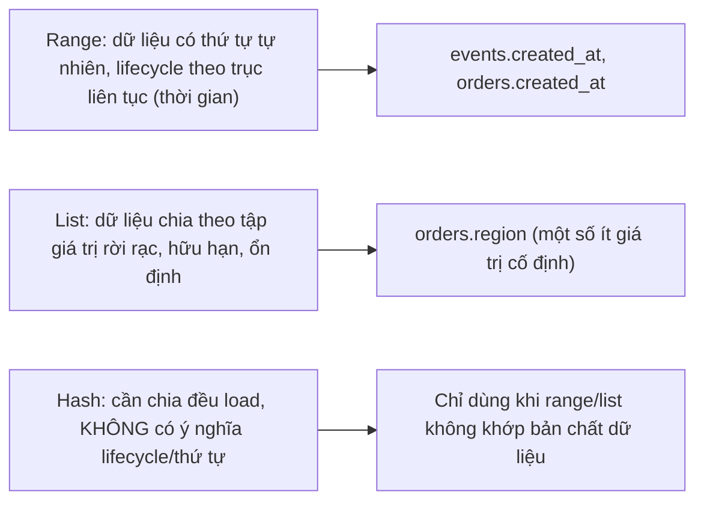
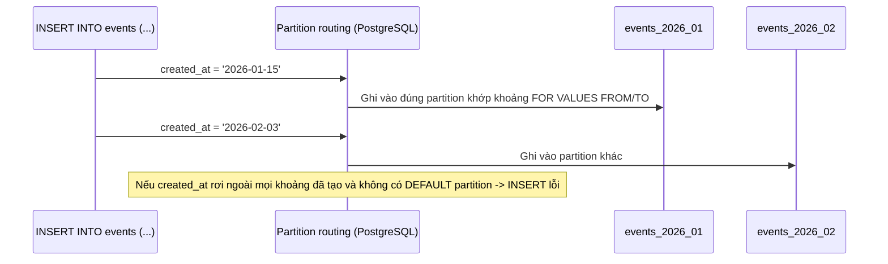
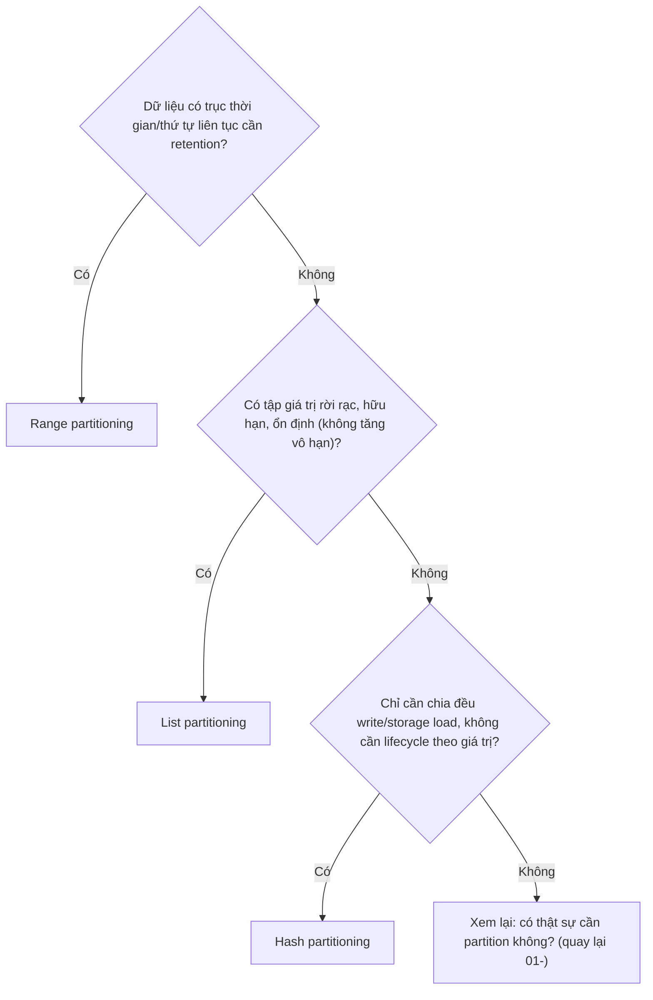

# 02 — Range, List, Hash Partitioning

## 🎯 Mục tiêu học

Sau file này, bạn phải chọn đúng kiểu partition (range/list/hash) dựa trên **cách dữ liệu thực sự sinh ra và được truy vấn**, không phải theo phản xạ "cứ range theo thời gian là an toàn nhất" hay "hash để chia đều load". Bạn cũng phải hiểu vì sao số lượng partition không phải "càng nhiều càng tốt".

## 📋 Mục lục

- [Mental model](#mental-model)
- [What actually happens: Range Partitioning](#what-actually-happens-range-partitioning)
- [What actually happens: List Partitioning](#what-actually-happens-list-partitioning)
- [What actually happens: Hash Partitioning](#what-actually-happens-hash-partitioning)
- [Subpartitioning — nhắc đúng mức](#subpartitioning--nhắc-đúng-mức)
- [Diagram: routing insert → partition](#diagram-routing-insert--partition)
- [Diagram: decision tree range vs list vs hash](#diagram-decision-tree-range-vs-list-vs-hash)
- [Bảng: partition type → good for → bad for → operational implication → common trap](#bảng-partition-type--good-for--bad-for--operational-implication--common-trap)
- [How to think about choosing partition key](#how-to-think-about-choosing-partition-key)
- [Why partition count is not just a nice round number](#why-partition-count-is-not-just-a-nice-round-number)
- [Failure modes](#failure-modes)
- [Debugging hints](#debugging-hints)
- [Interview lens](#interview-lens)
- [Mini scenarios](#mini-scenarios)
- [Key takeaways](#key-takeaways)
- [Xem tiếp / Liên kết liên quan](#xem-tiếp--liên-kết-liên-quan)

## Mental model



## What actually happens: Range Partitioning

Mỗi partition chứa các dòng có giá trị partition key nằm trong **một khoảng liên tục**. Đây là lựa chọn tự nhiên nhất cho dữ liệu theo thời gian, vì nó khớp trực tiếp với retention policy ("giữ N tháng gần nhất") và với query pattern phổ biến nhất ("N ngày/tháng gần đây").

```sql
CREATE TABLE events (
    id bigint,
    tenant_id bigint,
    event_type text,
    created_at timestamptz NOT NULL,
    payload jsonb
) PARTITION BY RANGE (created_at);

CREATE TABLE events_2026_01 PARTITION OF events
    FOR VALUES FROM ('2026-01-01') TO ('2026-02-01');
CREATE TABLE events_2026_02 PARTITION OF events
    FOR VALUES FROM ('2026-02-01') TO ('2026-03-01');
```

📌 Ranh giới partition phải **khớp với retention/reporting boundary thực tế** của nghiệp vụ (ví dụ theo tháng nếu retention tính theo tháng) — không phải chọn tùy tiện.

## What actually happens: List Partitioning

Mỗi partition ứng với **một tập giá trị rời rạc, hữu hạn, tương đối ổn định**. Phù hợp khi số lượng giá trị nhỏ và không tăng vô hạn theo thời gian.

```sql
CREATE TABLE orders (
    id bigint,
    region text NOT NULL,
    created_at timestamptz,
    status text
) PARTITION BY LIST (region);

CREATE TABLE orders_apac PARTITION OF orders FOR VALUES IN ('APAC');
CREATE TABLE orders_emea PARTITION OF orders FOR VALUES IN ('EMEA');
CREATE TABLE orders_amer PARTITION OF orders FOR VALUES IN ('AMER');
```

⚠️ List partitioning **nguy hiểm** khi giá trị dùng làm key tăng vô hạn theo thời gian (ví dụ `tenant_id` cho hệ thống multi-tenant liên tục thêm khách hàng mới) — mỗi tenant mới đòi hỏi tạo partition mới thủ công hoặc qua tự động hóa phức tạp, và số lượng partition có thể phình ra không kiểm soát.

## What actually happens: Hash Partitioning

Mỗi partition nhận một phần dữ liệu dựa trên **hash của giá trị partition key**, chia tương đối đều bất kể phân bố giá trị logic. Không có ý nghĩa thứ tự hay lifecycle — hash partitioning **chỉ nên dùng khi mục tiêu là chia đều write/storage load**, không phải khi cần retention theo thời gian hay pruning theo khoảng giá trị.

```sql
CREATE TABLE processing_jobs (
    id bigint,
    tenant_id bigint,
    job_type text,
    status text,
    created_at timestamptz
) PARTITION BY HASH (tenant_id);

CREATE TABLE processing_jobs_p0 PARTITION OF processing_jobs FOR VALUES WITH (modulus 4, remainder 0);
CREATE TABLE processing_jobs_p1 PARTITION OF processing_jobs FOR VALUES WITH (modulus 4, remainder 1);
CREATE TABLE processing_jobs_p2 PARTITION OF processing_jobs FOR VALUES WITH (modulus 4, remainder 2);
CREATE TABLE processing_jobs_p3 PARTITION OF processing_jobs FOR VALUES WITH (modulus 4, remainder 3);
```

⚠️ Vấn đề lớn nhất của hash partitioning: **retention theo thời gian gần như không thể** làm bằng `DROP PARTITION` — vì mỗi partition chứa dữ liệu trải đều mọi thời điểm (do hash trộn ngẫu nhiên), không có partition nào "toàn dữ liệu cũ" để drop.

## Subpartitioning — nhắc đúng mức

PostgreSQL hỗ trợ partition của partition (ví dụ range theo tháng, rồi mỗi tháng lại hash theo `tenant_id` để chia đều load ghi). Đây là kỹ thuật hợp lý **chỉ khi cả hai vấn đề đều thật sự tồn tại đồng thời** (cần retention theo thời gian VÀ cần chia đều load ghi cho tenant lớn) — không nên dùng subpartition "để linh hoạt" khi chỉ một trong hai vấn đề tồn tại, vì mỗi tầng subpartition nhân thêm độ phức tạp vận hành.

## Diagram: routing insert → partition



## Diagram: decision tree range vs list vs hash



## Bảng: partition type → good for → bad for → operational implication → common trap

| Partition type | Good for | Bad for | Operational implication | Common trap |
|---|---|---|---|---|
| **Range** | Dữ liệu theo thời gian, retention/archival theo khoảng | Dữ liệu không có thứ tự tự nhiên rõ ràng | Cần tạo partition mới định kỳ trước khi hết khoảng hiện tại (tự động hóa cần thiết) | Quên tạo partition tương lai → INSERT lỗi vì rơi ngoài mọi khoảng |
| **List** | Tập giá trị hữu hạn, ổn định (region, category cố định) | Giá trị tăng vô hạn theo thời gian (tenant_id liên tục thêm mới) | Mỗi giá trị mới cần 1 partition mới — dễ quản lý khi tập giá trị nhỏ | List partition theo giá trị tăng vô hạn — số partition phình ra không kiểm soát, vận hành không nổi |
| **Hash** | Cần chia đều load ghi/storage khi không có tiêu chí lifecycle rõ ràng | Cần retention theo thời gian — không có partition nào "toàn dữ liệu cũ" | Số lượng partition cố định ngay từ đầu (modulus), khó thay đổi linh hoạt sau này | Chọn hash rồi vẫn kỳ vọng "drop partition cũ" dễ như range — không khả thi |

## How to think about choosing partition key

Đặt câu hỏi theo đúng thứ tự:

1. **Retention/lifecycle**: dữ liệu có "hết hạn" theo trục nào không? Nếu có và là thời gian → range.
2. **Access pattern**: phần lớn query lọc theo cột nào? Partition key nên là cột đó (hoặc dẫn đầu trong composite key) — nếu không, pruning vô nghĩa (xem `03-`).
3. **Cardinality của giá trị**: nếu là tập hữu hạn nhỏ và ổn định → list; nếu tăng vô hạn theo thời gian → không dùng list, cân nhắc range hoặc hash.
4. **Nhu cầu chia đều load** (không có lifecycle rõ ràng): chỉ khi đây là mục tiêu chính → hash, và chấp nhận đánh đổi mất khả năng retention dễ dàng.

## Why partition count is not just a nice round number

Số lượng partition ảnh hưởng trực tiếp tới **thời gian planning** của mọi query (planner phải xem xét metadata của từng partition khi lập kế hoạch, dù pruning loại bỏ hầu hết chúng khi thực thi) và tới **chi phí quản trị** (mỗi partition là 1 object cần index, thống kê, backup riêng). Chọn "16 partition cho tenant" hay "12 partition theo tháng" phải dựa trên khối lượng dữ liệu/tần suất truy vấn thực tế của từng phần, không phải một con số tròn nghe "hợp lý".

## Failure modes

- 🔴 **List partition theo giá trị tăng vô hạn**: dùng list partition cho `tenant_id` trong hệ thống liên tục thêm khách hàng mới — số partition tăng không kiểm soát, mỗi tenant mới cần thao tác DDL thủ công hoặc tooling phức tạp.
- 🔴 **Hash partition rồi vẫn kỳ vọng retention dễ như range**: chọn hash để "chia đều tải" nhưng sau đó cần xóa dữ liệu quá hạn theo thời gian — không có cách nào drop 1 partition để loại bỏ đúng dữ liệu cũ vì mỗi partition trộn đều mọi thời điểm.
- 🔴 **Partition key không khớp access pattern**: chọn `created_at` làm partition key nhưng phần lớn query lọc theo `tenant_id` không kèm thời gian — pruning vô dụng (chi tiết ở `03-`).
- 🔴 **Chọn số lượng partition tùy tiện**: quá ít (mỗi partition vẫn quá lớn, không giải quyết được vấn đề gốc) hoặc quá nhiều (overhead planning, quản trị hàng trăm partition nhỏ xíu).

## Debugging hints

- Kiểm tra ranh giới partition hiện có: `SELECT relname, pg_get_expr(relpartbound, oid) FROM pg_class WHERE relispartition;`
- Nếu nghi ngờ list partitioning đang phình to: đếm số partition con hiện tại và tốc độ tăng theo thời gian — nếu tăng tuyến tính không giới hạn, đây là dấu hiệu sai loại partition.
- Trước khi chọn hash, thử trả lời: "Nếu 1 năm nữa cần xóa dữ liệu của quý trước, tôi sẽ làm thế nào?" — nếu không có câu trả lời gọn (`DROP PARTITION`), hash có thể không phù hợp.

## Interview lens

**Interviewer thường hỏi**: "Bạn sẽ hash partition hay range partition một bảng log 1 tỷ dòng/tháng?"

- ❌ Câu trả lời yếu: "Hash, để chia đều tải ghi cho nhanh."
- ✅ Câu trả lời mạnh: Phụ thuộc vào việc có cần retention theo thời gian không. Nếu bảng log cần giữ N tháng rồi xóa, range partitioning theo thời gian cho phép `DROP PARTITION` gần như tức thời cho dữ liệu quá hạn — hash sẽ làm mất khả năng này vì dữ liệu trộn đều theo mọi thời điểm trong mỗi partition. Chỉ chọn hash nếu mục tiêu thực sự là chia đều load ghi và không có nhu cầu retention theo thời gian.

## Mini scenarios

1. **`events` giữ 6 tháng, xóa dữ liệu cũ hàng tháng** — range partition theo tháng, mỗi tháng `DROP PARTITION` khi hết hạn retention.
2. **`orders.region` chỉ có 5 giá trị cố định (APAC/EMEA/AMER/...), không có kế hoạch mở rộng region liên tục** — list partitioning hợp lý, số partition ổn định.
3. **`processing_jobs` viết vào rất nhiều đồng thời từ hàng trăm tenant, không có nhu cầu xóa theo thời gian, chỉ cần giảm contention ghi** — hash partition theo `tenant_id` (hoặc `id`) hợp lý nếu mục tiêu là chia đều write load, chấp nhận việc archival job cũ sẽ cần cơ chế khác (không phải drop partition).

## Key takeaways

- 🧠 Range phù hợp cho dữ liệu có trục thời gian/thứ tự cần retention — đây là trường hợp phổ biến nhất trong thực tế.
- 🧠 List chỉ an toàn cho tập giá trị hữu hạn, ổn định — nguy hiểm nếu giá trị tăng vô hạn theo thời gian.
- 🧠 Hash chia đều load nhưng đánh đổi khả năng retention theo thời gian — không thể drop 1 partition để loại bỏ dữ liệu cũ.
- 🧠 Subpartitioning chỉ hợp lý khi cả 2 vấn đề (lifecycle + load balancing) cùng tồn tại thật sự, không phải "để linh hoạt".
- 🧠 Số lượng partition ảnh hưởng chi phí planning/quản trị — chọn dựa trên khối lượng dữ liệu thực tế, không phải con số tròn.

## Xem tiếp / Liên kết liên quan

- ➡️ [`03-partition-pruning-query-shape-and-index-strategy.md`](03-partition-pruning-query-shape-and-index-strategy.md) — partition key đã chọn quyết định pruning có hoạt động hay không.
- 🔗 [`01-when-partitioning-helps-and-when-it-does-not.md`](01-when-partitioning-helps-and-when-it-does-not.md) — xác nhận lại có thực sự cần partition trước khi chọn loại.
- ⬅️ [README phase này](README.md)
