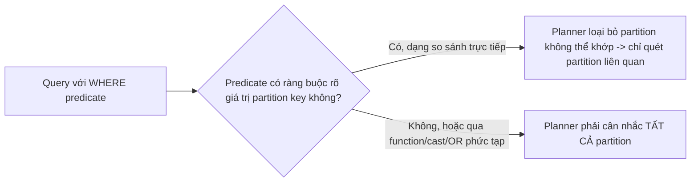
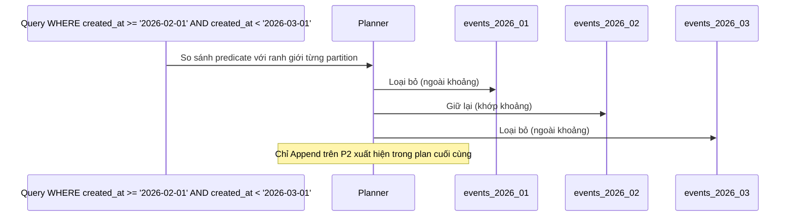
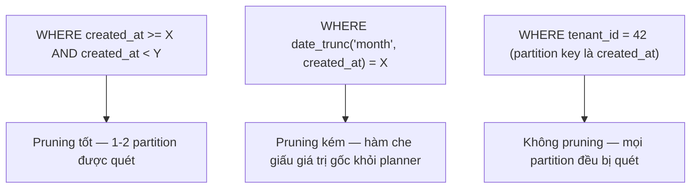

# 03 — Partition Pruning, Query Shape và Index Strategy

## 🎯 Mục tiêu học

Đây là file xương sống của phase này. Sau file này, bạn phải nhìn vào bất kỳ query nào trên bảng đã partition và trả lời ngay: "planner có pruning được không, và index nào cần tồn tại trên từng partition để query này nhanh?" Bạn cũng phải bác bỏ được hiểu lầm nguy hiểm nhất: "partitioning thay thế cho index."

## 📋 Mục lục

- [Mental model](#mental-model)
- [What actually happens: Partition Pruning](#what-actually-happens-partition-pruning)
- [Planning-time pruning vs runtime pruning](#planning-time-pruning-vs-runtime-pruning)
- [Diagram: pruning flow](#diagram-pruning-flow)
- [Query shape làm pruning tốt/kém](#query-shape-làm-pruning-tốtkém)
- [Diagram: query-shape comparison](#diagram-query-shape-comparison)
- [Partitioning does not replace indexing](#partitioning-does-not-replace-indexing)
- [Bảng: query shape → pruning likely? → index still needed? → common mistake](#bảng-query-shape--pruning-likely--index-still-needed--common-mistake)
- [Partition key is part of API/query design](#partition-key-is-part-of-apiquery-design)
- [Nối lại với phase planner + indexing](#nối-lại-với-phase-planner--indexing)
- [Failure modes](#failure-modes)
- [Debugging hints](#debugging-hints)
- [Interview lens](#interview-lens)
- [Mini scenarios](#mini-scenarios)
- [Key takeaways](#key-takeaways)
- [Xem tiếp / Liên kết liên quan](#xem-tiếp--liên-kết-liên-quan)

## Mental model



❌ Hiểu lầm phổ biến nhất: "Partition xong không cần index nữa, vì bảng đã được chia nhỏ."

✅ Thực tế: partitioning thu hẹp **số lượng partition** cần quét — mỗi partition còn lại vẫn là một bảng vật lý riêng, và bên trong nó, executor vẫn cần index để tránh Seq Scan nếu điều kiện lọc thứ hai (ngoài partition key) chọn lọc.

## What actually happens: Partition Pruning

Khi query có `WHERE` chứa điều kiện trên **partition key**, planner so sánh điều kiện đó với ranh giới (`FOR VALUES ...`) của từng partition, và **loại bỏ ngay từ bước lập kế hoạch** (hoặc lúc thực thi, xem phần sau) các partition không thể chứa dòng thỏa điều kiện.

```sql
EXPLAIN SELECT * FROM events
WHERE created_at >= '2026-02-01' AND created_at < '2026-03-01'
  AND event_type = 'payment_failed';
-- Plan chỉ liệt kê Append trên events_2026_02, KHÔNG liệt kê events_2026_01, events_2026_03, ...
```

## Planning-time pruning vs runtime pruning

- **Planning-time pruning**: khi giá trị so sánh là hằng số biết trước lúc lập plan (như ví dụ trên) — planner loại bỏ partition ngay khi tạo `EXPLAIN`, thể hiện rõ trong output (chỉ liệt kê partition còn lại).
- **Runtime pruning**: khi giá trị so sánh chỉ biết lúc thực thi (ví dụ tham số bind, hoặc giá trị từ một subquery/CTE khác) — executor vẫn loại bỏ được partition không liên quan **khi chạy**, nhưng `EXPLAIN` (không `ANALYZE`) có thể liệt kê nhiều partition hơn thực tế sẽ được quét; `EXPLAIN ANALYZE` mới cho thấy con số thật (`Subplans Removed:`).

```sql
-- Runtime pruning: giá trị đến từ tham số, không phải hằng số cố định lúc lập plan
PREPARE q(timestamptz) AS SELECT * FROM events WHERE created_at >= $1 AND created_at < $1 + interval '1 day';
EXPLAIN ANALYZE EXECUTE q('2026-02-15');
-- Output có dòng "Subplans Removed: N" — xác nhận runtime pruning đã loại bỏ N partition không liên quan
```

## Diagram: pruning flow



## Query shape làm pruning tốt/kém

```sql
-- ✅ Pruning tốt: so sánh trực tiếp cột partition key với hằng số/tham số
SELECT * FROM events WHERE created_at >= '2026-02-01' AND created_at < '2026-03-01';

-- ❌ Pruning kém: bọc cột partition key trong function -> planner không suy luận được ranh giới
SELECT * FROM events WHERE date_trunc('month', created_at) = '2026-02-01';

-- ❌ Pruning kém: so sánh gián tiếp qua cột khác không phải partition key
SELECT * FROM activity_logs WHERE tenant_id = 42; -- partition key là created_at, không liên quan tenant_id

-- ❌ Pruning kém: OR giữa điều kiện partition key và điều kiện không liên quan làm phạm vi lan rộng
SELECT * FROM events WHERE created_at >= '2026-02-01' OR event_type = 'critical';
```

📌 Nguyên tắc: partition key phải xuất hiện trong `WHERE` dưới dạng **so sánh trực tiếp** (`=`, `>=`, `<`, `BETWEEN`, `IN` trên chính cột đó, không qua hàm/ép kiểu) để planner suy luận được ranh giới.

## Diagram: query-shape comparison



## Partitioning does not replace indexing

Partition pruning chỉ giải quyết "quét ít bảng vật lý hơn" — nó **không** thay thế nhu cầu index bên trong từng partition. Nếu query có thêm điều kiện chọn lọc thứ hai (ví dụ `event_type = 'payment_failed'` sau khi đã pruning theo `created_at`), partition còn lại vẫn cần index trên `event_type` để tránh Seq Scan toàn bộ partition đó.

```sql
-- Mỗi partition con cần index riêng (PostgreSQL không tự động tạo index trên partition mới trừ khi định nghĩa ở bảng cha)
CREATE INDEX ON events (tenant_id, event_type); -- định nghĩa ở bảng cha (PARTITION BY RANGE...) -> tự động áp dụng cho mọi partition con hiện có VÀ tương lai
```

📌 Từ PostgreSQL 11+, tạo index trên **bảng cha đã partition** sẽ tự động tạo index tương ứng trên mọi partition con hiện có, và partition con mới tạo sau này cũng tự động kế thừa định nghĩa index đó — đây là cách quản lý index thực tế thay vì tạo thủ công cho từng partition.

## Bảng: query shape → pruning likely? → index still needed? → common mistake

| Query shape | Pruning likely? | Index vẫn cần? | Common mistake |
|---|---|---|---|
| `WHERE created_at >= X AND created_at < Y` (recent-window trên `events`) | ✅ Có, hiệu quả cao | ✅ Có, nếu còn điều kiện lọc khác trong cùng partition | Quên tạo index trên cột lọc phụ, nghĩ pruning là đủ |
| `WHERE tenant_id = 42 AND created_at >= X` (composite, partition key là `created_at`) | ✅ Có (nhờ `created_at`) | ✅ Có — cần index `(tenant_id, ...)` trong từng partition để lọc tiếp | Chỉ pruning theo thời gian, quên index cho `tenant_id` bên trong mỗi partition |
| `WHERE tenant_id = 42` (không kèm `created_at`, partition key là `created_at`) | ❌ Không | ✅ Có — bắt buộc cần index `tenant_id` vì phải quét mọi partition | Nghĩ partitioning "tự động" giúp query này nhanh hơn — hoàn toàn sai |
| `WHERE date_trunc('day', created_at) = CURRENT_DATE` | ❌ Kém (hàm che giấu giá trị) | Không cứu được bằng index nếu pruning đã thất bại ở mức partition | Viết điều kiện qua hàm thay vì so sánh trực tiếp `created_at >= ... AND < ...` |
| `WHERE created_at >= X` với X quá nhiều partition liên quan (khoảng thời gian rất rộng) | ⚠️ Một phần — pruning vẫn loại bỏ được các partition ngoài khoảng, nhưng vẫn phải quét nhiều partition còn lại | ✅ Có, cho mỗi partition còn lại | Query "báo cáo toàn bộ lịch sử" trên bảng partition theo tháng vẫn đụng hàng chục partition — cần đánh giá lại có nên archival/index riêng |

## Partition key is part of API/query design

Một khi bảng đã partition theo `created_at`, **mọi** đường truy vấn (API endpoint, báo cáo, job nền) chạm bảng này cần được thiết kế để **luôn kèm điều kiện theo `created_at`** khi có thể — đây không còn là chi tiết triển khai nội bộ mà là ràng buộc thiết kế API/query xuyên suốt team. Một endpoint mới thêm sau này quên kèm điều kiện thời gian sẽ âm thầm quét toàn bộ bảng dù bảng đã partition.

## Nối lại với phase planner + indexing

- Cardinality estimation (`02-query-planner-and-execution/03-`) vẫn hoạt động **trên từng partition riêng** — mỗi partition có statistics riêng, nên 2 partition với phân bố dữ liệu khác nhau (ví dụ tháng cao điểm sale vs tháng bình thường) có thể khiến planner chọn plan khác nhau cho "cùng một query logic" chạy vào các tháng khác nhau.
- Join strategy (`02-query-planner-and-execution/04-`) giữa 2 bảng partition (ví dụ `events` join `event_payloads` nếu cả hai đều partition theo cùng trục thời gian) có thể tận dụng "partition-wise join" — planner join từng cặp partition tương ứng thay vì join toàn bộ 2 bảng, nhưng chỉ khi cả hai bảng partition theo cùng ranh giới.
- Index design (`03-indexing/`) áp dụng y hệt bên trong mỗi partition — left-prefix rule, covering index, partial index đều cần được nghĩ lại theo đúng nguyên tắc đã học, chỉ khác là định nghĩa 1 lần ở bảng cha.

## Failure modes

- 🔴 **Partition theo `created_at` nhưng query chính luôn filter `user_id`**: pruning hoàn toàn vô dụng, mọi partition đều bị quét — tệ hơn cả khi không partition (thêm overhead routing).
- 🔴 **Partition xong bỏ qua index design**: nghĩ rằng chia nhỏ bảng là đủ, không tạo index cho điều kiện lọc thứ hai trong từng partition — Seq Scan vẫn xảy ra, chỉ là trên bảng nhỏ hơn.
- 🔴 **Quá nhiều partition làm planning/execution overhead**: hàng trăm partition nhỏ khiến mỗi lần lập plan phải xem xét metadata của tất cả (dù pruning loại bỏ hầu hết lúc chạy) — tăng latency lập plan cho mọi query, kể cả query đơn giản.
- 🔴 **Hidden cast/function làm pruning kém**: viết điều kiện qua `date_trunc()`, `CAST`, hay so sánh gián tiếp qua biểu thức thay vì so sánh trực tiếp cột partition key.

## Debugging hints

- Luôn xác nhận pruning thực sự xảy ra bằng `EXPLAIN` (planning-time) hoặc `EXPLAIN ANALYZE` (runtime, xem `Subplans Removed:`) — không giả định pruning hoạt động chỉ vì bảng đã partition.
- Nếu thấy plan liệt kê **toàn bộ** partition trong `Append`, kiểm tra ngay predicate có đúng dạng so sánh trực tiếp cột partition key không.
- Khi thêm partition mới, kiểm tra index đã được kế thừa đầy đủ từ bảng cha chưa (`\d+ tenchild_partition` trong `psql`).

## Interview lens

**Interviewer thường hỏi**: "Bảng đã partition theo `created_at`, có cần tạo thêm index không?"

- ❌ Câu trả lời yếu: "Không cần, partition đã đủ nhanh rồi."
- ✅ Câu trả lời mạnh: Partitioning chỉ giảm số bảng vật lý cần quét (pruning) khi query filter theo đúng partition key — bên trong mỗi partition còn lại, mọi nguyên tắc index (left-prefix, covering, selectivity) vẫn áp dụng y hệt bảng không partition. Cách quản lý thực tế là định nghĩa index trên bảng cha để tự động áp dụng cho mọi partition con hiện tại và tương lai, thay vì tạo thủ công từng cái.

## Mini scenarios

1. **Dashboard sự cố tra cứu `events` trong khoảng 2 giờ cụ thể kèm `event_type`** — pruning tốt (chỉ 1 partition tháng liên quan), nhưng vẫn cần index `(event_type, created_at)` trong partition đó để tránh Seq Scan.
2. **Báo cáo nội bộ đếm tổng số `activity_logs` theo `tenant_id` không kèm thời gian, trên bảng partition theo `created_at`** — không pruning được gì, mọi partition bị quét; cần xem lại: hoặc thêm điều kiện thời gian vào query (nếu nghiệp vụ cho phép), hoặc partition key/schema cần thiết kế lại.
3. **Job nền tổng hợp toàn bộ lịch sử `orders` từ ngày đầu tiên tới nay, chạy trên bảng partition theo tháng** — dù pruning "hoạt động đúng" (loại bỏ các tháng thực sự không liên quan), vẫn phải quét hàng chục partition nếu lịch sử dài — cần đánh giá lại tần suất chạy job này và có nên archival dữ liệu cũ ra khỏi phạm vi truy vấn thường xuyên.

## Key takeaways

- 🧠 Pruning chỉ hoạt động khi predicate so sánh trực tiếp cột partition key (không qua hàm/cast/OR không liên quan).
- 🧠 Planning-time pruning và runtime pruning là hai cơ chế khác nhau — `EXPLAIN ANALYZE` mới cho thấy pruning thực tế lúc chạy (`Subplans Removed:`).
- 🧠 Partitioning không thay thế index — mỗi partition vẫn cần index đúng cho điều kiện lọc thứ hai bên trong nó.
- 🧠 Partition key là quyết định thiết kế API/query xuyên suốt team, không phải chi tiết triển khai nội bộ có thể bỏ qua khi viết query mới.
- 🧠 Quá nhiều partition tăng chi phí lập plan cho mọi query, kể cả khi pruning loại bỏ hầu hết chúng lúc thực thi.

## Xem tiếp / Liên kết liên quan

- ➡️ [`04-retention-archival-and-drop-partition-patterns.md`](04-retention-archival-and-drop-partition-patterns.md) — tận dụng ranh giới partition cho retention/archival.
- 🔗 [`02-query-planner-and-execution/04-join-strategies.md`](../02-query-planner-and-execution/04-join-strategies.md) — partition-wise join reasoning.
- 🔗 [`03-indexing/02-multicolumn-covering-and-order.md`](../03-indexing/02-multicolumn-covering-and-order.md) — nguyên tắc index vẫn áp dụng y hệt bên trong từng partition.
- ⬅️ [README phase này](README.md)
