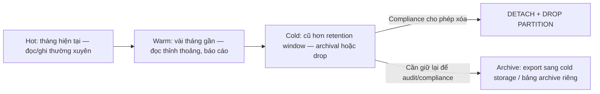
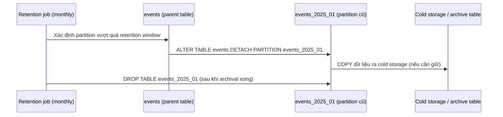
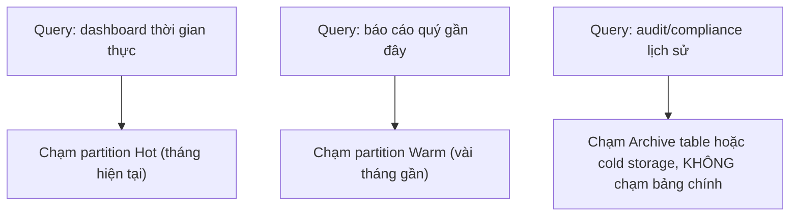

# 04 — Retention, Archival và Drop-Partition Patterns

## 🎯 Mục tiêu học

Sau file này, bạn phải giải thích được vì sao `DETACH`/`DROP PARTITION` là một công cụ vận hành khác hẳn về bản chất so với `DELETE ... WHERE`, và thiết kế được retention policy gắn liền với ranh giới partition ngay từ đầu — thay vì chắp vá sau khi bảng đã khổng lồ.

## 📋 Mục lục

- [Mental model](#mental-model)
- [What partitioning really buys you (cho retention)](#what-partitioning-really-buys-you-cho-retention)
- [Diagram: retention lifecycle](#diagram-retention-lifecycle)
- [Diagram: hot/warm/cold flow](#diagram-hotwarmcold-flow)
- [Vì sao drop partition khác mass delete](#vì-sao-drop-partition-khác-mass-delete)
- [Ví dụ thực tế](#ví-dụ-thực-tế)
- [Bảng: pattern → good for → benefits → risks](#bảng-pattern--good-for--benefits--risks)
- [Retention design phải bắt đầu trước khi bảng khổng lồ](#retention-design-phải-bắt-đầu-trước-khi-bảng-khổng-lồ)
- [Failure modes](#failure-modes)
- [Debugging hints](#debugging-hints)
- [Safe operational patterns](#safe-operational-patterns)
- [Interview lens](#interview-lens)
- [Mini scenarios](#mini-scenarios)
- [Key takeaways](#key-takeaways)
- [Xem tiếp / Liên kết liên quan](#xem-tiếp--liên-kết-liên-quan)

## Mental model



📌 Với bảng partition theo thời gian (`events`, `audit_logs`, `orders`), mỗi partition tương ứng tự nhiên với một "thế hệ dữ liệu" — điều này biến retention từ một thao tác `DELETE` tốn kém thành một thao tác **thay đổi metadata** gần như tức thời.

## What partitioning really buys you (cho retention)

- ✅ **Loại bỏ dữ liệu cũ mà không quét/khóa dòng nào**: `DROP PARTITION` chỉ xóa metadata của bảng con và giải phóng file vật lý — không cần quét từng dòng để tìm dòng thỏa điều kiện.
- ✅ **Tách rời vòng đời dữ liệu khỏi vòng đời bảng chính**: partition cũ có thể được `DETACH` (tách khỏi bảng cha nhưng vẫn giữ nguyên như một bảng độc lập) để archival/export riêng, không ảnh hưởng bảng đang hoạt động.
- ✅ **Giảm rủi ro khóa/transaction dài** so với `DELETE` hàng loạt (xem phần so sánh bên dưới).
- ❌ Partitioning **không tự động** đảm bảo compliance đúng — bạn vẫn phải tự thiết kế lịch chạy retention job, giám sát, và xử lý trường hợp partition boundary không khớp business rule.

## Diagram: retention lifecycle



## Diagram: hot/warm/cold flow



## Vì sao drop partition khác mass delete

```sql
-- ❌ Mass delete: quét toàn bộ dòng thỏa điều kiện, sinh dead tuple hàng loạt, giữ transaction dài,
-- có thể khóa và làm phình WAL, và bloat vẫn còn đó cho tới khi VACUUM dọn xong
DELETE FROM audit_logs WHERE created_at < now() - interval '2 years';

-- ✅ Drop partition: chỉ thay đổi metadata + xóa file vật lý của partition, không sinh dead tuple,
-- không cần VACUUM dọn bloat vì không có bloat để dọn
ALTER TABLE audit_logs DETACH PARTITION audit_logs_2023_q1;
DROP TABLE audit_logs_2023_q1;
```

| Khía cạnh | `DELETE ... WHERE` hàng loạt | `DETACH`/`DROP PARTITION` |
|---|---|---|
| Chi phí quét | Phải quét (hoặc dùng index) để tìm từng dòng thỏa điều kiện | Không quét dòng nào — chỉ thao tác metadata |
| Dead tuple / bloat | Sinh dead tuple hàng loạt, cần autovacuum dọn sau đó | Không sinh dead tuple |
| Thời gian khóa | Có thể giữ lock lâu nếu transaction lớn, rủi ro chặn ghi khác | Cực nhanh (thao tác catalog), ít rủi ro chặn |
| WAL | Sinh WAL cho từng dòng bị xóa | Sinh WAL tối thiểu (thay đổi catalog) |
| Khả năng archival trước khi xóa | Khó tách riêng — phải `SELECT` trước rồi `DELETE` | Dễ dàng — `DETACH` giữ nguyên bảng để export trước khi `DROP` |

## Ví dụ thực tế

**Case 1 — `events`/`audit_logs` retention theo tháng (compliance 24 tháng):**

```sql
-- Partition theo tháng, retention job chạy đầu mỗi tháng: detach + drop partition cũ hơn 24 tháng
ALTER TABLE audit_logs DETACH PARTITION audit_logs_2024_01;
-- Nếu compliance yêu cầu giữ log (không được xóa hẳn), export trước khi drop:
-- COPY audit_logs_2024_01 TO '/archive/audit_logs_2024_01.csv' WITH CSV;
DROP TABLE audit_logs_2024_01;
```

**Case 2 — archival `orders` lịch sử (giữ cho báo cáo tài chính nhưng tách khỏi bảng giao dịch chính):**

```sql
-- Orders partition theo tháng tạo lúc thiết kế ban đầu (xem file 02).
-- Sau 18 tháng, detach partition cũ và archival sang schema riêng thay vì drop hẳn
-- (vì báo cáo tài chính năm vẫn cần truy vấn được, chỉ không cần nằm trong bảng "hot").
ALTER TABLE orders DETACH PARTITION orders_2024_06;
ALTER TABLE orders_2024_06 SET SCHEMA archive;
-- Báo cáo tài chính năm nay truy vấn archive.orders_2024_06 riêng, không ảnh hưởng bảng orders chính
```

## Bảng: pattern → good for → benefits → risks

| Pattern | Good for | Benefits | Risks |
|---|---|---|---|
| `DROP PARTITION` (xóa hẳn) | Dữ liệu không có yêu cầu giữ lại (ví dụ log debug tạm thời) | Nhanh, không bloat, không cần archival step | Không thể khôi phục — cần chắc chắn compliance/business không cần dữ liệu này |
| `DETACH` + archival sang schema/table riêng | Dữ liệu cần giữ để tra cứu/compliance nhưng không cần nằm trong hot path | Tách khỏi bảng chính, vẫn truy vấn được khi cần, giảm kích thước bảng chính | Cần quản lý thêm không gian lưu trữ archive, thêm một nơi để maintain |
| `DETACH` + export ra cold storage ngoài Postgres (S3, file) | Dữ liệu retention dài hạn, ít khi cần tra cứu lại | Giảm tải hoàn toàn cho Postgres, chi phí lưu trữ rẻ hơn | Truy vấn lại phức tạp hơn (cần restore/import), không còn SQL trực tiếp |
| Mass `DELETE` theo điều kiện (không partition) | Chỉ hợp lý khi số dòng xóa nhỏ, không định kỳ lớn | Đơn giản, không cần thiết kế partition trước | Không scale cho retention định kỳ trên bảng lớn — chính là vấn đề partitioning giải quyết |

## Retention design phải bắt đầu trước khi bảng khổng lồ

📌 Nếu retention policy chỉ được nghĩ tới **sau khi** bảng đã hàng trăm triệu dòng, bạn buộc phải chạy một lần dọn dẹp khổng lồ (mass delete hoặc migrate sang partition) — cả hai đều rủi ro cao và tốn tài nguyên. Ranh giới partition (theo tháng/quý) nên được quyết định **cùng lúc** với quyết định retention window (ví dụ "giữ 24 tháng") ngay từ khi thiết kế bảng, để mỗi lần retention chạy chỉ là "drop 1 partition cũ nhất", lặp lại đều đặn, không bao giờ tích lũy thành vấn đề lớn.

## Failure modes

- 🔴 **Xóa hàng trăm triệu dòng bằng `DELETE`** thay vì thiết kế lifecycle-friendly ngay từ đầu — transaction dài, bloat khổng lồ, có thể timeout hoặc bị kill giữa chừng.
- 🔴 **Partition quá nhỏ (theo ngày cho bảng ít dữ liệu)** khiến số lượng partition cần quản lý retention tăng vọt, mỗi lần chạy job phải xử lý hàng chục/hàng trăm partition thay vì vài partition theo tháng.
- 🔴 **Retention policy không align với partition boundary** (ví dụ retention "giữ 90 ngày" nhưng partition theo tháng dương lịch) — job retention phải tính toán phức tạp thay vì đơn giản "drop partition cũ hơn N".
- 🔴 **Drop partition mà quên kiểm tra ràng buộc FK từ bảng khác** — nếu có bảng con tham chiếu tới dữ liệu trong partition sắp xóa, thao tác sẽ thất bại hoặc để lại dữ liệu mồ côi tùy cấu hình.

## Debugging hints

- Trước khi `DROP TABLE` một partition đã `DETACH`, luôn xác nhận đã archival xong (nếu cần) — thao tác `DROP TABLE` không thể hoàn tác.
- Kiểm tra retention job có đang chạy đúng lịch không bằng cách theo dõi số lượng partition qua thời gian (`\d+ events` liệt kê partition con trong `psql`) — số partition tăng liên tục mà không giảm là dấu hiệu retention job đã dừng hoạt động.
- Khi archival, đo thời gian `COPY`/export trước khi commit vào quy trình tự động, đặc biệt với partition lớn.

## Safe operational patterns

- ✅ Thiết kế ranh giới partition khớp với retention window ngay từ đầu (ví dụ retention 24 tháng → partition theo tháng, không theo tuần).
- ✅ Luôn `DETACH` trước, archival/export, rồi mới `DROP` — tách bước để có thể dừng lại giữa chừng nếu phát hiện vấn đề.
- ✅ Tự động hóa retention job (cron/scheduled job) thay vì chạy tay — retention định kỳ dễ bị quên nếu là thao tác thủ công.
- ✅ Giám sát số lượng và kích thước partition định kỳ để phát hiện sớm khi retention job ngừng hoạt động.

## Interview lens

**Interviewer thường hỏi**: "Vì sao không chỉ chạy `DELETE FROM audit_logs WHERE created_at < ...` định kỳ bằng cron?"

- ❌ Câu trả lời yếu: "Vì DELETE chậm."
- ✅ Câu trả lời mạnh: `DELETE` hàng loạt phải quét/định vị từng dòng thỏa điều kiện, sinh dead tuple cần autovacuum dọn sau đó, có thể giữ transaction dài gây áp lực lock, và không giảm kích thước file vật lý ngay lập tức (cần `VACUUM`/`VACUUM FULL` để trả lại không gian). `DROP`/`DETACH PARTITION` là thao tác catalog gần như tức thời, không sinh bloat, và cho phép archival có kiểm soát trước khi xóa hẳn — đây là lý do retention nên được thiết kế thành ranh giới partition ngay từ đầu, không phải thêm sau.

## Mini scenarios

1. **`audit_logs` cần giữ đúng 24 tháng theo quy định compliance** — partition theo tháng, retention job đầu tháng detach + archival (export CSV) + drop partition tháng thứ 25.
2. **`orders` lịch sử vẫn cần truy vấn cho báo cáo tài chính năm nhưng không cần nằm trong hot path giao dịch** — detach và chuyển sang schema `archive` thay vì drop hẳn, giữ khả năng truy vấn SQL trực tiếp khi cần.
3. **Team phát hiện bảng `events` có 500 partition (theo ngày) sau 1.5 năm vận hành, retention job chạy rất chậm** — vấn đề không phải retention logic sai, mà là partition granularity quá mịn (theo ngày) không khớp với nhu cầu retention thực tế (theo tháng) — cần cân nhắc gộp lại partition theo tháng.

## Key takeaways

- 📦 `DETACH`/`DROP PARTITION` là thao tác catalog gần như tức thời — khác hẳn về bản chất so với `DELETE` hàng loạt phải quét và sinh dead tuple.
- 📦 Retention design (ranh giới partition khớp retention window) nên quyết định cùng lúc với thiết kế partition, không phải vá sau khi bảng đã khổng lồ.
- 📦 `DETACH` trước khi `DROP` cho phép archival có kiểm soát — không nên xóa hẳn ngay nếu compliance cần giữ dữ liệu.
- 📦 Partition quá mịn (quá nhiều partition nhỏ) làm retention job phức tạp hơn thay vì đơn giản hơn.

## Xem tiếp / Liên kết liên quan

- ➡️ [`05-partitioning-anti-patterns-and-operational-costs.md`](05-partitioning-anti-patterns-and-operational-costs.md) — tổng hợp anti-pattern, bao gồm retention boundary sai lệch.
- 🔗 [`05-maintenance-and-bloat/02-table-bloat-and-index-bloat.md`](../05-maintenance-and-bloat/02-table-bloat-and-index-bloat.md) — vì sao mass delete sinh bloat mà drop partition thì không.
- ⬅️ [`03-partition-pruning-query-shape-and-index-strategy.md`](03-partition-pruning-query-shape-and-index-strategy.md)
- ⬅️ [README phase này](README.md)
