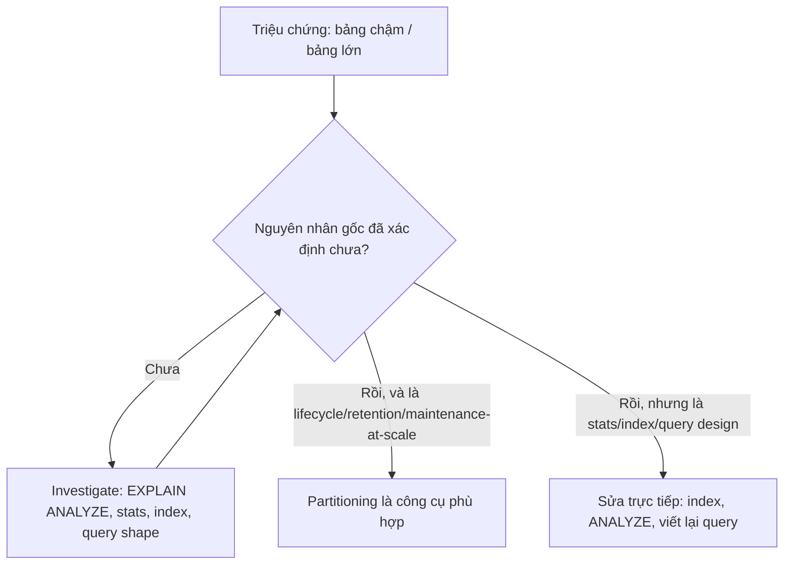
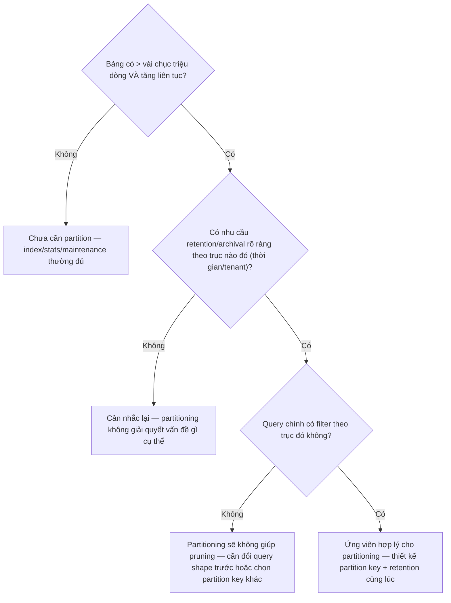

# 05 — Partitioning Anti-Patterns và Operational Costs

## 🎯 Mục tiêu học

Đây là file tổng hợp thực chiến. Sau file này, bạn phải nhận diện được ít nhất 8 anti-pattern partitioning phổ biến, hiểu vì sao chúng "nghe có vẻ hợp lý" lúc quyết định, và biết hướng sửa/rollback thực tế — thay vì chỉ học lý thuyết "nên/không nên".

## 📋 Mục lục

- [Mental model](#mental-model)
- [Diagram: decision tree "có nên partition bảng này không?"](#diagram-decision-tree-có-nên-partition-bảng-này-không)
- [8+ Anti-patterns](#8-anti-patterns)
- [Khi nào real fix là indexing/stats/query redesign](#khi-nào-real-fix-là-indexingstatsquery-redesign)
- [Khi nào real fix là maintenance workflow, không phải partitioning](#khi-nào-real-fix-là-maintenance-workflow-không-phải-partitioning)
- [Operational complexity là một phần của cost model](#operational-complexity-là-một-phần-của-cost-model)
- [Bảng: symptom → bad instinct → better reasoning → safer direction](#bảng-symptom--bad-instinct--better-reasoning--safer-direction)
- [Cost model matrix](#cost-model-matrix)
- [Failure modes](#failure-modes)
- [Debugging hints](#debugging-hints)
- [Safe operational patterns](#safe-operational-patterns)
- [Interview lens](#interview-lens)
- [Mini scenarios](#mini-scenarios)
- [Key takeaways](#key-takeaways)
- [Xem tiếp / Liên kết liên quan](#xem-tiếp--liên-kết-liên-quan)

## Mental model

## Diagram: decision tree "có nên partition bảng này không?"

## 8+ Anti-patterns

### 1. Partitioning quá sớm ("just in case")

- **Vì sao hay làm**: nghe "partitioning tốt cho bảng lớn" nên áp dụng ngay từ ngày đầu thiết kế, dù bảng chưa có dữ liệu.
- **Nghe hợp lý vì**: "chuẩn bị trước cho tương lai" nghe như thực hành tốt.
- **Hậu quả thật**: thêm độ phức tạp DDL/query routing ngay từ đầu cho một bảng có thể mãi mãi không bao giờ đủ lớn để cần — mọi query, migration, tooling đều phải cân nhắc partition dù không cần thiết.
- **Dấu hiệu nhận biết**: bảng có vài nghìn dòng nhưng đã có 12+ partition theo tháng.
- **Hướng sửa**: chỉ partition khi có bằng chứng cụ thể (kích thước dự kiến, nhu cầu retention) — không partition theo cảm tính "phòng khi".

### 2. Chọn sai partition key (không khớp query pattern chính)

- **Vì sao hay làm**: chọn partition key theo "trực giác dữ liệu" (ví dụ `created_at` vì "mọi bảng log đều nên theo thời gian") mà không kiểm tra query thực tế filter theo cột nào.
- **Nghe hợp lý vì**: thời gian luôn có vẻ là trục tự nhiên cho dữ liệu log.
- **Hậu quả thật**: query chính (ví dụ luôn filter `tenant_id`) không được hưởng pruning gì — như đã minh họa ở file 01 và 03.
- **Dấu hiệu nhận biết**: `EXPLAIN` cho thấy `Append` luôn liệt kê toàn bộ partition dù có `WHERE`.
- **Hướng sửa**: khảo sát top query pattern thực tế trước khi chọn partition key, không chỉ dựa vào bản chất dữ liệu.

### 3. Quá nhiều partition nhỏ (over-partitioning)

- **Vì sao hay làm**: nghĩ "chia càng nhỏ càng nhanh" nên partition theo ngày/giờ cho bảng có tốc độ tăng trưởng vừa phải.
- **Nghe hợp lý vì**: "partition nhỏ hơn = quét ít hơn" nghe đúng về mặt trực giác đơn giản.
- **Hậu quả thật**: hàng trăm/nghìn partition làm tăng chi phí lập plan cho mọi query (kể cả sau khi pruning), tăng overhead quản trị (mỗi partition là 1 file, 1 tập index, 1 tập statistics riêng), và làm chậm thao tác catalog (`\d+`, migration schema).
- **Dấu hiệu nhận biết**: thời gian `EXPLAIN` (không `ANALYZE`) tăng đáng kể dù dữ liệu không tăng nhiều; số lượng partition vượt xa số lượng cần cho retention thực tế.
- **Hướng sửa**: gộp partition theo granularity thô hơn (tháng thay vì ngày) trừ khi có bằng chứng cụ thể cần mịn hơn.

### 4. Giả định partitioning thay thế indexing

- **Vì sao hay làm**: sau khi partition, thấy query "có vẻ nhanh hơn" nên bỏ qua việc thiết kế index cho từng partition.
- **Nghe hợp lý vì**: bảng đã "nhỏ hơn" nên trực giác nghĩ index không còn cần thiết.
- **Hậu quả thật**: Seq Scan vẫn xảy ra bên trong mỗi partition cho điều kiện lọc thứ hai — như đã phân tích chi tiết ở file 03.
- **Dấu hiệu nhận biết**: `EXPLAIN ANALYZE` cho thấy `Seq Scan` trên partition con dù đã pruning tốt ở tầng ngoài.
- **Hướng sửa**: định nghĩa index trên bảng cha để tự động áp dụng cho mọi partition con, theo đúng nguyên tắc index đã học ở phase 03.

### 5. Bỏ qua query shape và pruning khi migrate

- **Vì sao hay làm**: migrate bảng hiện có sang partition mà không rà soát lại toàn bộ query đang chạm bảng đó.
- **Nghe hợp lý vì**: nghĩ "chỉ cần đổi cấu trúc lưu trữ, query không cần đổi."
- **Hậu quả thật**: nhiều query cũ không filter theo partition key mới sẽ chạy chậm hơn trước (do thêm overhead routing mà không được hưởng pruning).
- **Dấu hiệu nhận biết**: một số endpoint chậm đi rõ rệt ngay sau khi migrate sang partitioning, dù bảng "nhỏ hơn về mặt logic".
- **Hướng sửa**: kiểm kê toàn bộ query pattern chạm bảng trước khi migrate, đảm bảo phần lớn filter theo partition key dự kiến.

### 6. Bỏ qua skew/hotspot khi chọn list/hash partitioning

- **Vì sao hay làm**: dùng hash hoặc list partitioning theo `tenant_id` mà không kiểm tra phân bố dữ liệu giữa các tenant.
- **Nghe hợp lý vì**: "chia đều theo tenant" nghe công bằng và đơn giản.
- **Hậu quả thật**: tenant lớn nhất (hotspot) áp đảo 1 partition duy nhất, các tenant nhỏ chia sẻ partition khác gần như trống — không cân bằng tải như kỳ vọng.
- **Dấu hiệu nhận biết**: 1-2 partition có kích thước lớn gấp hàng chục lần các partition còn lại.
- **Hướng sửa**: khảo sát phân bố dữ liệu thực tế trước khi chọn scheme; cân nhắc composite key hoặc partition riêng cho tenant cực lớn.

### 7. Ranh giới retention không khớp business lifecycle

- **Vì sao hay làm**: chọn ranh giới partition (ví dụ theo tháng dương lịch) mà không đối chiếu với chu kỳ nghiệp vụ thật (ví dụ "giữ đúng 90 ngày kể từ ngày tạo").
- **Nghe hợp lý vì**: tháng dương lịch là đơn vị thời gian quen thuộc, dễ implement.
- **Hậu quả thật**: retention job phải xử lý logic phức tạp (một phần partition thỏa điều kiện, phần khác không) thay vì đơn giản "drop partition cũ nhất" — mất đi lợi ích chính của partition-based retention.
- **Dấu hiệu nhận biết**: retention job chứa `DELETE` phức tạp bên trong từng partition thay vì chỉ `DROP PARTITION`.
- **Hướng sửa**: thiết kế ranh giới partition khớp chính xác với retention window đã thống nhất với business trước khi tạo bảng.

### 8. Partition layout quá phức tạp, không ai vận hành nổi

- **Vì sao hay làm**: kết hợp nhiều tầng subpartition (ví dụ range theo tháng, rồi list theo tenant tier, rồi hash bên trong) để "tối ưu mọi trường hợp".
- **Nghe hợp lý vì**: mỗi tầng subpartition đều "có lý do riêng" khi xét độc lập.
- **Hậu quả thật**: không ai trong team hiểu nổi toàn bộ cấu trúc, mỗi lần thêm cột/sửa index phải áp dụng đúng cho hàng chục tổ hợp partition, rủi ro sai sót vận hành cao.
- **Dấu hiệu nhận biết**: cần xem tài liệu hoặc hỏi người khác mỗi khi muốn biết dữ liệu của 1 tenant nằm ở partition nào.
- **Hướng sửa**: giữ tối đa 1 tầng partition trừ khi có bằng chứng rất mạnh cần thêm tầng; ưu tiên đơn giản, dễ vận hành hơn "tối ưu lý thuyết".

### 9. Migrate sang partitioning mà không hiểu workload thật

- **Vì sao hay làm**: quyết định partition dựa trên "bảng này lớn" mà không đo query pattern, tần suất truy vấn, tỷ lệ đọc/ghi thực tế.
- **Nghe hợp lý vì**: kích thước bảng là con số dễ nhìn thấy nhất, dễ dùng làm lý do quyết định.
- **Hậu quả thật**: partition xong nhưng vấn đề gốc (ví dụ thiếu index, stats cũ, join design tệ) vẫn còn nguyên — chỉ thêm độ phức tạp vận hành mà không giải quyết triệu chứng ban đầu.
- **Dấu hiệu nhận biết**: sau khi partition, latency query không cải thiện hoặc cải thiện không đáng kể so với công sức bỏ ra.
- **Hướng sửa**: luôn bắt đầu bằng `EXPLAIN ANALYZE` + kiểm tra statistics + index trước khi kết luận partitioning là giải pháp.

## Khi nào real fix là indexing/stats/query redesign

Nếu vấn đề là: Seq Scan trên điều kiện lọc chọn lọc cao, statistics lỗi thời (`n_distinct` sai), hoặc query viết theo dạng phá vỡ sargability (bọc cột trong hàm) — **partitioning không sửa được bất kỳ điều nào trong số này**. Quay lại phase 02 (planner) và phase 03 (indexing) trước khi cân nhắc partitioning.

## Khi nào real fix là maintenance workflow, không phải partitioning

Nếu vấn đề là: autovacuum không theo kịp, bloat tích lũy do cấu hình threshold sai, hoặc `ANALYZE` không chạy đủ thường xuyên — đây là vấn đề **maintenance workflow** (phase 05), không phải kích thước bảng. Partitioning có thể giúp cô lập maintenance (mỗi partition vacuum độc lập, nhanh hơn), nhưng nếu cấu hình autovacuum sai, partition nhỏ hơn cũng sẽ bloat theo đúng tỷ lệ tương tự.

## Operational complexity là một phần của cost model

📌 Mọi lợi ích của partitioning (pruning, retention nhanh, maintenance cô lập) phải được cân với chi phí vận hành thật: mỗi partition là một đối tượng catalog riêng cần backup/restore cân nhắc, mỗi thay đổi schema phải áp dụng nhất quán, mỗi thêm partition mới (tự động hoặc thủ công) là một điểm có thể thất bại (quên tạo partition tương lai → insert lỗi "no partition found"). Quyết định partition một bảng là quyết định **thêm một tầng vận hành mới** cho toàn bộ vòng đời bảng đó, không chỉ là một cấu hình lưu trữ.

## Bảng: symptom → bad instinct → better reasoning → safer direction

| Symptom | Bad instinct | Better reasoning | Safer direction |
|---|---|---|---|
| Query chậm trên bảng lớn | "Partition bảng này ngay" | Kiểm tra `EXPLAIN ANALYZE` trước — có thể chỉ thiếu index hoặc stats cũ | Sửa index/stats trước; chỉ partition nếu vấn đề là lifecycle/retention |
| Bảng hàng trăm triệu dòng | "Bảng lớn thì phải partition" | Bảng lớn nhưng workload ổn định, query có index tốt có thể vẫn ổn không cần partition | Đo tốc độ tăng trưởng + query pattern trước khi quyết định |
| Cần xóa dữ liệu cũ định kỳ | "Cứ chạy cron DELETE" | Nếu định kỳ và số lượng lớn, đây chính là use case partitioning + drop partition | Thiết kế partition theo trục thời gian khớp retention window |
| Muốn scale ghi đồng thời | "Hash partition theo user_id cho nhanh" | Hash partitioning phân tán ghi nhưng không giúp retention hay pruning theo thời gian | Làm rõ mục tiêu chính (ghi song song hay retention) trước khi chọn scheme |
| Sau khi partition, query vẫn chậm | "Chắc cần partition mịn hơn" | Kiểm tra lại predicate có filter đúng partition key không, và index bên trong partition có tồn tại không | Rà soát query shape (file 03) trước khi tăng số lượng partition |

## Cost model matrix

| Chi phí | Thấp khi | Cao khi |
|---|---|---|
| DDL/operational complexity | 1 tầng partition, số lượng partition vừa phải (chục), tự động hóa tạo partition mới | Nhiều tầng subpartition, tạo partition thủ công, thiếu tự động hóa |
| Query routing complexity | Phần lớn query filter đúng partition key | Nhiều query pattern khác nhau, không thống nhất filter theo partition key |
| Index management complexity | Index định nghĩa 1 lần ở bảng cha, áp dụng tự động | Index tạo thủ công riêng lẻ cho từng partition, dễ thiếu sót |
| Skew risk | Phân bố dữ liệu đồng đều giữa các partition (range theo thời gian với tốc độ ghi ổn định) | List/hash theo cột có phân bố lệch mạnh (tenant lớn áp đảo) |
| Too-many-partitions overhead | Số partition ở mức chục, khớp nhu cầu retention thực tế | Partition theo đơn vị quá mịn (giờ/ngày) cho bảng tăng trưởng vừa phải |

## Failure modes

Xem chi tiết 9 anti-pattern ở trên — đây là danh sách failure mode chính của cả phase 7.

## Debugging hints

- Khi nghi ngờ partitioning không giúp ích, quay lại `EXPLAIN ANALYZE` trước tiên — đừng giả định.
- So sánh số lượng partition thực tế với số lượng cần thiết cho retention window đã thống nhất — chênh lệch lớn là dấu hiệu over-partitioning.
- Theo dõi kích thước từng partition định kỳ để phát hiện skew sớm.

## Safe operational patterns

- ✅ Luôn bắt đầu từ triệu chứng cụ thể (`EXPLAIN ANALYZE`, kích thước bảng, tần suất truy vấn) trước khi chọn partitioning.
- ✅ Tự động hóa việc tạo partition tương lai (job định kỳ tạo partition tháng sau) để tránh insert lỗi vì thiếu partition đích.
- ✅ Giữ số tầng partition tối thiểu; chỉ thêm tầng khi có bằng chứng mạnh.
- ✅ Đối chiếu ranh giới partition với retention window đã thống nhất với business trước khi triển khai.

## Interview lens

**Interviewer thường hỏi**: "Bạn sẽ làm gì nếu một bảng 500 triệu dòng chạy chậm?"

- ❌ Câu trả lời yếu: "Partition bảng đó ra."
- ✅ Câu trả lời mạnh: Trước tiên xác định triệu chứng cụ thể qua `EXPLAIN ANALYZE` — có thể là thiếu index, statistics lỗi thời, hoặc query shape phá sargability, và partitioning không sửa được bất kỳ điều nào trong số đó. Chỉ khi vấn đề thật sự là lifecycle/retention hoặc maintenance-at-scale, và query pattern chính đã filter theo một trục rõ ràng (thời gian, tenant), partitioning mới là công cụ phù hợp — kèm đánh giá đầy đủ chi phí vận hành (DDL complexity, index management, skew risk).

## Mini scenarios

1. **Team thấy dashboard chậm, quyết định partition ngay `orders` theo `created_at`** mà chưa kiểm tra `EXPLAIN ANALYZE` — sau khi partition, dashboard vẫn chậm vì filter chính là `status = 'pending'` không liên quan tới partition key, và cũng chưa từng có index cho `status`.
2. **Bảng `processing_jobs` hash-partition theo `tenant_id` để "scale ghi"**, nhưng 1 tenant enterprise chiếm 80% khối lượng — 1 partition trở thành hotspot y hệt trước khi partition, chỉ đổi tên vấn đề.
3. **Retention policy "giữ 90 ngày" áp lên bảng partition theo tháng dương lịch** — mỗi lần retention job chạy phải tính toán phần overlap giữa "90 ngày" và ranh giới tháng, phức tạp hơn nhiều so với thiết kế lại partition theo chu kỳ 30 ngày cố định.

## Key takeaways

- 🧱 9 anti-pattern phổ biến đều xuất phát từ việc nhảy vào giải pháp trước khi xác nhận nguyên nhân gốc bằng bằng chứng cụ thể.
- 🧱 Partitioning không sửa được vấn đề index/stats/query-design/maintenance-workflow — chỉ giải quyết lifecycle/retention/pruning-cho-đúng-query-shape/maintenance-isolation.
- 🧱 Operational complexity (DDL, routing, index management, skew, too-many-partitions) là một phần bắt buộc của quyết định, không phải chi tiết phụ.
- 🧱 Quyết định "có nên partition" luôn nên đi qua decision tree: xác nhận nguyên nhân gốc → xác nhận nhu cầu lifecycle rõ ràng → xác nhận query pattern khớp trục đó.

## Xem tiếp / Liên kết liên quan

- 🔗 [`01-when-partitioning-helps-and-when-it-does-not.md`](01-when-partitioning-helps-and-when-it-does-not.md) — quay lại điểm khởi đầu của phase này.
- 🔗 [`02-query-planner-and-execution/README.md`](../02-query-planner-and-execution/README.md) — khi real fix là planner/stats.
- 🔗 [`05-maintenance-and-bloat/README.md`](../05-maintenance-and-bloat/README.md) — khi real fix là maintenance workflow.
- ⬅️ [README phase này](README.md)
- ➡️ Phase tiếp theo: `07-replication-and-ha/` — sẽ mở rộng ở phần sau.
