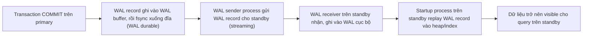
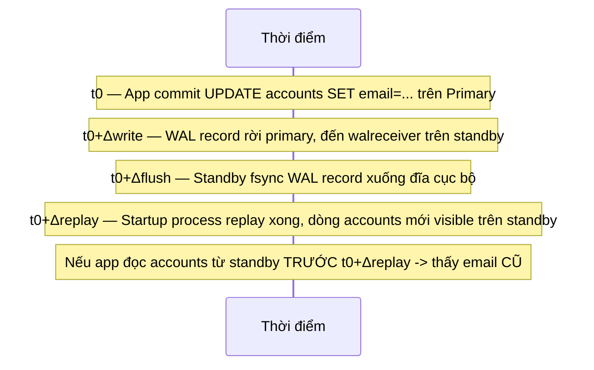

# 01 — Streaming Replication và WAL Shipping

## 🎯 Mục tiêu học

Sau file này, bạn phải bỏ được câu trả lời "primary gửi WAL cho standby" và thay bằng một mental model chính xác: standby là một tiến trình **liên tục replay WAL** mà nó nhận được, và trạng thái bất kỳ lúc nào của standby luôn là "trạng thái đã replay tới đâu", không bao giờ là "trạng thái hiện tại của primary".

## 📋 Mục lục

- [Mental model](#mental-model)
- [What actually happens: streaming replication](#what-actually-happens-streaming-replication)
- [Diagram: replication flow](#diagram-replication-flow)
- [Timeline: commit trên primary → visible trên standby](#timeline-commit-trên-primary--visible-trên-standby)
- [Streaming replication vs WAL shipping (file-based)](#streaming-replication-vs-wal-shipping-file-based)
- [Bảng: mechanism → good for → weakness → operational implication](#bảng-mechanism--good-for--weakness--operational-implication)
- [Vì sao replication bắt đầu từ WAL, không phải từ bảng](#vì-sao-replication-bắt-đầu-từ-wal-không-phải-từ-bảng)
- [Vì sao trạng thái standby luôn là trạng thái đã replay](#vì-sao-trạng-thái-standby-luôn-là-trạng-thái-đã-replay)
- [Failure modes](#failure-modes)
- [Debugging hints](#debugging-hints)
- [Safe HA/DR patterns](#safe-hadr-patterns)
- [Interview lens](#interview-lens)
- [Mini scenarios](#mini-scenarios)
- [Key takeaways](#key-takeaways)
- [Why this matters in production](#why-this-matters-in-production)
- [Xem tiếp / Liên kết liên quan](#xem-tiếp--liên-kết-liên-quan)

## Mental model



📌 Đây chính là 4 khoảng cách (send → write → flush → replay) sẽ được đo cụ thể trong file 02. Ở file này, điều quan trọng nhất là nắm được: **standby không nhận "kết quả query"**, nó nhận **byte-stream các thay đổi vật lý** (WAL record) và tự áp dụng lại từng thay đổi đó theo đúng thứ tự.

## What actually happens: streaming replication

Streaming replication (mặc định từ PostgreSQL 9.x trở đi) hoạt động qua kết nối TCP liên tục giữa `walsender` (process trên primary) và `walreceiver` (process trên standby):

1. Mỗi transaction commit trên primary tạo ra WAL record, được ghi vào WAL segment trên đĩa (đã học ở [`01-storage-and-mvcc/04-wal-checkpoints-crash-recovery.md`](../01-storage-and-mvcc/04-wal-checkpoints-crash-recovery.md)).
2. `walsender` đọc WAL segment ngay khi nó được ghi và **stream** từng record sang standby qua kết nối replication — không chờ WAL segment đầy (16MB mặc định) như WAL archiving file-based.
3. `walreceiver` trên standby nhận record, ghi vào WAL cục bộ của standby.
4. Startup process trên standby **replay** (redo) từng WAL record — chính là cơ chế crash recovery/redo đã học ở phase 2, chỉ khác là chạy liên tục thay vì chỉ chạy một lần lúc khởi động sau crash.
5. Sau khi replay xong một record, thay đổi đó mới **visible** cho query chạy trên standby.

## Diagram: replication flow

```mermaid
sequenceDiagram
    participant App as App (ghi orders)
    participant Primary as Primary
    participant WALP as WAL (primary, đã fsync)
    participant Standby as Standby (walreceiver + startup process)
    App->>Primary: INSERT INTO orders (...) ; COMMIT
    Primary->>WALP: Ghi + fsync WAL record (durable)
    Primary-->>App: Commit acknowledged
    Primary->>Standby: Stream WAL record (walsender -> walreceiver)
    Standby->>Standby: Replay WAL record vào heap/index cục bộ
    Note over Standby: Dòng orders mới chỉ visible SAU bước replay này
```

## Timeline: commit trên primary → visible trên standby



## Streaming replication vs WAL shipping (file-based)

| Mechanism | Good for | Weakness | Operational implication |
|---|---|---|---|
| Streaming replication (WAL sender/receiver, TCP liên tục) | Lag thấp (thường vài ms đến vài giây), phù hợp HA/read-replica thời gian gần thực | Cần kết nối mạng ổn định liên tục giữa primary-standby | Cần `wal_level = replica` (hoặc cao hơn), replication slot hoặc `wal_keep_size` để giữ đủ WAL cho standby bắt kịp |
| WAL shipping (file-based, `archive_command` + `restore_command`) | Không cần kết nối trực tiếp liên tục, phù hợp DR site ở xa hoặc chuyển WAL qua object storage | Lag cao hơn nhiều (theo chu kỳ archive segment, có thể vài phút) | Không phù hợp cho HA cần failover nhanh, thường dùng kết hợp cho PITR (xem file 05) |
| Cascading replication (standby của standby) | Giảm tải walsender trên primary khi có nhiều standby | Thêm một tầng lag (standby con trễ hơn standby cha) | Cần theo dõi lag ở từng tầng riêng, không chỉ tầng đầu |

## Vì sao replication bắt đầu từ WAL, không phải từ bảng

📌 PostgreSQL replication vật lý (physical replication) không "so sánh bảng nguồn với bảng đích" như một số công cụ ETL — nó chỉ đơn thuần phát lại (replay) đúng những gì đã xảy ra trên primary, ở đúng mức byte/page vật lý. Đây là lý do:

- Standby là **byte-for-byte** giống primary ở mức đã replay tới — không có khái niệm "đồng bộ lại từ query" hay "so khớp dữ liệu".
- Standby **không thể** ghi độc lập (read-only) — vì nó chỉ replay đúng những gì primary đã làm, không có "câu chuyện riêng" để dung hòa.
- Bất kỳ điều gì primary làm (kể cả `DROP TABLE`, `DELETE` nhầm, corruption do bug ứng dụng ghi sai dữ liệu) đều được replay y hệt sang standby — đây chính là lý do replication **không phải** backup (chi tiết ở file 05).

## Vì sao trạng thái standby luôn là trạng thái đã replay

Không có khái niệm "standby đã đồng bộ 100% real-time" trong streaming replication — luôn tồn tại một độ trễ giữa lúc WAL record được tạo trên primary và lúc nó được replay xong trên standby, dù độ trễ đó có thể chỉ vài mili-giây trong điều kiện lý tưởng. Mọi truy vấn chạy trên standby đọc **snapshot tại thời điểm đã replay**, không phải "thời điểm hiện tại của primary".

## Failure modes

- 🔴 **Nghĩ replica đồng bộ tuyệt đối theo real-time**: dẫn tới thiết kế query đọc-ghi phụ thuộc lẫn nhau mà không kiểm tra lag — gây bug đọc dữ liệu cũ (chi tiết case cụ thể ở file 03).
- 🔴 **Nhầm replication với backup**: xóa nhầm `DELETE FROM orders` trên primary sẽ replay y hệt sang mọi standby trong vài mili-giây — không có "phiên bản cũ" nào để cứu từ replica.
- 🔴 **Nghĩ standby là mirror tuyệt đối không độ trễ**: dù trong điều kiện mạng tốt lag rất thấp, vẫn luôn có một khoảng thời gian khác 0 giữa write và replay — không được thiết kế hệ thống giả định lag = 0.
- 🔴 **Không cấu hình đủ WAL retention (`wal_keep_size`/replication slot)** khi standby tạm ngắt kết nối: nếu WAL cần thiết đã bị primary dọn trước khi standby kịp lấy, standby sẽ rơi vào trạng thái không thể bắt kịp và cần rebuild từ base backup mới.

## Debugging hints

- Kiểm tra trạng thái kết nối replication từ phía primary: `SELECT * FROM pg_stat_replication;` — cho biết standby nào đang kết nối, LSN đã gửi/ghi/flush/replay tới đâu.
- Kiểm tra từ phía standby: `SELECT pg_is_in_recovery();` (trả về `true` nếu đang ở chế độ standby), và `SELECT pg_last_wal_replay_lsn();` để biết đã replay tới LSN nào.
- So sánh `pg_current_wal_lsn()` trên primary với `pg_last_wal_replay_lsn()` trên standby để có con số lag cụ thể theo LSN (chi tiết đo lag bằng thời gian ở file 02).

## Safe HA/DR patterns

- ✅ Luôn cấu hình `wal_level = replica` trở lên và replication slot (hoặc `wal_keep_size` đủ lớn) để standby không bao giờ "mất dấu" WAL cần thiết.
- ✅ Theo dõi `pg_stat_replication` liên tục (không chỉ kiểm tra thủ công khi có sự cố) để phát hiện standby rớt kết nối sớm.
- ✅ Với DR site ở xa, cân nhắc kết hợp streaming replication (cho standby gần, lag thấp) với WAL shipping/archiving (cho site xa hoặc mục đích PITR).
- ❌ Không dùng streaming replication một mình như "backup" — luôn cần chiến lược backup/PITR độc lập (file 05).

## Interview lens

**Interviewer thường hỏi**: "Giải thích cách PostgreSQL replication hoạt động."

- ❌ Câu trả lời yếu: "Primary gửi dữ liệu cho standby qua mạng."
- ✅ Câu trả lời mạnh: Replication vật lý dựa hoàn toàn trên WAL — mỗi transaction commit sinh ra WAL record đã fsync durable trên primary, sau đó được stream (hoặc shipped theo file) sang standby, nơi startup process replay lại từng record theo đúng cơ chế redo dùng cho crash recovery. Vì vậy trạng thái standby luôn là "trạng thái đã replay tới một LSN nào đó", không bao giờ là bản sao tức thời của primary — đây là nguồn gốc của mọi caveat về lag và read consistency.

## Mini scenarios

1. **App ghi `INSERT INTO orders` trên primary, ngay lập tức gọi API đọc `orders` route sang read-replica** — nếu API đọc chạy trước khi WAL record của INSERT được replay xong trên replica, response trả về "không tìm thấy order" dù ghi đã thành công.
2. **Standby mất kết nối mạng 10 phút rồi kết nối lại** — nếu WAL cần thiết (từ lúc mất kết nối) vẫn còn giữ (nhờ slot/`wal_keep_size`), standby tự động bắt kịp bằng cách nhận và replay phần WAL bị thiếu; nếu WAL đã bị dọn, standby cần rebuild từ base backup mới.
3. **Team dùng WAL shipping (archive_command) cho DR site ở khu vực địa lý khác** — chấp nhận lag cao hơn (vài phút) đổi lấy việc không cần duy trì kết nối trực tiếp liên tục, phù hợp cho disaster recovery hơn là failover nhanh.

## Key takeaways

- 🧠 Replication vật lý sao chép **WAL record** (thay đổi vật lý), không sao chép "kết quả query" — chỉ đơn thuần replay lại đúng những gì primary đã làm.
- 🧠 Trạng thái standby luôn là "đã replay tới đâu" — không bao giờ là bản sao tức thời của primary, dù lag có thể rất nhỏ.
- 🧠 Streaming replication (lag thấp, cần kết nối liên tục) và WAL shipping (lag cao hơn, không cần kết nối liên tục) phục vụ mục đích khác nhau — không phải lựa chọn "cái nào tốt hơn" tuyệt đối.
- 🧠 Vì replay lại y hệt mọi thay đổi (kể cả lỗi), replication không bao giờ là chiến lược backup.

## Why this matters in production

Mọi bug "đọc dữ liệu cũ ngay sau khi ghi" mà backend engineer gặp phải khi hệ thống có read-replica đều bắt nguồn từ chính cơ chế này — không phải bug PostgreSQL, mà là hệ quả tất yếu của kiến trúc WAL-based replication. Hiểu đúng mental model này là điều kiện tiên quyết để thiết kế routing đọc/ghi an toàn (file 03) và để không hoảng loạn khi thấy `pg_stat_replication` báo lag khác 0 — lag khác 0 là bình thường, vấn đề là lag đó có phù hợp với yêu cầu nghiệp vụ hay không.

## Xem tiếp / Liên kết liên quan

- ➡️ [`02-replication-lag-slots-and-backpressure.md`](02-replication-lag-slots-and-backpressure.md) — đo lag cụ thể, slot bảo vệ và gây rủi ro gì.
- 🔗 [`01-storage-and-mvcc/04-wal-checkpoints-crash-recovery.md`](../01-storage-and-mvcc/04-wal-checkpoints-crash-recovery.md) — cơ chế WAL/redo nền tảng mà replay trên standby tái sử dụng.
- ⬅️ [README phase này](README.md)
