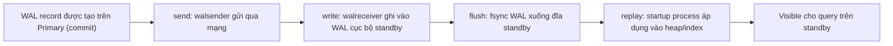
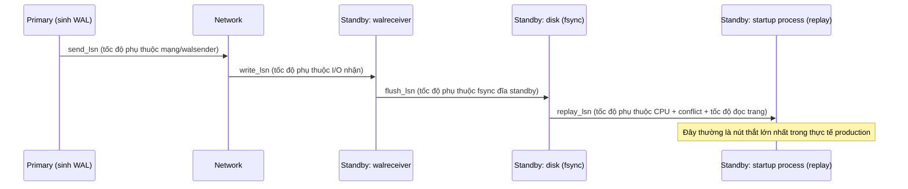
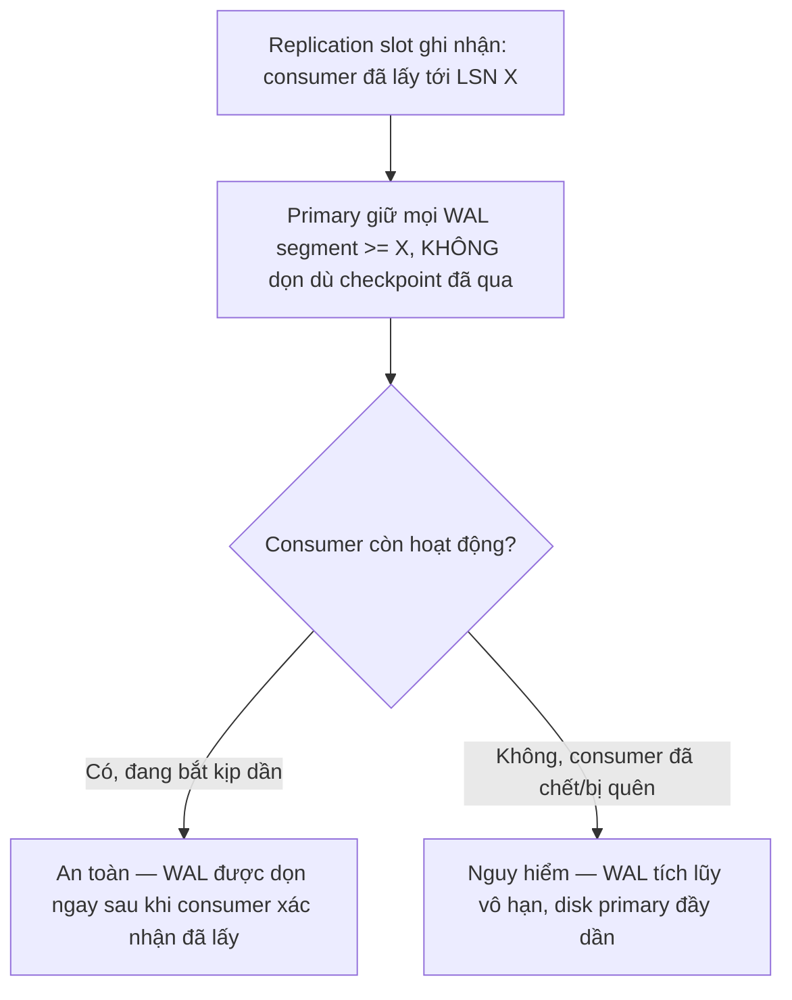

# 02 — Replication Lag, Slots và Backpressure

## 🎯 Mục tiêu học

Đây là file nền cho toàn bộ phần còn lại của phase. Sau file này, bạn phải trả lời được: "lag" không phải một con số duy nhất với một nguyên nhân duy nhất — nó là một **pipeline nhiều giai đoạn**, và mỗi giai đoạn có nguyên nhân riêng, cách đo riêng, hướng sửa riêng. Bạn cũng phải giải thích được vì sao replication slot vừa là công cụ bảo vệ vừa là nguồn rủi ro.

## 📋 Mục lục

- [Mental model](#mental-model)
- [What actually happens: 4 giai đoạn của lag](#what-actually-happens-4-giai-đoạn-của-lag)
- [Diagram: lag pipeline](#diagram-lag-pipeline)
- [Lag không phải một con số với một nguyên nhân](#lag-không-phải-một-con-số-với-một-nguyên-nhân)
- [Replication slot: bảo vệ gì, gây nguy hiểm gì](#replication-slot-bảo-vệ-gì-gây-nguy-hiểm-gì)
- [Diagram: slot giữ WAL flow](#diagram-slot-giữ-wal-flow)
- [Bảng: symptom → likely lag source → how to verify → fix direction](#bảng-symptom--likely-lag-source--how-to-verify--fix-direction)
- [Ví dụ thực tế](#ví-dụ-thực-tế)
- [Failure modes](#failure-modes)
- [Debugging hints](#debugging-hints)
- [Safe HA/DR patterns](#safe-hadr-patterns)
- [Interview lens](#interview-lens)
- [Mini scenarios](#mini-scenarios)
- [Key takeaways](#key-takeaways)
- [Why this matters in production](#why-this-matters-in-production)
- [Xem tiếp / Liên kết liên quan](#xem-tiếp--liên-kết-liên-quan)

## Mental model



📌 "Lag" mà người ta hay nói tới thực chất là khoảng cách giữa **Gen** và **Visible** — nhưng khoảng cách đó tích lũy từ 4 giai đoạn con (send/write/flush/replay), mỗi giai đoạn có thể là nút thắt cổ chai độc lập.

## What actually happens: 4 giai đoạn của lag

PostgreSQL expose trực tiếp 4 giai đoạn này qua `pg_stat_replication` (cột `write_lag`, `flush_lag`, `replay_lag`, cùng các LSN tương ứng `sent_lsn`, `write_lsn`, `flush_lsn`, `replay_lsn`):

- **Send lag** (`sent_lsn` so với `pg_current_wal_lsn()` primary): WAL sender gửi chậm — thường do mạng chậm/nghẽn hoặc walsender bị nghẽn CPU.
- **Write lag** (`write_lsn` so với `sent_lsn`): standby nhận nhưng chưa ghi kịp vào WAL cục bộ — thường do I/O standby chậm.
- **Flush lag** (`flush_lsn` so với `write_lsn`): standby ghi nhưng chưa fsync xong — thường do đĩa standby chậm hoặc bận.
- **Replay lag** (`replay_lsn` so với `flush_lsn`): đây là giai đoạn hay bị nghẽn nhất trong thực tế — startup process replay chậm hơn tốc độ WAL sinh ra, thường do: query đọc dài đang giữ lock trên standby (`hot_standby_feedback`/conflict), CPU standby yếu hơn primary, hoặc replay phải chờ conflict resolution.

## Diagram: lag pipeline



## Lag không phải một con số với một nguyên nhân

📌 Khi dashboard giám sát chỉ hiển thị "replication lag: 45 giây", con số đó **che giấu** giai đoạn nào đang là nút thắt. Team dễ mắc anti-pattern "cứ thấy lag là đổ lỗi mạng" — trong khi phần lớn lag production nghiêm trọng nằm ở **replay lag** (CPU/conflict trên standby) hoặc **WAL generation rate quá cao trên primary** (không phải vấn đề "chậm" ở standby, mà là primary sinh WAL nhanh hơn khả năng standby xử lý).

## Replication slot: bảo vệ gì, gây nguy hiểm gì

Replication slot (`pg_create_physical_replication_slot`) là cơ chế để primary **nhớ** rằng có một standby (hoặc consumer WAL khác) chưa lấy hết WAL tới một LSN nào đó — và **giữ lại** WAL segment cần thiết cho tới khi consumer đó xác nhận đã lấy xong, dù WAL segment đó đáng lẽ đã có thể bị dọn theo checkpoint thông thường.

- ✅ **Bảo vệ**: standby tạm ngắt kết nối (mạng chập chờn, restart bảo trì) vẫn có thể bắt kịp sau khi kết nối lại, vì WAL cần thiết chưa bị xóa.
- 🔴 **Nguy hiểm**: nếu standby (hoặc consumer) **dừng lấy WAL vĩnh viễn** (crash, bị xóa, quên tắt slot) nhưng slot vẫn tồn tại, primary sẽ **giữ WAL vô thời hạn** — đĩa primary phình to liên tục cho tới khi hết dung lượng, ảnh hưởng trực tiếp tới khả năng ghi của toàn bộ hệ thống, không chỉ riêng replication.

## Diagram: slot giữ WAL flow



## Bảng: symptom → likely lag source → how to verify → fix direction

| Symptom | Likely lag source | How to verify | Fix direction |
|---|---|---|---|
| Replica lag tăng dần, dashboard chỉ báo "lag cao" chung chung | Không rõ giai đoạn nào — cần tách nhỏ | So sánh `write_lag`/`flush_lag`/`replay_lag` riêng trong `pg_stat_replication` | Xác định đúng giai đoạn trước khi hành động, không đổ lỗi mạng theo phản xạ |
| `replay_lag` cao, `write_lag`/`flush_lag` thấp | Standby replay chậm — thường do query dài đang giữ lock, hoặc CPU standby yếu | `SELECT * FROM pg_stat_activity` trên standby tìm long-running query; kiểm tra CPU standby | Giảm `max_standby_streaming_delay` cân nhắc, tối ưu query dài trên standby, hoặc tăng tài nguyên standby |
| Slot tồn tại, đĩa primary tăng liên tục dù ghi bình thường | Slot inactive (consumer chết) đang giữ WAL vô hạn | `SELECT slot_name, active, restart_lsn FROM pg_replication_slots;` — slot `active = false` kèm `restart_lsn` cũ là dấu hiệu rõ | Xóa slot không dùng nữa (`pg_drop_replication_slot`), hoặc khôi phục consumer nếu vẫn cần |
| Lag tăng đột biến trong giờ cao điểm ghi | WAL generation rate trên primary tăng vọt (batch insert lớn, bulk update) vượt khả năng standby xử lý | So sánh tốc độ tăng `pg_current_wal_lsn()` trên primary theo thời gian với tốc độ `replay_lsn` tăng trên standby | Không phải lỗi "chậm" ở standby — cân nhắc giới hạn batch size, hoặc chấp nhận lag tạm thời trong burst |
| Long transaction trên primary làm standby chậm theo | Long transaction giữ nhiều WAL chưa commit, cũng ảnh hưởng `hot_standby_feedback` gây conflict trên standby | Kiểm tra `pg_stat_activity` trên primary tìm transaction chạy lâu | Áp dụng kỷ luật long-transaction đã học ở [`04-concurrency-and-locking/04-`](../04-concurrency-and-locking/04-long-transactions-and-idle-in-transaction.md) |

## Ví dụ thực tế

**Case 1 — replay chậm vì long-running report query trên standby:**

```sql
-- Trên standby, một query báo cáo chạy 20 phút đọc activity_logs
SELECT tenant_id, count(*) FROM activity_logs
WHERE created_at >= now() - interval '30 days'
GROUP BY tenant_id;
-- Nếu hot_standby_feedback = on: primary sẽ tạm hoãn dọn dead tuple cần thiết cho query này,
-- tránh conflict nhưng có thể làm primary bloat/replay chậm dồn ứ
-- Nếu hot_standby_feedback = off: query có thể bị hủy giữa chừng do conflict WAL replay
```

**Case 2 — slot bị bỏ quên làm phình đĩa primary:**

```sql
-- Team tạo slot để thử nghiệm logical replication, sau đó xóa consumer nhưng quên xóa slot
SELECT slot_name, slot_type, active, restart_lsn FROM pg_replication_slots;
--  slot_name      | slot_type | active | restart_lsn
--  test_logical_1 | logical   | f      | 0/1A2B3C40   <- inactive nhưng vẫn giữ WAL từ rất lâu

-- Disk primary tăng dần dù lượng ghi không đổi -> nguyên nhân là slot này, không phải lưu lượng ghi
DROP_REPLICATION_SLOT test_logical_1; -- hoặc SELECT pg_drop_replication_slot('test_logical_1');
```

**Case 3 — heavy write burst làm lag tăng đột biến:**

```sql
-- Batch job insert 5 triệu dòng vào events trong 1 giao dịch lớn
INSERT INTO events (tenant_id, event_type, created_at, payload)
SELECT ... FROM staging_import; -- 5 triệu dòng
-- WAL generation rate tăng vọt trong vài phút -> replay_lag tăng tạm thời trên mọi standby
-- Đây KHÔNG phải lỗi cấu hình, mà là hệ quả tất yếu của tốc độ ghi vượt khả năng replay tức thời
```

## Failure modes

- 🔴 **Tạo slot rồi quên**: slot inactive giữ WAL vô hạn, disk primary đầy dần cho tới khi ghi bị từ chối — ảnh hưởng toàn hệ thống, không chỉ replication.
- 🔴 **Đổ lỗi mạng cho mọi loại lag**: bỏ qua khả năng nút thắt thực sự nằm ở replay (CPU/conflict) hoặc ở tốc độ sinh WAL trên chính primary.
- 🔴 **Chỉ nhìn "replica delay" mà không nhìn WAL generation rate**: một đợt lag tăng có thể hoàn toàn bình thường (do burst ghi), không cần hành động khẩn cấp nếu standby vẫn bắt kịp sau đó.
- 🔴 **Coi lag chỉ là vấn đề "đọc dữ liệu cũ"**: bỏ qua rủi ro disk pressure trên **primary** khi slot giữ WAL quá lâu — đây là rủi ro vận hành nghiêm trọng hơn nhiều so với việc replica trả dữ liệu cũ vài giây.

## Debugging hints

- Luôn tách riêng `write_lag`/`flush_lag`/`replay_lag` từ `pg_stat_replication` trước khi kết luận nguyên nhân.
- Kiểm tra `pg_replication_slots.active` định kỳ (không chỉ khi có sự cố) để phát hiện slot bị bỏ quên sớm — đây nên là một alert tự động, không phải kiểm tra thủ công.
- So sánh tốc độ tăng LSN trên primary với tốc độ replay trên standby để phân biệt "burst ghi tạm thời" với "standby thực sự không bắt kịp nổi".

## Safe HA/DR patterns

- ✅ Alert tự động khi slot `active = false` quá một ngưỡng thời gian ngắn (vài phút), không chờ tới khi disk gần đầy mới phát hiện.
- ✅ Alert riêng biệt cho từng giai đoạn lag (`write_lag`, `flush_lag`, `replay_lag`) thay vì chỉ một con số lag tổng.
- ✅ Đặt giới hạn dung lượng WAL tối đa có thể giữ cho slot (`max_slot_wal_keep_size` từ PostgreSQL 13+) để tránh disk phình vô hạn dù có bug quên xóa slot.
- ❌ Không dùng `hot_standby_feedback = on` một cách mặc định mà không hiểu trade-off: nó tránh query conflict trên standby nhưng có thể làm primary giữ dead tuple lâu hơn (ảnh hưởng vacuum — liên hệ [`05-maintenance-and-bloat/`](../05-maintenance-and-bloat/README.md)).

## Interview lens

**Interviewer thường hỏi**: "Replica lag 30 giây, bạn sẽ điều tra thế nào?"

- ❌ Câu trả lời yếu: "Kiểm tra mạng giữa primary và standby."
- ✅ Câu trả lời mạnh: Trước tiên tách lag thành 4 giai đoạn (send/write/flush/replay) qua `pg_stat_replication` để biết chính xác nút thắt nằm ở đâu — mạng chỉ là một trong nhiều khả năng. Nếu `replay_lag` cao riêng biệt, nghi ngờ query dài trên standby hoặc CPU yếu; nếu toàn bộ 4 giai đoạn đều tăng đồng thời, nghi ngờ WAL generation rate trên primary tăng đột biến (burst ghi) chứ không phải standby "chậm". Đồng thời luôn kiểm tra `pg_replication_slots` để loại trừ khả năng slot bị bỏ quên đang gây áp lực disk trên chính primary.

## Mini scenarios

1. **Dashboard nội bộ báo "replica lag 2 phút" mỗi ngày lúc 2 giờ sáng, đúng giờ chạy batch job import `events`** — đây là burst ghi hợp lý (WAL generation rate tăng tạm thời), không cần hành động khẩn nếu lag tự giảm sau khi batch xong.
2. **Đĩa primary tăng liên tục 5%/ngày dù lượng ghi ứng dụng không đổi** — nghi ngờ ngay slot bị bỏ quên; kiểm tra `pg_replication_slots` trước khi nghi ngờ nguyên nhân khác.
3. **Team bật `hot_standby_feedback = on` để "tránh lỗi query bị hủy trên standby"**, sau đó phát hiện bảng `processing_jobs` trên primary bloat nhanh hơn dự kiến — nguyên nhân là feedback này trì hoãn vacuum trên primary để tránh xóa dữ liệu mà standby còn cần đọc.

## Key takeaways

- 🧠 Lag là pipeline 4 giai đoạn (send/write/flush/replay) — mỗi giai đoạn có nguyên nhân và cách sửa riêng, không phải một con số một nguyên nhân.
- 🧠 Replay lag (CPU/conflict trên standby) thường là nút thắt thực tế lớn nhất trong production, không phải mạng.
- 🧠 Replication slot bảo vệ khả năng bắt kịp của standby, nhưng nếu consumer chết mà slot còn tồn tại, nó sẽ khiến **primary** phình đĩa vô hạn — rủi ro nghiêm trọng hơn cả bản thân lag.
- 🧠 WAL generation rate tăng đột biến trên primary (burst ghi) là nguyên nhân lag hoàn toàn khác với "standby chậm" — cần phân biệt trước khi hành động.

## Why this matters in production

Phần lớn sự cố "replica bị lag nghiêm trọng" trong thực tế không phải do mạng — mà do slot bị bỏ quên (rủi ro disk toàn hệ thống) hoặc query dài trên standby chặn replay. Team nào chỉ theo dõi một con số lag tổng và phản xạ "đổ lỗi mạng" sẽ liên tục bỏ lỡ nguyên nhân gốc thật sự, và trong trường hợp xấu nhất (slot bị quên), có thể dẫn tới toàn bộ primary ngừng nhận ghi vì hết dung lượng đĩa — một sự cố nghiêm trọng hơn nhiều so với lag đọc vài giây.

## Xem tiếp / Liên kết liên quan

- ➡️ [`03-read-replicas-consistency-and-routing.md`](03-read-replicas-consistency-and-routing.md) — lag ảnh hưởng gì tới việc route query đọc.
- 🔗 [`04-concurrency-and-locking/04-long-transactions-and-idle-in-transaction.md`](../04-concurrency-and-locking/04-long-transactions-and-idle-in-transaction.md) — long transaction ảnh hưởng cả replay lag lẫn vacuum.
- 🔗 [`05-maintenance-and-bloat/README.md`](../05-maintenance-and-bloat/README.md) — `hot_standby_feedback` và ảnh hưởng tới vacuum trên primary.
- ⬅️ [`01-streaming-replication-and-wal-shipping.md`](01-streaming-replication-and-wal-shipping.md)
- ⬅️ [README phase này](README.md)
