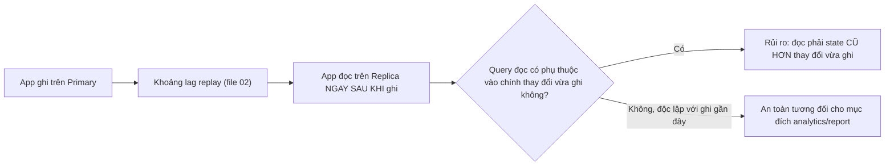
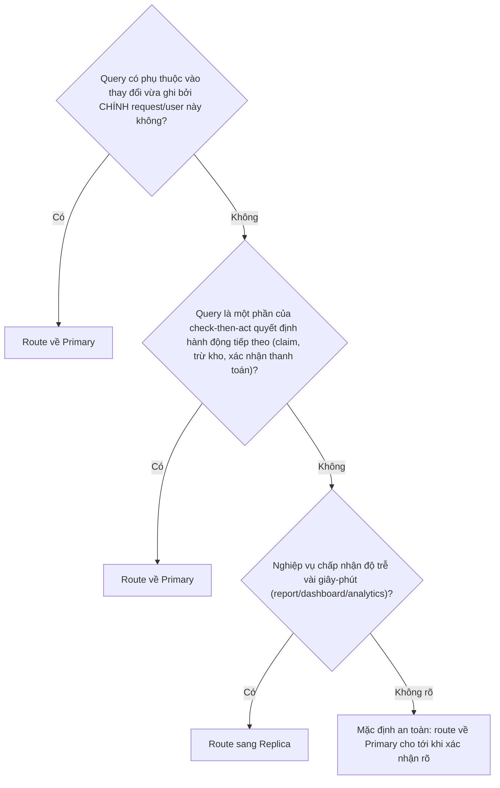

# 03 — Read Replicas: Consistency và Routing

## 🎯 Mục tiêu học

File này quan trọng nhất cho backend engineer trong toàn phase. Sau file này, bạn phải tự trả lời được câu hỏi cho từng endpoint/query cụ thể: "route sang replica có an toàn không, và nếu không thì vì sao?" — không dựa vào cảm tính "GET thì chắc đọc replica được".

## 📋 Mục lục

- [Mental model](#mental-model)
- [What actually happens: read-after-write caveat](#what-actually-happens-read-after-write-caveat)
- [Diagram: stale-read timeline](#diagram-stale-read-timeline)
- [Replica-safe reads vs coordination-sensitive reads](#replica-safe-reads-vs-coordination-sensitive-reads)
- [Bảng: read pattern → replica-safe? → why/caveat → safer routing idea](#bảng-read-pattern--replica-safe--whycaveat--safer-routing-idea)
- [Diagram: routing decision tree](#diagram-routing-decision-tree)
- [Ví dụ thực tế](#ví-dụ-thực-tế)
- [Vì sao stale read có thể trở thành bug nghiệp vụ](#vì-sao-stale-read-có-thể-trở-thành-bug-nghiệp-vụ)
- [Failure modes](#failure-modes)
- [Debugging hints](#debugging-hints)
- [Safe HA/DR patterns](#safe-hadr-patterns)
- [Interview lens](#interview-lens)
- [Mini scenarios](#mini-scenarios)
- [Key takeaways](#key-takeaways)
- [Why this matters in production](#why-this-matters-in-production)
- [Xem tiếp / Liên kết liên quan](#xem-tiếp--liên-kết-liên-quan)

## Mental model



❌ "Replica read là free scalability" — sai vì nó bỏ qua chính xác câu hỏi ở giữa: query đọc đó có nhạy cảm với độ mới của dữ liệu hay không.

## What actually happens: read-after-write caveat

Vì replica luôn ở trạng thái "đã replay tới đâu" (file 01), nếu app ghi trên primary rồi lập tức đọc lại trên replica **trước khi** WAL của thay đổi đó được replay xong, app sẽ thấy **dữ liệu cũ hơn chính thay đổi nó vừa tạo ra** — đây gọi là vi phạm **read-after-write consistency**.

```sql
-- Trên Primary:
UPDATE accounts SET email = 'new@example.com' WHERE id = 42;
-- COMMIT thành công, response trả về "profile updated" cho user

-- Ngay sau đó, trang profile gọi API đọc lại (route sang Replica):
SELECT email FROM accounts WHERE id = 42;
-- Nếu replay chưa kịp tới -> trả về email CŨ -> user thấy "update không có tác dụng"
```

## Diagram: stale-read timeline

```mermaid
sequenceDiagram
    participant User as User
    participant App as App
    participant Primary as Primary
    participant Replica as Replica
    User->>App: PATCH /profile (đổi email)
    App->>Primary: UPDATE accounts SET email=... ; COMMIT
    Primary-->>App: 200 OK
    App-->>User: "Cập nhật thành công"
    User->>App: GET /profile (load lại trang)
    App->>Replica: SELECT email FROM accounts WHERE id=42
    Note over Replica: Replay WAL của UPDATE chưa xong
    Replica-->>App: email CŨ
    App-->>User: Hiển thị email CŨ ngay sau khi vừa báo "thành công"
```

## Replica-safe reads vs coordination-sensitive reads

- **Replica-safe reads**: query độc lập với bất kỳ ghi gần đây nào của **chính request/user hiện tại**, và nghiệp vụ chấp nhận độ trễ vài giây tới vài phút — ví dụ dashboard tổng hợp, báo cáo `activity_logs`/`events` theo khoảng thời gian trong quá khứ.
- **Coordination-sensitive reads**: query cần phản ánh **ngay lập tức** một thay đổi vừa xảy ra để quyết định hành động tiếp theo (check-then-act), hoặc user kỳ vọng thấy ngay kết quả hành động của chính họ (read-your-write) — đây là loại query tuyệt đối không nên route sang replica mà không có cơ chế bù trừ.

## Bảng: read pattern → replica-safe? → why/caveat → safer routing idea

| Read pattern | Replica-safe? | Why / caveat | Safer routing idea |
|---|---|---|---|
| User đổi profile rồi load lại trang ngay (read-your-write) | ❌ Không an toàn | Replica có thể chưa replay kịp UPDATE vừa commit | Đọc từ primary ngay sau ghi trong cùng request/session, hoặc trả lại chính giá trị vừa ghi từ response của lệnh UPDATE thay vì query lại |
| Đọc trạng thái `orders`/`payments` để hiển thị cho user ngay sau khi thanh toán | ❌ Không an toàn nếu cần trạng thái mới nhất tuyệt đối | User có thể thấy "đang xử lý" dù đã thanh toán xong trên primary | Đọc trực tiếp từ primary cho luồng xác nhận thanh toán; dùng replica chỉ cho lịch sử đơn hàng cũ hơn |
| Dashboard/report tổng hợp `activity_logs`/`events` theo ngày/tuần | ✅ An toàn tương đối | Không nhạy cảm với vài giây/phút lag; nghiệp vụ báo cáo chấp nhận độ trễ | Route thẳng sang replica, có thể hiển thị rõ "dữ liệu tính tới HH:mm" để đặt kỳ vọng đúng |
| Worker đọc `processing_jobs` để **claim** job (check-then-act) | ❌ Rất nguy hiểm | Đọc trên replica có thể thấy job "chưa được claim" dù thực tế worker khác đã claim xong trên primary — dẫn tới xử lý trùng | Luôn đọc + claim (`UPDATE ... WHERE status='pending'`) trên **primary**, không bao giờ tách 2 bước qua 2 node khác nhau |
| Kiểm tra tồn kho (`products.stock`) trước khi trừ kho | ❌ Không an toàn cho quyết định trừ kho | Số liệu tồn kho đọc từ replica có thể cũ hơn giao dịch trừ kho vừa xảy ra trên primary | Đọc để hiển thị ước lượng thì được; quyết định trừ kho thật sự phải qua transaction trên primary với điều kiện kiểm tra lại |
| Autocomplete/search không phụ thuộc ghi gần đây | ✅ An toàn | Không có yêu cầu read-your-write, độ trễ vài giây không ảnh hưởng trải nghiệm | Route sang replica thoải mái |

## Diagram: routing decision tree



## Ví dụ thực tế

**Case 1 — user update profile rồi đọc lại (read-your-write vi phạm):**

Xem timeline ở trên. Hướng sửa an toàn: sau khi `UPDATE` thành công trên primary, trả **trực tiếp** giá trị mới từ chính response của câu lệnh (dùng `RETURNING email`) thay vì gọi thêm một query đọc riêng sang replica.

```sql
UPDATE accounts SET email = 'new@example.com' WHERE id = 42
RETURNING email; -- App dùng ngay giá trị này để hiển thị, không cần đọc lại từ đâu cả
```

**Case 2 — đọc trạng thái `orders`/`payments`:**

```sql
-- Luồng xác nhận thanh toán: PHẢI đọc từ Primary
SELECT status FROM payments WHERE order_id = 123; -- route Primary

-- Lịch sử đơn hàng cũ (đã hoàn tất > 1 giờ trước): an toàn route Replica
SELECT * FROM orders WHERE user_id = 42 AND created_at < now() - interval '1 hour';
```

**Case 3 — dashboard đọc `activity_logs`/`events` (an toàn):**

```sql
-- Route Replica thoải mái — báo cáo không cần chính xác tới giây
SELECT tenant_id, count(*) FROM activity_logs
WHERE created_at >= now() - interval '7 days'
GROUP BY tenant_id;
```

**Case 4 — worker claim `processing_jobs` (phản ví dụ nguy hiểm):**

```sql
-- ❌ NGUY HIỂM: đọc job "pending" từ Replica rồi claim ở Primary bằng 2 câu lệnh tách rời qua 2 node
-- Bước 1 (Replica): SELECT id FROM processing_jobs WHERE status = 'pending' LIMIT 10;
-- Bước 2 (Primary): UPDATE processing_jobs SET status='claimed' WHERE id = ANY($1);
-- Nếu Replica lag, danh sách id ở bước 1 có thể đã được worker khác claim xong ở Primary từ trước
-- -> 2 worker cùng xử lý 1 job (duplicate work)

-- ✅ AN TOÀN: đọc + claim trong CÙNG 1 transaction trên Primary
UPDATE processing_jobs
SET status = 'claimed', claimed_at = now()
WHERE id IN (
  SELECT id FROM processing_jobs WHERE status = 'pending' ORDER BY scheduled_at
  FOR UPDATE SKIP LOCKED LIMIT 10
)
RETURNING id;
```

## Vì sao stale read có thể trở thành bug nghiệp vụ

📌 Stale read không chỉ là "UX hơi khó chịu" — nó có thể trực tiếp gây **sai lệch nghiệp vụ thật**: worker xử lý trùng job (tốn tài nguyên, có thể gửi email/thông báo trùng cho user), quyết định trừ kho dựa trên số liệu cũ (bán vượt tồn kho), hoặc hiển thị trạng thái thanh toán sai khiến user thao tác lại gây double-charge. Khi thiết kế routing đọc/ghi, câu hỏi đúng không phải "route có nhanh hơn không" mà là "nếu dữ liệu này cũ hơn X giây, hậu quả nghiệp vụ là gì".

## Failure modes

- 🔴 **Read-your-write expectation trên replica**: giả định user luôn thấy ngay kết quả hành động của chính họ khi đọc từ replica.
- 🔴 **Route mọi GET sang replica mặc định**: coi "đọc" là một khái niệm đồng nhất, không phân biệt loại đọc nhạy cảm với độ mới hay không.
- 🔴 **Workflow quyết định business logic bằng stale state**: check-then-act (claim job, trừ kho, xác nhận trạng thái) đọc từ replica rồi hành động dựa trên kết quả đó ở nơi khác.
- 🔴 **Không đặt kỳ vọng rõ ràng cho end-user/nội bộ** về độ trễ của dữ liệu report/dashboard đọc từ replica — dẫn tới câu hỏi "sao số liệu không khớp" lặp lại liên tục.

## Debugging hints

- Khi nghi ngờ bug "vừa update xong nhưng đọc lại vẫn thấy cũ", câu hỏi đầu tiên: request đọc đó có đi qua replica không, và lag hiện tại là bao nhiêu (`pg_stat_replication`).
- Với worker/job processing, luôn kiểm tra: bước đọc để chọn job và bước cập nhật trạng thái "đã claim" có nằm trên cùng một node và cùng một transaction không.
- Log rõ node nào (`primary`/`replica`) phục vụ mỗi query trong tầng data access, để khi có bug "dữ liệu không nhất quán" có thể truy vết ngay không cần đoán.

## Safe HA/DR patterns

- ✅ Dùng `RETURNING` để trả lại giá trị vừa ghi thay vì đọc lại từ nơi khác (loại bỏ hoàn toàn rủi ro read-your-write cho trường hợp đơn giản).
- ✅ Với luồng nghiệp vụ cần đọc-rồi-quyết định (check-then-act), luôn giữ cả đọc và ghi trong cùng transaction trên primary.
- ✅ Với dashboard/report chấp nhận stale, hiển thị rõ mốc thời gian dữ liệu ("Số liệu tính tới HH:mm") để người dùng tự đặt kỳ vọng đúng.
- ✅ Nếu cần route linh hoạt, cân nhắc pattern "sticky read" — trong cùng session, các đọc tiếp theo sau một ghi sẽ tạm thời ưu tiên primary trong một khoảng thời gian ngắn.

## Interview lens

**Interviewer thường hỏi**: "Hệ thống có read-replica, khi nào bạn route query đọc sang đó?"

- ❌ Câu trả lời yếu: "Mọi query SELECT đều route sang replica để giảm tải primary."
- ✅ Câu trả lời mạnh: Quyết định dựa trên việc query đó có phải coordination-sensitive hay không — nếu nó phụ thuộc vào một ghi gần đây (đặc biệt của chính request đó) hoặc là một phần của check-then-act quyết định hành động tiếp theo (claim job, trừ kho, xác nhận thanh toán), phải route về primary bất kể chi phí tải. Chỉ những đọc thực sự độc lập với ghi gần đây và nghiệp vụ chấp nhận độ trễ (report, dashboard, analytics) mới nên route sang replica — vì bản chất WAL-replay khiến replica luôn có một độ trễ khác 0 so với primary.

## Mini scenarios

1. **Trang "Đơn hàng của tôi" hiển thị trạng thái `orders.status` ngay sau khi user vừa đặt hàng** — nếu route sang replica, có rủi ro hiển thị trạng thái cũ; cân nhắc route riêng cho đơn hàng "vừa tạo trong X phút gần nhất" về primary.
2. **Team thêm read-replica để "scale đọc" nhưng không audit lại toàn bộ query hiện có trước khi route** — một số endpoint claim job vô tình bị route sang replica, gây xử lý trùng job hàng loạt trong production.
3. **Dashboard nội bộ hiển thị `activity_logs` từ replica nhưng không ghi rõ mốc thời gian dữ liệu** — nhân viên vận hành hiểu nhầm số liệu là real-time, đưa ra quyết định dựa trên dữ liệu trễ vài phút mà không biết.

## Key takeaways

- 🧠 Replica luôn có độ trễ khác 0 — câu hỏi đúng là "nghiệp vụ này có chịu được độ trễ đó không", không phải "replica có nhanh không".
- 🧠 Coordination-sensitive reads (check-then-act, read-your-write) phải luôn về primary; replica-safe reads là loại độc lập với ghi gần đây và chấp nhận độ trễ.
- 🧠 Worker claim job là ví dụ kinh điển của anti-pattern route sai — đọc và claim phải cùng transaction, cùng node (primary).
- 🧠 Stale read có thể là bug nghiệp vụ thật (xử lý trùng, bán vượt tồn kho), không chỉ là vấn đề UX.

## Why this matters in production

Đây là nơi lý thuyết replication chuyển hóa trực tiếp thành hành vi ứng dụng. Một quyết định routing sai (route claim-job hoặc read-your-write sang replica) không gây lỗi ngay lập tức trong môi trường test (lag rất thấp), mà chỉ xuất hiện dưới tải cao hoặc khi lag tăng đột biến trong production — khiến nó trở thành loại bug rất khó tái hiện và dễ bị đổ oan cho nguyên nhân khác.

## Xem tiếp / Liên kết liên quan

- ➡️ [`04-failover-promotion-and-ha-trade-offs.md`](04-failover-promotion-and-ha-trade-offs.md) — điều gì xảy ra với routing này khi primary đổi vai trò.
- 🔗 [`02-replication-lag-slots-and-backpressure.md`](02-replication-lag-slots-and-backpressure.md) — cơ chế lag làm nền cho mọi caveat ở file này.
- 🔗 [`04-concurrency-and-locking/05-upserts-race-conditions-and-safe-concurrency-patterns.md`](../04-concurrency-and-locking/05-upserts-race-conditions-and-safe-concurrency-patterns.md) — `FOR UPDATE SKIP LOCKED` cho claim pattern an toàn trên primary.
- ⬅️ [README phase này](README.md)
