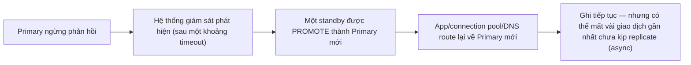
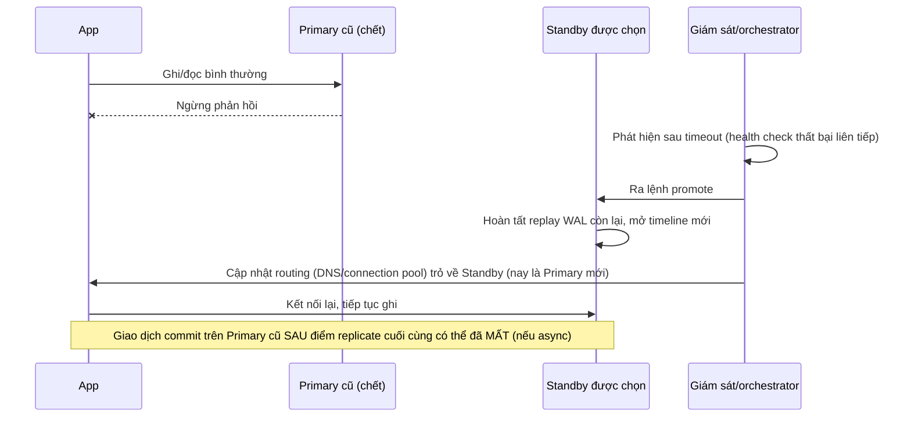
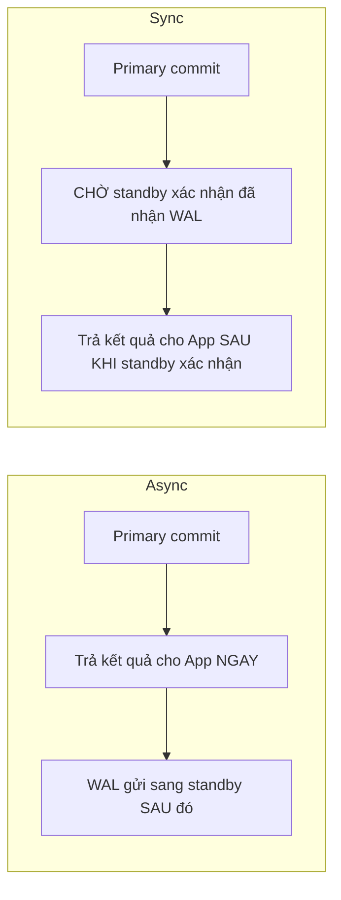

# 04 — Failover, Promotion và HA Trade-offs

## 🎯 Mục tiêu học

Sau file này, bạn phải hiểu HA không phải "công tắc an toàn miễn phí" — mỗi lựa chọn (sync/async, timeout promotion, retry policy) đều đánh đổi giữa durability, write latency, và độ phức tạp app phải xử lý sau khi failover xảy ra.

## 📋 Mục lục

- [Mental model](#mental-model)
- [What actually happens: failover/promotion là gì](#what-actually-happens-failoverpromotion-là-gì)
- [Diagram: failover sequence](#diagram-failover-sequence)
- [RPO/RTO ở mức thực chiến](#rporto-ở-mức-thực-chiến)
- [Sync vs async replication trade-off](#sync-vs-async-replication-trade-off)
- [Diagram: async vs sync flow](#diagram-async-vs-sync-flow)
- [Bảng: HA choice/pattern → benefit → cost → where it hurts](#bảng-ha-choicepattern--benefit--cost--where-it-hurts)
- [Failover-safe application behavior](#failover-safe-application-behavior)
- [Ví dụ thực tế](#ví-dụ-thực-tế)
- [Failure modes](#failure-modes)
- [Debugging hints](#debugging-hints)
- [Safe HA/DR patterns](#safe-hadr-patterns)
- [Interview lens](#interview-lens)
- [Mini scenarios](#mini-scenarios)
- [Key takeaways](#key-takeaways)
- [Why this matters in production](#why-this-matters-in-production)
- [Xem tiếp / Liên kết liên quan](#xem-tiếp--liên-kết-liên-quan)

## Mental model



❌ "HA là công tắc an toàn miễn phí" — sai vì mỗi bước trong sơ đồ trên đều có chi phí: thời gian phát hiện (không tức thời), khả năng mất dữ liệu (tùy sync/async), và app phải tự xử lý việc route lại + retry an toàn.

## What actually happens: failover/promotion là gì

**Promotion** là hành động chuyển một standby từ chế độ "chỉ đọc, đang replay WAL" sang chế độ "primary — chấp nhận ghi mới, không còn replay từ node khác nữa". Về bản chất kỹ thuật:

1. Standby dừng chờ WAL mới từ primary cũ.
2. Standby hoàn tất replay toàn bộ WAL đã nhận được (tới điểm cuối cùng nó có).
3. Standby mở một **timeline mới** (PostgreSQL đánh số timeline để phân biệt "lịch sử" trước và sau mỗi lần promotion) và bắt đầu chấp nhận ghi.

**Failover** là quy trình vận hành tổng thể bao quanh promotion: phát hiện primary chết → chọn standby nào để promote → thực hiện promotion → cập nhật routing (DNS, connection pool, service discovery) để app kết nối tới primary mới.

## Diagram: failover sequence



## RPO/RTO ở mức thực chiến

- **RPO (Recovery Point Objective)** — "chấp nhận mất tối đa bao nhiêu dữ liệu (tính theo thời gian) khi có sự cố". Với async replication, RPO thực tế = lag replay tại thời điểm primary chết (có thể vài trăm mili-giây tới vài giây, hoặc hơn nếu đang có lag bất thường).
- **RTO (Recovery Time Objective)** — "chấp nhận hệ thống ngừng phục vụ ghi tối đa bao lâu". RTO thực tế = thời gian phát hiện sự cố + thời gian promotion + thời gian cập nhật routing — không phải tức thời, và mỗi bước đều có chi phí thời gian riêng cần đo đạc thực tế (không giả định).

📌 RPO và RTO không phải khái niệm trừu tượng để ghi trong tài liệu — chúng là **con số cụ thể phải đo được** bằng cách diễn tập failover thật (xem phần Safe HA/DR patterns).

## Sync vs async replication trade-off

```sql
-- Async (mặc định): primary commit ngay khi WAL fsync cục bộ, KHÔNG chờ standby xác nhận
-- Write latency thấp, nhưng RPO > 0 nếu primary chết trước khi standby kịp nhận WAL này

-- Sync: primary commit CHỜ standby xác nhận đã nhận (hoặc flush/replay tùy synchronous_commit level)
ALTER SYSTEM SET synchronous_standby_names = 'standby_1';
ALTER SYSTEM SET synchronous_commit = 'on'; -- chờ standby ghi WAL (write), chưa chắc chờ replay xong
-- Write latency tăng thêm đúng bằng round-trip network + thời gian standby xác nhận
```

## Diagram: async vs sync flow



## Bảng: HA choice/pattern → benefit → cost → where it hurts

| HA choice/pattern | Benefit | Cost | Where it hurts |
|---|---|---|---|
| Async replication (mặc định) | Write latency thấp, không phụ thuộc tình trạng mạng tới standby | RPO > 0 — có thể mất vài giao dịch gần nhất khi failover | Giao dịch tài chính nhạy cảm (`payments`) mất dữ liệu dù hiếm khi xảy ra vẫn là rủi ro nghiêm trọng |
| Synchronous replication (1 standby) | RPO ~ 0 cho standby đó — dữ liệu đã commit chắc chắn có mặt ở standby trước khi trả kết quả | Write latency tăng theo round-trip mạng; nếu standby đó chết, ghi có thể bị chặn (tùy cấu hình) | Ứng dụng cần latency ghi thấp/ổn định sẽ chịu ảnh hưởng trực tiếp, đặc biệt dưới tải cao |
| Quorum synchronous (nhiều standby, chờ N trong M) | Cân bằng giữa durability và không phụ thuộc 1 standby duy nhất | Cấu hình phức tạp hơn, vẫn tăng latency dù ít hơn sync 1-standby thuần | Cần đủ số lượng standby khỏe mạnh — giảm xuống dưới quorum sẽ chặn ghi hoặc rơi về hành vi async tùy cấu hình |
| Automatic failover (orchestrator tự động promote) | RTO thấp hơn, không cần con người can thiệp | Rủi ro promote nhầm do false positive (network partition ngắn hạn bị hiểu nhầm là primary chết) | Split-brain nếu orchestrator và ứng dụng không đồng thuận primary nào là "thật" |
| Manual failover (con người quyết định promote) | Giảm rủi ro promote nhầm | RTO cao hơn (phụ thuộc thời gian phản ứng con người) | Không phù hợp cho SLA yêu cầu RTO rất thấp |

## Failover-safe application behavior

📌 Failover không phải "chuyện của infra" — app buộc phải xử lý đúng các tình huống sau:

- **Stale connection**: connection pool có thể vẫn giữ kết nối tới primary cũ (đã chết hoặc đã trở thành standby) sau failover — cần cấu hình timeout/health-check ở tầng pool để loại bỏ kết nối cũ nhanh, không phải chờ TCP timeout mặc định (có thể rất lâu).
- **Retry sau failover có thể gây duplicate side-effect**: nếu request ghi đang "treo" đúng lúc failover xảy ra, app không biết chắc request đó đã commit trên primary cũ hay chưa trước khi nó chết — retry mù quáng có thể ghi trùng nếu thao tác không idempotent.
- **Old primary có thể quay lại (nếu không xử lý đúng)**: nếu primary cũ khởi động lại sau sự cố mạng tạm thời mà chưa được cấu hình lại thành standby của primary mới, nó có thể tiếp tục nhận ghi độc lập — dẫn tới **split-brain** (2 node cùng nhận ghi, dữ liệu phân kỳ không thể tự động hợp nhất).

## Ví dụ thực tế

**Case 1 — async failover mất một ít recent writes:**

```sql
-- t0: Primary commit thành công, trả 200 OK cho app
INSERT INTO payments (order_id, status, provider_ref) VALUES (789, 'succeeded', 'ch_abc123');
-- t0+50ms: Primary sập trước khi WAL của INSERT này kịp gửi sang standby
-- -> Sau failover, standby (nay là primary mới) KHÔNG có dòng payments này
-- -> App đã báo "thanh toán thành công" cho user nhưng dữ liệu đã mất trên primary mới
```

Hướng giảm thiểu: với giao dịch cực nhạy cảm (`payments`), cân nhắc synchronous replication cho riêng luồng này, hoặc thiết kế reconciliation với payment provider (webhook xác nhận lại) để phát hiện và bù đắp trường hợp mất dữ liệu hiếm gặp này.

**Case 2 — sync replication tăng write latency:**

```sql
-- Bật synchronous_commit cho toàn bộ traffic ghi
-- Mọi INSERT/UPDATE/DELETE giờ chờ thêm round-trip network + xác nhận từ standby
-- Dưới tải cao, tổng write latency tăng đáng kể, có thể ảnh hưởng throughput toàn hệ thống
-- nếu round-trip network primary<->standby không ổn định
```

**Case 3 — app retry sau failover gây duplicate side-effect nếu không idempotent:**

```sql
-- App gửi request "trừ 1 đơn vị tồn kho" đúng lúc failover xảy ra, không rõ đã ghi thành công chưa
UPDATE products SET stock = stock - 1 WHERE id = 55; -- KHÔNG idempotent, retry mù = trừ kho 2 lần

-- Thiết kế idempotent hơn: dùng idempotency key, kiểm tra đã xử lý chưa trước khi trừ
UPDATE products SET stock = stock - 1
WHERE id = 55 AND NOT EXISTS (
  SELECT 1 FROM processed_requests WHERE idempotency_key = 'req-xyz'
);
INSERT INTO processed_requests (idempotency_key) VALUES ('req-xyz') ON CONFLICT DO NOTHING;
```

## Failure modes

- 🔴 **Assume failover is transparent**: nghĩ app không cần thay đổi gì, connection pool/driver sẽ "tự động" xử lý mọi thứ mượt mà.
- 🔴 **Ignore retry/idempotency after promotion**: retry request ghi sau failover mà không kiểm tra idempotency, gây duplicate side-effect (trừ kho 2 lần, gửi email 2 lần).
- 🔴 **Synchronous replication everywhere without latency budget**: bật sync cho toàn bộ traffic mà không đánh giá write latency budget thực tế của ứng dụng, gây regression hiệu năng diện rộng.
- 🔴 **Replica promotion plan chưa từng diễn tập**: RPO/RTO chỉ là số lý thuyết trên giấy, chưa từng đo bằng diễn tập failover thật — khi sự cố thật xảy ra, thời gian phục hồi thực tế thường lâu hơn nhiều so với con số kỳ vọng.

## Debugging hints

- Sau bất kỳ sự kiện failover nào (kể cả diễn tập), kiểm tra `pg_stat_replication`/log trên primary mới để xác nhận không có node nào khác vẫn đang cố ghi độc lập (dấu hiệu split-brain).
- Đo RTO thực tế bằng cách ghi lại đúng 3 mốc thời gian: lúc primary ngừng phản hồi, lúc promotion hoàn tất, lúc app bắt đầu ghi thành công trở lại.
- Rà soát log ứng dụng quanh thời điểm failover để tìm các request bị timeout/retry — đây là nơi dễ phát hiện duplicate side-effect nhất.

## Safe HA/DR patterns

- ✅ Diễn tập failover định kỳ (không chỉ đọc tài liệu) để có con số RPO/RTO thực tế, không phải con số lý thuyết.
- ✅ Thiết kế idempotency key cho mọi thao tác ghi quan trọng, đặc biệt các thao tác có thể bị retry sau sự cố.
- ✅ Cấu hình timeout kết nối/health-check tầng connection pool đủ ngắn để loại bỏ kết nối tới node cũ nhanh sau failover.
- ✅ Với dữ liệu cực nhạy cảm với mất mát, cân nhắc synchronous replication có mục tiêu (không phải toàn hệ thống) kèm đánh giá latency budget rõ ràng.
- ❌ Không để primary cũ có khả năng tự khởi động lại như một primary độc lập mà chưa qua bước cấu hình lại thành standby (STONITH/fencing hoặc cơ chế tương đương để tránh split-brain).

## Interview lens

**Interviewer thường hỏi**: "Sync replication luôn an toàn hơn async, vậy sao không dùng sync cho mọi thứ?"

- ❌ Câu trả lời yếu: "Sync chậm hơn nên người ta ít dùng."
- ✅ Câu trả lời mạnh: Sync replication đổi write latency (chờ standby xác nhận mỗi lần commit) lấy RPO gần 0 cho standby đó — đây là trade-off có ý nghĩa cho dữ liệu cực nhạy cảm (giao dịch tài chính), nhưng áp dụng cho toàn bộ traffic sẽ tăng latency ghi hệ thống, đặc biệt nhạy với chất lượng mạng giữa các node. HA không phải "chọn cái an toàn nhất luôn đúng" — phải cân bằng với latency budget thực tế và mức độ nhạy cảm dữ liệu, đồng thời app vẫn phải tự xử lý retry/idempotency vì không loại HA nào loại bỏ hoàn toàn khả năng mất dữ liệu hoặc trùng lặp thao tác khi failover xảy ra.

## Mini scenarios

1. **Team dùng async replication cho toàn hệ thống, kể cả bảng `payments`** — sau một lần failover thật, phát hiện mất 2 giao dịch thanh toán đã báo thành công cho user nhưng không có trên primary mới; phải dựa vào webhook đối soát với payment provider để phát hiện và bù đắp thủ công.
2. **Orchestrator tự động promote sau 5 giây mất kết nối** — một lần network partition ngắn (do bảo trì switch mạng) khiến orchestrator promote nhầm trong khi primary cũ vẫn sống, gây split-brain trong vài phút cho tới khi phát hiện và fencing thủ công.
3. **App retry request ghi 3 lần liên tiếp ngay sau failover vì timeout**, thao tác trừ kho không có idempotency key — dẫn tới trừ kho 3 lần cho 1 đơn hàng, phải hoàn tác thủ công sau sự cố.

## Key takeaways

- 🧠 Failover = phát hiện + promotion + re-routing — mỗi bước có chi phí thời gian thật, RTO không phải con số lý thuyết cho tới khi được diễn tập đo đạc.
- 🧠 Async replication có RPO > 0 luôn tồn tại; sync replication giảm RPO nhưng tăng write latency — không có lựa chọn nào miễn phí.
- 🧠 App phải tự xử lý stale connection, retry-idempotency, và khả năng primary cũ "sống lại" gây split-brain — HA không phải chuyện thuần infra.
- 🧠 RPO/RTO chỉ có ý nghĩa khi được đo bằng diễn tập thật, không phải ghi trong tài liệu rồi không kiểm chứng.

## Why this matters in production

Sự cố failover thật luôn xảy ra vào thời điểm tệ nhất, và đây chính xác là lúc mọi giả định chưa kiểm chứng (RTO lý thuyết, "driver tự động xử lý được", "retry chắc không sao") bị phơi bày. Backend engineer hiểu đúng trade-off HA sẽ thiết kế idempotency và retry policy **trước khi** cần tới, thay vì phát hiện lỗ hổng ngay giữa một sự cố production thật.

## Xem tiếp / Liên kết liên quan

- ➡️ [`05-backup-base-backup-and-point-in-time-recovery.md`](05-backup-base-backup-and-point-in-time-recovery.md) — HA không thay thế backup; điều gì xảy ra khi lỗi đã replicate.
- 🔗 [`03-read-replicas-consistency-and-routing.md`](03-read-replicas-consistency-and-routing.md) — routing đọc/ghi cần điều chỉnh gì sau failover.
- 🔗 [`04-concurrency-and-locking/05-upserts-race-conditions-and-safe-concurrency-patterns.md`](../04-concurrency-and-locking/05-upserts-race-conditions-and-safe-concurrency-patterns.md) — idempotency pattern áp dụng trực tiếp cho retry sau failover.
- ⬅️ [README phase này](README.md)
