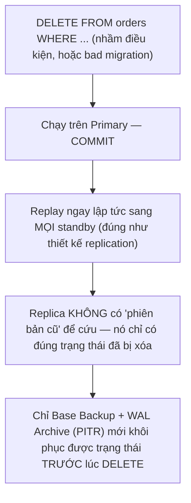
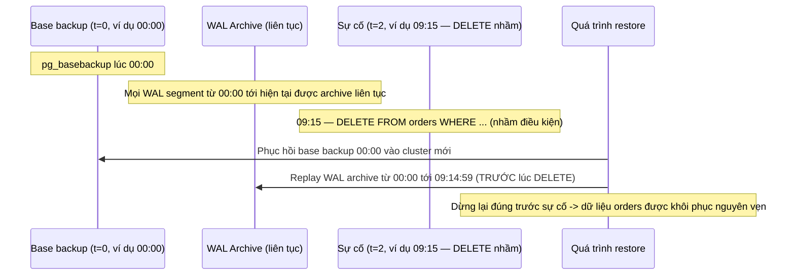
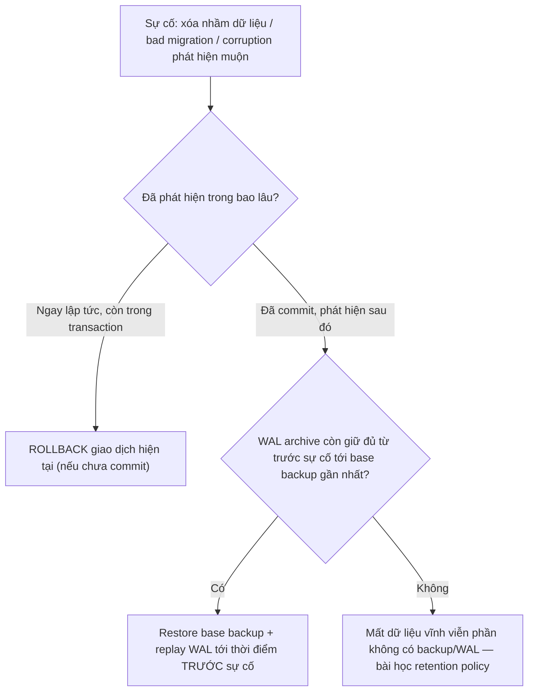

# 05 — Backup, Base Backup và Point-in-Time Recovery

## 🎯 Mục tiêu học

Đây là file dễ gây nhầm lẫn nguy hiểm nhất trong toàn phase. Sau file này, bạn phải khắc cốt ghi tâm một câu: **replication sao chép cả lỗi**, chỉ backup + PITR mới cứu được dữ liệu khi chính lỗi đó (xóa nhầm, migration hỏng) đã xảy ra và lan tới mọi node.

## 📋 Mục lục

- [Mental model](#mental-model)
- [Replication is not backup](#replication-is-not-backup)
- [What actually happens: base backup + WAL archive](#what-actually-happens-base-backup--wal-archive)
- [Diagram: PITR timeline](#diagram-pitr-timeline)
- [Bảng: mechanism → protects against → does NOT protect against → cost/operational duty](#bảng-mechanism--protects-against--does-not-protect-against--costoperational-duty)
- [Diagram: backup/restore decision flow](#diagram-backuprestore-decision-flow)
- [PITR is only real if restore is practiced](#pitr-is-only-real-if-restore-is-practiced)
- [Ví dụ thực tế](#ví-dụ-thực-tế)
- [Backup strategy is part of system design](#backup-strategy-is-part-of-system-design)
- [Failure modes](#failure-modes)
- [Debugging hints](#debugging-hints)
- [Safe HA/DR patterns](#safe-hadr-patterns)
- [Interview lens](#interview-lens)
- [Mini scenarios](#mini-scenarios)
- [Key takeaways](#key-takeaways)
- [Why this matters in production](#why-this-matters-in-production)
- [Xem tiếp / Liên kết liên quan](#xem-tiếp--liên-kết-liên-quan)

## Mental model



## Replication is not backup

📌 Đây là hiểu lầm nguy hiểm nhất trong toàn bộ phase. Lý do gốc rễ đã học ở file 01: replication chỉ **replay lại đúng những gì primary đã làm**, không phân biệt "thay đổi đúng" hay "thay đổi sai". Nếu điều gì đó sai xảy ra trên primary (xóa nhầm bảng, migration hỏng, ứng dụng ghi dữ liệu bậy do bug), replication sẽ **trung thực** lan truyền đúng lỗi đó sang mọi standby trong vài mili-giây tới vài giây.

| | Replication (HA) | Backup + PITR (DR) |
|---|---|---|
| Mục đích | Tiếp tục phục vụ nhanh khi primary chết | Khôi phục về một thời điểm trước khi có lỗi |
| Bảo vệ khỏi | Node/hardware failure | Lỗi logic, xóa nhầm, migration hỏng, corruption phát hiện muộn |
| Có "phiên bản cũ" không | ❌ Không — luôn là trạng thái mới nhất đã replay | ✅ Có — WAL archive cho phép tua về bất kỳ thời điểm nào đã lưu |
| Thời gian phục hồi | Giây tới phút (failover) | Phút tới giờ (restore base backup + replay WAL tới điểm cần) |

## What actually happens: base backup + WAL archive

**Base backup** là một bản sao vật lý đầy đủ của toàn bộ cluster tại một thời điểm (`pg_basebackup`, hoặc snapshot filesystem/volume tương đương) — về bản chất là "điểm khởi đầu" để từ đó có thể replay WAL tiếp tục.

**WAL archive** là cơ chế lưu trữ liên tục mọi WAL segment đã sinh ra (qua `archive_command`) vào một nơi bền vững (object storage, disk riêng) — đây chính là "cuốn nhật ký thay đổi" cho phép tua tiếp từ base backup tới bất kỳ thời điểm nào sau đó.

**PITR (Point-in-Time Recovery)** kết hợp cả hai: phục hồi base backup, sau đó **replay WAL archive** (dùng đúng cơ chế redo đã học ở phase 2 và dùng lại cho replication ở file 01) cho tới một mốc **do bạn chỉ định** (thời gian cụ thể, hoặc một LSN cụ thể, hoặc một "recovery target" khác) — không nhất thiết phải replay tới hết.

## Diagram: PITR timeline



## Bảng: mechanism → protects against → does NOT protect against → cost/operational duty

| Mechanism | Protects against | Does NOT protect against | Cost/operational duty |
|---|---|---|---|
| Streaming replication (HA) | Node/hardware failure, giảm downtime khi primary chết | Lỗi logic đã commit (DELETE nhầm, migration hỏng) — lan truyền y hệt sang mọi standby | Cần giám sát lag liên tục (file 02); không giảm bớt nhu cầu backup |
| Base backup (định kỳ, ví dụ hàng ngày) | Mất mát nếu chỉ dùng riêng — cần kết hợp WAL archive để không mất dữ liệu giữa 2 lần backup | Không đủ để khôi phục chính xác một thời điểm giữa 2 lần backup nếu thiếu WAL archive | Chi phí lưu trữ tăng theo tần suất backup; cần kiểm tra backup không bị hỏng |
| WAL archive liên tục | Cho phép PITR tới bất kỳ thời điểm nào sau base backup gần nhất | Không tự nó là "backup đầy đủ" — vẫn cần base backup làm điểm khởi đầu | Chi phí lưu trữ tăng liên tục theo lượng ghi; cần retention policy rõ ràng (giữ bao lâu) |
| PITR (base backup + WAL archive + recovery target) | Khôi phục chính xác trạng thái trước một sự cố logic cụ thể | Không cứu được nếu lỗi đã tồn tại **từ trước** điểm backup xa nhất còn giữ, hoặc WAL cần thiết đã bị xóa theo retention | Cần restore testing định kỳ để đảm bảo quy trình thực sự hoạt động khi cần |

## Diagram: backup/restore decision flow



## PITR is only real if restore is practiced

📌 Một cấu hình `archive_command` chạy đúng và base backup chạy đều đặn theo lịch **không đảm bảo** restore sẽ thành công khi cần — có rất nhiều điểm hỏng âm thầm: quyền truy cập object storage hết hạn, `archive_command` âm thầm thất bại nhiều ngày mà không ai để ý, base backup bị hỏng giữa chừng, hoặc quy trình restore chưa từng được viết ra rõ ràng nên không ai biết chạy lệnh nào khi sự cố thật xảy ra. **Restore testing định kỳ** (thực sự phục hồi ra một cluster thử nghiệm và xác minh dữ liệu đúng) là bước bắt buộc, không phải tùy chọn.

## Ví dụ thực tế

**Case 1 — DELETE nhầm điều kiện trên `orders`:**

```sql
-- Sự cố lúc 09:15: nhân viên vận hành chạy nhầm, thiếu điều kiện WHERE chính xác
DELETE FROM orders WHERE created_at < '2026-01-01'; -- lẽ ra phải thêm AND status = 'cancelled'
-- Hậu quả: xóa luôn nhiều đơn hàng hợp lệ đã hoàn tất trước 2026-01-01
-- Replication đã lan sự cố này sang mọi standby trong vài giây

-- Hướng khôi phục: restore base backup gần nhất TRƯỚC 09:15, replay WAL archive
-- tới đúng 09:14:59, dùng recovery_target_time
```

```ini
# postgresql.conf hoặc recovery config tương đương (tùy phiên bản)
restore_command = 'cp /wal_archive/%f %p'
recovery_target_time = '2026-09-15 09:14:59+07'
recovery_target_action = 'promote'
```

**Case 2 — "replication không cứu được vì lỗi đã replicate":**

Nếu team chỉ có HA (replica) mà không có base backup/WAL archive riêng biệt, sau sự cố DELETE nhầm ở Case 1: cả primary lẫn mọi replica đều đã mất đúng những dòng bị xóa — không có nơi nào trong toàn bộ hạ tầng còn giữ "phiên bản cũ" để lấy lại. Đây chính là lý do "có replica" không bao giờ là lý do để bỏ qua chiến lược backup.

**Case 3 — bad migration trên `activity_logs`/schema:**

```sql
-- Migration hỏng chạy ALTER TABLE + UPDATE hàng loạt sai logic, deploy nhầm lên production
ALTER TABLE activity_logs DROP COLUMN metadata; -- migration lẽ ra chỉ nên rename, không drop
-- Cột dữ liệu JSONB quan trọng bị mất vĩnh viễn trên mọi node đã replicate
-- Khôi phục: PITR về thời điểm ngay trước khi migration này chạy
```

## Backup strategy is part of system design

📌 Backup/PITR không phải một dòng cấu hình thêm vào sau khi hệ thống đã chạy — retention policy (giữ bao lâu), tần suất base backup, và recovery objective (RPO/RTO cho **disaster recovery**, khác với RPO/RTO của HA ở file 04) phải được quyết định **cùng lúc** với thiết kế hệ thống, đặc biệt khi bảng đã partition (liên hệ [`06-partitioning-and-large-tables/04-`](../06-partitioning-and-large-tables/04-retention-archival-and-drop-partition-patterns.md)): partition đã `DROP` theo retention lifecycle sẽ **không thể** khôi phục qua PITR nếu backup/WAL archive tại thời điểm đó cũng đã bị dọn theo policy riêng của backup — hai retention policy này (data lifecycle và backup lifecycle) cần được thiết kế nhất quán với nhau, không mặc định trùng khớp.

## Failure modes

- 🔴 **Có replica nên không làm backup tử tế**: hiểu lầm nguy hiểm nhất — bỏ qua hoàn toàn vì nghĩ "đã có standby là an toàn rồi".
- 🔴 **Backup có nhưng chưa từng restore test**: phát hiện quy trình restore bị hỏng đúng lúc cần dùng thật, không còn thời gian sửa.
- 🔴 **Không giữ đủ WAL cho PITR objective**: retention WAL archive ngắn hơn khoảng thời gian cần để phát hiện sự cố (một số lỗi logic chỉ được phát hiện sau vài ngày/tuần), khiến PITR không thể tua về đúng điểm cần.
- 🔴 **Chỉ nghĩ backup file là xong mà không nghĩ recovery objective**: có file backup nằm đó nhưng không rõ RPO/RTO thực tế của quy trình restore là bao nhiêu, không biết mất bao lâu để phục hồi khi cần thật.

## Debugging hints

- Kiểm tra `archive_command` có đang thành công liên tục không — thất bại âm thầm nhiều ngày là kiểu lỗi phổ biến nhất và nguy hiểm nhất (`pg_stat_archiver` cho biết lần archive thành công/thất bại gần nhất).
- Xác minh retention WAL archive thực tế đủ dài cho khoảng thời gian "phát hiện sự cố" thực tế của tổ chức (không phải giả định lý thuyết).
- Khi restore test, đo cả thời gian phục hồi (RTO thực tế) lẫn tính đúng đắn của dữ liệu sau phục hồi (đối chiếu vài bản ghi mẫu đã biết trước).

## Safe HA/DR patterns

- ✅ Luôn duy trì base backup định kỳ + WAL archive liên tục **độc lập** với chiến lược HA (replica) — hai mục đích khác nhau, không thay thế nhau.
- ✅ Restore test định kỳ (ví dụ hàng quý) ra một cluster thử nghiệm, xác minh dữ liệu đúng và đo thời gian phục hồi thực tế.
- ✅ Thiết kế retention WAL archive dài hơn thời gian phát hiện sự cố trung bình của tổ chức, không chỉ dài hơn chu kỳ base backup.
- ✅ Đồng bộ retention policy giữa data lifecycle (partition drop) và backup lifecycle để tránh tình huống "muốn PITR về thời điểm đã hết backup".
- ❌ Không coi HA (replica) là một hình thức backup dưới bất kỳ góc độ nào.

## Interview lens

**Interviewer thường hỏi**: "Hệ thống có 2 read-replica, có cần backup riêng không?"

- ❌ Câu trả lời yếu: "Không cần, đã có 2 bản sao rồi."
- ✅ Câu trả lời mạnh: Có — replica chỉ bảo vệ khỏi node/hardware failure (HA), không bảo vệ khỏi lỗi logic đã commit (xóa nhầm, migration hỏng, corruption dữ liệu do bug ứng dụng), vì replication replay lại **đúng mọi thay đổi**, kể cả thay đổi sai, sang mọi standby gần như tức thời. Chỉ base backup kết hợp WAL archive (PITR) mới cho phép tua về một thời điểm trước sự cố. Và quan trọng không kém: cấu hình backup đúng chỉ có giá trị thực sự nếu quy trình restore đã được diễn tập và kiểm chứng — nếu không, đó chỉ là "backup trên giấy".

## Mini scenarios

1. **Nhân viên vận hành chạy nhầm `DELETE` thiếu điều kiện trên `orders`** — replica không cứu được (đã replicate lỗi); team dùng PITR restore base backup + replay WAL tới đúng trước thời điểm sự cố, khôi phục thành công vì retention WAL archive đủ dài và đã từng restore test trước đó.
2. **Team phát hiện sau 3 tháng rằng WAL archive retention chỉ giữ 7 ngày** — một sự cố dữ liệu xảy ra cách đây 10 ngày (phát hiện muộn qua báo cáo tài chính) không thể khôi phục qua PITR vì WAL cần thiết đã bị dọn theo policy.
3. **Đội hạ tầng tự tin báo cáo "backup daily, không lo gì"**, nhưng chưa từng restore thử — khi sự cố thật xảy ra, phát hiện `archive_command` đã âm thầm thất bại 2 tuần do quyền truy cập object storage hết hạn, WAL archive có một khoảng trống lớn không thể lấp.

## Key takeaways

- 📦 Replication (HA) và Backup/PITR (DR) giải quyết hai vấn đề khác nhau hoàn toàn — không loại nào thay thế loại kia.
- 📦 Replication replay lại cả lỗi — không có "phiên bản cũ" nào còn tồn tại trên bất kỳ standby nào sau khi lỗi đã commit và replicate.
- 📦 PITR = base backup + WAL archive + recovery target — chỉ hoạt động nếu WAL archive đủ dài và không có khoảng trống (archive_command chạy đúng liên tục).
- 📦 Backup chỉ thực sự "xong" khi quy trình restore đã được diễn tập và đo đạc — file backup nằm im không kiểm chứng là rủi ro tiềm ẩn.
- 📦 Retention policy của backup/WAL archive cần thiết kế nhất quán với retention policy của data lifecycle (partition drop) để tránh mất khả năng PITR đúng lúc cần.

## Why this matters in production

Sự cố dữ liệu nghiêm trọng nhất trong thực tế thường không phải "hardware chết" (đã có HA lo) mà là "con người hoặc code làm sai điều gì đó đã commit" — và đây chính xác là lúc HA hoàn toàn bất lực còn backup/PITR là tuyến phòng thủ duy nhất. Team nào chỉ đầu tư vào HA mà bỏ qua backup/PITR (hoặc có backup nhưng chưa test restore) đang mang một rủi ro tồn tại âm thầm cho tới ngày nó bộc lộ theo cách tệ nhất có thể.

## Xem tiếp / Liên kết liên quan

- 🔗 [`01-streaming-replication-and-wal-shipping.md`](01-streaming-replication-and-wal-shipping.md) — vì sao replication replay lại mọi thứ, kể cả lỗi.
- 🔗 [`06-partitioning-and-large-tables/04-retention-archival-and-drop-partition-patterns.md`](../06-partitioning-and-large-tables/04-retention-archival-and-drop-partition-patterns.md) — đồng bộ retention data lifecycle với retention backup/WAL.
- 🔗 [`01-storage-and-mvcc/04-wal-checkpoints-crash-recovery.md`](../01-storage-and-mvcc/04-wal-checkpoints-crash-recovery.md) — cơ chế redo nền tảng mà PITR tái sử dụng.
- ⬅️ [`04-failover-promotion-and-ha-trade-offs.md`](04-failover-promotion-and-ha-trade-offs.md)
- ⬅️ [README phase này](README.md)
- ➡️ Phase tiếp theo: `08-connection-management/` — sẽ mở rộng ở phần sau.
