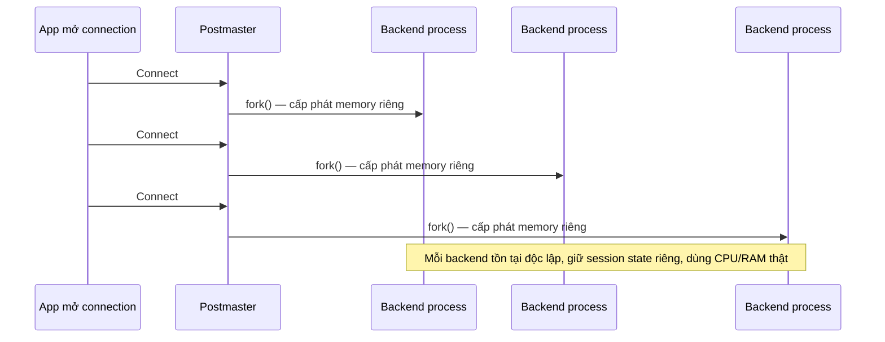
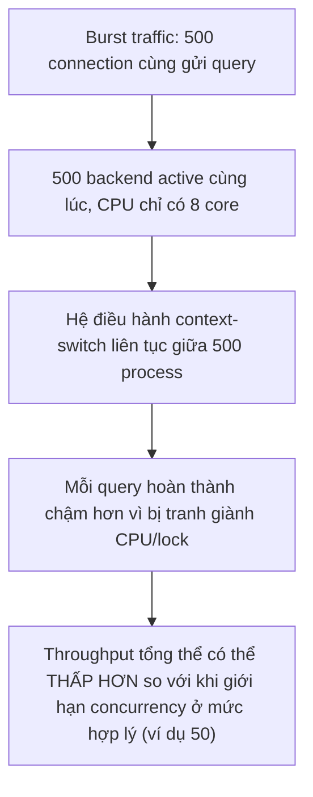

# 01 — Vì Sao Connection Trong PostgreSQL Đắt Đỏ

## 🎯 Mục tiêu học

Sau file này, bạn phải bỏ hẳn suy nghĩ "connection chỉ là một socket TCP, mở/đóng vô tư" và thay bằng: mỗi connection PostgreSQL là một **OS process riêng biệt**, mang theo chi phí bộ nhớ và CPU thật, và số lượng connection cao không tự động đồng nghĩa throughput cao — có thể ngược lại.

## 📋 Mục lục

- [Mental model](#mental-model)
- [What actually happens: backend-per-connection model](#what-actually-happens-backend-per-connection-model)
- [Diagram: backend-per-connection](#diagram-backend-per-connection)
- [Open connections are not free](#open-connections-are-not-free)
- [Vì sao quá nhiều connection có thể làm database chậm hơn](#vì-sao-quá-nhiều-connection-có-thể-làm-database-chậm-hơn)
- [Diagram: too-many-backends → contention](#diagram-too-many-backends--contention)
- [Vì sao max_connections không phải chiến lược scale](#vì-sao-maxconnections-không-phải-chiến-lược-scale)
- [Bảng: symptom → naive interpretation → what is actually happening](#bảng-symptom--naive-interpretation--what-is-actually-happening)
- [Trade-offs](#trade-offs)
- [Failure modes](#failure-modes)
- [Debugging hints](#debugging-hints)
- [Safe pooling patterns](#safe-pooling-patterns)
- [Interview lens](#interview-lens)
- [Mini scenarios](#mini-scenarios)
- [Key takeaways](#key-takeaways)
- [Why this matters in production](#why-this-matters-in-production)
- [Xem tiếp / Liên kết liên quan](#xem-tiếp--liên-kết-liên-quan)

## Mental model

📌 Đây là điểm khác biệt lớn với mô hình "thread-per-connection" nhẹ hơn ở một số hệ quản trị khác: PostgreSQL dùng **process-per-connection**, mỗi connection mới là một lần `fork()` process, không phải chỉ tạo một object nhẹ trong cùng một process.

## What actually happens: backend-per-connection model

Khi client kết nối, tiến trình `postmaster` (tiến trình cha) **fork** ra một backend process con dành riêng cho connection đó. Backend process này:

- Có bộ nhớ riêng cho catalog cache (metadata bảng/index đã dùng), session state (`SET` variables, prepared statement, temp table), và không gian làm việc (`work_mem` khi cần sort/hash).
- Tồn tại **suốt vòng đời connection** — không tái sử dụng cho request khác trừ khi có pooling ở tầng ứng dụng/proxy.
- Bị hệ điều hành phải context-switch giữa hàng trăm/nghìn process này khi CPU giới hạn — chi phí context-switch tăng phi tuyến khi số lượng process runnable tăng.

## Diagram: backend-per-connection

## Open connections are not free

Ngay cả khi một connection **hoàn toàn idle** (không chạy query gì), backend process của nó vẫn:

- Chiếm một phần bộ nhớ cố định (catalog cache đã load, cấu trúc session).
- Được đếm vào giới hạn `max_connections`, chiếm một "chỗ" mà connection khác đang cần có thể phải chờ hoặc bị từ chối.
- Vẫn cần được hệ điều hành theo dõi (file descriptor, process table entry) dù không làm gì.

📌 Đây là lý do "mở một connection mỗi request rồi đóng ngay" (connection churn) tốn kém hơn nhiều so với cảm giác trực quan — chi phí `fork()` + cấp phát memory + thiết lập session mỗi lần đều là chi phí CPU thật, lặp lại liên tục thay vì trả một lần.

## Vì sao quá nhiều connection có thể làm database chậm hơn

Khi số lượng backend **active** (đang thực sự chạy query, không phải idle) vượt quá số CPU core khả dụng, các backend này cạnh tranh CPU qua context-switching — tổng throughput có thể **giảm** thay vì tăng, vì:

- Chi phí context-switch giữa các backend tăng lên.
- Contention trên các cấu trúc dùng chung (ví dụ lock nội bộ của buffer pool, spinlock trên các cấu trúc chia sẻ) tăng khi có nhiều backend cùng tranh chấp.
- Nếu nhiều backend cùng cần cùng loại tài nguyên (ví dụ cùng index đang bị lock ghi), số lượng backend cao chỉ khiến hàng đợi chờ lock dài hơn, không giúp việc nào xong nhanh hơn.

## Diagram: too-many-backends → contention

## Vì sao max_connections không phải chiến lược scale

Tăng `max_connections` chỉ tăng **giới hạn số connection được phép mở**, nó **không** tăng số CPU core, không tăng dung lượng RAM, không tăng tốc độ đĩa. Nếu nguyên nhân gốc là burst traffic vượt khả năng CPU xử lý đồng thời, tăng `max_connections` chỉ cho phép **nhiều backend hơn cùng cạnh tranh tài nguyên hữu hạn đó** — dẫn tới đúng tình huống ở phần trên: throughput có thể giảm, không tăng.

## Bảng: symptom → naive interpretation → what is actually happening

| Symptom | Naive interpretation | What is actually happening |
|---|---|---|
| Lỗi `FATAL: too many connections` | "Cần tăng `max_connections` ngay" | Có thể là connection churn (mở/đóng liên tục, không tái sử dụng) hoặc thiếu pooling — tăng giới hạn chỉ trì hoãn vấn đề, không giải quyết gốc rễ |
| Database chậm hẳn khi traffic tăng dù server "còn RAM" | "Cần nhiều RAM/CPU hơn" | Có thể đơn giản là quá nhiều backend active cùng lúc gây context-switch/lock contention — thêm concurrency limit hợp lý (qua pooling) có thể nhanh hơn thêm phần cứng |
| Có 1000 connection mở nhưng chỉ 20 đang thực sự chạy query | "Hệ thống đang tải nặng, cần scale" | 980 connection đang **idle** — chi phí bộ nhớ vẫn tồn tại dù không làm gì; vấn đề là quản lý vòng đời connection ở tầng app/pool, không phải tải DB thật |
| Tăng `max_connections` từ 100 lên 500 để "chữa" timeout | "Vấn đề đã được giải quyết vì không còn lỗi too-many-connections" | DB giờ có thể nhận 500 backend active cùng lúc — nếu traffic burst thật sự chạm mức đó, database sẽ chậm hơn trước, chỉ là lỗi hiển thị khác đi (timeout thay vì connection refused) |

## Trade-offs

| Lựa chọn | Lợi | Chi phí |
|---|---|---|
| `max_connections` thấp, dùng pooling | Kiểm soát tốt số backend active, tránh contention khi burst | Cần tầng pooling (thêm thành phần vận hành) |
| `max_connections` cao, không pooling | Đơn giản, không cần thêm hạ tầng | Dễ rơi vào tình huống burst traffic tạo quá nhiều backend active cùng lúc, throughput giảm |
| Giữ connection lâu dài (long-lived) từ app | Tránh chi phí `fork()` lặp lại mỗi request | Cần quản lý pool ở tầng app, và connection idle vẫn chiếm chỗ trong `max_connections` |

## Failure modes

- 🔴 **Tăng `max_connections` để chữa lỗi timeout**: che giấu triệu chứng, không giải quyết nguyên nhân gốc (thiếu pooling hoặc quá nhiều active backend).
- 🔴 **Mở connection mới cho mỗi request/job**: connection churn liên tục, chi phí `fork()` + thiết lập session lặp lại tốn CPU đáng kể ở tải cao.
- 🔴 **Giữ idle connection vô tội vạ** (ví dụ mỗi worker instance giữ một pool riêng không giới hạn): tổng số connection toàn hệ thống có thể vượt xa nhu cầu thực, chiếm chỗ `max_connections` một cách lãng phí.

## Debugging hints

- Phân biệt rõ tổng connection và connection **active**: `SELECT state, count(*) FROM pg_stat_activity GROUP BY state;` — cột `active` mới là backend đang thực sự dùng CPU/IO, `idle` chỉ chiếm chỗ.
- Khi nghi ngờ contention do quá nhiều active backend, theo dõi CPU load trung bình so với số CPU core thực tế của DB server — nếu load trung bình vượt xa số core, đó là dấu hiệu rõ ràng.
- Trước khi tăng `max_connections`, luôn hỏi: "connection đang mở này có đang làm việc gì không, hay đang idle chờ?"

## Safe pooling patterns

- ✅ Giới hạn số backend active đồng thời ở mức gần với số CPU core khả dụng của DB server (chi tiết công thức ở file 03), thay vì để `max_connections` là giới hạn duy nhất.
- ✅ Dùng pooling (PgBouncer hoặc pool ở tầng app) để tái sử dụng connection thay vì mở mới liên tục theo request.
- ✅ Theo dõi tỷ lệ idle/active connection thường xuyên, không chỉ tổng số connection.
- ❌ Không coi `max_connections` cao là "an toàn hơn" một cách mặc định — nó chỉ nâng trần cho phép nhiều backend cạnh tranh hơn.

## Interview lens

**Interviewer thường hỏi**: "Vì sao không tăng `max_connections` lên 2000 để tránh lỗi hết connection?"

- ❌ Câu trả lời yếu: "Vì tốn RAM."
- ✅ Câu trả lời mạnh: PostgreSQL dùng mô hình process-per-connection — mỗi connection là một OS process riêng với chi phí bộ nhớ/CPU thật, không phải một object nhẹ trong cùng process. Tăng `max_connections` chỉ nâng trần số backend được phép tồn tại, không tăng tài nguyên vật lý (CPU core, RAM, đĩa) để xử lý chúng. Nếu số backend **active** đồng thời vượt xa số CPU core, context-switch và lock contention tăng lên có thể khiến throughput tổng thể **giảm**, không tăng — đây là lý do connection pooling (giới hạn concurrency hợp lý) thường hiệu quả hơn việc chỉ nâng giới hạn connection.

## Mini scenarios

1. **API backend mở một connection mới cho mỗi HTTP request tới `orders/payments`, đóng ngay sau khi xong** — dưới traffic thấp không thấy vấn đề gì, nhưng khi traffic tăng gấp 10 lần, CPU DB server tăng vọt dù mỗi query đơn lẻ vẫn nhanh — nguyên nhân là chi phí `fork()`/thiết lập session lặp lại quá nhiều lần mỗi giây.
2. **Team tăng `max_connections` từ 200 lên 1000 sau khi gặp lỗi "too many connections" trong đợt sale**, nhưng đợt sale sau đó database còn chậm hơn — vì giờ có tới 800 backend active cùng lúc tranh chấp 16 CPU core, thay vì bị từ chối kết nối sớm như trước.
3. **Dashboard giám sát chỉ hiển thị "tổng số connection: 950/1000 (95%)" khiến team hoảng loạn tưởng sắp hết chỗ** — kiểm tra kỹ thấy 900 connection đang `idle` (worker instance giữ pool riêng dư thừa không cần thiết), chỉ 50 đang thực sự `active` — vấn đề thật là quản lý vòng đời pool ở tầng app, không phải thiếu connection.

## Key takeaways

- 🔌 Mỗi PostgreSQL connection là một OS process riêng (backend-per-connection), mang chi phí bộ nhớ/CPU thật, không phải một socket nhẹ.
- 🔌 Idle connection vẫn chiếm chỗ trong `max_connections` và bộ nhớ dù không làm gì — "mở connection" không bao giờ miễn phí.
- 🔌 Quá nhiều backend **active** cùng lúc (vượt số CPU core) có thể làm throughput giảm do context-switch/lock contention, không phải tăng.
- 🔌 `max_connections` là giới hạn an toàn, không phải chiến lược scale — tăng nó không tạo thêm tài nguyên vật lý để xử lý backend.

## Why this matters in production

Hiểu sai mô hình chi phí connection dẫn tới vòng lặp sự cố kinh điển: gặp lỗi hết connection → tăng `max_connections` → traffic burst tiếp theo khiến database chậm hơn (nhiều active backend hơn tranh CPU) → lỗi khác xuất hiện (timeout thay vì connection refused) → tiếp tục tăng giới hạn. Vòng lặp này chỉ dừng lại khi team hiểu đúng: vấn đề thật nằm ở việc kiểm soát concurrency và quản lý vòng đời connection (pooling), không phải nâng trần giới hạn.

## Xem tiếp / Liên kết liên quan

- ➡️ [`02-pgbouncer-session-vs-transaction-vs-statement-pooling.md`](02-pgbouncer-session-vs-transaction-vs-statement-pooling.md) — pooling giải quyết connection churn và concurrency thế nào.
- 🔗 [`04-concurrency-and-locking/02-row-table-and-advisory-locks.md`](../04-concurrency-and-locking/02-row-table-and-advisory-locks.md) — contention giữa nhiều backend đồng thời.
- ⬅️ [README phase này](README.md)
