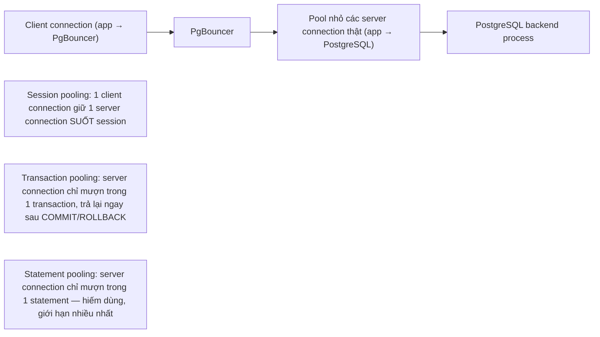
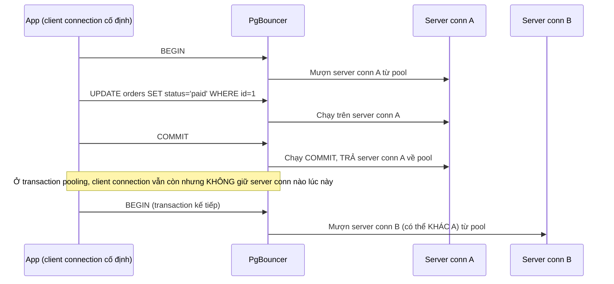
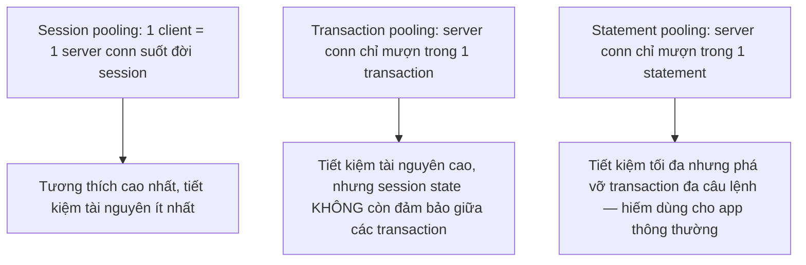

# 02 — PgBouncer: Session vs Transaction vs Statement Pooling

## 🎯 Mục tiêu học

Đây là file xương sống của phase này. Sau file này, bạn phải giải thích chính xác **server connection được gán cho client như thế nào** trong từng chế độ pooling, và vì sao transaction pooling — chế độ mạnh nhất về hiệu quả tài nguyên — cũng là chế độ dễ **phá vỡ ngầm** giả định của ứng dụng nhất.

## 📋 Mục lục

- [Mental model](#mental-model)
- [What actually happens: cách mỗi mode gán server connection](#what-actually-happens-cách-mỗi-mode-gán-server-connection)
- [Diagram: request → PgBouncer → backend lifecycle](#diagram-request--pgbouncer--backend-lifecycle)
- [Diagram: pool mode comparison](#diagram-pool-mode-comparison)
- [Bảng: pooling mode → how server connection is assigned → what works well → what breaks / needs care → common use case](#bảng-pooling-mode--how-server-connection-is-assigned--what-works-well--what-breaks--needs-care--common-use-case)
- [Vì sao transaction pooling mạnh](#vì-sao-transaction-pooling-mạnh)
- [Vì sao transaction pooling phá vỡ giả định session ngầm](#vì-sao-transaction-pooling-phá-vỡ-giả-định-session-ngầm)
- [Ví dụ thực tế: feature nào chạm session state](#ví-dụ-thực-tế-feature-nào-chạm-session-state)
- [PgBouncer giúp gì, không giúp gì](#pgbouncer-giúp-gì-không-giúp-gì)
- [Failure modes](#failure-modes)
- [Debugging hints](#debugging-hints)
- [Safe pooling patterns](#safe-pooling-patterns)
- [Interview lens](#interview-lens)
- [Mini scenarios](#mini-scenarios)
- [Key takeaways](#key-takeaways)
- [Why this matters in production](#why-this-matters-in-production)
- [Xem tiếp / Liên kết liên quan](#xem-tiếp--liên-kết-liên-quan)

## Mental model



❌ "PgBouncer là proxy connection" — mô tả đúng nhưng vô nghĩa nếu không hiểu **khi nào** nó trả server connection về pool để dùng cho client khác, vì chính thời điểm đó quyết định feature nào của PostgreSQL còn hoạt động đúng.

## What actually happens: cách mỗi mode gán server connection

- **Session pooling**: khi client connect vào PgBouncer, một server connection thật được gán cho nó và **giữ nguyên cho tới khi client disconnect** — hành vi gần giống hệt kết nối trực tiếp PostgreSQL, chỉ khác là PgBouncer đứng giữa để quản lý.
- **Transaction pooling**: server connection chỉ được gán **khi một transaction bắt đầu**, và được **trả lại pool ngay khi transaction kết thúc** (`COMMIT`/`ROLLBACK`) — client connection vẫn còn đó (kết nối TCP tới PgBouncer không đổi), nhưng ở giữa các transaction, nó **không sở hữu** bất kỳ server connection cụ thể nào.
- **Statement pooling**: server connection chỉ được gán trong đúng thời gian chạy **một statement**, trả lại ngay sau đó — kể cả nhiều statement trong cùng transaction cũng có thể chạy trên các server connection khác nhau. Chế độ này **không hỗ trợ transaction đa câu lệnh** đúng nghĩa và hiếm khi phù hợp cho ứng dụng thông thường — chủ yếu tồn tại cho các use case rất đặc thù (ví dụ pgbouncer làm proxy cho công cụ chỉ chạy autocommit đơn lẻ).

## Diagram: request → PgBouncer → backend lifecycle



## Diagram: pool mode comparison



## Bảng: pooling mode → how server connection is assigned → what works well → what breaks / needs care → common use case

| Pooling mode | How server connection is assigned | What works well | What breaks / needs care | Common use case |
|---|---|---|---|---|
| Session | Giữ 1 server connection suốt vòng đời client connection | Mọi session state (prepared statement, temp table, `SET`, advisory lock, `LISTEN/NOTIFY`) hoạt động y hệt kết nối trực tiếp | Không tiết kiệm tài nguyên nhiều — số server connection cần gần bằng số client connection đồng thời | App cần session state đầy đủ, hoặc số lượng client connection không quá lớn |
| Transaction | Mượn server connection chỉ trong phạm vi 1 transaction, trả lại ngay khi commit/rollback | Tiết kiệm tài nguyên rất cao — hàng nghìn client connection có thể dùng chung vài chục server connection | Prepared statement server-side, temp table, session-level `SET`, advisory lock giữ qua nhiều transaction, `LISTEN/NOTIFY` đều **không đáng tin cậy** vì server connection có thể đổi giữa các transaction | Web API stateless, mỗi request là 1-vài transaction ngắn, không cần session state xuyên transaction |
| Statement | Mượn server connection chỉ trong phạm vi 1 statement | Tiết kiệm tài nguyên tối đa | Transaction đa câu lệnh (`BEGIN; ... nhiều lệnh ...; COMMIT`) không hoạt động đúng vì mỗi lệnh có thể rơi vào server connection khác nhau | Rất hiếm cho ứng dụng thông thường; chỉ phù hợp workload autocommit đơn lẻ tuyệt đối |

## Vì sao transaction pooling mạnh

📌 Với web API có hàng nghìn client connection đồng thời nhưng mỗi request chỉ cần vài chục mili-giây làm việc thật với DB, transaction pooling cho phép **hàng nghìn client connection chia sẻ chỉ vài chục server connection** — vì server connection chỉ bị chiếm dụng đúng trong khoảng thời gian transaction đang chạy, không phải suốt vòng đời client. Đây chính là cách transaction pooling giải quyết trực tiếp vấn đề "backend-per-connection đắt đỏ" đã học ở file 01: số OS process backend thật cần có thể thấp hơn số client connection tới hàng chục hoặc hàng trăm lần.

## Vì sao transaction pooling phá vỡ giả định session ngầm

Nhiều feature PostgreSQL vốn được thiết kế để "tồn tại xuyên suốt session" (session = 1 kết nối vật lý cố định) — nhưng dưới transaction pooling, khái niệm "session" ở phía server connection **không còn liên tục** giữa các transaction của cùng một client. Bất kỳ trạng thái nào ứng dụng "âm thầm" giả định sẽ còn nguyên ở transaction kế tiếp đều có nguy cơ biến mất hoặc — tệ hơn — bị **rò rỉ** sang client khác đang mượn cùng server connection đó sau này.

## Ví dụ thực tế: feature nào chạm session state

```sql
-- ❌ Advisory lock giữ qua nhiều transaction — nguy hiểm dưới transaction pooling
SELECT pg_advisory_lock(12345); -- transaction A mượn server conn X, lock được giữ trên conn X
-- ... một lúc sau, transaction A kết thúc (COMMIT) -> conn X trả về pool
-- ... advisory lock session-level KHÔNG tự giải phóng khi transaction commit (chỉ giải phóng khi session/connection đóng)
-- -> conn X giờ có thể được mượn bởi CLIENT KHÁC, và client đó "vô tình thừa hưởng" lock này

-- ✅ An toàn hơn dưới transaction pooling: dùng advisory lock DẠNG TRANSACTION-LEVEL
SELECT pg_advisory_xact_lock(12345); -- tự động giải phóng khi transaction kết thúc, khớp với vòng đời transaction pooling cấp
```

```sql
-- ❌ Temp table tạo ở transaction này, kỳ vọng dùng lại ở transaction sau — nguy hiểm dưới transaction pooling
CREATE TEMP TABLE staging_import (...); -- transaction A, server conn X
COMMIT;
-- Transaction B (request khác hoặc cùng client, transaction kế tiếp) có thể rơi vào server conn Y KHÁC
-- -> staging_import không tồn tại trên conn Y -> lỗi "relation does not exist"
```

```sql
-- ⚠️ SET session-level âm thầm "biến mất" giữa các transaction dưới transaction pooling
SET search_path = tenant_42; -- chạy ngoài transaction hoặc đầu transaction A, server conn X
-- Transaction B rơi vào conn Y (chưa từng SET search_path này) -> query chạy sai schema mà KHÔNG báo lỗi rõ ràng
```

## PgBouncer giúp gì, không giúp gì

- ✅ **Giúp**: giảm số OS backend process thật cần tồn tại, giảm chi phí connection churn (không cần `fork()` mới cho mỗi client connection), điều tiết concurrency (giới hạn số server connection tối đa dù client connection có tăng vọt).
- ❌ **Không giúp**: không tự động tăng tốc query chậm, không thay thế việc thiết kế đúng query/index, không giải quyết vấn đề nếu DB thật sự saturated (quá nhiều active work thật cần làm) — nó chỉ điều tiết cách các client tiếp cận số server connection giới hạn, không tạo thêm năng lực xử lý cho PostgreSQL.

## Failure modes

- 🔴 **Bật transaction pooling mà app còn lệ thuộc session state**: advisory lock session-level, temp table, `SET` không transaction-scoped, `LISTEN/NOTIFY` đều có nguy cơ hoạt động sai một cách âm thầm, không báo lỗi rõ ràng lúc test tải thấp.
- 🔴 **Không biết driver/framework đang dùng server-side prepared statement**: nhiều ORM/driver tự động dùng prepared statement phía server để tối ưu — dưới transaction pooling, prepared statement (nếu không cấu hình đúng ở PgBouncer) có thể lỗi "prepared statement does not exist" vì server connection đã đổi.
- 🔴 **Chọn mode theo trend** ("mọi người dùng transaction pooling nên mình cũng dùng") mà không kiểm tra ứng dụng có phụ thuộc session state nào không — dẫn tới lỗi khó tái hiện chỉ xuất hiện dưới tải thật.

## Debugging hints

- Trước khi chuyển sang transaction pooling, kiểm kê toàn bộ chỗ code dùng: advisory lock, temp table, `SET`/`SET LOCAL`, `LISTEN/NOTIFY`, cursor giữ qua nhiều statement.
- Khi thấy lỗi lạ "prepared statement does not exist" hoặc "relation does not exist" chỉ xảy ra qua PgBouncer (không xảy ra khi test trực tiếp PostgreSQL), nghi ngờ ngay assumption về session-continuity bị phá vỡ.
- Kiểm tra cấu hình `pool_mode` thực tế đang chạy (`SHOW CONFIG` trong PgBouncer admin console) — đừng giả định dựa trên tài liệu triển khai cũ.

## Safe pooling patterns

- ✅ Dùng `pg_advisory_xact_lock` (transaction-scoped) thay vì `pg_advisory_lock` (session-scoped) khi có transaction pooling.
- ✅ Tránh temp table và `SET` session-level không cần thiết trong workload chạy qua transaction pooling; nếu cần, cân nhắc `SET LOCAL` (chỉ áp dụng trong transaction hiện tại, khớp với vòng đời transaction pooling).
- ✅ Với ứng dụng cần `LISTEN/NOTIFY` hoặc session state phức tạp, route riêng qua một pool cấu hình **session pooling**, tách biệt khỏi pool transaction pooling chính cho traffic thông thường.
- ✅ Kiểm tra cấu hình driver/ORM có server-side prepared statement bật hay không, và cấu hình PgBouncer phù hợp (một số phiên bản PgBouncer hỗ trợ prepared statement qua transaction pooling với cấu hình riêng — luôn kiểm chứng theo đúng phiên bản đang dùng).

## Interview lens

**Interviewer thường hỏi**: "Transaction pooling và session pooling khác nhau thế nào, chọn cái nào?"

- ❌ Câu trả lời yếu: "Transaction pooling nhanh hơn nên luôn chọn nó."
- ✅ Câu trả lời mạnh: Khác biệt cốt lõi là **thời điểm server connection được trả về pool** — session pooling giữ nguyên suốt vòng đời client connection (tương thích cao nhất, ít tiết kiệm tài nguyên nhất), còn transaction pooling chỉ mượn trong phạm vi một transaction rồi trả ngay (tiết kiệm tài nguyên rất cao, nhưng phá vỡ mọi giả định về session-continuity: advisory lock session-scoped, temp table, `SET`, `LISTEN/NOTIFY` đều không còn đáng tin cậy). Lựa chọn đúng phụ thuộc vào việc audit ứng dụng có lệ thuộc session state hay không — nếu có, cần dùng transaction-scoped equivalent (`pg_advisory_xact_lock`, `SET LOCAL`) hoặc route riêng qua session pooling cho phần đó.

## Mini scenarios

1. **Team chuyển toàn bộ traffic sang transaction pooling để tiết kiệm connection**, vài tuần sau phát hiện một luồng nghiệp vụ dùng `pg_advisory_lock` để tránh 2 job chạy trùng — lock không còn hoạt động đúng vì bị "trả lại" ngay khi transaction đầu tiên commit, dẫn tới 2 job chạy trùng âm thầm.
2. **ORM mặc định bật server-side prepared statement**, sau khi thêm PgBouncer transaction pooling, log xuất hiện lỗi `prepared statement "S_1" does not exist` ngẫu nhiên dưới tải cao — vì mỗi transaction có thể rơi vào server connection khác, còn prepared statement được chuẩn bị trên một server connection cụ thể trước đó.
3. **Batch job tạo temp table để xử lý dữ liệu tạm trong nhiều bước, mỗi bước là 1 transaction riêng** — hoạt động bình thường khi test bằng kết nối trực tiếp, nhưng lỗi "relation does not exist" ngẫu nhiên khi chạy qua transaction pooling vì temp table không tồn tại trên server connection của transaction sau.

## Key takeaways

- 🧠 Sự khác biệt cốt lõi giữa các pooling mode là **thời điểm** server connection được gán và trả lại — không phải chỉ "nhanh hay chậm".
- 🧠 Transaction pooling mạnh vì cho phép hàng nghìn client connection chia sẻ rất ít server connection thật, nhưng đánh đổi là session-continuity không còn đảm bảo giữa các transaction.
- 🧠 Advisory lock session-scoped, temp table, `SET` không transaction-scoped, `LISTEN/NOTIFY`, và server-side prepared statement đều là các điểm dễ vỡ nhất dưới transaction pooling.
- 🧠 PgBouncer không tăng năng lực xử lý của PostgreSQL — nó chỉ điều tiết cách nhiều client tiếp cận một số lượng server connection giới hạn.

## Why this matters in production

Lỗi do transaction pooling phá vỡ session assumption gần như không bao giờ xuất hiện trong môi trường test tải thấp (vì xác suất 2 transaction liên tiếp rơi vào cùng server connection khá cao khi ít traffic) — nó chỉ lộ diện dưới tải thật, ngẫu nhiên, khó tái hiện, và thường bị nhầm là "bug PostgreSQL" hoặc "bug driver" thay vì đúng bản chất: một giả định về session-continuity đã âm thầm bị phá vỡ từ lúc bật transaction pooling.

## Xem tiếp / Liên kết liên quan

- ➡️ [`03-pool-sizing-queueing-and-backpressure.md`](03-pool-sizing-queueing-and-backpressure.md) — tính pool size dựa trên concurrency budget.
- ➡️ [`04-prepared-statements-session-state-and-pooling-caveats.md`](04-prepared-statements-session-state-and-pooling-caveats.md) — đào sâu từng feature bị ảnh hưởng.
- ⬅️ [`01-why-connections-are-expensive-in-postgres.md`](01-why-connections-are-expensive-in-postgres.md)
- ⬅️ [README phase này](README.md)
