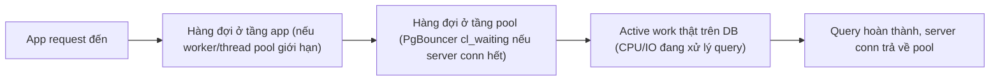
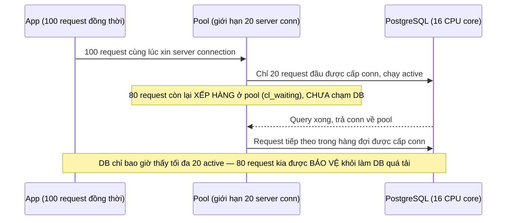

# 03 — Pool Sizing, Queueing và Backpressure

## 🎯 Mục tiêu học

Sau file này, bạn phải tính được pool size dựa trên **concurrency budget** thực tế (CPU core, độ dài query, mức độ burst) thay vì công thức "số thread ứng dụng" hay "CPU × 2" máy móc, và phải chỉ ra chính xác **request đang xếp hàng ở đâu** (app, pool, hay DB) khi có sự cố chậm.

## 📋 Mục lục

- [Mental model](#mental-model)
- [What actually happens: 5 khái niệm hay bị gộp lẫn](#what-actually-happens-5-khái-niệm-hay-bị-gộp-lẫn)
- [Diagram: queueing/backpressure flow](#diagram-queueingbackpressure-flow)
- [Pool lớn hơn chưa chắc tốt hơn](#pool-lớn-hơn-chưa-chắc-tốt-hơn)
- [Diagram: concurrency budget decision tree](#diagram-concurrency-budget-decision-tree)
- [Bảng: symptom → where queue likely is → what to verify → safer direction](#bảng-symptom--where-queue-likely-is--what-to-verify--safer-direction)
- [Ví dụ thực tế](#ví-dụ-thực-tế)
- [Backpressure must happen somewhere](#backpressure-must-happen-somewhere)
- [Failure modes](#failure-modes)
- [Debugging hints](#debugging-hints)
- [Safe pooling patterns](#safe-pooling-patterns)
- [Interview lens](#interview-lens)
- [Mini scenarios](#mini-scenarios)
- [Key takeaways](#key-takeaways)
- [Why this matters in production](#why-this-matters-in-production)
- [Xem tiếp / Liên kết liên quan](#xem-tiếp--liên-kết-liên-quan)

## Mental model



📌 "Chậm" có thể xảy ra ở bất kỳ tầng nào trong 4 tầng trên — và mỗi tầng có triệu chứng, cách đo, và hướng sửa khác nhau hoàn toàn.

## What actually happens: 5 khái niệm hay bị gộp lẫn

- **App concurrency**: số request/task ứng dụng đang cố xử lý đồng thời (không nhất thiết đang chạm DB).
- **Active DB work**: số backend PostgreSQL **thực sự đang chạy query** (CPU/IO đang bận) tại một thời điểm.
- **Open idle connections**: số connection đang tồn tại nhưng không làm gì (đã học chi tiết ở file 01).
- **Queued requests**: request đang **chờ** được cấp một server connection (ở tầng pool) hoặc chờ tới lượt xử lý (ở tầng app), chưa chạm được vào DB.
- **Saturated database**: DB đã dùng hết năng lực xử lý thật (CPU/IO), thêm request mới chỉ làm mọi thứ chậm hơn cho tất cả, không tăng thêm throughput.

📌 Pool size hợp lý là con số cố gắng giữ **Active DB work** ở gần mức năng lực thật của DB (không vượt saturated), đồng thời chấp nhận rằng khi app concurrency vượt pool size, phần dư sẽ trở thành **queued requests** — đây là hành vi *mong muốn*, không phải lỗi.

## Diagram: queueing/backpressure flow



## Pool lớn hơn chưa chắc tốt hơn

📌 Nếu pool size được đặt lớn hơn nhiều so với năng lực CPU thật của DB, request không còn được xếp hàng an toàn ở tầng pool nữa — chúng được đẩy thẳng vào DB thành **active work** vượt quá năng lực xử lý, và DB tự nó trở thành nơi request "xếp hàng" (dưới dạng context-switch/lock contention như đã học ở file 01) — chỉ khác là lúc này **không ai kiểm soát được** hàng đợi đó, và toàn bộ query (kể cả những query vốn nhanh) đều chậm lại đồng loạt.

## Diagram: concurrency budget decision tree

```mermaid
flowchart TD
    Q1{"Query trung bình mất bao lâu?"} -->|Rất ngắn, vài ms| Q2A{"CPU core khả dụng của DB là bao nhiêu?"}
    Q1 -->|Dài, vài giây trở lên (report/dashboard)| Isolate["Cân nhắc pool RIÊNG cho workload dài, tách khỏi pool phục vụ traffic ngắn"]
    Q2A --> Budget["Pool size cho workload ngắn ~ gần số CPU core, cộng thêm buffer nhỏ cho I/O wait"]
    Budget --> Burst{"Traffic có burst mạnh (spike gấp nhiều lần trung bình)?"}
    Burst -->|Có| QueueApp["Chấp nhận queueing ở tầng pool trong lúc burst, kèm timeout hợp lý — không tăng pool để hấp thụ hết spike"]
    Burst -->|Không, tải ổn định| Steady["Pool size cố định theo budget, theo dõi định kỳ khi traffic pattern đổi"]
```

## Bảng: symptom → where queue likely is → what to verify → safer direction

| Symptom | Where queue likely is | What to verify | Safer direction |
|---|---|---|---|
| App timeout khi "xin" connection, DB CPU vẫn thấp | Hàng đợi ở tầng pool (pool acquire timeout) | PgBouncer `SHOW POOLS` — cột `cl_waiting` cao | Có thể cần tăng pool size (nếu DB còn dư năng lực) hoặc giảm thời gian giữ transaction |
| DB CPU 100%, mọi query (kể cả đơn giản) đều chậm | Hàng đợi thực chất đang nằm bên trong DB (active work vượt năng lực) | `pg_stat_activity` — số dòng `active` cao gần/vượt pool size, CPU load trung bình vượt số core | Giảm pool size để bảo vệ DB, không tăng thêm |
| Worker xử lý `processing_jobs` chạy chậm hẳn khi số worker instance tăng lên | Nhiều worker cùng tăng pool riêng, tổng server connection vượt năng lực DB dù mỗi pool nhỏ | Tổng connection active trên toàn hệ thống (không chỉ 1 worker), không chỉ nhìn từng instance | Tính pool size theo tổng across toàn bộ instance, không theo từng instance riêng lẻ |
| Dashboard/report query dài (`activity_logs`/`events`) làm nghẽn traffic API ngắn | Query dài chiếm giữ server connection lâu trong cùng pool với traffic ngắn | Kiểm tra `pg_stat_activity` xem query dài đang chiếm bao nhiêu connection trong pool chung | Tách pool riêng cho report/dashboard, không dùng chung pool với traffic API ngắn |
| Tăng pool size từ 20 lên 100 nhưng latency vẫn tệ hoặc tệ hơn | Không phải vấn đề queueing — DB đã saturated bởi chính khối lượng active work | So sánh throughput trước/sau khi tăng pool — nếu không cải thiện hoặc tệ hơn, xác nhận DB đã chạm giới hạn CPU/IO | Tối ưu query/index thay vì tiếp tục tăng pool |

## Ví dụ thực tế

**Case 1 — web API burst traffic vào `orders/payments`:**

```
Traffic bình thường: 50 request/giây, mỗi request ~20ms làm việc với DB -> cần ~1 active connection trung bình
Burst đột biến (flash sale): 2000 request/giây trong 30 giây
Pool size cố định 30 (dựa trên CPU core DB + buffer) -> phần lớn burst phải XẾP HÀNG ở PgBouncer trong vài trăm ms
-> Đây là hành vi ĐÚNG: DB không bị tràn ngập active work, request chỉ chờ thêm chút rồi được xử lý tuần tự
```

**Case 2 — background worker xử lý `processing_jobs`:**

```
10 worker instance, mỗi instance tự cấu hình pool riêng 20 connection -> tổng 200 server connection tiềm năng
DB chỉ có 16 CPU core -> nếu cả 10 worker cùng active hết công suất, 200 active backend tranh 16 core
-> Giải pháp: tính pool size CHIA ĐỀU theo tổng số worker instance, ví dụ mỗi instance chỉ 2-3 connection
  để tổng toàn hệ thống không vượt quá concurrency budget của DB
```

**Case 3 — dashboard/report query dài đọc `activity_logs`:**

```sql
-- Query báo cáo chạy 30 giây, dùng chung pool 20 connection với API traffic (mỗi request API ~20ms)
SELECT tenant_id, count(*) FROM activity_logs
WHERE created_at >= now() - interval '90 days'
GROUP BY tenant_id;
-- Nếu 5 report như vậy chạy đồng thời, chiếm 5/20 connection trong SUỐT 30 giây
-- -> API traffic ngắn (vốn chỉ cần vài ms) giờ phải chờ 30 giây để tới lượt -> latency API tăng vọt bất thường
-- Hướng sửa: route report sang pool RIÊNG, tách biệt hoàn toàn khỏi pool phục vụ API
```

## Backpressure must happen somewhere

📌 Không có thiết kế nào loại bỏ hoàn toàn khả năng hệ thống bị quá tải — câu hỏi đúng không phải "làm sao để không bao giờ bị nghẽn" mà là "nghẽn nên xảy ra ở đâu, theo cách có kiểm soát". Xếp hàng ở tầng pool (với timeout rõ ràng) là backpressure **có kiểm soát**: request chờ một khoảng ngắn rồi hoặc được xử lý hoặc bị từ chối rõ ràng. Để DB tự "xếp hàng" bằng cách nhận active work vượt năng lực là backpressure **không kiểm soát**: mọi query (kể cả vốn nhanh) đều chậm lại đồng loạt, không có tín hiệu rõ ràng nào để app biết nên chờ hay nên từ chối.

- ✅ **Small pool can be healthy**: pool nhỏ hơn số CPU core một chút vẫn đảm bảo throughput tối đa vì DB không bao giờ bị tràn ngập active work — phần request dư chờ ở hàng đợi pool, có kiểm soát.
- ⚠️ **Big pool can hide overload until the database collapses**: pool quá to trì hoãn triệu chứng "quá tải" cho tới khi DB tự sụp dưới tải active work vượt xa năng lực — lúc đó khó phục hồi hơn nhiều so với việc từ chối bớt request sớm ở tầng pool.

## Failure modes

- 🔴 **Pool size = số thread/request tối đa của ứng dụng**: gán pool size theo concurrency mong muốn của app thay vì theo năng lực thật của DB — dẫn tới quá tải DB ngay khi app đạt tải thiết kế.
- 🔴 **Retry storm khi timeout**: mỗi request timeout ở tầng pool lập tức được retry ngay, làm tăng thêm áp lực đúng lúc hệ thống đang quá tải (chi tiết ở file 05).
- 🔴 **Worker count không gắn với DB capacity**: mỗi worker instance tự chọn pool size độc lập mà không tính tổng toàn hệ thống, dẫn tới tổng connection vượt xa concurrency budget của DB khi scale số instance.
- 🔴 **Query chậm nhưng chỉ tăng pool**: tăng pool size để "giải quyết" triệu chứng chậm trong khi nguyên nhân gốc là 1-2 query cụ thể chạy chậm (thiếu index, thiếu stats) — pool to hơn chỉ khiến nhiều query chậm chạy song song hơn, làm DB chậm đồng loạt thay vì sửa đúng chỗ.

## Debugging hints

- Luôn kiểm tra `pg_stat_activity` để đếm số backend `active` thực tế trước khi kết luận cần tăng pool.
- Với PgBouncer, `SHOW POOLS` cho biết `cl_active` (client đang có server conn), `cl_waiting` (client đang chờ), `sv_active`/`sv_idle` (server conn đang bận/rảnh) — đọc đúng các cột này trước khi thay đổi cấu hình.
- Khi scale số worker/app instance theo chiều ngang, luôn tính lại tổng connection toàn hệ thống, không chỉ nhìn từng instance riêng lẻ.

## Safe pooling patterns

- ✅ Đặt pool size ban đầu gần với số CPU core khả dụng của DB server (cộng buffer nhỏ cho workload có I/O wait đáng kể), rồi điều chỉnh dựa trên đo đạc thực tế, không phải công thức cứng.
- ✅ Tách pool riêng cho workload có query duration khác biệt lớn (API ngắn vs report dài) để tránh workload dài "khóa" tài nguyên chung.
- ✅ Đặt timeout rõ ràng cho việc chờ server connection ở tầng pool, để backpressure xảy ra có kiểm soát thay vì để DB tự xử lý bằng cách chậm dần.
- ✅ Khi scale số instance ứng dụng theo chiều ngang, giảm tương ứng pool size mỗi instance để giữ tổng connection ổn định.

## Interview lens

**Interviewer thường hỏi**: "Pool size nên đặt bao nhiêu?"

- ❌ Câu trả lời yếu: "CPU core × 2" áp dụng máy móc cho mọi trường hợp.
- ✅ Câu trả lời mạnh: Pool size nên phản ánh concurrency budget thực tế của DB — gần với số CPU core khả dụng cho workload CPU-bound ngắn, có điều chỉnh theo tỷ lệ I/O wait và độ dài query trung bình. Quan trọng hơn con số cụ thể là việc phân biệt: pool nhỏ hơn traffic đỉnh không phải là vấn đề nếu backpressure ở tầng pool có timeout rõ ràng — đó là cơ chế bảo vệ DB khỏi bị tràn ngập active work. Pool quá to mới là rủi ro thật, vì nó trì hoãn triệu chứng quá tải cho tới khi DB tự sụp dưới áp lực không kiểm soát.

## Mini scenarios

1. **Team đặt pool size = 500 vì "app có 500 worker thread"**, sau đó phát hiện dưới tải cao mọi query (kể cả `SELECT 1`) đều mất hàng giây — vì DB (16 core) đang phải context-switch giữa hàng trăm active backend cùng lúc, đúng như đã học ở file 01.
2. **10 worker instance xử lý `processing_jobs` scale lên 30 instance để xử lý backlog nhanh hơn**, nhưng throughput tổng không tăng (thậm chí giảm) — vì tổng connection giờ vượt xa concurrency budget của DB; giải pháp là giảm pool size mỗi instance khi tăng số instance, giữ tổng ổn định.
3. **API traffic ngắn bị chậm bất thường mỗi khi có report chạy** — vì report và API dùng chung 1 pool, report giữ connection 30 giây trong khi API chỉ cần vài ms; tách pool riêng cho report giải quyết ngay vấn đề mà không cần tối ưu gì thêm về query.

## Key takeaways

- 🧠 5 khái niệm (app concurrency, active DB work, idle connections, queued requests, saturated database) phải được phân biệt rõ trước khi kết luận nguyên nhân chậm.
- 🧠 Pool size nhỏ hơn traffic đỉnh không phải vấn đề nếu queueing ở tầng pool có timeout kiểm soát — đây là backpressure lành mạnh.
- 🧠 Pool quá to che giấu quá tải cho tới khi DB tự sụp — lúc đó khó phục hồi hơn nhiều so với từ chối bớt request sớm.
- 🧠 Workload có độ dài query khác biệt lớn (API ngắn vs report dài) nên tách pool riêng, không dùng chung.
- 🧠 Khi scale số instance ứng dụng, phải tính lại tổng connection toàn hệ thống, không chỉ từng instance.

## Why this matters in production

Quyết định pool size sai theo cả hai hướng đều gây sự cố thật: quá nhỏ không kiểm soát (không có timeout) làm request bị từ chối vô lý dù DB còn dư năng lực; quá to biến DB thành nơi "xếp hàng không kiểm soát" khiến toàn hệ thống sụp đồng loạt dưới burst traffic thay vì chỉ một phần request bị trễ có kiểm soát. Hiểu đúng khái niệm concurrency budget là điều kiện để tránh cả hai thái cực này.

## Xem tiếp / Liên kết liên quan

- ➡️ [`04-prepared-statements-session-state-and-pooling-caveats.md`](04-prepared-statements-session-state-and-pooling-caveats.md) — caveat session state khi pool xoay vòng nhanh.
- ➡️ [`05-failover-timeouts-and-connection-management-anti-patterns.md`](05-failover-timeouts-and-connection-management-anti-patterns.md) — timeout layering và retry an toàn khi hàng đợi đầy.
- ⬅️ [`02-pgbouncer-session-vs-transaction-vs-statement-pooling.md`](02-pgbouncer-session-vs-transaction-vs-statement-pooling.md)
- ⬅️ [README phase này](README.md)
