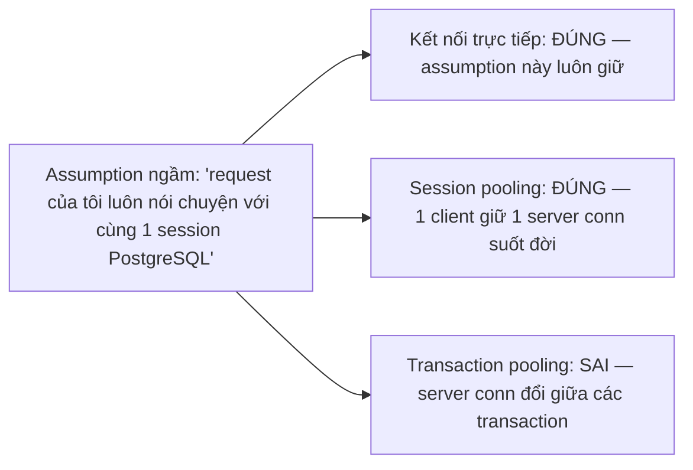
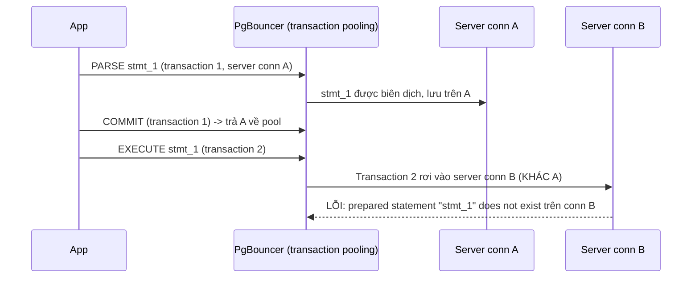

# 04 — Prepared Statements, Session State và Pooling Caveats

## 🎯 Mục tiêu học

Sau file này, bạn phải liệt kê chính xác feature nào của PostgreSQL "hoạt động hoàn hảo khi test bằng kết nối trực tiếp, nhưng vỡ một cách khó hiểu khi chạy qua PgBouncer transaction pooling" — và giải thích đúng nguyên nhân: assumption ngầm "request == session liên tục" không còn đúng.

## 📋 Mục lục

- [Mental model](#mental-model)
- [What actually happens: prepared statement ở mức practical](#what-actually-happens-prepared-statement-ở-mức-practical)
- [Diagram: session-state lifecycle](#diagram-session-state-lifecycle)
- [Diagram: "hidden assumption breaks here"](#diagram-hidden-assumption-breaks-here)
- [Bảng: feature/pattern → safe in direct connection? → safe in session pooling? → safe in transaction pooling? → caveat](#bảng-featurepattern--safe-in-direct-connection--safe-in-session-pooling--safe-in-transaction-pooling--caveat)
- [Ví dụ thực tế](#ví-dụ-thực-tế)
- [Failure modes](#failure-modes)
- [Debugging hints](#debugging-hints)
- [Safe pooling patterns](#safe-pooling-patterns)
- [Interview lens](#interview-lens)
- [Mini scenarios](#mini-scenarios)
- [Key takeaways](#key-takeaways)
- [Why this matters in production](#why-this-matters-in-production)
- [Xem tiếp / Liên kết liên quan](#xem-tiếp--liên-kết-liên-quan)

## Mental model



📌 Toàn bộ file này xoay quanh một câu hỏi duy nhất cho mỗi feature: **feature đó có state nào tồn tại lâu hơn 1 transaction không?** Nếu có, nó không an toàn dưới transaction pooling.

## What actually happens: prepared statement ở mức practical

Prepared statement (`PREPARE stmt AS ...` hoặc phiên bản server-side mà driver tự động tạo, ví dụ `libpq`/JDBC/`node-postgres` ở chế độ tối ưu) được **biên dịch và lưu trên một server connection cụ thể** — nó không phải khái niệm ở tầng client connection.

- **Server-side prepared statement**: driver gửi `PARSE` (đặt tên statement) một lần, sau đó gửi `BIND`+`EXECUTE` nhiều lần với tham số khác nhau, tái sử dụng plan đã biên dịch — tối ưu hiệu năng cho query lặp lại nhiều lần. Statement này **chỉ tồn tại trên đúng server connection đã PARSE nó**.
- **Client-side prepared statement** (một số driver/framework giả lập bằng cách nội suy tham số vào SQL text trước khi gửi): không phụ thuộc server connection cụ thể vì thực chất mỗi lần gửi là một câu SQL hoàn chỉnh mới — an toàn hơn dưới transaction pooling nhưng mất lợi ích tái sử dụng plan phía server.

## Diagram: session-state lifecycle



## Diagram: "hidden assumption breaks here"

```mermaid
flowchart TD
    Feature["Feature có state xuyên transaction"] --> Q{"State đó gắn với client connection hay server connection?"}
    Q -->|Client connection logic của app, ví dụ session token app-level| SafeApp["An toàn — không liên quan PostgreSQL session"]
    Q -->|Server connection PostgreSQL (advisory lock session-level, temp table, SET, prepared statement server-side)| Break["VỠ dưới transaction pooling — server conn có thể đổi bất kỳ lúc nào giữa các transaction"]
```

## Bảng: feature/pattern → safe in direct connection? → safe in session pooling? → safe in transaction pooling? → caveat

| Feature/pattern | Safe in direct connection? | Safe in session pooling? | Safe in transaction pooling? | Caveat |
|---|---|---|---|---|
| Prepared statement server-side (`PREPARE`/driver tự động) | ✅ | ✅ | ❌ (trừ khi PgBouncer cấu hình riêng hỗ trợ, tùy phiên bản) | Statement gắn với server connection cụ thể — mất khi conn đổi giữa transaction |
| Temp table (`CREATE TEMP TABLE`) | ✅ | ✅ | ❌ | Temp table chỉ tồn tại trên server connection tạo ra nó, biến mất khi conn đó bị trả về pool cho client khác |
| `SET` session-level (không phải `SET LOCAL`) | ✅ | ✅ | ❌ | Setting áp dụng cho server connection, không tự động "theo" client qua các transaction |
| `SET LOCAL` (trong transaction) | ✅ | ✅ | ✅ | Tự động hết hiệu lực khi transaction kết thúc — khớp đúng vòng đời transaction pooling |
| `pg_advisory_lock` (session-scoped) | ✅ | ✅ | ❌ | Lock gắn với server connection, không giải phóng khi transaction kết thúc — có thể "rò rỉ" sang client khác dùng chung conn sau đó |
| `pg_advisory_xact_lock` (transaction-scoped) | ✅ | ✅ | ✅ | Tự động giải phóng khi transaction kết thúc — an toàn dưới mọi mode |
| `LISTEN`/`NOTIFY` | ✅ | ✅ | ❌ | `LISTEN` cần giữ đúng 1 kết nối vật lý liên tục để nhận `NOTIFY` — transaction pooling không đảm bảo điều này |
| Cursor giữ qua nhiều statement (`DECLARE CURSOR` không `WITH HOLD`) | ✅ | ✅ | ❌ | Cursor thường gắn với transaction/server connection hiện tại, không tồn tại xuyên transaction dưới transaction pooling |
| Đơn giản `SELECT`/`INSERT`/`UPDATE` không dùng state đặc biệt | ✅ | ✅ | ✅ | An toàn tuyệt đối vì không có state nào cần "sống sót" qua transaction |

## Ví dụ thực tế

**Case 1 — prepared statement confusion:**

```sql
-- Driver tự động tạo server-side prepared statement cho câu query lặp lại nhiều lần
-- (ví dụ Npgsql, JDBC PgJDBC, hoặc node-postgres với chế độ statement caching)
-- Transaction 1 (server conn A): PARSE "SELECT * FROM orders WHERE id = $1" AS stmt_a
-- Transaction 2 (cùng client, nhưng qua transaction pooling rơi vào server conn B):
--   EXECUTE stmt_a($1=123) -> LỖI: prepared statement "stmt_a" does not exist
```

Hướng sửa: cấu hình driver dùng chế độ không server-side prepare (ví dụ tắt statement caching, hoặc dùng `simple query protocol`), hoặc dùng phiên bản PgBouncer/cấu hình hỗ trợ prepared statement qua transaction pooling nếu có, và luôn kiểm chứng bằng test tải thật trước khi tin tưởng.

**Case 2 — temp table/session setting problem:**

```sql
-- Batch job nhiều bước, mỗi bước gọi qua application code riêng biệt (mỗi lần gọi = 1 transaction)
-- Bước 1: CREATE TEMP TABLE staging (...); INSERT INTO staging SELECT ...; COMMIT;
-- Bước 2 (transaction mới, có thể rơi vào server connection khác dưới transaction pooling):
--   SELECT * FROM staging; -- LỖI: relation "staging" does not exist
```

Hướng sửa: gộp toàn bộ các bước cần chia sẻ temp table vào **cùng một transaction** (không chia thành nhiều transaction/call riêng), hoặc thay temp table bằng bảng thật có cột định danh phiên làm việc (ví dụ `batch_id`) để không phụ thuộc vào server connection cụ thể.

**Case 3 — advisory lock/session affinity issue:**

```sql
-- Worker dùng advisory lock để đảm bảo chỉ 1 instance xử lý một loại job tại 1 thời điểm
SELECT pg_advisory_lock(hashtext('daily_report_job')); -- transaction A, server conn X
-- ... xử lý report, transaction A COMMIT -> conn X trả về pool
-- Lock KHÔNG được release (vì đây là session-scoped, chỉ release khi session/connection đóng, không phải transaction)
-- Client khác mượn conn X sau đó VÔ TÌNH "sở hữu" lock -> hoặc lock treo mãi vì không ai biết cách release đúng conn
```

Hướng sửa: luôn dùng `pg_advisory_xact_lock` (transaction-scoped) khi có transaction pooling, để lock tự động giải phóng đúng lúc transaction kết thúc, khớp với vòng đời server connection thực tế.

## Failure modes

- 🔴 **Assume request == session**: giả định ngầm rằng mỗi request/lần gọi liên tiếp của cùng một client sẽ luôn nói chuyện với cùng một server connection — đúng dưới direct connection/session pooling, sai dưới transaction pooling.
- 🔴 **Set session state rồi dùng về sau**: `SET search_path`, tạo temp table, hoặc bất kỳ trạng thái server-side nào được thiết lập ở một transaction/call rồi kỳ vọng transaction/call sau đó (khác biệt) vẫn thấy được.
- 🔴 **Dùng transaction pooling cho workload đòi sticky backend behavior**: `LISTEN/NOTIFY`, cursor dài hạn, session-level advisory lock — các pattern này về bản chất cần một kết nối vật lý cố định, mâu thuẫn trực tiếp với cách transaction pooling hoạt động.

## Debugging hints

- Khi thấy lỗi "prepared statement does not exist", "relation does not exist" (cho temp table), hoặc advisory lock "hoạt động kỳ lạ" chỉ dưới tải cao qua PgBouncer, kiểm tra ngay `pool_mode` đang cấu hình.
- Audit code tìm mọi chỗ dùng `CREATE TEMP TABLE`, `SET` (không phải `SET LOCAL`), `pg_advisory_lock` (không phải biến thể `_xact_`), `LISTEN`, `DECLARE CURSOR` — đây là danh sách "điểm nghi ngờ" cần rà soát trước khi bật transaction pooling.
- Kiểm tra cấu hình driver/ORM về server-side prepared statement (nhiều driver có tùy chọn bật/tắt riêng, hoặc tự động bật sau N lần chạy cùng query).

## Safe pooling patterns

- ✅ Thay mọi advisory lock session-scoped bằng transaction-scoped (`pg_advisory_xact_lock`) khi dùng transaction pooling.
- ✅ Gộp các bước cần chia sẻ temp table vào cùng một transaction, hoặc thay bằng bảng thật với định danh phiên làm việc.
- ✅ Dùng `SET LOCAL` thay vì `SET` khi cần thay đổi setting chỉ trong phạm vi transaction hiện tại.
- ✅ Route riêng các luồng cần `LISTEN/NOTIFY` hoặc session state phức tạp qua một pool cấu hình session pooling, tách biệt khỏi pool transaction pooling chính.
- ✅ Kiểm tra kỹ cấu hình prepared statement của driver trước khi bật transaction pooling cho production, không chỉ dựa vào tài liệu chung chung.

## Interview lens

**Interviewer thường hỏi**: "Ứng dụng dùng `LISTEN/NOTIFY` để nhận thông báo real-time, có dùng transaction pooling được không?"

- ❌ Câu trả lời yếu: "Được, PgBouncer là proxy trong suốt nên không ảnh hưởng gì."
- ✅ Câu trả lời mạnh: Không nên — `LISTEN` yêu cầu giữ đúng một kết nối vật lý liên tục để PostgreSQL có thể gửi `NOTIFY` bất kỳ lúc nào, trong khi transaction pooling chỉ gán server connection trong phạm vi một transaction rồi trả lại ngay. Việc này áp dụng chung cho mọi feature có state gắn với server connection cụ thể (prepared statement server-side, temp table, session-level `SET`, advisory lock session-scoped) — quy tắc chung là kiểm tra state đó có "sống" lâu hơn một transaction hay không; nếu có, cần route qua session pooling hoặc chuyển sang biến thể transaction-scoped tương đương.

## Mini scenarios

1. **Ứng dụng dùng ORM mặc định bật statement caching**, sau khi thêm transaction pooling để giảm connection, log bắt đầu xuất hiện lỗi `prepared statement "..." does not exist` ngẫu nhiên chỉ dưới tải cao — vì transaction pooling khiến server connection đổi thường xuyên hơn khi test tải thấp.
2. **Feature "khóa job trùng lặp" bằng `pg_advisory_lock` hoạt động hoàn hảo trong môi trường dev (1 connection cố định)**, nhưng trong production (transaction pooling, nhiều server connection) lock đôi khi "biến mất" sớm hơn dự kiến hoặc "kẹt" ở connection khác — nguyên nhân là dùng session-scoped lock thay vì transaction-scoped.
3. **Batch job chia nhỏ 5 bước xử lý dữ liệu qua temp table, mỗi bước 1 API call riêng (5 transaction riêng biệt)** — chạy ổn khi test thủ công (ít traffic, hay rơi cùng conn), lỗi ngẫu nhiên "relation does not exist" khi chạy sản xuất dưới tải cao qua transaction pooling.

## Key takeaways

- 🧠 Nguyên tắc chung: nếu state của một feature "sống" lâu hơn một transaction và gắn với server connection cụ thể, nó không an toàn dưới transaction pooling.
- 🧠 Danh sách rủi ro cần audit: prepared statement server-side, temp table, `SET` session-level, advisory lock session-scoped, `LISTEN/NOTIFY`, cursor dài hạn.
- 🧠 Biến thể transaction-scoped (`pg_advisory_xact_lock`, `SET LOCAL`) thường tồn tại và an toàn dưới mọi pooling mode — ưu tiên dùng khi có transaction pooling.
- 🧠 Feature cần sticky backend behavior thực sự nên route qua pool session pooling riêng, không cố ép vào transaction pooling.

## Why this matters in production

Đây là loại bug production kinh điển nhất liên quan tới connection pooling: mọi thứ chạy hoàn hảo trong môi trường dev/staging (ít connection đồng thời, xác suất trùng server connection giữa các transaction liên tiếp khá cao), rồi lỗi bùng phát ngẫu nhiên và khó tái hiện ngay khi lên production dưới tải thật — đúng lúc đội vận hành ít có thời gian nhất để bình tĩnh chẩn đoán.

## Xem tiếp / Liên kết liên quan

- ➡️ [`05-failover-timeouts-and-connection-management-anti-patterns.md`](05-failover-timeouts-and-connection-management-anti-patterns.md) — timeout layering và retry an toàn.
- ⬅️ [`02-pgbouncer-session-vs-transaction-vs-statement-pooling.md`](02-pgbouncer-session-vs-transaction-vs-statement-pooling.md)
- 🔗 [`04-concurrency-and-locking/02-row-table-and-advisory-locks.md`](../04-concurrency-and-locking/02-row-table-and-advisory-locks.md) — phân biệt advisory lock session-scoped vs transaction-scoped chi tiết hơn.
- ⬅️ [README phase này](README.md)
