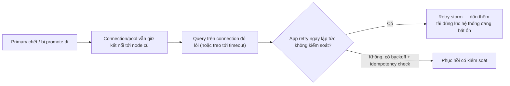
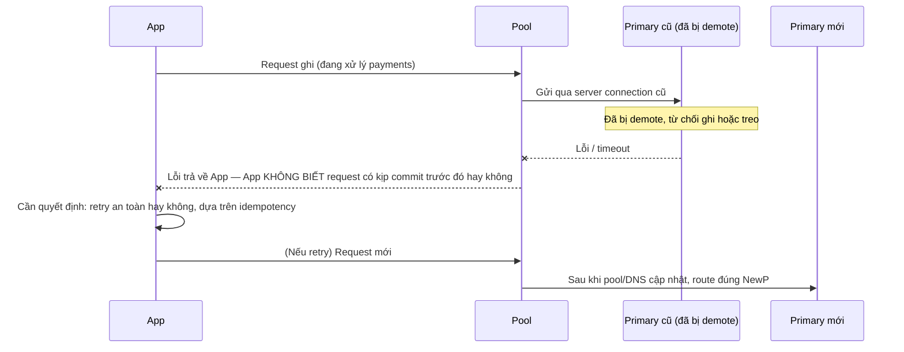
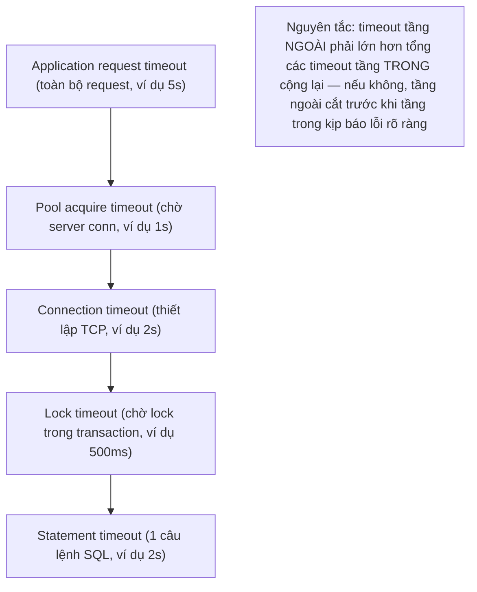
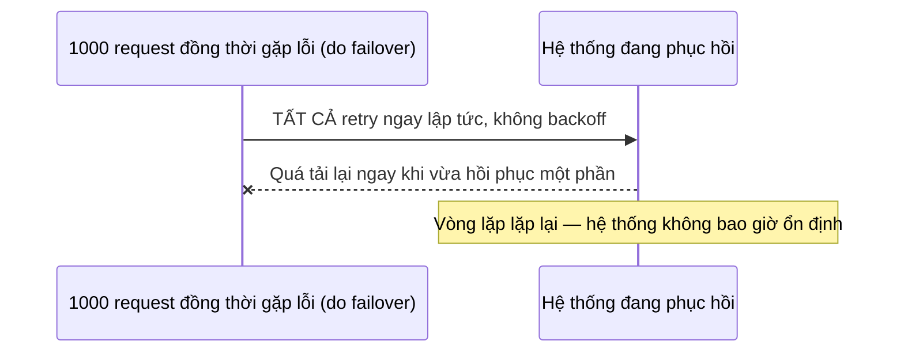

# 05 — Failover, Timeouts và Connection Management Anti-Patterns

## 🎯 Mục tiêu học

Sau file này, bạn phải thiết kế được một stack timeout hợp lý theo từng tầng (connection/statement/lock/application/pool acquire) thay vì "set số lớn cho đỡ lỗi", và giải thích chính xác vì sao client sau failover phải xử lý nhiều hơn "reconnect" — đặc biệt là vấn đề **không biết chắc một write đã commit hay chưa**.

## 📋 Mục lục

- [Mental model](#mental-model)
- [What actually happens: stale connection sau failover](#what-actually-happens-stale-connection-sau-failover)
- [Diagram: failover + stale connection sequence](#diagram-failover--stale-connection-sequence)
- [Timeout layers](#timeout-layers)
- [Diagram: timeout-layer stack](#diagram-timeout-layer-stack)
- [Retry strategy và retry storm risk](#retry-strategy-và-retry-storm-risk)
- [Diagram: retry storm flow](#diagram-retry-storm-flow)
- [Unknown commit outcome là vấn đề của application](#unknown-commit-outcome-là-vấn-đề-của-application)
- [Bảng: symptom → likely layer → bad instinct → safer response](#bảng-symptom--likely-layer--bad-instinct--safer-response)
- [Ví dụ thực tế](#ví-dụ-thực-tế)
- [Failure modes](#failure-modes)
- [Debugging hints](#debugging-hints)
- [Safe pooling patterns](#safe-pooling-patterns)
- [Interview lens](#interview-lens)
- [Mini scenarios](#mini-scenarios)
- [Key takeaways](#key-takeaways)
- [Why this matters in production](#why-this-matters-in-production)
- [Xem tiếp / Liên kết liên quan](#xem-tiếp--liên-kết-liên-quan)

## Mental model



❌ "Failover là chuyện của infra, app không cần quan tâm" — sai vì chính app là nơi quyết định retry có kiểm soát hay biến thành storm, và app là nơi duy nhất biết ý nghĩa nghiệp vụ của việc "không chắc write đã commit hay chưa".

## What actually happens: stale connection sau failover

Sau khi promotion xảy ra (đã học ở [`07-replication-and-ha/04-`](../07-replication-and-ha/04-failover-promotion-and-ha-trade-offs.md)), mọi connection (trực tiếp hoặc qua pool) đang trỏ tới **primary cũ** không tự động biết điều này đã xảy ra — chúng chỉ phát hiện ra khi:

- Kết nối TCP bị đóng đột ngột (nếu node cũ chết hẳn) → lỗi kết nối rõ ràng.
- Node cũ vẫn sống nhưng đã bị hạ xuống làm standby (hoặc cô lập) → query có thể bị từ chối rõ ràng (`read-only` error) hoặc **treo** cho tới khi timeout tùy cấu hình.
- DNS/service discovery chưa cập nhật kịp → app tiếp tục kết nối lại vào địa chỉ cũ dù đã có primary mới ở nơi khác.

## Diagram: failover + stale connection sequence



## Timeout layers

Một hệ thống có nhiều tầng timeout độc lập, và mỗi tầng bảo vệ một điều khác nhau — đặt cùng một con số cho tất cả là sai lầm phổ biến:

- **Connection timeout**: thời gian tối đa chờ **thiết lập** kết nối TCP mới — bảo vệ khỏi việc chờ vô hạn khi node đích không phản hồi.
- **Statement timeout** (`statement_timeout`): thời gian tối đa cho một câu lệnh SQL chạy trên PostgreSQL — bảo vệ khỏi query chạy mãi không dừng.
- **Lock timeout** (`lock_timeout`): thời gian tối đa chờ để lấy được lock — bảo vệ khỏi việc bị chặn vô hạn bởi transaction khác giữ lock lâu.
- **Application request timeout**: thời gian tối đa cho toàn bộ một request nghiệp vụ (có thể bao gồm nhiều câu lệnh DB, gọi service khác) — bảo vệ trải nghiệm người dùng cuối.
- **Pool acquire timeout**: thời gian tối đa chờ được cấp một server connection từ pool — bảo vệ khỏi request "treo vô thời hạn" khi pool đã cạn.

## Diagram: timeout-layer stack



📌 Timeout không phải "số ngẫu nhiên cho đỡ lỗi" — mỗi con số là một **hợp đồng** về việc hệ thống sẽ chờ tối đa bao lâu trước khi từ bỏ và trả lỗi rõ ràng, để tầng phía trên (bao gồm cả người dùng cuối) có thể phản ứng có kiểm soát thay vì chờ vô định.

## Retry strategy và retry storm risk

Khi nhiều request cùng gặp lỗi (ví dụ do failover hoặc do pool cạn) và tất cả **retry ngay lập tức** không có độ trễ, lượng request retry dồn vào hệ thống đúng lúc nó đang phục hồi (hoặc vẫn đang quá tải) — tạo ra **retry storm**, có thể khiến hệ thống không bao giờ kịp phục hồi vì liên tục nhận thêm tải mới ngay khi vừa có dấu hiệu hồi phục.

## Diagram: retry storm flow



Hướng giảm thiểu: **exponential backoff kèm jitter** (độ trễ tăng dần theo cấp số nhân, có yếu tố ngẫu nhiên để tránh nhiều client đồng loạt retry cùng một thời điểm) — không phải "retry ngay" và cũng không phải "retry vô hạn".

## Unknown commit outcome là vấn đề của application

📌 Khi một request ghi gặp lỗi kết nối đúng lúc failover xảy ra, app **không thể biết chắc** liệu transaction đó đã commit thành công trên primary cũ trước khi nó chết hay chưa — đây không phải lỗi hiếm gặp lý thuyết, mà là hệ quả tất yếu của việc mạng có thể đứt ở bất kỳ điểm nào trong chuỗi request→commit→ack. Việc xử lý đúng tình huống này là trách nhiệm của **application**, không phải điều gì database có thể tự giải quyết — bằng cách thiết kế mọi thao tác ghi quan trọng (đặc biệt `payments`, `orders`) là **idempotent**.

## Bảng: symptom → likely layer → bad instinct → safer response

| Symptom | Likely layer | Bad instinct | Safer response |
|---|---|---|---|
| Request treo rất lâu rồi mới lỗi, đúng lúc đang failover | Không có timeout ở tầng application request hoặc pool acquire | "Chờ thêm, chắc sắp xong" | Đặt application request timeout rõ ràng để cắt sớm và trả lỗi có kiểm soát, thay vì để user chờ vô định |
| Sau khi lỗi do failover, hàng loạt request retry cùng lúc làm hệ thống sập sâu hơn | Retry không có backoff, xảy ra ở tầng app/client | "Retry nhiều hơn sẽ tự ổn" | Exponential backoff + jitter, giới hạn số lần retry tối đa |
| Job thanh toán bị lỗi kết nối giữa chừng, không rõ đã trừ tiền hay chưa | Unknown commit outcome — vấn đề application, không phải DB | "Cứ retry, nếu trùng thì tính sau" | Idempotency key gắn với mỗi giao dịch, kiểm tra trạng thái trước khi retry side-effect |
| Toàn bộ timeout (connection/statement/lock/app) đều đặt cùng 30 giây | Thiết kế timeout layering sai — không tầng nào bảo vệ đúng vai trò của nó | "Set to hơn cho chắc, đỡ phải nghĩ nhiều tầng" | Timeout tầng trong phải nhỏ hơn tầng ngoài, mỗi tầng phản ánh đúng mục đích bảo vệ của nó |
| Có transient network blip ngắn (dưới 1 giây) nhưng app coi là lỗi nghiêm trọng, dừng hẳn xử lý | Không phân biệt transient failure (nên retry) với overload thật (không nên retry ngay) | "Cứ lỗi là dừng an toàn nhất" | Phân loại lỗi: transient (network blip, timeout ngắn) nên retry có backoff; overload/lỗi nghiệp vụ rõ ràng thì không nên retry mù quáng |

## Ví dụ thực tế

**Case 1 — failover khi app đang xử lý `payments/orders`:**

```sql
-- App gửi request thanh toán, transaction đang chạy đúng lúc primary chết
BEGIN;
UPDATE payments SET status = 'succeeded', provider_ref = 'ch_xyz' WHERE order_id = 456;
-- Kết nối bị đứt NGAY SAU câu UPDATE, TRƯỚC khi App nhận được xác nhận COMMIT
COMMIT; -- App không biết dòng lệnh này có chạy tới nơi hay không
```

Hướng xử lý an toàn: khi retry, kiểm tra trạng thái hiện tại trước khi hành động lại:

```sql
-- Kiểm tra trước khi retry, dựa trên idempotency key đã gắn từ đầu giao dịch
SELECT status FROM payments WHERE order_id = 456 AND idempotency_key = 'idem-abc123';
-- Nếu đã 'succeeded' -> không làm gì thêm, chỉ trả kết quả thành công cho client
-- Nếu chưa tồn tại/chưa succeeded -> an toàn để thử lại
```

**Case 2 — worker retry storm:**

```
10 worker instance xử lý processing_jobs, tất cả đang connect tới primary khi failover xảy ra
Toàn bộ 10 worker gặp lỗi kết nối CÙNG một thời điểm
Nếu mỗi worker retry NGAY LẬP TỨC không backoff -> primary mới (vừa promote, đang "ấm" pool/cache)
  nhận toàn bộ tải retry dồn dập ngay khi vừa online -> có thể làm chậm/crash lại primary mới
Giải pháp: mỗi worker áp dụng backoff với jitter riêng, tránh đồng loạt retry cùng một millisecond
```

**Case 3 — timeout layering misconfiguration:**

```
connection_timeout = 30s
statement_timeout = 30s
lock_timeout = 30s
application_request_timeout = 30s  <- TẤT CẢ giống nhau
-- Nếu statement bị chặn bởi lock, nó chờ đủ 30s (lock_timeout) rồi mới báo lỗi,
-- nhưng application_request_timeout CŨNG là 30s -> user đã bỏ cuộc/timeout ở tầng ngoài
-- trước khi DB kịp trả lỗi rõ ràng, gây ra tình huống "lỗi mơ hồ, không rõ nguyên nhân"
```

Sửa: sắp xếp theo tầng lồng nhau như trong diagram — `lock_timeout` (500ms-2s) < `statement_timeout` (vài giây) < `pool acquire timeout` (1-2s, chạy song song) < `application_request_timeout` (đủ lớn để bao trọn các tầng trong cộng lại).

## Failure modes

- 🔴 **Timeout mọi tầng giống nhau**: không tầng nào thực sự bảo vệ đúng vai trò của nó, gây ra lỗi mơ hồ khó chẩn đoán khi có sự cố.
- 🔴 **Retry vô hạn**: không giới hạn số lần thử lại, khiến một request lỗi vĩnh viễn (do lỗi nghiệp vụ, không phải transient) tiêu tốn tài nguyên vô ích liên tục.
- 🔴 **Reconnect storm**: hàng loạt client cùng kết nối lại tức thì sau khi phát hiện mất kết nối, dồn tải kết nối mới (bao gồm cả chi phí `fork()` đã học ở file 01) đúng lúc hệ thống đang bất ổn nhất.
- 🔴 **Không phân biệt transient failure vs overload**: coi mọi lỗi kết nối là như nhau — transient network blip nên retry có backoff, nhưng overload thật (DB đã saturated) thì retry chỉ làm tệ hơn, cần cơ chế circuit-breaker/brownout thay vì retry mù quáng.
- 🔴 **Ignore idempotency in payment/order flows**: bỏ qua hoàn toàn khả năng "không biết write đã commit hay chưa", dẫn tới rủi ro trừ tiền/tạo đơn hàng trùng khi retry sau sự cố kết nối.

## Debugging hints

- Khi điều tra sự cố sau failover, luôn hỏi: "request nào đang treo/chạy đúng lúc promotion xảy ra, và app đã xử lý outcome không xác định đó thế nào?"
- Vẽ lại toàn bộ stack timeout hiện có (từng tầng, từng con số) để phát hiện tầng nào lớn hơn/nhỏ hơn bất hợp lý so với tầng bao quanh nó.
- Rà soát log retry quanh sự cố để phát hiện dấu hiệu retry storm (số lượng request retry tăng đột biến ngay sau lỗi đầu tiên, không có độ trễ tăng dần).

## Safe pooling patterns

- ✅ Thiết kế timeout theo tầng lồng nhau, tầng trong luôn nhỏ hơn tầng ngoài, mỗi tầng phản ánh đúng mục đích bảo vệ riêng.
- ✅ Exponential backoff kèm jitter cho mọi retry logic, giới hạn số lần thử lại tối đa.
- ✅ Idempotency key cho mọi thao tác ghi nhạy cảm (`payments`, tạo `orders`), kiểm tra trạng thái trước khi retry side-effect.
- ✅ Health-check tầng pool/connection đủ nhanh để loại bỏ kết nối tới node cũ ngay sau failover, không chờ TCP timeout mặc định (có thể rất lâu).
- ✅ Phân loại lỗi rõ ràng (transient vs lỗi nghiệp vụ vs overload) để quyết định retry hay không, thay vì áp dụng một chính sách retry chung cho mọi loại lỗi.

## Interview lens

**Interviewer thường hỏi**: "Sau khi failover, app của bạn cần làm gì ngoài việc reconnect?"

- ❌ Câu trả lời yếu: "Chỉ cần retry lại request là xong."
- ✅ Câu trả lời mạnh: Reconnect chỉ là bước đầu tiên. App phải xử lý (1) khả năng request ghi trước đó rơi vào trạng thái không xác định (đã commit hay chưa) bằng idempotency key, (2) tránh retry storm bằng exponential backoff + jitter thay vì retry đồng loạt ngay lập tức, (3) đảm bảo timeout layering hợp lý để phát hiện lỗi kết nối tới node cũ nhanh thay vì treo lâu, và (4) phân biệt lỗi transient (đáng retry) với lỗi do overload thật (retry chỉ làm tệ hơn). Failover-safe không phải một cơ chế duy nhất, mà là tổng hợp nhiều quyết định thiết kế nhỏ ở tầng application.

## Mini scenarios

1. **Đúng lúc failover, một request thanh toán bị lỗi kết nối giữa `UPDATE` và `COMMIT`** — app dùng idempotency key kiểm tra trạng thái trước khi quyết định gọi lại provider thanh toán, tránh trừ tiền trùng.
2. **10 worker cùng mất kết nối do failover, tất cả retry ngay lập tức trong vòng 100ms** — primary mới (vừa promote, cache còn "lạnh") bị dồn tải retry storm, chậm thêm vài phút; sau đó team thêm backoff+jitter, sự cố tương tự lần sau phục hồi êm hơn nhiều.
3. **Toàn bộ timeout hệ thống đặt cùng 60 giây "cho chắc"** — khi có lock contention thật, user chờ đủ 60 giây rồi nhận lỗi timeout mơ hồ ở tầng application, trong khi lẽ ra `lock_timeout` ngắn hơn (2 giây) đã có thể báo lỗi rõ ràng gần như ngay lập tức.

## Key takeaways

- 🔌 Stale connection sau failover không tự báo lỗi ngay — cần health-check/timeout đủ nhanh để phát hiện và loại bỏ.
- 🔌 Timeout là một stack nhiều tầng, mỗi tầng bảo vệ một điều khác nhau — tầng trong phải nhỏ hơn tầng ngoài, không đặt cùng một con số cho tất cả.
- 🔌 Retry storm là hệ quả của retry không backoff — exponential backoff + jitter là yêu cầu bắt buộc, không phải tùy chọn.
- 🔌 "Không biết write đã commit hay chưa" là một trạng thái luôn có thể xảy ra khi có sự cố mạng/failover — chỉ idempotency ở tầng application mới giải quyết được, database không thể tự làm điều này thay app.

## Why this matters in production

Sự cố failover thật thường không kết thúc ở "database đã có primary mới" — nó tiếp diễn thành một làn sóng thứ hai do chính hành vi client: reconnect storm, retry storm, hoặc side-effect trùng lặp do bỏ qua idempotency. Đội ngũ chuẩn bị kỹ các quyết định thiết kế ở file này (timeout layering, backoff, idempotency) sẽ trải qua một sự cố failover "êm" hơn nhiều so với đội chỉ tin tưởng vào cơ chế failover tự động của hạ tầng mà bỏ qua phần trách nhiệm của ứng dụng.

## Xem tiếp / Liên kết liên quan

- 🔗 [`07-replication-and-ha/04-failover-promotion-and-ha-trade-offs.md`](../07-replication-and-ha/04-failover-promotion-and-ha-trade-offs.md) — cơ chế promotion và RPO/RTO nền tảng cho file này.
- 🔗 [`04-concurrency-and-locking/05-upserts-race-conditions-and-safe-concurrency-patterns.md`](../04-concurrency-and-locking/05-upserts-race-conditions-and-safe-concurrency-patterns.md) — pattern idempotency chi tiết hơn.
- ⬅️ [`03-pool-sizing-queueing-and-backpressure.md`](03-pool-sizing-queueing-and-backpressure.md)
- ⬅️ [README phase này](README.md)
- ➡️ Phase tiếp theo: `09-advanced-sql-patterns/` — sẽ mở rộng ở phần sau.
