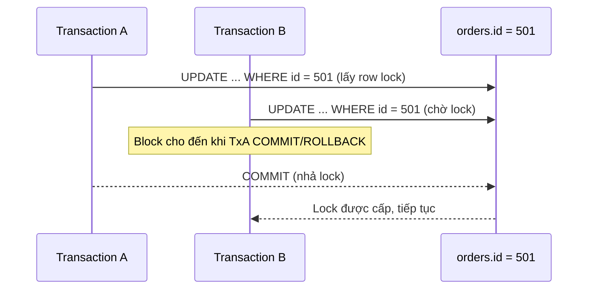

# ✍️ Style Guide

Tài liệu này định nghĩa **quy tắc bắt buộc** khi viết bất kỳ file lesson nào trong pack. Mọi prompt sinh nội dung sau này phải tuân theo guide này. Reviewer (hoặc chính bạn khi tự kiểm tra) dùng `QUALITY-CHECKLIST.md` để chấm điểm dựa trên các quy tắc ở đây.

## 1. Nguyên tắc tối thượng: Example-driven, không phải Definition-driven

Mọi khái niệm phải được giới thiệu **thông qua** một schema + query cụ thể, không phải bằng định nghĩa trừu tượng đứng một mình.

❌ **Không chấp nhận:**
> "Index là cấu trúc dữ liệu giúp tăng tốc truy vấn."

✅ **Bắt buộc:**
> Xét bảng `orders(id, user_id, status, created_at)`. Query `SELECT * FROM orders WHERE user_id = 42 ORDER BY created_at DESC LIMIT 20;` chạy trên bảng 10 triệu row sẽ Seq Scan nếu không có index, đọc toàn bộ heap. Thêm `CREATE INDEX idx_orders_user_created ON orders(user_id, created_at DESC);` giúp planner chọn Index Scan, chỉ đọc đúng các page chứa row của `user_id = 42`, kèm `EXPLAIN` minh họa trước/sau.

**Quy tắc**: Định nghĩa (nếu cần) đặt sau ví dụ, như một câu tóm tắt — không đặt trước.

## 2. Cấu trúc chuẩn cho một lesson file

Mỗi file lesson (không phải README index) nên có các section theo thứ tự này, bỏ qua section không áp dụng:

```markdown
# Tiêu đề

## Bối cảnh & câu hỏi cần trả lời
(Vì sao chủ đề này quan trọng, tình huống thực tế nào dẫn tới nó)

## Schema & dữ liệu minh họa
(Bảng cụ thể từ 1 trong 3 schema chuẩn của pack, kèm vài row mẫu nếu cần)

## Key mechanics
(Cơ chế PostgreSQL vận hành bên trong, có thể kèm diagram)

## Query example & execution path
(SQL cụ thể + EXPLAIN/EXPLAIN ANALYZE + giải thích planner reasoning)

## Key decisions
(Khi nào chọn phương án A, khi nào chọn B — dựa trên điều kiện cụ thể)

## Trade-offs
(Cái giá phải trả cho mỗi lựa chọn — không có giải pháp miễn phí)

## Anti-pattern (nếu áp dụng)
(Query/thiết kế sai phổ biến + hệ quả + cách viết lại)

## Failure modes
(Khi nào cơ chế này gây ra sự cố production)

## Debugging hints
(Query/catalog/lệnh dùng để chẩn đoán khi nghi ngờ vấn đề liên quan)

## Operational implications
(Ảnh hưởng tới vận hành: monitoring, alerting, capacity)

## Interview lens
(Câu hỏi phỏng vấn điển hình liên quan + hướng trả lời có lý luận)

## Tóm tắt
(3-5 bullet điểm mấu chốt)

## Liên quan
(Link tới lesson khác cùng pack)
```

## 3. Quy tắc viết Troubleshooting file (thư mục `10-troubleshooting-and-anti-patterns/`)

Phải theo luồng điều tra thực tế, không phải liệt kê lý thuyết:

1. **Triệu chứng quan sát được** (symptom) — điều gì user/monitoring thấy đầu tiên.
2. **Các giả thuyết khả dĩ** (hypotheses) — liệt kê nhiều nguyên nhân có thể, không chốt ngay 1 nguyên nhân.
3. **Cách thu thập evidence** — query trên `pg_stat_activity`, `pg_locks`, `pg_stat_statements`, log, `EXPLAIN`, v.v.
4. **Cách phân biệt giữa các giả thuyết** dựa trên evidence thu được.
5. **Mitigation ngắn hạn** (dừng chảy máu) — nêu rõ đây chỉ là tạm thời.
6. **Root-cause fix dài hạn**.
7. **Cách phòng tránh tái diễn** (alert, guardrail, review process).

**Cấm tuyệt đối**: đưa "restart database", "tăng timeout", "thêm index bừa" như bước đầu tiên nếu chưa có evidence chứng minh đó là nguyên nhân.

## 4. Quy tắc viết Anti-pattern file

Mỗi anti-pattern trình bày theo format:

- **Query/thiết kế sai** — code cụ thể.
- **Vì sao nhìn có vẻ ổn** — lý do người viết ban đầu nghĩ nó đúng.
- **Cơ chế PostgreSQL khiến nó nguy hiểm** — giải thích kỹ thuật.
- **Khi nào nó phát nổ** — điều kiện scale/concurrency cụ thể gây sự cố.
- **Cách viết lại** — query/thiết kế thay thế, kèm so sánh `EXPLAIN` nếu có thể.
- **Ngoại lệ chấp nhận được** — trường hợp hiếm hoi pattern cũ vẫn ổn.

## 5. Quy tắc viết Decision Guide (`11-learning-aids/02-decision-guide.md`)

Dùng bảng hoặc cây quyết định, mỗi nhánh phải nêu rõ **input/điều kiện** dẫn tới lựa chọn, không chỉ đưa ra kết luận suông.

Ví dụ format bảng:

| Điều kiện | Lựa chọn | Vì sao |
|---|---|---|
| Cột có cardinality thấp (VD: status enum 5 giá trị), predicate lệch (90% row là 'active') | Partial index trên giá trị hiếm | Index nhỏ, chỉ chứa row đáng tìm |
| Cần range query trên timestamp cột append-only | BRIN | Dữ liệu tương quan vật lý với thứ tự insert, BRIN rẻ hơn B-tree nhiều |

## 6. Quy tắc dùng Diagram

Dùng Mermaid hoặc ASCII khi — và chỉ khi — diagram giúp **nén một cơ chế khó diễn đạt bằng văn xuôi**:

- MVCC visibility giữa nhiều transaction đồng thời.
- Lock wait chain (blocker → waiter → waiter khác).
- Join path / planner decision tree.
- WAL → replica → replay/failover flow.
- Application → PgBouncer → PostgreSQL connection flow.
- Partition pruning path theo query predicate.

**Quy tắc**: diagram phải gắn với schema/query thật đang được thảo luận trong bài (VD: dùng đúng tên bảng `orders`, `order_items` trong diagram join path), không phải diagram trừu tượng "Table A / Table B". Không dùng diagram chỉ để trang trí hoặc lặp lại điều văn xuôi đã nói rõ.

Ví dụ khung Mermaid cho lock wait:



## 7. Quy tắc dùng schema ví dụ xuyên suốt

- Bắt buộc dùng lại 1 trong 3 schema chuẩn của pack (e-commerce, multi-tenant SaaS, event/log) — xem chi tiết cột trong `00-overview/02-postgres-core-mental-model.md`.
- Không tự chế schema mới trừ khi chủ đề thực sự đòi hỏi (VD: minh họa geospatial cần bảng khác) — nếu vậy phải nêu rõ lý do và giữ tối giản.
- Khi một chủ đề phù hợp với nhiều schema, ưu tiên schema mà đặc điểm dữ liệu làm rõ cơ chế nhất:
  - **Locking/race condition** → e-commerce (`payments`, `order_items` khi giảm tồn kho).
  - **Composite index/multi-tenant filtering** → SaaS schema (`tenant_id` luôn là cột đầu).
  - **JSONB, partitioning theo thời gian, BRIN** → event/log schema (`events`, `event_payloads`).

## 8. Quy tắc viết Query Example

- Mọi query ví dụ phải là SQL hợp lệ, chạy được trên PostgreSQL thật (không giả định cú pháp không tồn tại).
- Luôn nêu rõ **index giả định đang có/không có** trước khi bàn về plan.
- Khi rewrite query, phải giữ nguyên semantics: kết quả NULL, duplicate, thứ tự sắp xếp, pagination phải tương đương — nêu rõ nếu có đánh đổi.
- `EXPLAIN` mẫu phải hợp lý về hình dạng (loại node, thứ tự) dù số liệu cost/row là minh họa, không phải log thật — nói rõ đây là **minh họa** khi không chạy trên môi trường thật.

## 9. Giải thích Planner/Join/Index bằng ví dụ thật

Không được viết: "planner sẽ chọn plan tối ưu nhất". Phải viết theo dạng: "Với `orders` có 50,000 row và `user_id = 42` chỉ khớp ~12 row (selectivity thấp), nếu có `idx_orders_user_id`, planner ước lượng chi phí Index Scan (~12 row × random I/O) thấp hơn Seq Scan (quét 50,000 row), nên chọn Index Scan — trừ khi bảng quá nhỏ (dưới vài trăm row) khiến chi phí cố định của Index Scan không đáng, lúc đó Seq Scan lại rẻ hơn."

## 10. Quy tắc GitHub-readability

- Heading ngắn gọn, mỗi section giải quyết đúng một ý.
- Dùng bảng cho so sánh có số lượng lựa chọn hữu hạn (VD: các loại index, các isolation level).
- Dùng bullet list cho checklist/quy trình tuần tự.
- Mọi code block phải khai báo ngôn ngữ: `sql`, `text`, `mermaid`, `bash`.
- Tránh đoạn văn dài quá 5-6 dòng liên tục — tách bằng heading phụ hoặc bullet.
- Icon dùng vừa phải ở heading cấp 1-2 (không lạm dụng trong văn xuôi).

## 11. Quy tắc Relative Links

- Luôn dùng relative path, dùng `/` làm separator (kể cả trên Windows).
- Từ file trong thư mục con trỏ về root: `../README.md`, `../GLOSSARY.md`.
- Từ file này sang file khác cùng thư mục: `./ten-file.md` hoặc `ten-file.md`.
- Không link tới file chưa tồn tại như thể nó đã có nội dung — nếu cần tham chiếu file ở phase tương lai, ghi rõ dạng: *"sẽ được đề cập ở `06-partitioning-and-large-tables/` (chưa sinh nội dung)"*.
- Mỗi README thư mục con phải có link Previous/Next tới thư mục liền kề theo thứ tự học.

## 12. Ngôn ngữ

- Viết tiếng Việt tự nhiên, không dịch máy móc.
- Giữ nguyên thuật ngữ tiếng Anh khi đó là thuật ngữ chuẩn ngành đã định nghĩa trong `GLOSSARY.md` (VD: giữ "vacuum", "bloat", "snapshot", không dịch thành "hút bụi", "phình to", "ảnh chụp nhanh").
- Không viết theo giọng blog marketing ("Bạn có biết...", "Đừng bỏ lỡ...") — viết như tài liệu kỹ thuật nội bộ nghiêm túc.
