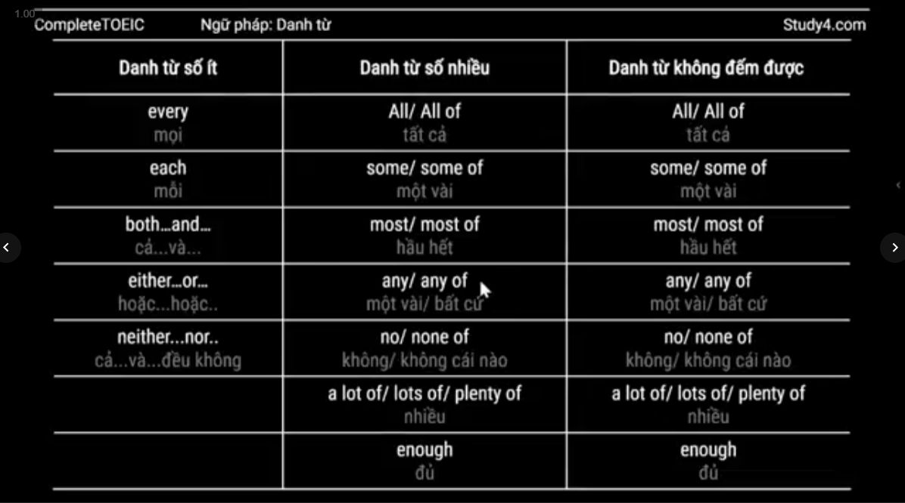
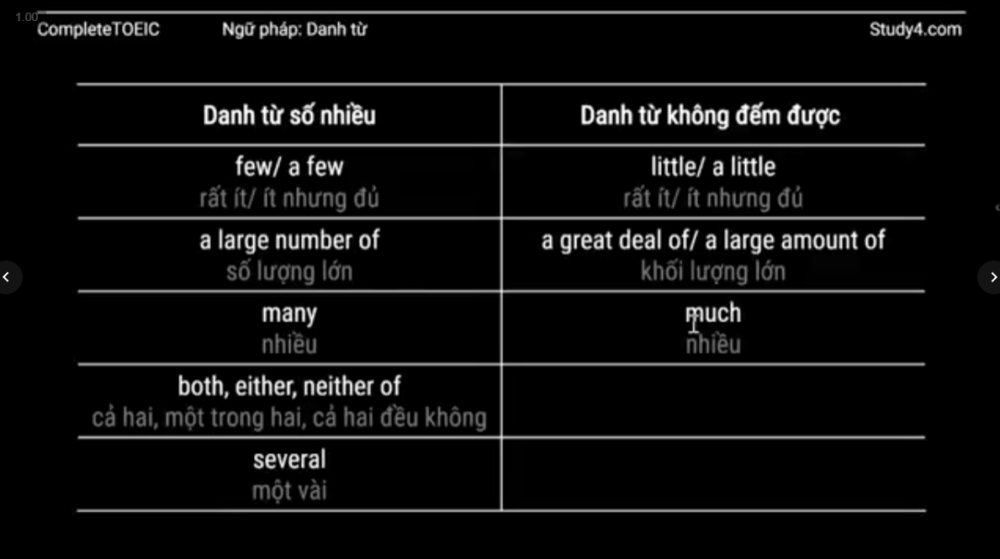
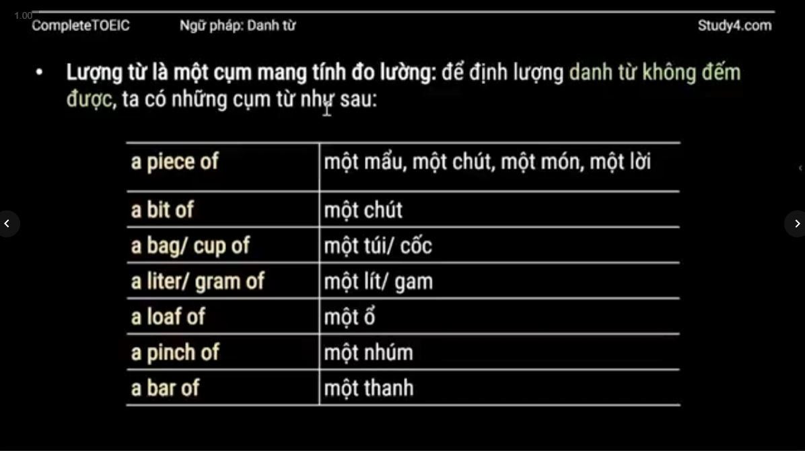
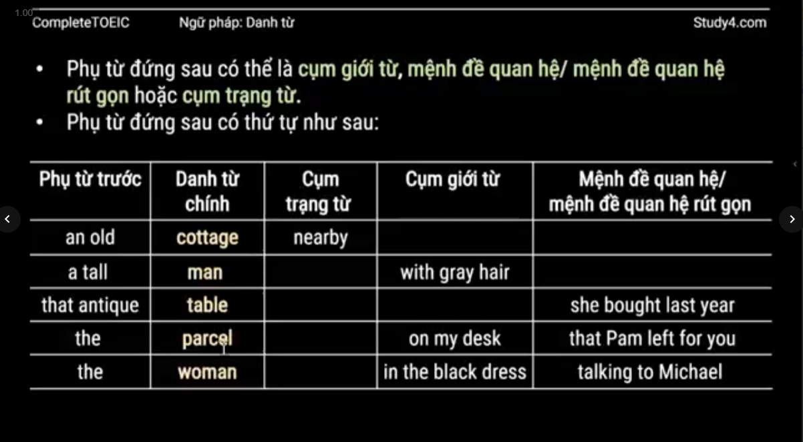
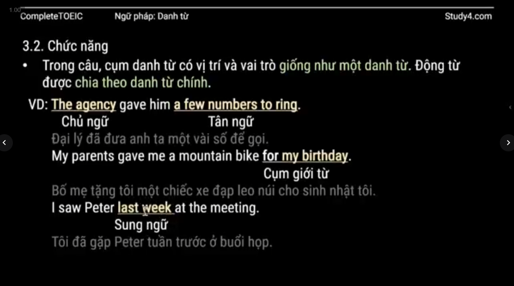

### 1. Danh từ

#### 1.1. Danh từ đếm được

- Cách hình thành danh từ số nhiều
	- Phần lớn danh từ: thêm **-s**
		- book -> books
		- student -> students
	- Danh từ tận cùng là **-o, -s, -ch, -x, -sh**: thêm **-es**, ngoại lệ: radio - radios, video - videos,...
		-  potato -> potatoes
		- bus -> buses
		- church -> churches
		- box -> boxes
		- dish -> dishes
	- Danh từ tận cùng là **phụ âm + -y**: bỏ -y, thêm -ies
		- baby -> babies
		- party -> parties
		- city -> cities
	- Danh từ tận cùng là **-f, -fe** : bỏ **-f/-fe**, thêm **-ves**, ngoại lệ: roof - roof**s**, belief - belief**s**, cliff - cliff**s**
	- Danh từ bất quy tắc: 
		- child -> children
		- man -> men
		- woman -> women
		- person -> people
		- sheep, fish, deer -> sheep, fish, deer
		- tooth, foot -> teeth, feet
- Danh từ chỉ ở dạng số nhiều
	- Những vật mà có cấu tạo 2 bộ phận giống hệt nhau (mà nếu thiếu 1 thì không dùng được) như kính, kéo, quần,... thì danh từ chỉ vật đó **luôn ở dạng số nhiều**
	- binoculars -> ống nhóm
	- headphones -> tai nghe
	- glasses -> kính mắt
	- jeans -> quần jeans
	- pants -> quần dài 
	- Để nói về số lượng của những vật này, chúng ta không thể dùng số đếm như với các danh từ số nhiều thông thường, mà phải diễn tả số lượng như với danh từ không đếm được ->  ta thường dùng cụm a pair of (một đôi/ cặp) hoặc pairs of (nhiều đôi/ cặp) để nói về số lượng của những vật trên
		-   Ibought a new pair of binoculars last week
		- Tôi đã mua 1 cái ống nhóm mới vào tuần trước 
		- I bought three pairs of shorts for the summer
		- Tôi đã mua 3 chiếc quàn đùi cho mùa hè
	- Những danh từ khác:
		- belongsing -> hành lý
		- suroundings -> môi trường xung quanh
		- earnings -> thu nhập
		- outskirts -> vùng ngoại ô
		- clothes -> quần áo
		- savings -> tiền tiết kiệm
		- stairs -> cầu thang
		- goods -> hàng hóa
		- thanks -> sự cảm ơn / biết ơn
		- congratulations -> lời chúc mừng
		- likes / dislikes -> thích / không thích
- Danh từ tập hợp: là danh từ chỉ chung 1 nhóm người. Danh từ tập hợp có thể được coi là danh từ số nhiều hoặc số ít tùy thuộc vào việc nó được coi như là một nhóm riêng lẻ hay nhiều cá nhân
	- audience -> khán giả
	- crew -> nhóm
	- public ->  công chúng
	- committee -> hội đồng
	- staff -> nhân viên
	- team -> đội
	- company -> công ty
	- government -> chính phủ
	- family -> gia đình
- Danh từ kết thúc với đôi **-s** có thể là danh từ số ít hoặc số nhiều
	- means -> cách thức
	- series -> loạt phim
	- species -> loài

#### 1.2. Danh từ không đếm được (uncountable nouns)
Ví dụ về danh từ không đếm được thường gặp
- Ý tưởng và trải nghiệm: advice, information, progress, news, luck, fun, work
- Chất liệu và nguyên liệu: water, rice, cement, gold, milk, flour, sugar, salt
- Thời tiết: weather, thunder, lightning, rain, snow
- Tên 1 nhom sự vật: furniture, equipment, rubbish, luggage
- Các từ khác: accommodation, baggage, homework, knowledge,
- money, permission, research, traffic, travel
We're going to get new furrniture for the living room
We had terrible weather last week
We need rice next time we go shopping

Danh từ không đếm được dễ bị nhầm lẫn: nhiều danh từ kết thúc với đuôi -s dễ bị nhầm lẫn thành danh từ số nhiều nhưng thật chất là danh từ không đếm được
- classics -> nghiên cứu cổ điển
- politics: chính trị học
- economics: kinh tế học
- athletics: điền kinh
- gymnastics: thể dục dụng cụ
- maths: toán học
- physics: vật lý
- electronics: điện tử học
- news: tin tức

Gymnastics **is** my favorite sport
What time **is** the news on TV?

### 2. Từ hạn định

#### 2.1. Đặc điểm

- Danh từ đếm được số ít bắt buộc phải có từ hạn định đi kèm
	- She never wears **a** hat
	- Be careful of **the** dog
- Trong cụm danh từ, từ hạn định đứng đầu tiền, trước tính từ và danh từ phụ  
- Trong một cụm danh từ, có thể có nhiều hơn một từ hạn định
	- **All your** books got wet when you left them in the garden
- Lưu ý: chúng ta không dùng 2 từ bạn định mang tính xác định đứng liền nhau, hoặc 2 từ hạn định chỉ số lượng đứng liền nhau
- Về phân loại, từ hạn định có những dạng như sau:
	- Mạo từ: a, an, the
	- Đại từ chỉ định: this, that, these, those
	- Tính từ sở hữu, sỏ hữu cách: my, your, his, her, Jim's,...
	- Lượng từ: some, any, a few,...
	- Số: one, two, first, second,...

#### 2.2. Mạo từ 
##### 2.2.1. Mạo từ a/an**

- Mạo từ a đứng trước từ có âm đầu là một phụ âm, mạo từ an đứng trước từ có âm đầu là nguyên âm. VD: a car, a house, an apple, an umbrella,...
- Một vài từ có chữ cái đầu là nguyên âm nhưng âm đầu lại là một phụ âm => dùng a
	- VD: a university, aunited group, a one-year-old child
- Một vài từ có chữ cái đầu là phụ âm. nhưng âm đầu lại là một nguyên âm => dùng an
	-  VD: an hour, an MP# player, an honor 
- Ta dùng a/an khi muốn nói người hay vật thuộc nhóm nào/ loại nào. VD: A dog is **an animal**
- Ta dùng a/an khi nói về nghề nghiệp
	- Sam is a nurse
-  Ta dùng a/an khi nói về tần suất hay đo lường
	- once a week, three times a day,...

##### 2.2.2. Mạo từ **the**
- Ta dùng the + danh từ chỉ vật gì đó chỉ có  một
- Ta dùng the + danh từ chỉ những khái niệm trong tự nhiên mà ai cũng biết tới. VD: the sun, the moon, the stars,...
- Ta dùng the + địa điểm biểu diễn, trình chiếu. VD: the cinema. the theater
- Ta dùng the + phương tiện truyền thống. VD: the radio, the internet,...
- Ta dùng the + một loại vật nhất định để phân biệt với các loại khác trong cùng nhóm lớn. VD: the car, the telephone, the piano,...
- Ta dùng the + tính từ để chỉ một nhóm người trong xã hội. VD: the rich, the poor, the young,...
- Ta dùng the + quốc tịch để nói về người của một quốc gia, và nó mang nghĩa số nhiều. VD: the Vietnamese, the French,...
-  Ta dùng the + danh từ chỉ phương hướng. VD: the north, the south-east,...
- 

##### 2.2.3. Phân biệt a/an/the
- Mạo từ a/an dùng để nói đến đối tượng được nhắc đến / biết đến lần đầu tiên trong hội thoại hoặc văn bản ~ mạo từ không xác định
- Mạo từ **the** dùng để nói đến đối tượng đã được nhắc đến/ biết đến trước đó ~ mạo từ xác định

##### 2.2.4. Không dùng mạo từ
- Ta không dùng mạo từ với danh từ chỉ người/vật nói chung
	- I'm afraid of **snakes**.
	- **Doctors** are usually paid more than teachers
- Ta không dùng mạo từ với các địa điểm  như school, hospital, church, university,... khi chủ ngữ đến những địa điểm đó với đúng mục đích
- Ta nói **go to work/ be at work/ start work / finish work**...
- Ta nói **go home/ come home/ arive home/ get home/ be at home**...
- Ta không dùng mạo từ với các bữa trong ngày. VD: breakfast, lunch. dinner
- Lưu ý: khi thêm tính từ diễn tả bữa ăn. ta đã thêm tính phân loại cho nó => cần thêm **a/an** vào trước danh từ
	- VD: a big lunch, a wonderful dinner, an early breakfast,...
- Ta không dùng mạo từ với **cụm danh từ + số**
	- Our train leaves from **Platform 6**
	- Do you have these shoes in **size 39** ?
	- Tương tự, ta nói: room 27, page 30, question 9, gate 10,...
- Ta không dùng the + tên riêng. Nhưng có 1 số trường hợp the + tên riêng
	- Tên đất nước với **Republic, Kingdom, States**
	- Đại dương, sông, kênh đào, sa mạc
	- Tên người dạng số nhiều => gia đình
	- Tên đất nước dạng số nhiều ( cộng hòa)
	- Tên quần đảo, dãy núi, khách sạn, rạp hát, bảo tàng, tòa nhà, cung điện

#### 2.3. Đại từ chỉ định

- Đại từ chỉ định **this/that/these/those** khi đóng vai trò là từ hạn định thì đứng trước danh từ để chỉ đối tượng cụ thế
- Lưu ý: phân biệt với vai trò là **đại từ**. Khi là đại từ, this/that/these/those sẽ đứng ột mình để **thay thế cho danh từ**
- These/those + danh từ số nhiều
- This + từ chỉ thời gian để chỉ thời điểm sắp tới hoặc thời điểm hiện tại
	- I'll be there some time this evening
	- Lan is in Germany all this week

#### 2.4. Tính từ sở hữu, sở hữu cách
-  Tính từ sở hữu là những từ: my, our, your, his, her, their, its + danh từ => nghĩa là **ai/cái gì của ai**
	- My sister is a doctor
	- We went to his wedding last week
- Sở hữu cách: ta thêm **-'s** vào sau tên riêng và danh từ để diễn tả sự sở hữu đối với vật/ ai đó
	- Is that **Olivia's bag** ?
- Sở hữu cách có thể dùng để nói về thời gian:
	- Is that yesterday's paper?
	- I've only had one week's holiday so far this year
- Quy tắc thành lập sở hữu cách:
	- Danh từ số ít + **'s**
	- Danh từ số nhiều + **'**
	- Lưu ý: khi danh từ số nhiều ở dạng bất quy tắc, không kết thúc với đuôi **-s** =>  ta thêm  **'s**  để thành lập sở hữu cách giống như với danh từ số ít
	- VD: the children's, the men's, the people's

#### 2.5. Lượng từ

- Lượng từ  là một từ hoặc cụm từ dùng để diễn tả số lượng, khối lượng hoặc mức độ. Chúng có thể đóng vai trò là từ hạn định khi đi kèm với danh từ, hoặc là đại từ khi không đii kèm danh từ. 
- Lượng từ có quy tắc riêng khi đi kèm với danh từ số ít, số nhiều và không đếm được

### 3. Cụm danh từ

#### 3.1. Cấu tạo
- Cụm danh từ bao gồm 1 **danh từ chính** và **một hoặc các phụ từ**
- Phụ từ đứng trước danh từ chính có thể là **từ hạn định**, **tính từ** hoặc **danh từ khác**
- Lưu ý:
	- Danh từ phụ luôn ở dạng số ít hoặc không đếm được
	- Danh từ phụ chỉ thời gian hoặc đo lường dù mang nghĩa số nhiều thì khi viết vẫn ở dạng số ít và thêm gạch nối. VD: an eight-hour, a two-liter bottle
- Phụ từ đứng sau có thể là cụm giới từ, mệnh đề quan hệ/ mệnh đề quan hệ rút gọn hoặc cụm trạng từ
- Phụ từ đứng sau có thứ tự như sau

#### 3.2. Chức năng
- Trong câu, cụm danh từ có vị trí và vai trò giống như một danh từ. Động từ được chia theo danh từ chính

