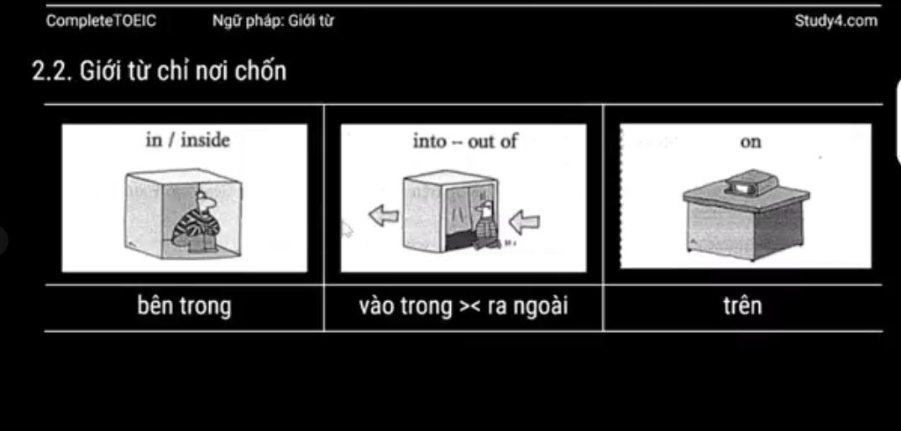
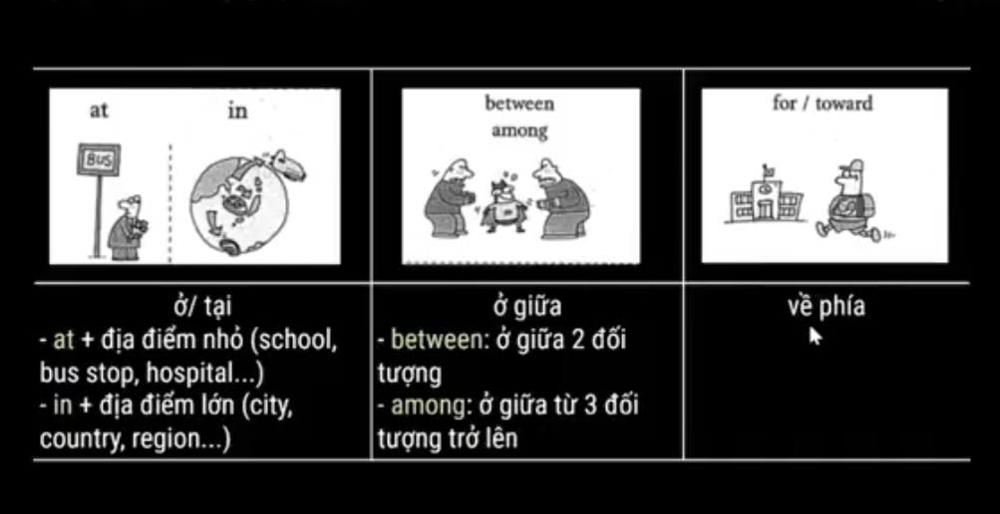
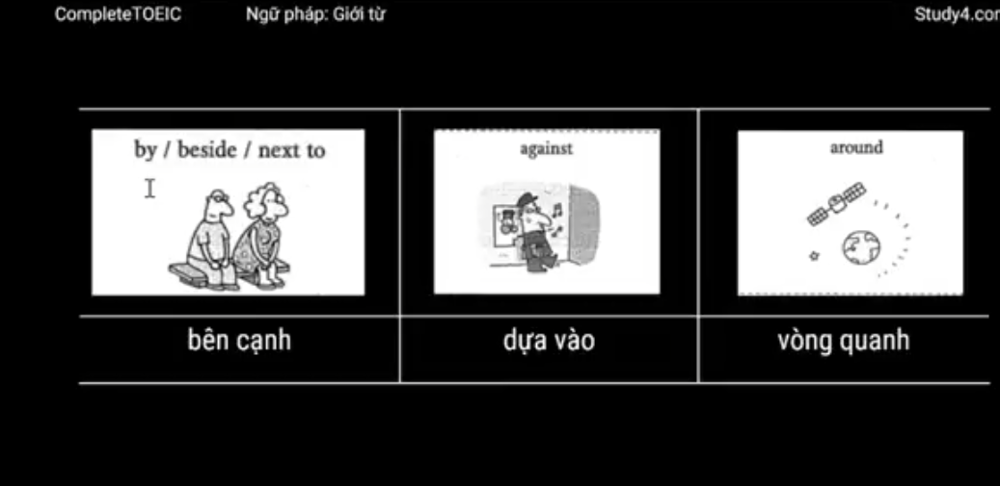
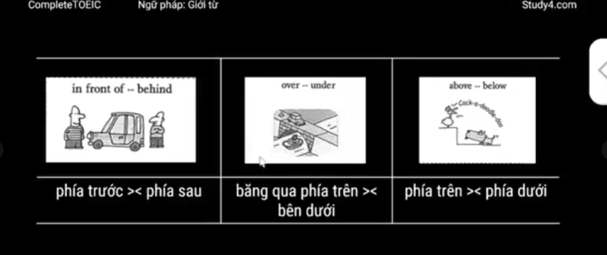
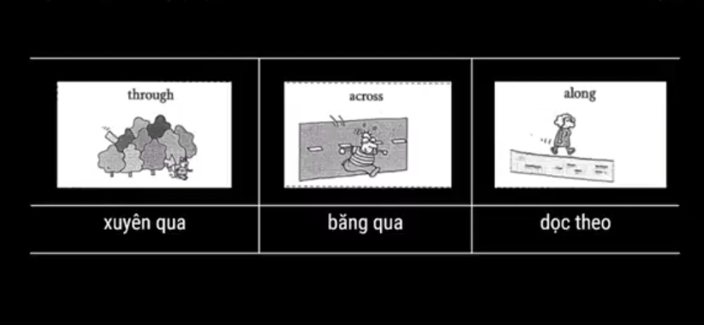

# 📘 Giới từ trong tiếng Anh

---

## 1. Khái niệm và cách dùng  

### 🔹 1.1. Khái niệm  
- Giới từ = từ loại thể hiện mối quan hệ **không gian / thời gian / logic** giữa các đối tượng.  
- Thường đứng trước: **danh từ / cụm danh từ / V-ing / đại từ tân ngữ**.  
	- *I'll meet you in the cafe opposite the cinema*  
		👉 Tôi sẽ gặp bạn ở quán cà phê đối diện rạp chiếu phim  
- Một số giới từ có đuôi **-ing**, nhưng đừng nhầm với V-ing:  
	- regarding/concerning : về việc, theo như  
	- barring: nếu không có  
	- following: theo như  
	- including: bao gồm  
	- excluding: không bao gồm  
	- considering: xét thấy  

---

### 🔹 1.2. Cách dùng  

#### 🟢 Cụm giới từ đứng độc lập  
- Công thức: **Giới từ + N / NP / V-ing / đại từ tân ngữ**  
- Vai trò: bổ ngữ / sung ngữ cho câu.  
	- The cat is **on the table** 🐱  
	- Please put your baggage **under your seat** ✈️  

#### 🟢 Động từ + giới từ  
- Công thức: **V + Prep** = cụm động từ kèm giới từ  
	- Somebody **broke into** his car and stole his radio.  
	- I don’t like this CD. I don’t want to listen **to it** anymore.  

#### 🟢 Tính từ + giới từ  
- Một số collocation hay gặp:  
	- aware **of** = để ý  
	- full **of** = đầy  
	- different **from** = khác  
	- separate **from** = tách biệt  
	- due **to** = bởi vì  
	- similar **to** = giống  
	- responsible **for** = chịu trách nhiệm  

#### 🟢 Danh từ + giới từ  
- Công thức: **N + Prep + Object**  
- Ví dụ phổ biến:  
	- age **at**: tuổi  
	- attempt **at**: thử sức, nỗ lực  
	- point **at**: điểm  
	- need **for**: sự cần  
	- reason **for**: lý do  
	- responsibility **for**: trách nhiệm  
	- changes **in**: những thay đổi  
	- differences **in**: sự khác biệt  
	- increase **in**: sự tăng  
	- inquiry **into**: cuộc điều tra  
	- investigation **into**: sự điều tra  
	- research **into**: nghiên cứu  
	- approach **to**: cách tiếp cận  

---

## 2. Phân loại  

### 🔹 2.1. Giới từ chỉ thời gian  

#### ⏰ in / on / at  
- **in** + khoảng dài (**năm, mùa, tháng, buổi trong ngày**)  
	- in 2023, in spring, in March, in the morning  
- **on** + ngày / thứ / ngày + buổi  
	- on March 28, on Monday, on Monday morning  
- **at** + giờ / thời điểm đặc biệt (noon, night, midnight)  

⚠️ Không dùng **in/on/at** trước: *every, last, next*.  
- Ví dụ: We go hiking **every Saturday**.  

---

#### ⏰ for / during  
- **for** + khoảng thời gian  
- **during** + sự kiện / tình huống  
	- for five years = trong 5 năm  
	- during the meeting = trong suốt buổi họp  

---

#### ⏰ from / since  
- **from** + mốc thời gian → điểm bắt đầu, thường dùng với thì đơn.  
- **since** + mốc thời gian → kéo dài đến hiện tại, dùng với thì hoàn thành.  

---

#### ⏰ by / until / till  
- **by** + mốc thời gian → hoàn tất trước hoặc chậm nhất.  
	- thường đi với: complete, finish, submit.  
- **until / till** + mốc thời gian → trạng thái duy trì đến 1 thời điểm.  
	- thường đi với: open, valid, last.  

---

#### ⏰ in / within  
- **in** + khoảng thời gian → trước hoặc muộn nhất là trong khoảng đó.  
- **within** + khoảng thời gian → trong vòng bao lâu.  

---

#### ⏰ Các giới từ khác  
- **upon** + sự kiện: ngay khi  
- **over** + khoảng thời gian: trong suốt  
- **through / throughout** + mốc thời gian: từ đầu đến cuối  

---

### 2.2. Giới từ chỉ nơi chốn

