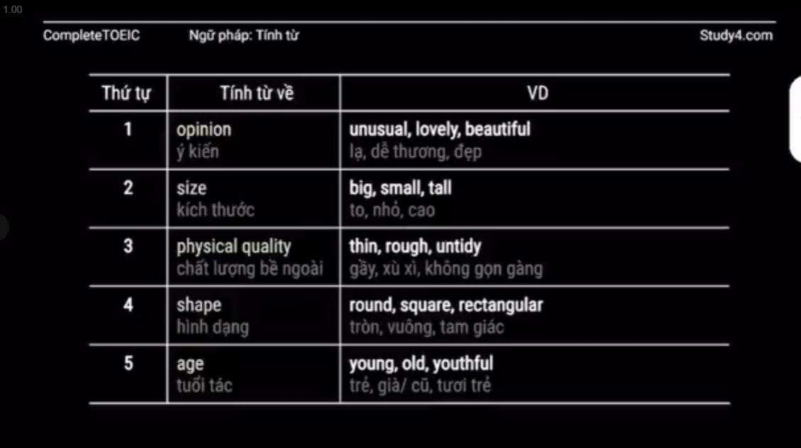
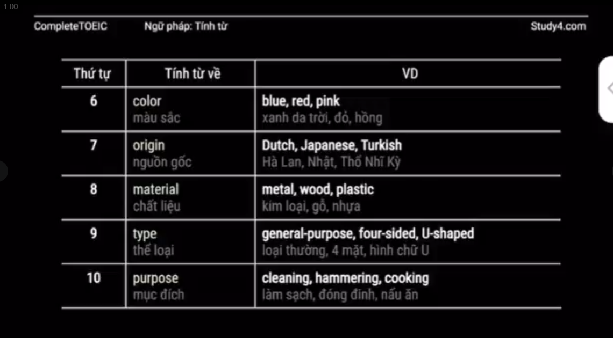

## 1. Phân loại

### 1.1. Tính từ có hậu tố/tiền tố
- Từ **danh từ, động từ, hoặc tính từ khác**, ta thê, vào đó những hậu tố và tiền tố để tạo nên *tính từ*
- Hậu tố thường được thêm vào **danh từ hoặc động từ** để tạo nên tính từ
- Tiền tố thường được thêm vào **tính từ** để tạo nên **tính từ trái nghĩa**
- Hậu tố: **-able, -ible, -al, -ial, -ful, -ic, -ive, -ative, -less, -eous, -ious, -ous, -y**
- Tiền tố: **un-, in-, ir-, im-, il-**
	- fair - unfair
	- happy - unhappy
	- active - inactive
	- responsible - irresponsible
	- balance - imbalnace
- Lưu ý 1:  Một số từ có đuôi **-tive** cũng có thể là danh từ. VD: representative (người đại diện), executive (chuyên viên), alternative (vật thay thế)
- Một ố tính từ đuôi -ly dễ bị nhầm lẫn thành trạng từ. VD: 
	- friendly: thân thiện
	- timely: đúng lúc
	- elderly: già
	- costly: tốn kém
	- lonely: cô đơn
	- daily: hằng ngày
- Lưu ý 2: từ **cùng một gốc từ** có thể có nhiều tính từ nghĩa khác nhau
	- compare (v): so sánh
		- compareable (adj): có thể so sánh
		- comparative (adj): mang tính so sánh

### 1.2. Tính từ dạng phân từ
- Là các tính từ được hình thành từ động từ ở dạng **V-ing hoặc V-ed**
- Tính từ đuôi **-ing** diễn tả tính chất/ trạng thái của chủ thể (mang tính chủ động)
- Tính từ đuôi **-ed** thường diễn tả cảm xúc/trạng thái/ tính chất của chủ thể khi có yếu tố bên ngoài tác động lên (mang tính bị động)
- Lưu ý: tính từ dạng phân từ không phải lúc nào cũng tồn  tại song song 1 cặp. Có những từ chỉ ở dạng **-ing** hoặc **-ed**

### 1.3. Tính từ ghép
- Tính từ ghép là những tính từ gồm 2 từ hoặc nhiều hơn ghép lại, nối với nhau bằng dấu gạch ngang
- Nhiều tính từ ghép có dạng phân từ
	- adv + -ed : well-behaved -> ngoan ngoãn
	- adv + -ing: fast-growing -> tăng trưởng nhanh
	- adj + -ed: ready-made -> được làm sẵn
	- adj + -ing: easy-going -> dễ tính
	- N + -ed: action-packed -> hành động kịch tính
	- N + -ing: money-making -> kiếm tiền
	- -ed + particle: made-up -> bịa đặt
- Các tính từ ghép khác không có dạng phân từ. VD: short-tern/long-tern (ngắn hạn, dài hạn), small-scale (trên diện nhỏ),...

### 1.4. Tính từ thường
- VD: long, shorrt, big, small

## 2. Cụm tính từ
- Cụm tính từ bao gồm **1 tính từ chính** đi kèm với các từ hoặc cụm từ **bổ nghĩa phía trước hoặc sau**
- Từ bổ nghĩa phía trước cho tính từ thường là **trạng từ**
	- That soup is **pretty cold**
	- Món súp đó khá là nguội
- Từ/ cụm từ bổ nghĩa phía sau cho tính từ là: **enough/ cụm giới từ/ to V/ mệnh đề bắt đầu với that/ -wh**

## 3. Chức năng

### 3.1. Bổ nghĩa cho dnah từ, đại từ bất định trong cụm danh từ
- Trong một cụm danh từ, tính từ có thể là phụ từ đứng trước hoặc đứng sau để bổ nghĩa cho danh từ
- Ngoài ra, tính từ cũng có thể đứng sau bổ nghĩa cho đại từ bất định trong câu
- Có thể có nhiều tính từ cùng bổ nghĩa cho một danh từ. Thứ tự của các tính từ đó khi đứng trong cùng một cụm danh từ như sau:

- VD: It's a long (2), narrow (4), plastic (8) brush

### 3.2. Đứng sau động từ nối để làm bổ ngữ cho câu

- Trong câu có sử dụng **động từ nối**, tính từ là 1 thành phần bắt buộc, đóng vai trò là bổ ngữ cho **chủ ngữ** hoặc **tân ngữ**. Nếu thiếu tính từ, câu sẽ không có nghĩa
- Động từ nối là những động từ như sau:
	- Động từ diễn tả cảm giác: **look, seem, taste, smell. sound, feel**
	- Động từ thể hiện sự biến dổi trạng thái: **become, grow, turn, make**
	- Động từ thể hiện sự duy trì trạng thái: **be, remain, keep, stay**
- Động từ nối + tính từ => tính từ làm bổ ngữ cho **chủ ngữ**
	- I'm **tired** and I'm getting **hungry**
- Có những tính từ **hiếm khi hoặc không bao giờ đứng trước danh từ**. VD
	- afraid : lo lắng, e ngại
	- alike : giống
	- alive: còn sống
	- aline: thẳng hàng
	- ashamed: xấu hổ
	- asleep: đã ngủ
	- awake: thức
	- aware: có ý thức
- Có những từ hiếm khi hoặc không bao giờ đứng sau động từ nối. Đây là những tính từ mang tính nhấn mạnh hoặc phân loại
	- Tính từ nhấn mạnh: complete, absolute, entire, mere, sheer, total,...
	- Tính từ phân loại: chemical, digital, medical,...

### 3.3. Một số cấu trúc với tính từ

- Cấu trúc **so ... that và such .. that**: quá đến nỗi
	- so + **tính từ** + (that) mệnh đề
	- such + (a/an) + **tính từ** + danh từ + (that) mệnh đề
- Cấu trúc **enough và too**
	- **tính từ** + enough + for.../ to V
	- too + **tính từ** + for.../ to V
	- Lưu ý: enough đứng trước danh từ và đứng sau tính từ